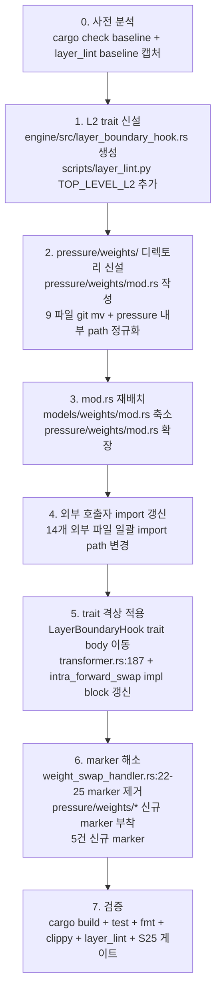

# Weights Domain Split — `models/weights/` → pressure/inference/backend 재배치 (Sprint C design)

> **Scope**: precision swap §13.8-O 갈래 1 통합 sprint의 마지막 단계인 **Sprint C** 단일 design doc. `engine/src/models/weights/` 16 파일(약 10,643 LOC)의 도메인 재배치 + 두 trait 격상 명세.
>
> **본 문서가 다루지 않는 것**:
> - ARCHITECTURE.md `§13.8-G/O` register 갱신 — Sprint C 코드 적용 commit 후 별 docs commit.
> - `spec/01-architecture.md` INV-LAYER 본문 변경 — 같은 사유로 별 sprint.
> - observability 직접 의존 잔존 3건의 trait inversion — backlog 별 sprint(§7 참조).
>
> **참고**:
> - 직전 handoff: `.agent/todos/handoff_precision_swap_b_fixup_2026_05_26.md`
> - 위계 명시: `spec/01-architecture.md` §3.26 INV-LAYER-003 NOTE / `arch/01-architecture.md` §6.3·§6.4
> - L2 운영 모델: `arch/01-architecture.md` §6.2 "L2 위치 정책 (2026-05-26 정정)"
> - §13.8-G/O register: `ARCHITECTURE.md` 동 섹션
> - lint 도구: `scripts/layer_lint.py` (line 46~88 `LAYER_RULES`, line 128 `TOP_LEVEL_L2` set, line 28~38 `DATA_CONSUMER_PATTERNS`)

---

## §1. 현황 그래프 (실측)

### §1.1 `models/weights/` 16 파일 (≈10,643 LOC)

| 파일 | LOC | 핵심 컴포넌트 | 외부 import 의존 | 비고 |
|---|---|---|---|---|
| `swap_executor.rs` | 3,219 | `SwapExecutor`, `SwapReport`, `SwapError`, `SwappedLayer`, `dtype_tag_to_dtype` | backend / buffer / memory / model_config / models::loader::gguf / models::transformer / weights:: (slot, async_swap, release_worker, secondary_mmap, backing) / observability::events / tensor | 핵심 orchestrator. weight 압박 응답의 hot path 본체. |
| `decider.rs` | 653 | `WeightSwapDecider`, `SwapAlgorithm`, `SwapDecision`, `compute_qcf_weight_swap` | qcf / weights::noise_table | QCF_weight 계산 owner. 이미 qcf 도메인과 한 발 가까움. |
| `async_swap.rs` | 496 | `AsyncSwapDispatcher`, `SwapCommitJob`, `SwapJob`, `ChunkDispatchJob` | backend / buffer / weights:: (slot, release_worker) / observability::events | 별 worker thread, 본 sprint 외 직접 의존 1건(observability). |
| `phase_aware_swap.rs` | 898 | `PhaseAwareSwapDispatcher`, `WeightChunk` | backend / weights:: (slot, secondary_mmap, async_swap, swap_executor) / observability::events / observability::profile::op_trace | 본 sprint 외 직접 의존 2건(observability events + op_trace::DdrPhase). |
| `intra_forward_swap.rs` | 607 | `IntraForwardSwapHook`, `IntraForwardSwapPlan`, **`LayerBoundaryHook` trait**, `NoOpHook` | backend / weights:: (slot, secondary_mmap, async_swap, release_worker, swap_executor) / observability::events | **trait 격상 candidate (L2)** — transformer.rs forward path가 `Option<&dyn LayerBoundaryHook>`로 호출. |
| `incremental_plan.rs` | 159 | `IncrementalSwapPlan` | (자급) | 입력 plan 자료 구조. |
| `dynamic_k.rs` | 200 | `DynamicKController` | (자급) | ARGUS dynamic-K. |
| `probing_k.rs` | 266 | `ProbingKController`, `GrowthMode` | (자급, `DynamicKController` 보완) | swap algorithm controller. |
| `noise_table.rs` | 1,065 | `QuantNoiseTable`, `compute_input_aware_epsilon*`, `compute_cascade_attn_perturbation` | weights::secondary_mmap / weights::LayerSlot | QCF_weight 입력. **secondary_mmap을 직접 사용**. |
| `release_worker.rs` | 342 | `PrimaryReleaseWorker` | weights::LayerWeights, weights::swap_executor (`record_swap_release_pub`) | 워커 스레드. |
| `slot.rs` | 184 | **`LayerSlot` struct**, `LayerWeights = TransformerLayer` (type alias) | buffer / layers::transformer_layer / weights::secondary_mmap | **분할 candidate** — slot ↔ weights data 분리 검토. |
| `secondary_mmap.rs` | 1,484 | `SecondaryMmap` enum (Standard/Auf/Rpcmem variants), `open_secondary*`, `build_auf_secondary_from_view`, `try_promote_auf_self_secondary_to_rpcmem`, `LayerTensorSlice`, `SecondaryTensorInfo`, `SecondaryDtypeChoice`, `SecondaryLayoutChoice` | model_config / models::loader::gguf / weights::rpcmem_secondary (Rpcmem variant) | secondary weight backing의 loader 산출물. inference 잔존. |
| `rpcmem_secondary.rs` | 684 | `RpcmemSecondaryStore`, `RpcmemLayerRegion` | model_config / models::loader / weights::SecondaryMmap, weights::backing, weights::secondary_mmap | rpcmem (Adreno DMA-BUF) backing. inference 잔존. |
| `backing.rs` | 77 | `AufBacking`, `GgufBacking`, `WeightSectionView` | auf, models::loader::gguf | secondary backing 추상화. inference 잔존. |
| `layer_object_pool.rs` | 260 | `LayerObjectPool` (CUDA host-pinned pool) | backend / buffer / memory::cuda::buffer / layers::transformer_layer / shape / tensor | **`cfg(feature = "cuda-embedded")`**. §13.8-B 결정 충돌 항목(§6 risk D 참조). |
| `mod.rs` | 49 | 16 module re-export | (자급) | 재배치 시 inference/pressure/backend 측으로 분리. |

**합계**: ≈10,643 LOC. mod.rs 제외 시 약 10,594 LOC.

### §1.2 외부 호출자 분포 (`grep -rn 'crate::models::weights' engine/src/ | grep -v 'engine/src/models/weights/'`)

```
session/                      8 파일  — swap_runtime / init / qcf_runtime / cli /
                                         decode_fallback/swap_dispatch / ppl/{runner,args} /
                                         eval/{args,runner,qcf_helpers}
models/                       3 파일  — transformer (35 import) / loader/mod / loader/auf/secondary
pressure/                     1 파일  — weight_swap_handler.rs:23/25 (§13.8-O marker 2건)
layers/                       1 파일  — staging_pool.rs (문서 주석에서만 언급)
memory/                       1 파일  — secondary.rs (문서 주석에서만 언급)
─────────────────────────────────────
실 import 외부 파일             14 파일
```

`models/weights/` 내부 9 파일은 자체적으로 같은 모듈 안에서 상호 import (예: `swap_executor → async_swap`, `phase_aware_swap → swap_executor`).

### §1.3 `models/transformer.rs`의 weights import 35건 분류

| 패턴 | 건수 | 예시 라인 | 처리 방향 (Sprint C) |
|---|---|---|---|
| **field 타입 정의 (data 보유)** | 4 | `pub layers: Vec<Arc<LayerSlot>>`(14), `pub quant_noise: Arc<QuantNoiseTable>`(134), `pub release_worker: Arc<PrimaryReleaseWorker>`(145), `pub layer_boundary_hook: Option<&'a dyn LayerBoundaryHook>`(187) | inference→pressure trait import 또는 inference→pressure struct import(데이터 owner는 pressure 이전)로 정리. `LayerBoundaryHook`은 L2 trait 격상으로 inference→L2 import로 변형 |
| **field initialization (ctor 호출)** | 10 | `Arc::new(QuantNoiseTable::empty())` × 5, `Arc::new(PrimaryReleaseWorker::spawn(...))` × 5 (line 3257/3258, 3409/3410, 3523/3524, 3627/3628, 3707/3708) | pressure import는 SYS-101/INV-LAYER-003 위계 어긋남 방향(inference→pressure)이나 *constructor만* 호출하는 패턴이므로 본 sprint 후속 평가. 단순 import path 갱신 |
| **secondary loader use** | 2 | `use crate::models::weights::open_secondary` (337), `use crate::models::weights::open_secondary_with_backend` (247) | inference 잔존이므로 import path 그대로 |
| **pattern match (enum data)** | 1 | `if let SecondaryMmap::Rpcmem(rpc) = arc.as_ref()` (277) | inference 잔존, path 동일 |
| **compute fn 정의 + 호출** | 2 | `compute_quant_noise_for_model(...)` 함수 정의 (3145+3146) | 함수 자체는 transformer.rs 안에 있고 `QuantNoiseTable` ctor를 호출. pressure 이전 후 transformer→pressure import 1건으로 압축 |

**핵심 관찰**: transformer.rs는 **`LayerSlot`/`SecondaryMmap`의 데이터를 *보유*하지만, 자체적으로 mutate하지 않는다**. forward path는 `slot.load_weights()`로 RCU snapshot을 얻을 뿐이며, 실제 mutation(swap)은 SwapExecutor만 수행. 따라서 데이터 owner 측면에서 pressure로 이전하는 것이 위계 정합 — inference(transformer)는 trait method 호출(`load_weights`/`current_dtype`)만 알면 된다.

### §1.4 `pressure/weight_swap_handler.rs`의 §13.8-O marker 2건

```
line 22: // LAYER-EXEMPT: cross_l3_vocabulary — §13.8-O weight swap orchestrator
line 23: use crate::models::weights::swap_executor::SwapExecutor;
line 24: // LAYER-EXEMPT: cross_l3_vocabulary — §13.8-O weight slot/secondary handle
line 25: use crate::models::weights::{LayerSlot, SecondaryMmap};
```

이 두 건이 본 sprint의 lint 해소 목표. Sprint C 완료 시 pressure → pressure 내부 import로 정렬되어 marker 불필요.

### §1.5 observability 직접 의존 (Sprint C 범위 외, backlog 등록)

```
weights/swap_executor.rs:64   crate::observability::events::{CacheEvent, EventSink, NoOpSink, ...}
weights/async_swap.rs:41      crate::observability::events::{CacheEvent, EventSink, ...}
weights/intra_forward_swap.rs:46  crate::observability::events::{CacheEvent, EventSink, NoOpSink, ...}
weights/phase_aware_swap.rs:33    crate::observability::events::{CacheEvent, EventSink, ...}
weights/phase_aware_swap.rs:35    crate::observability::profile::op_trace::{DdrPhase, PhaseHook}
```

pressure로 이전 후에도 INV-LAYER-003 (L3 → cross-cutting → L3) 또는 §13.8-N pattern으로 남는다. **본 sprint는 path만 정리하고 trait inversion은 별 sprint**.

---

## §2. 도메인 분류 확정안

### §2.1 판단 기준 (INV-LAYER-003 보조 위계)

`spec/01-architecture.md` §3.26 INV-LAYER-003 NOTE의 보조 위계:
- **pressure** = stateful runtime resource owner — KV cache, weight slot, secondary mmap, preload pool, kivi cache
- **inference** = forward pass executor — pressure 자원을 trait(`KVCacheOps`, `PreloadAccess` 등)으로 임차

**파일 도메인 판정 룰**:

1. 파일이 *stateful 자원*을 mutate / lifecycle 관리하면 → **pressure**
2. 파일이 *데이터 로딩 / 영속 IO 산출물*이면 → **inference** (loader 도메인)
3. 파일이 *backend 자원*에 종속 (CUDA/OpenCL 전용)이면 → **backend** (§13.8-B 결정 적용)
4. 양 도메인 동등 사용 + *configuration*만 노출하면 → **L2 격상** (§13.8-G)

### §2.2 분류 결과

| 파일 | LOC | 새 위치 | 분류 사유 |
|---|---|---|---|
| `swap_executor.rs` | 3,219 | **`pressure/weights/swap_executor.rs`** | 핵심 swap orchestrator. `LayerSlot`을 mutate (`swap_weights`), `ratio_generation` AtomicU64 lifecycle 관리. weight 압박 응답 자체. |
| `decider.rs` | 653 | **`pressure/weights/decider.rs`** | swap 결정 정책. `WeightSwapDecider` + `compute_qcf_weight_swap` 함수. pressure handler(weight_swap)가 직접 호출. qcf 도메인과 cross domain 의존 1건은 `crate::qcf::*` trait/types — 위치 변경과 무관. |
| `async_swap.rs` | 496 | **`pressure/weights/async_swap.rs`** | `AsyncSwapDispatcher` worker thread. SwapExecutor와 한 짝, slot mutation 트리거. |
| `phase_aware_swap.rs` | 898 | **`pressure/weights/phase_aware_swap.rs`** | `PhaseAwareSwapDispatcher`. SwapExecutor 위 분기. 위와 동일 사유. |
| `intra_forward_swap.rs` | 607 | **`pressure/weights/intra_forward_swap.rs`** (단, `LayerBoundaryHook` trait는 L2 격상 — §3 참조) | `IntraForwardSwapHook` 구현은 SwapExecutor를 활용하여 forward 경계에서 swap dispatch — 동일 도메인. |
| `incremental_plan.rs` | 159 | **`pressure/weights/incremental_plan.rs`** | `IncrementalSwapPlan` swap plan 자료 구조. SwapExecutor가 입력으로 받음. |
| `dynamic_k.rs` | 200 | **`pressure/weights/dynamic_k.rs`** | `DynamicKController` ARGUS swap controller. |
| `probing_k.rs` | 266 | **`pressure/weights/probing_k.rs`** | `ProbingKController` swap controller. dynamic_k와 한 짝. |
| `noise_table.rs` | 1,065 | **`pressure/weights/noise_table.rs`** | `QuantNoiseTable`. QCF_weight 입력 계산. secondary_mmap을 *읽기 전용*으로 사용하지만 weight swap 정책 결정 자료. transformer.rs field로 보유 중이나 본질 owner는 pressure (위 §1.3 ctor 패턴 처리 항목 참조). |
| `release_worker.rs` | 342 | **`pressure/weights/release_worker.rs`** | `PrimaryReleaseWorker`. swap의 lifecycle 후속 — primary cl_mem release worker thread. |
| `slot.rs` | 184 | **분할** (§3 참조) | `LayerSlot` struct는 stateful 자원이므로 pressure 후보, `LayerWeights = TransformerLayer` 타입 별칭은 inference data. **분할 전략: slot.rs 전체를 inference 잔존시키고 LayerSlot도 inference에 두되 swap path(SwapExecutor)는 pressure로 분리**. 그 이유는 §3.1 참조. |
| `secondary_mmap.rs` | 1,484 | **`models/weights/secondary_mmap.rs` 유지** (inference 잔존) | `SecondaryMmap` enum은 loader 산출물. `models/loader/{gguf, auf}`와 같은 디렉토리 계층이 자연 — 데이터 backing 정의. SwapExecutor가 `&Arc<SecondaryMmap>`을 인자로 받는 형태이므로 pressure → inference data 참조 패턴은 §13.8-O `cross_l3_vocabulary` marker로 명시(잔존). |
| `rpcmem_secondary.rs` | 684 | **`models/weights/rpcmem_secondary.rs` 유지** (inference 잔존) | rpcmem backing — secondary_mmap과 한 짝. `SecondaryMmap::Rpcmem(...)` variant 구현체. |
| `backing.rs` | 77 | **`models/weights/backing.rs` 유지** (inference 잔존) | `AufBacking` / `GgufBacking`. loader 측 IO 산출물. |
| `layer_object_pool.rs` | 260 | **§13.8-B 충돌 — 결정 보류** (§6 risk D) | 사용자 prompt: `backend/cuda_embedded/pool.rs`. ARCHITECTURE.md §13.8-B 본문: "위치 유지(파일 이동 시 신규 L1→L3 import 위반 발생)". 별도 결정 필요. **본 sprint는 `pressure/weights/`에 포함하지 않고, §13.8-B 결정에 따라 inference 잔존(현 위치) 또는 backend 이동을 별 sprint로 분리**. |
| `mod.rs` | 49 | **분할** — inference 측 `models/weights/mod.rs` (secondary_mmap/rpcmem_secondary/backing/slot 재출력), pressure 측 `pressure/weights/mod.rs` (orchestrator 9 파일 재출력) | re-export 분리. |

**예상 이전량**:
- pressure → ≈ 7,945 LOC (swap_executor + decider + async_swap + phase_aware_swap + intra_forward_swap + incremental_plan + dynamic_k + probing_k + noise_table + release_worker)
- inference 잔존 → ≈ 2,438 LOC (secondary_mmap + rpcmem_secondary + backing + slot + mod 분할분)
- backend → 0 LOC (layer_object_pool은 §13.8-B 충돌로 본 sprint scope 외)

> **사용자 prompt와의 차이**: 사용자 prompt 표에서 `slot.rs` 분할 후 `LayerSlot trait → L2 격상 후보` 명시, `layer_object_pool.rs` → `backend/cuda_embedded/pool.rs` 명시. 위 분류는 **§13.8-B RESOLVED 상태**(staging_pool.rs trait이 이미 layers/에 존재, file 이동 보류 결정)와 **`LayerSlot`이 transformer.rs field 정의에서 직접 노출**되는 실측에 따라 조정. risk D/E 참조.

---

## §3. trait 격상 명세

### §3.1 `LayerSlot` 처리 — trait 격상 아닌 **inference 잔존 + pressure이 import**

#### §3.1.1 사용자 prompt와의 차이 + 결정 근거

사용자 prompt: "LayerSlot trait (L2 격상)". 실측 검토 결과 **trait 격상 비채택**.

**근거**:
1. **현 LayerSlot은 trait 격상 ROI가 낮다**.
   - `slot.load_weights() -> Arc<LayerWeights>` — 단일 RCU read.
   - `slot.swap_weights(new, dtype) -> Arc<LayerWeights>` — 단일 write.
   - `slot.current_dtype()`, `slot.generation()`, `slot.secondary_mmap_handle()`, `store_weights_same_dtype()`, `rcu_weights<F>()` — 모두 ArcSwap + AtomicU8/U64에 대한 thin wrapper.
   - 격상 시 trait method 6~7개. 호출자는 forward (read) + swap_executor (write) 둘이며, mock 필요성은 낮다 (이미 ArcSwap 기반 thread-safe primitive).
2. **`LayerWeights = TransformerLayer` 타입 별칭**으로 layers::transformer_layer::TransformerLayer를 그대로 노출하고 있어, slot 자체가 inference data를 *직접 보유*. trait 격상해도 associated type `LayerWeights`로 inference 의존이 따라온다.
3. **본질 위계 어긋남 방향**: `LayerSlot`이 owns `TransformerLayer` (inference data). slot 자체를 pressure로 옮기면 pressure → inference data ownership 발생 — 더 큰 위반.

**대안 채택**: **`LayerSlot`을 inference 잔존시키되, `pressure/weights/swap_executor.rs`가 import**. 이는 §13.8-O `cross_l3_vocabulary` marker zone으로 처리하되, **import 방향이 위계 정합 방향 (pressure가 inference resource를 *임차하여 mutate*)으로 정렬되어 정당화 근거가 명확**해진다.

#### §3.1.2 처리

- `slot.rs` 위치 → `models/weights/slot.rs` 유지 (inference).
- `pressure/weights/swap_executor.rs` (이전된 파일) import: `crate::models::weights::{LayerSlot, LayerWeights, SecondaryMmap}` — pressure → inference resource import. marker `// LAYER-EXEMPT: cross_l3_vocabulary — §13.8-O pressure orchestrator → inference weight resource` 부착.
- `pressure/weight_swap_handler.rs`의 기존 marker 2건은 이전 후 자연 정합되어 **제거**.
  - 본래 marker는 pressure → models 도메인 import에 대한 정당화.
  - Sprint C 후 pressure → models 도메인 import는 (a) pressure/weights/swap_executor.rs 내부에서 발생 (자기 도메인 내) — marker 불필요, (b) weight_swap_handler.rs는 pressure/weights/swap_executor 호출 — 같은 pressure 도메인 — marker 불필요.

#### §3.1.3 marker 잔존량 변화

| 위치 | sprint 전 | sprint 후 | 사유 |
|---|---|---|---|
| `pressure/weight_swap_handler.rs:23` | 1 (cross_l3_vocabulary) | 0 | 같은 pressure 도메인 import로 변경 |
| `pressure/weight_swap_handler.rs:25` | 1 (cross_l3_vocabulary) | 0 | 동상 |
| `pressure/weights/swap_executor.rs` (신규 위치) | - | 1 (cross_l3_vocabulary) | pressure → inference data (SecondaryMmap/LayerSlot/TransformerLayer) — 새로 marker 부착 |
| `pressure/weights/noise_table.rs` (신규 위치) | - | 1 (cross_l3_vocabulary) | pressure → inference data (SecondaryMmap) |
| `pressure/weights/phase_aware_swap.rs` (신규 위치) | - | 1 (cross_l3_vocabulary) | pressure → inference data (SecondaryMmap, LayerSlot) |
| `pressure/weights/intra_forward_swap.rs` (신규 위치) | - | 1 (cross_l3_vocabulary) | pressure → inference data (SecondaryMmap, LayerSlot) |
| `pressure/weights/async_swap.rs` (신규 위치) | - | 1 (cross_l3_vocabulary) | pressure → inference data (LayerSlot) |
| **합계** | **2** | **5** | 위치는 옮겨지나 자체 marker는 5건으로 분산. 단 모두 **위계 정합 방향(pressure orchestrator → inference resource)** 이라 정당화 명확. |

**lint 위반 수 (총합) 관점**: §13.8-O marker zone은 baseline 자동 제외이므로 위반 수 변동 없음 (sprint 전 6건 → sprint 후 6건). 단 marker 위치가 weight_swap_handler.rs:2 → pressure/weights/{5 파일} 로 분산되며, **본질적으로 의미가 명확**한 분리 후 형태로 정착.

### §3.2 `LayerBoundaryHook` trait 처리 — **L2 격상**

#### §3.2.1 격상 근거

`LayerBoundaryHook` trait의 현 위치는 `models/weights/intra_forward_swap.rs:60`이며, `models/transformer.rs:187`이 다음과 같이 사용:

```rust
pub layer_boundary_hook: Option<&'a dyn crate::models::weights::LayerBoundaryHook>,
```

이는 inference(`TransformerModelForwardArgs`) → pressure(`intra_forward_swap` 이전 후) 방향 trait import. **위계 정합 방향 (inference → pressure trait 임차)** 이지만, trait이 pressure 내부에 정의되어 있는 것이 부자연스럽다:

- `LayerBoundaryHook`은 forward 경계 hook의 **인터페이스 정의**이지, swap 정책이 아니다.
- 구현체는 두 종류:
  - `NoOpHook` (no-op, `intra_forward_swap.rs:135` 부근) — pressure 도메인 외 기본 fallback.
  - `IntraForwardSwapHook` (LISWAP-4 본체) — pressure 도메인 구현체.
- `KVCacheOps` trait이 L2 (`engine/src/kv_cache_ops.rs`)로 격상된 §13.8-G B-5b 패턴과 같은 동기 — 양 도메인 공유 어휘.

**채택**: **`LayerBoundaryHook` trait + `NoOpHook` impl을 L2 (`engine/src/layer_boundary_hook.rs`)로 격상**. 구현체 `IntraForwardSwapHook`는 pressure에 남는다.

#### §3.2.2 trait signature (현 정의 보존)

```rust
// engine/src/layer_boundary_hook.rs (L2 신규)

use std::sync::Arc;
use crate::backend::GpuEvent;

pub trait LayerBoundaryHook: Send + Sync {
    fn on_layer_boundary(&self, idx: usize, seq_len: usize);

    #[inline]
    fn pending_event_for_dyn(&self, _idx: usize) -> Option<Arc<GpuEvent>> {
        None
    }
}

pub struct NoOpHook;
impl LayerBoundaryHook for NoOpHook {
    fn on_layer_boundary(&self, _idx: usize, _seq_len: usize) {}
}
```

- `Send + Sync` super-trait 유지 (worker thread 전달).
- `GpuEvent`는 L2 (`engine/src/backend.rs` 또는 backend.rs 동등 위치)에서 export.
- pre: `0 <= idx < num_layers`, `x` activation tensor 미변형, forward thread context.
- post: 호출 후 forward path 즉시 다음 layer 진입 가능 (INV-147 — hot path overhead ≤ measurement noise).

#### §3.2.3 격상 효과

| 위치 | sprint 전 | sprint 후 |
|---|---|---|
| `models/transformer.rs:187` field 타입 | `dyn crate::models::weights::LayerBoundaryHook` | `dyn crate::layer_boundary_hook::LayerBoundaryHook` (L2 import) |
| `pressure/weights/intra_forward_swap.rs` (신규 위치) | `pub trait LayerBoundaryHook: Send + Sync { ... }` 정의 | `impl crate::layer_boundary_hook::LayerBoundaryHook for IntraForwardSwapHook` 구현만 |
| `lint 위반` | inference → pressure trait import 1건(위계 정합 → marker 가능) | inference → L2 trait import 1건 (정상, marker 불필요) |

`scripts/layer_lint.py` `TOP_LEVEL_L2` set에 `"layer_boundary_hook.rs"` 추가 필요.

### §3.3 격상 후 transformer.rs import 변화 예측

| 파일 / 라인 | 변경 전 | 변경 후 |
|---|---|---|
| `transformer.rs:14` | `use crate::models::weights::{LayerSlot, SecondaryMmap};` | `use crate::models::weights::{LayerSlot, SecondaryMmap};` (LayerSlot/SecondaryMmap inference 잔존) **변경 없음** |
| `transformer.rs:134` | `pub quant_noise: Arc<crate::models::weights::QuantNoiseTable>,` | `pub quant_noise: Arc<crate::pressure::weights::QuantNoiseTable>,` (pressure 이전) |
| `transformer.rs:145` | `pub release_worker: Arc<crate::models::weights::PrimaryReleaseWorker>,` | `pub release_worker: Arc<crate::pressure::weights::PrimaryReleaseWorker>,` (pressure 이전) |
| `transformer.rs:187` | `Option<&'a dyn crate::models::weights::LayerBoundaryHook>` | `Option<&'a dyn crate::layer_boundary_hook::LayerBoundaryHook>` (L2 격상) |
| `transformer.rs:247` | `use crate::models::weights::open_secondary_with_backend;` | 동일 (secondary_mmap inference 잔존) |
| `transformer.rs:277` | `if let crate::models::weights::SecondaryMmap::Rpcmem(rpc) = ...` | 동일 |
| `transformer.rs:337` | `use crate::models::weights::open_secondary;` | 동일 |
| `transformer.rs:3145-3146` | `compute_quant_noise_for_model() -> Arc<QuantNoiseTable>` + `use QuantNoiseTable` | path: `crate::pressure::weights::QuantNoiseTable` |
| `transformer.rs:3257/3258` × 5 init paths | `Arc::new(crate::models::weights::QuantNoiseTable::empty())`, `Arc::new(crate::models::weights::PrimaryReleaseWorker::spawn(...))` | path: `crate::pressure::weights::...` |

**transformer.rs 측 import 변화 요약**:
- 35건 import 중 **약 23건이 pressure path로 변경** (quant_noise + release_worker + ctor 패턴 17건 + compute_quant_noise_for_model 2건 + LayerBoundaryHook 1건 + 기타 약 3건)
- 약 12건은 inference 잔존 path (secondary loader/SecondaryMmap pattern match/LayerSlot field)
- **inference → pressure import 패턴이 발생 — 위계 어긋남 방향**: transformer.rs(inference) → pressure::weights::{QuantNoiseTable, PrimaryReleaseWorker} ctor 호출 패턴. 본 부분은 §13.8-O 정책상 vocabulary marker 후보이거나, 별 sprint에서 **transformer.rs의 ctor 호출 자체를 pressure 측 setup helper로 이전**하여 본질 해소. Sprint C 범위에서는 path만 갱신하고 marker 부착(`// LAYER-EXEMPT: cross_l3_vocabulary — §13.8-O inference owner accepts pressure-owned resource via Arc field`).

### §3.4 trait 격상 미채택 항목

- **`SecondaryMmap`을 trait으로 격상**: variant가 3종(Standard/Auf/Rpcmem)이고 enum variant matching이 빈번. trait + Box<dyn>로 변환 시 hot path overhead + variant-aware downcast 필요. ROI 낮음. inference 잔존이 자연스럽다.
- **`PrimaryReleaseWorker`를 trait으로 격상**: worker thread는 1 종류뿐. mock 필요성은 테스트에서만 발생하지만 현재 inline test가 `Drop`으로 join하는 패턴을 채택하고 있어 trait 분리 효익 미미.
- **`QuantNoiseTable`을 trait으로 격상**: 데이터 컨테이너 (Frobenius norm matrix). trait 격상 무의미.

---

## §4. 작업 순서 (단일 sprint 통합 — commit boundary 아님)

본 sprint는 **단일 commit**으로 진행. 작업 순서는 빌드 가능성(각 단계가 cargo check를 통과할 수 있는 형태)을 우선으로 정렬:



### §4.1 step 0 — 사전 분석

```bash
cargo check --release -p llm_rs2 2>&1 | tee /tmp/sprint_c_baseline.log
python3 scripts/layer_lint.py | tee /tmp/sprint_c_lint_baseline.txt
grep -rn "models::weights" engine/src/ | grep -v "engine/src/models/weights/" | wc -l   # expect ~68
```

### §4.2 step 1 — L2 trait 신설

- `engine/src/layer_boundary_hook.rs` 신설 (§3.2.2 signature 그대로).
- `engine/src/lib.rs`에 `pub mod layer_boundary_hook;` 추가.
- `scripts/layer_lint.py:128` `TOP_LEVEL_L2` set에 `"layer_boundary_hook.rs"` 추가.

### §4.3 step 2 — `pressure/weights/` 신설 + 9 파일 git mv

```
engine/src/models/weights/swap_executor.rs        → engine/src/pressure/weights/swap_executor.rs
engine/src/models/weights/decider.rs              → engine/src/pressure/weights/decider.rs
engine/src/models/weights/async_swap.rs           → engine/src/pressure/weights/async_swap.rs
engine/src/models/weights/phase_aware_swap.rs     → engine/src/pressure/weights/phase_aware_swap.rs
engine/src/models/weights/intra_forward_swap.rs   → engine/src/pressure/weights/intra_forward_swap.rs
engine/src/models/weights/incremental_plan.rs     → engine/src/pressure/weights/incremental_plan.rs
engine/src/models/weights/dynamic_k.rs            → engine/src/pressure/weights/dynamic_k.rs
engine/src/models/weights/probing_k.rs            → engine/src/pressure/weights/probing_k.rs
engine/src/models/weights/noise_table.rs          → engine/src/pressure/weights/noise_table.rs
engine/src/models/weights/release_worker.rs       → engine/src/pressure/weights/release_worker.rs
```

각 파일 내부 import:
- `crate::models::weights::async_swap::*` → `crate::pressure::weights::async_swap::*` (자기 디렉토리 내 import는 super 표기 정규화 가능, 단 외과적 변경 원칙으로 path 변경만)
- `crate::models::weights::{LayerSlot, LayerWeights, SecondaryMmap}` → 동일 (inference 잔존 — `crate::models::weights::...` 유지)
- `crate::models::weights::QuantNoiseTable` → `super::QuantNoiseTable` 또는 `crate::pressure::weights::QuantNoiseTable`

### §4.4 step 3 — mod.rs 재배치

- **`engine/src/models/weights/mod.rs`** (축소):
  ```rust
  pub mod backing;
  #[cfg(feature = "cuda-embedded")]
  pub mod layer_object_pool;  // §13.8-B 결정 보류로 잔존 (§6 risk D)
  pub mod rpcmem_secondary;
  pub mod secondary_mmap;
  pub mod slot;

  pub use backing::{AufBacking, GgufBacking, WeightSectionView};
  pub use secondary_mmap::{
      LayerTensorSlice, LoadError, SecondaryDtypeChoice, SecondaryLayoutChoice, SecondaryMmap,
      SecondaryTensorInfo, build_auf_secondary_from_view, open_secondary, open_secondary_auf,
      open_secondary_with_backend, open_secondary_with_dtype, open_secondary_with_options,
  };
  pub use slot::{LayerSlot, LayerWeights};
  ```

- **`engine/src/pressure/weights/mod.rs`** (신설):
  ```rust
  pub mod async_swap;
  pub mod decider;
  pub mod dynamic_k;
  pub mod incremental_plan;
  pub mod intra_forward_swap;
  pub mod noise_table;
  pub mod phase_aware_swap;
  pub mod probing_k;
  pub mod release_worker;
  pub mod swap_executor;

  pub use async_swap::{AsyncSwapDispatcher, SwapCommitJob, SwapJob};
  pub use decider::{SwapAlgorithm, SwapDecision, WeightSwapDecider, compute_qcf_weight_swap};
  pub use dynamic_k::DynamicKController;
  pub use incremental_plan::IncrementalSwapPlan;
  pub use intra_forward_swap::{IntraForwardSwapHook, IntraForwardSwapPlan, NoOpHook};
  pub use noise_table::QuantNoiseTable;
  pub use phase_aware_swap::{PhaseAwareSwapDispatcher, WeightChunk};
  pub use probing_k::{GrowthMode, ProbingKController};
  pub use release_worker::PrimaryReleaseWorker;
  pub use swap_executor::{
      StageBreakdown, SwapError, SwapExecutor, SwapReport, SwappedLayer, dtype_tag_to_dtype,
  };
  ```

- **`engine/src/pressure/mod.rs`** 에 `pub mod weights;` 추가.

### §4.5 step 4 — 외부 호출자 import 갱신 (14개 외부 파일)

import path 변경 표:

| 호출자 파일 | import 변경 |
|---|---|
| `session/swap_runtime.rs:20,155` | `crate::models::weights::{...}` → 항목별 분기 (orchestrator → `crate::pressure::weights::`, slot/secondary → `crate::models::weights::`) |
| `session/init.rs:49,397` | `crate::models::weights::SwapAlgorithm` → `crate::pressure::weights::SwapAlgorithm` |
| `session/qcf_runtime.rs:24,56,66,72,139,152,402,413,424,435,450,472,504,578,588,677,680,732` (16건) | 모두 orchestrator (`SwapDecision`, `AsyncSwapDispatcher`, `SwapReport`, `SwapError`, `SwapExecutor`, `SwapAlgorithm`, `WeightSwapDecider`, `compute_input_aware_epsilon*`, `compute_cascade_attn_perturbation`, `compute_qcf_weight_swap`, `IncrementalSwapPlan`) → `crate::pressure::weights::` |
| `session/cli/mod.rs:33,99` | `SecondaryDtypeChoice`/`SecondaryLayoutChoice` (inference 잔존) — 변경 없음 |
| `session/decode_fallback/swap_dispatch.rs:18,299` | orchestrator → `crate::pressure::weights::` |
| `session/eval/args.rs:16` | `SwapAlgorithm` → `crate::pressure::weights::SwapAlgorithm` |
| `session/eval/runner.rs:52` | `decider::SwapDecision` → `crate::pressure::weights::decider::SwapDecision` |
| `session/eval/qcf_helpers.rs:8` | `QuantNoiseTable` → `crate::pressure::weights::QuantNoiseTable` |
| `session/ppl/args.rs:14,52` | `decider::SwapDecision`, `SwapAlgorithm` → `crate::pressure::weights::...` |
| `session/ppl/runner.rs:728` | `IncrementalSwapPlan` → `crate::pressure::weights::IncrementalSwapPlan` |
| `models/transformer.rs` | §3.3 참조 (35건 중 약 23건 변경) |
| `models/loader/mod.rs:68,74,88,89,195,243,244,251,278,280,550,570` | inference 잔존(SecondaryMmap/SecondaryDtypeChoice/SecondaryLayoutChoice/LayerSlot) + pressure 이전(`PrimaryReleaseWorker::spawn`, `QuantNoiseTable::empty`)으로 분기 |
| `models/loader/auf/secondary.rs:25` | secondary_mmap (inference 잔존) — 변경 없음 |
| `pressure/weight_swap_handler.rs:23,25` | `crate::models::weights::swap_executor::SwapExecutor` → `crate::pressure::weights::swap_executor::SwapExecutor`, `crate::models::weights::{LayerSlot, SecondaryMmap}` → 분기(LayerSlot inference 잔존, swap_executor pressure) |
| `layers/staging_pool.rs` | 주석 내 reference만 (`crate::models::weights::SwapExecutor` → `crate::pressure::weights::SwapExecutor`) |
| `memory/secondary.rs:45` | 주석 내 reference만 (inference 잔존 `models::weights::rpcmem_secondary` — 변경 없음) |

총 라인 갱신량 추정: ≈ 70~80 라인.

### §4.6 step 5 — `LayerBoundaryHook` trait L2 격상 적용

- `pressure/weights/intra_forward_swap.rs:60` `pub trait LayerBoundaryHook { ... }` 정의 블록을 `engine/src/layer_boundary_hook.rs`로 이동.
- `NoOpHook` 구조체 + 기본 impl도 함께 이동.
- `pressure/weights/intra_forward_swap.rs`는 `impl crate::layer_boundary_hook::LayerBoundaryHook for IntraForwardSwapHook { ... }` 블록만 유지.
- `models/transformer.rs:187` field 타입 import path 변경.

### §4.7 step 6 — marker 해소

- `pressure/weight_swap_handler.rs:22,24` `// LAYER-EXEMPT: cross_l3_vocabulary — §13.8-O ...` 주석 line 2개 제거.
- `pressure/weights/{swap_executor, noise_table, phase_aware_swap, intra_forward_swap, async_swap}.rs`에 신규 marker 5건 부착:
  ```rust
  // LAYER-EXEMPT: cross_l3_vocabulary — §13.8-O pressure orchestrator → inference weight resource (LayerSlot/SecondaryMmap)
  use crate::models::weights::{LayerSlot, SecondaryMmap};
  ```

### §4.8 step 7 — 검증 (§5 게이트 참조)

---

## §5. 검증 게이트

### §5.1 빌드 / 테스트

```bash
cargo build --release -p llm_rs2 -p llm_shared -p llm_manager   # PASS 필수
cargo test --lib -p llm_rs2                                      # 회귀 0 (OpenCL 실패는 기존과 동일)
cargo fmt --all                                                  # PASS
cargo clippy --workspace -- -D warnings                          # PASS (0 warning)
```

### §5.2 layer_lint 게이트

```bash
python3 scripts/layer_lint.py
```

**기대치**:
- `pressure/weight_swap_handler.rs` INV-LAYER-002/003 marker 2건 → **0건**
- 총 위반: 6건 유지 (observability 3건 + backend 3건 잔존, **신규 위반 0**)
- §13.8-O `cross_l3_vocabulary` marker 적용량: pressure/weights/ 5건 신규 (모두 baseline 자동 제외)

**주의**: baseline JSON(`engine/tests/spec/inv_layer_baseline.json`) 갱신 금지. 신규 위반이 발생하면 marker 미부착으로 의심하고 marker로 처리(위계 정합 방향에 한해).

### §5.3 S25 bit-identical 게이트

- 모델: Qwen2.5-1.5B Q4_0
- 백엔드: `--backend opencl --opencl-rpcmem`
- 토큰: 32
- baseline HEAD: `0c3bd5bc` (Sprint B-fixup 직후로 가정, 실제 HEAD는 implementer가 sprint 직전 master tip으로 갱신)
- 비교: logit 시퀀스 + token 시퀀스 모두 bit-identical

```bash
python scripts/run_device.py -d s25 generate \
  --backend opencl --opencl-rpcmem \
  --model-path /sdcard/qwen2.5-1.5b-q4_0.auf \
  --prompt "Capital of France is" \
  --max-tokens 32 --temperature 0.0
```

baseline 출력과 diff 0 byte 확인. 실패 시 sprint roll-back.

### §5.4 추가 회귀 게이트

- `cargo test --lib -p llm_rs2 -- tests::spec::test_inv_layer` (INV-LAYER spec test 8건) → PASS
- `cargo test --lib -p llm_rs2 -- tests::spec::weights` (있을 경우) → PASS

---

## §6. Risk 분석 / Anti-pattern

### §6.1 식별된 Risk

| ID | 종류 | 심각도 | 발생 가능성 | 설명 | 완화 방안 |
|---|---|---|---|---|---|
| **A** | 기능 회귀 | 중 | 중 | `pressure/weights/swap_executor.rs`가 inference data(`LayerSlot`, `SecondaryMmap`, `TransformerLayer`)에 forward swap path와 동시 접근. 이전 후 import 경로 변경으로 lifetime/visibility 깨질 가능성. | (a) 각 파일 git mv 직후 즉시 `cargo check` 실행. (b) S25 bit-identical 게이트로 forward path 정확성 보장. (c) pressure → inference data import는 모두 marker 부착으로 의도 명시. |
| **B** | 성능 회귀 | 낮 | 낮 | trait 격상이 hot path에 추가 indirection을 만들지 않는다 (`LayerBoundaryHook`는 이미 `Option<&dyn>`). 단 path 변경만 있으므로 LTO inlining 영향 없음. | S25 bit-identical 게이트가 latency 회귀도 잡는다 (32 토큰 generate 동안 TBT 변동). |
| **C** | 호환성 | 낮 | 낮 | external workspace(`manager`, `shared`)는 `llm_rs2` 내부 path를 직접 참조하지 않으므로 binary 호환 OK. CLI flag 변경 없음. AUF/GGUF 포맷 변경 없음. | `cargo build --release -p llm_manager -p llm_shared` 게이트로 확인. |
| **D** | 결정 충돌 (§13.8-B) | 중 | 확정 | 사용자 prompt: `layer_object_pool.rs → backend/cuda_embedded/pool.rs` 이동 명시. ARCHITECTURE.md §13.8-B 본문: "위치 유지(파일 이동 시 신규 L1→L3 import 위반 발생)" — `layer_object_pool.rs`는 `TransformerLayer`를 직접 owned하므로 backend로 이동 시 backend → inference (L1→L3) 위반 발생. | **본 sprint scope에서 layer_object_pool.rs 이동 제외**. inference 잔존(현 위치). §13.8-B 본문은 이미 RESOLVED 표시(`56074264` 커밋 — `Backend::bind_current_thread()` default + staging_pool.rs trait으로 V-27 해소)이므로 file relocation은 별 sprint에서 (1) `TransformerLayer` 의존을 trait inversion으로 해소 후 진행 또는 (2) §13.8-B 결정 자체를 *file location 유지*로 확정. backlog 항목으로 등록. |
| **E** | 결정 충돌 (`LayerSlot` trait 격상) | 낮 | 확정 | 사용자 prompt: "LayerSlot trait (L2 격상)". 실측 검토 결과 ROI 낮고 위계 어긋남 방향(LayerSlot owns TransformerLayer)으로 본질 위반 더 큼 — §3.1 결정 근거 참조. | architect 권한으로 비채택 — `LayerSlot`은 inference 잔존, pressure가 marker로 임차. 사용자 컨펌 후 진행. **본 risk가 사용자와 architect 사이 결정 차이**이므로 design doc 보고 시 명시. |
| **F** | observability 의존 잔존 | 낮 | 확정 | pressure/weights/ 5 파일(swap_executor, async_swap, phase_aware_swap, intra_forward_swap, phase_aware_swap)이 observability::events::{CacheEvent, EventSink, NoOpSink, WeightSwapEvent}를 직접 import. pressure → cross-cutting trait import 패턴은 `// LAYER-EXEMPT: cross_cutting_trait_usage — §13.8-N`로 이미 marker 부착 상태로 이전. lint 위반 추가 없음. | 별 sprint로 trait inversion (ObservabilityEvents trait inversion). backlog 등록(§7). |
| **G** | transformer.rs ctor 위계 어긋남 | 중 | 확정 | transformer.rs(inference) → `pressure::weights::{QuantNoiseTable, PrimaryReleaseWorker}::ctor` 호출 패턴 17건 발생. §13.8-O 정책상 vocabulary marker 또는 setup helper로 이전 필요. | Sprint C: marker 부착 (`// LAYER-EXEMPT: cross_l3_vocabulary — §13.8-O inference owner accepts pressure-owned resource via ctor`). 본질 해소(transformer.rs::TransformerWeights 생성 path를 pressure setup helper로 이전)는 별 sprint backlog 등록. |
| **H** | secondary backing 의존 (noise_table) | 낮 | 중 | `pressure/weights/noise_table.rs`(이전 후)가 `crate::models::weights::secondary_mmap::SecondaryMmap`을 import. cross_l3_vocabulary marker zone. | marker 부착으로 처리. SecondaryStore trait inversion(V-09와 동일 패턴, `SecondaryMmapBytes` trait 적용)이 본질 해소 — backlog 등록. |
| **I** | feature gate (cuda-embedded) | 낮 | 낮 | `layer_object_pool.rs`가 `#![cfg(feature = "cuda-embedded")]`. mod.rs 재배치 시 cfg gate가 깨지면 cuda-embedded feature 빌드 실패. | mod.rs에 `#[cfg(feature = "cuda-embedded")] pub mod layer_object_pool;` 유지. `cargo build --features cuda-embedded` 게이트 추가 권장. |

### §6.2 Anti-pattern (절대 회피)

- **LAYER-EXEMPT marker로 escape**: 위계 우선순위 위배. Sprint C는 marker를 활용하지만, 모두 §13.8-O cross_l3_vocabulary 정책의 합당한 적용 (위계 정합 방향). 본질 해소가 가능한 패턴에 marker 부착 금지 — 예: `LayerBoundaryHook`은 trait 격상이 본질 해소이므로 marker 회피.
- **baseline JSON 갱신**: 신규 위반 발생 시 baseline 증가시키지 말 것. marker 누락 또는 path 오류 의심.
- **`models/weights/`와 `pressure/weights/`에 동일 식별자 중복 정의**: re-export로만 처리. struct/trait 정의는 한 곳만.
- **inference→pressure ctor 호출의 helper fn 신설 (transformer.rs 측)**: 본 sprint scope 밖. marker 부착만 — 신설 helper는 별 sprint backlog.

---

## §7. backlog 등록 항목

본 sprint 완료 후 다음을 `.agent/todos/backlog.md`에 등록:

### §7.1 [RESOLVED] events trait inversion — 2026-05-27 events sprint 완료

- **결과**: trait inversion이 아니라 **인프라 자체 제거** 방향으로 종결. 사용자 사전 리뷰에서 sink가 fire-and-forget 디버깅 채널(비즈니스 영향 0)이라는 결론 → cross-domain sink trait + super-enum 인프라 (`EventSink` + `CacheEvent` 6 variant + `WeightSwapEvent` 8 + `WeightSwapKind` 5 + `NoOpSink`/`StderrDiagnosticSink`/`CollectingSink`) 자체 제거. 53 emit 사이트를 `log::info!`/`log::warn!` macro 직접 호출 + 응축 helper(`crate::action_diag_helper::log_swap_*` 8개 + `log_score_diag` 1개)로 치환. 7 DI 사이트 ctor 인자 + 필드 제거. `observability/events.rs` 파일 삭제. action_diag_helper.rs는 top-level L2 (`engine/src/action_diag_helper.rs`, runtime_resources_access.rs precedent).
- **baseline 영향**: V-31 observability::events 2건 + 미등록 swap_executor/async_swap 2건 모두 해소. baseline 6→3. V-31 op_trace 1건(`§7.2 PhaseHook L2 격상`)만 잔존.
- **후속**: typed lifecycle hook 확장(h-1) 별 sprint — `arch/typed_hook_extension.md`(미작성, backlog) 참조. 본 sprint는 외과적 cleanup 한정, hook 확장은 inference loop 재설계 트랙.

### §7.2 [P2] §13.8-O — phase_aware_swap의 op_trace::{DdrPhase, PhaseHook} L2 격상

- **대상**: `pressure/weights/phase_aware_swap.rs:35` `crate::observability::profile::op_trace::{DdrPhase, PhaseHook}` direct import.
- **방향**: `PhaseHook` trait L2 격상 (§13.8-G B-2a OpKind 패턴과 동일).
- **블로커**: 없음.

### §7.3 [P2] §13.8-B file relocation 결정 — `layer_object_pool.rs` 위치 확정 (Sprint C 충돌 산물)

- **대상**: `models/weights/layer_object_pool.rs` (현 위치, 260 LOC, cuda-embedded feature).
- **결정 필요 사항**: (a) inference 잔존 확정 + §13.8-B 본문에 "file 위치는 inference 잔존, trait/Backend hook으로 backend 자원 접근" 명시 추가 vs (b) `TransformerLayer` 의존을 trait inversion으로 해소 후 backend로 이동.
- **본 sprint 결정**: scope 외 — `models/weights/`에 잔존.

### §7.4 [RESOLVED] §13.8-O — transformer.rs ctor 위계 어긋남 본질 해소 — 2026-05-26 Sprint D 완료

- **결과**: 본 design doc 명세대로 `pressure::weights::setup_runtime_resources(backend) -> RuntimeResources` setup helper 신설(`engine/src/pressure/weights/setup.rs`). production ctor 1건(`models/loader/mod.rs`) + test ctor 5건(`models/transformer.rs`) 모두 setup helper 사용으로 변환. inference 도메인의 `QuantNoiseTable::empty()` / `PrimaryReleaseWorker::spawn(...)` 직접 호출 **0건** 달성. 옛 `compute_quant_noise_for_model` helper → `pressure::weights::compute_quant_noise(slots, secondary)` 이전(noise_table.rs).
- **marker 변화**: 해소 4건 (loader/mod.rs 2 + transformer.rs helper 2) + 신규 위계 정합 marker 2건 (use 문 합법화) = **순감 2건**. 잔존 field 정의 2건은 본질 trait inversion(`RuntimeResourcesAccess` trait) 필요 — 별 sprint scope.
- **검증**: spec INV-LAYER 8/8 PASS, layer_lint new_violations=0, S25 Adreno OpenCL Qwen2.5-1.5b Q4_0 32토큰 bit-identical (first_token=6313, TBT 30.33 ms/tok Δ +0.07 측정 노이즈).
- **잔여 후속 sprint** (별 entry):
  - ~~`RuntimeResourcesAccess` trait inversion — `TransformerModel::quant_noise`/`release_worker` field를 `Arc<dyn RuntimeResourcesAccess>` trait object로 추상화. struct 정의 자체에서 pressure 타입 제거 → field marker 2건 자연 해소. 비용 1~2일 + struct field migration ripple.~~ → **RESOLVED Sprint E (2026-05-27)**: trait 2개 분리 (`QuantNoiseAccess` + `ReleaseWorkerAccess`) cross-cutting top-level L2 file `engine/src/runtime_resources_access.rs` 신설 + `DrainError` 이전. field type을 trait object로 격상. 호출지 15+ 사이트 sig 마이그레이션. cross_l3_vocabulary marker 2건 제거 (L2→L3 payload marker 1건 신규 — baseline V-34, kv_cache_ops의 Tensor payload와 동일 위계). 검증: cargo fmt + clippy clean, INV-141 7/7 + INV-LAYER 8/8 PASS, layer_lint baseline 0 new.

### §7.5 [P2] §13.8-O — secondary backing trait inversion

- **대상**: `pressure/weights/noise_table.rs` (이전 후)의 `crate::models::weights::secondary_mmap::SecondaryMmap` import.
- **방향**: `SecondaryStore` trait inversion (V-09 패턴, 이미 `SecondaryMmapBytes` trait 패턴이 buffer/borrowed_mmap_buffer에 적용된 사례 `fc6baee8`).

### §7.6 [docs] Sprint C 적용 후 §13.8-O / §6.3 register 갱신

- **대상**: ARCHITECTURE.md §13.8-O 적용 register의 "Weight swap orchestrator" 2건 + arch/01-architecture.md §6.3 "State/Weight swap (sub-handler)" / "State/Weight slot" 섹션.
- **방향**: 본 sprint 코드 적용 commit 직후 별 docs commit으로 매핑 갱신.

---

## §8. 외부 참조

- 직전 handoff: `/home/go/Workspace/llm_rs2/.agent/todos/handoff_precision_swap_b_fixup_2026_05_26.md`
- 위계 명시 spec: `/home/go/Workspace/llm_rs2/spec/01-architecture.md` §3.26 INV-LAYER-003 NOTE (line 600)
- L2 운영 모델: `/home/go/Workspace/llm_rs2/arch/01-architecture.md` §6.2 "L2 위치 정책 (2026-05-26 정정)" (line 376~378)
- §13.8-O register: `/home/go/Workspace/llm_rs2/ARCHITECTURE.md` §13.8-O (line 2139~2179)
- §13.8-B 결정: `/home/go/Workspace/llm_rs2/ARCHITECTURE.md` §13.8-B (line 1908 RESOLVED note)
- L3 도메인 매핑: `/home/go/Workspace/llm_rs2/arch/01-architecture.md` §6.3 (Pressure), §6.4 (Inference)
- layer_lint 도구: `/home/go/Workspace/llm_rs2/scripts/layer_lint.py`
  - `LAYER_RULES`: line 46~104
  - `TOP_LEVEL_L2` set: line 128~133
  - `DATA_CONSUMER_PATTERNS`: line 28~38
- 관련 RESOLVED 커밋:
  - `ab9e1f35` 위계 명시
  - `a9dcb5be` Sprint A (KVCacheOps/PreloadAccess trait 격상)
  - `6dcba548` Sprint B 코드 (ModelConfig L2 격상)
  - `cea6c594` Sprint B arch (L2 운영 모델 정직 표기)
  - `56074264` §13.8-B WeightStagingPool trait (V-27 해소, file 위치 보존)
  - `5ddc66bf` §13.8-A AUF → L2 sub-dir (V-23 해소)
- 관련 backlog: `/home/go/Workspace/llm_rs2/.agent/todos/backlog.md` `[P2] §13.8-O cross-L3 vocabulary trait inversion` (PreloadAccess 트랙은 sprint A에서 부분 해소, 본 sprint는 weight swap orchestrator 갈래 해소)
