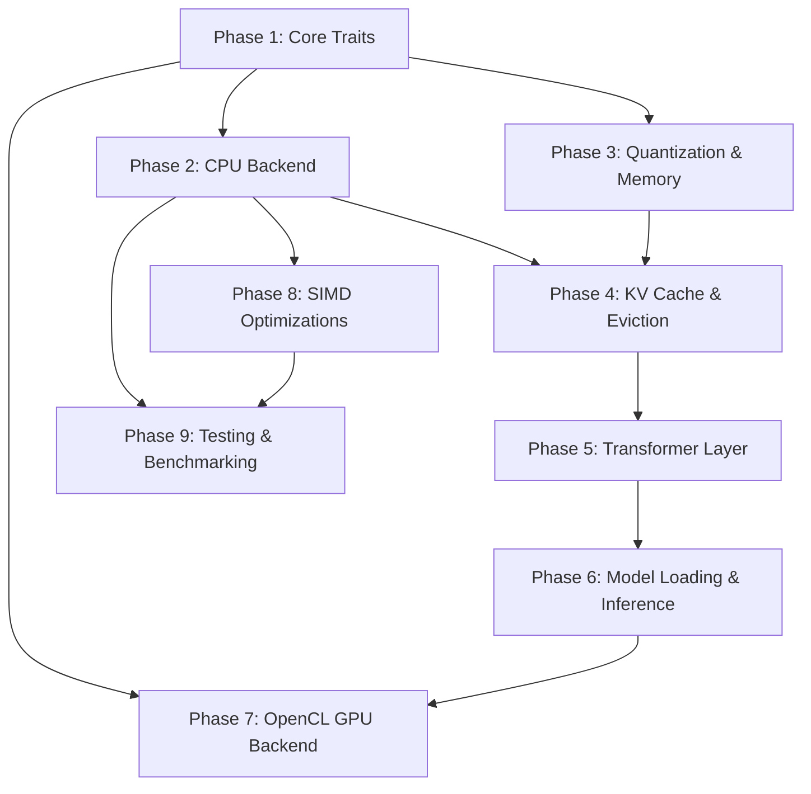

# Chapter 0: 구현 순서 가이드 (Build Guide)

**이전**: 없음 | **다음**: [01. 설계 결정 및 근거](01_design_rationale.md)

---

이 문서는 Antigravity (llm_rs2) 프로젝트를 처음부터 다시 구현하고자 하는 개발자를 위한 단계별 가이드입니다. 각 Phase는 의존 관계를 고려하여 구성되어 있으며, 순서대로 따라가면 동작하는 on-device LLM inference framework를 완성할 수 있습니다.

## Phase 의존 관계



---

## Phase 1: Core Traits (`src/core/`)

프레임워크 전체를 관통하는 추상화 계층을 먼저 정의합니다. 이 단계에서 만드는 trait들이 이후 모든 Phase의 기반이 됩니다.

### 대상 파일

| 파일 | 역할 |
|------|------|
| `buffer.rs` | `DType` enum (`F32`, `F16`, `BF16`, `Q4_0`, `Q4_1`, `Q8_0`), `Buffer` trait |
| `shape.rs` | `Shape` struct (다차원 텐서 형상 표현) |
| `tensor.rs` | `Tensor` struct (Buffer + Shape 조합) |
| `memory.rs` | `Memory` trait (버퍼 할당 추상화) |
| `backend.rs` | `Backend` trait (15+ 연산 정의) |

### 핵심 포인트

- `Backend` trait에는 `attention_gen`, `gather`, `copy_slice`, `read_buffer`, `synchronize`에 대한 **default CPU 구현**이 포함되어 있습니다. 새 backend를 추가할 때 이 연산들은 별도 구현 없이 사용할 수 있습니다.
- `Buffer` trait은 `opencl` feature flag에 따라 `cl_mem()` 메서드가 조건부 컴파일됩니다.
- `DType`은 메모리 레이아웃 계산과 quantization dispatch의 핵심입니다.

### 의존성

없음. 가장 먼저 구현합니다.

---

## Phase 2: CPU Backend (`src/backend/cpu/`)

Core trait을 기반으로 순수 스칼라 CPU 연산을 구현합니다. 이 backend는 정확성 검증의 reference 역할도 겸합니다.

### 대상 파일

| 파일 | 역할 |
|------|------|
| `common.rs` | `CpuBackendCommon` — 12개 스칼라 연산 구현 (나머지는 Backend trait default) |
| `mod.rs` | type alias `CpuBackend` |

### 구현 대상 연산

```
matmul, matmul_transposed, matmul_slice, rms_norm, softmax,
rope_inplace, silu_mul, add_assign, scale, copy_from, cast, attention_gen
```

### 핵심 포인트

- `matmul_transposed`가 주 matmul 경로입니다. 모델 가중치가 전치(transposed) 상태로 저장되기 때문입니다.
- `matmul_transposed`는 B의 `DType`에 따라 dispatch합니다: `F32`, `Q4_0`, `Q4_1` 각각 별도 경로.
- 이 Phase의 스칼라 구현은 느리지만 정확하며, Phase 8의 SIMD 최적화와 Phase 9의 테스트에서 oracle로 사용됩니다.

### 의존성

Phase 1 (Core Traits)

---

## Phase 3: Quantization & Memory

양자화 포맷 구현과 메모리 할당 시스템을 구축합니다.

### 대상 파일

| 파일 | 역할 |
|------|------|
| `quant.rs` | `BlockQ4_0`, `BlockQ4_1`, `BlockQ8_0` 구조체 및 dequant 함수 |
| `galloc.rs` | `Galloc` — stateless simple allocator |
| `shared_buffer.rs` | `SharedBuffer` — `Vec<u8>` wrapping 버퍼 |

### 양자화 포맷 상세

**BlockQ4_0** (18 bytes per 32 elements):

```
┌──────────┬──────────────────────┐
│ f16 scale │ [u8; 16] packed      │
│ (2 bytes) │ nibbles (16 bytes)   │
└──────────┴──────────────────────┘

dequantize: value = (nibble - 8) * scale
```

**BlockQ8_0** (34 bytes per 32 elements):

```
┌──────────┬──────────────────────┐
│ f16 scale │ [i8; 32] quants      │
│ (2 bytes) │ (32 bytes)           │
└──────────┴──────────────────────┘

용도: Q4_0 matmul 가속을 위한 중간(intermediate) 포맷
      activation을 Q8_0으로 양자화 → Q4_0×Q8_0 dotprod 수행
```

**BlockQ4_1** (20 bytes per 32 elements):

```
┌──────────┬──────────┬──────────────────────┐
│ f16 scale │ f16 min  │ [u8; 16] packed      │
│ (2 bytes) │ (2 bytes)│ nibbles (16 bytes)   │
└──────────┴──────────┴──────────────────────┘
```

### Galloc 할당자

- Stateless 설계: `alloc()` 호출 시 `SharedBuffer`를 생성하여 반환
- `SharedBuffer`는 내부적으로 `Vec<u8>`를 감싸며, `Buffer` trait을 구현

### 의존성

Phase 1 (Core Traits)

---

## Phase 4: KV Cache & Eviction

Transformer의 autoregressive decoding에 필수적인 KV cache와 메모리 관리를 위한 eviction 시스템을 구현합니다.

### 대상 파일

| 파일 | 역할 |
|------|------|
| `kv_cache.rs` | `KVCache` — K/V 버퍼 관리 |
| `eviction/mod.rs` | `EvictionPolicy` trait |
| `eviction/no_eviction.rs` | `NoEvictionPolicy` |
| `eviction/sliding_window.rs` | `SlidingWindowPolicy` |
| `eviction/snap_kv.rs` | `SnapKVPolicy` (stub) |
| `cache_manager.rs` | Cache 생명주기 관리 |
| `sys_monitor.rs` | 시스템 리소스 모니터링 |

### KVCache 구조

```
k_buffer: Tensor [1, max_seq_len, kv_heads, head_dim]
v_buffer: Tensor [1, max_seq_len, kv_heads, head_dim]
current_pos: usize  // 현재 채워진 위치 (물리적 슬롯)
```

### 핵심 연산

- `update()`: 새 K/V 값을 cache에 기록. 내부적으로 `copy_slice` 사용
- `prune_prefix()`: eviction 시 오래된 토큰을 제거하고 나머지를 `memmove`로 이동

### Eviction 정책

- `NoEvictionPolicy`: eviction 없음. `max_seq_len`에 도달하면 에러
- `SlidingWindowPolicy`: 최근 N개 토큰만 유지. `protected_prefix`로 앞부분 보호 가능
- `SnapKVPolicy`: attention score 기반 토큰 선택 (현재 stub, sliding window로 fallback)

### 의존성

Phase 1 (Core Traits), Phase 2 (CPU Backend), Phase 3 (Quantization & Memory)

---

## Phase 5: Transformer Layer

Llama 모델의 단일 Transformer layer와 사전 할당 workspace를 구현합니다.

### 대상 파일

| 파일 | 역할 |
|------|------|
| `layers/llama_layer.rs` | Transformer layer forward pass |
| `layers/workspace.rs` | `LayerWorkspace` — 사전 할당 버퍼 |
| `layers/attention.rs` | Attention 연산 (naive + flash) |

### LayerWorkspace

Decode 단계에서 매 토큰마다 동일한 크기의 버퍼가 필요합니다. 매번 할당하는 대신 한 번 할당 후 재사용합니다.

```
LayerWorkspace {
    q: [batch, 1, q_dim],          // Q projection (q_dim = num_heads * head_dim)
    k: [batch, 1, k_dim],          // K projection (k_dim = kv_heads * head_dim)
    v: [batch, 1, v_dim],          // V projection
    out_attn: [batch, 1, q_dim],   // attention 출력 (projection 전)
    gate: [batch, 1, ffn_hidden],  // FFN gate
    up: [batch, 1, ffn_hidden],    // FFN up
    down: [batch, 1, dim],         // FFN down
    residual: [batch, 1, dim],     // residual connection
    attn_out: [batch, 1, dim],     // attention output projection 후
    scores: Vec<f32>,              // CPU attention fallback용 (n_heads * max_seq_len)
}
```

> **주의**: q_dim, k_dim 등은 heads가 flatten된 형태입니다 (별도 차원이 아님).

### Forward Pass 흐름

`forward()` (prefill, `seq_len > 1`)와 `forward_gen()` (decode, `seq_len = 1`) 두 경로가 있습니다.

```
Input
  │
  ├─ RMSNorm
  ├─ QKV matmul (q_proj, k_proj, v_proj)
  ├─ RoPE (positional encoding)
  ├─ KV Cache update
  ├─ Attention
  ├─ Output projection (o_proj)
  ├─ Residual add
  │
  ├─ RMSNorm
  ├─ FFN: gate_proj → SiLU × up_proj → down_proj
  └─ Residual add
       │
     Output
```

### 의존성

Phase 1-4

---

## Phase 6: Model Loading & Inference

Safetensors 포맷의 가중치를 로드하고, 토큰 생성 루프를 구현합니다.

### 대상 파일

| 파일 | 역할 |
|------|------|
| `models/llama/llama_model.rs` | 모델 구조 정의, 가중치 로딩 |
| `bin/generate.rs` | 추론 바이너리 (CLI) |

### 가중치 로딩 흐름

```
Safetensors (memmap)
  → dtype 변환 (BF16/F16 → F32)
  → 선택적 Q4_0 양자화
  → Tensor 생성
```

### HuggingFace 텐서 네이밍 규칙

```
model.layers.{i}.self_attn.q_proj.weight
model.layers.{i}.self_attn.k_proj.weight
model.layers.{i}.self_attn.v_proj.weight
model.layers.{i}.self_attn.o_proj.weight
model.layers.{i}.mlp.gate_proj.weight
model.layers.{i}.mlp.up_proj.weight
model.layers.{i}.mlp.down_proj.weight
model.layers.{i}.input_layernorm.weight
model.layers.{i}.post_attention_layernorm.weight
model.embed_tokens.weight
model.norm.weight
lm_head.weight
```

### Tied Weights

`lm_head.weight`가 없는 모델에서는 `embed_tokens.weight`를 lm_head로 공유(tie)합니다. 이 경우 양자화된 embed_tokens를 그대로 사용합니다.

### Sampling 파이프라인

```
logits
  → repetition penalty 적용
  → temperature scaling
  → softmax
  → top-K filtering
  → top-P (nucleus) filtering
  → multinomial sampling
  → 다음 토큰
```

### 의존성

Phase 1-5

---

## Phase 7: OpenCL GPU Backend

ARM SoC (Adreno GPU) 대상 OpenCL 가속 backend를 구현합니다.

### 대상 파일

| 파일 | 역할 |
|------|------|
| `backend/opencl/mod.rs` | `OpenCLBackend` — GPU 연산 dispatch |
| `backend/opencl/buffer.rs` | GPU 버퍼 관리 |
| `backend/opencl/memory.rs` | GPU 메모리 할당 |
| `kernels/*.cl` | OpenCL 커널 (~78개 파일) |

### 핵심 설계

- `KernelCache`: 컴파일된 커널을 캐싱하여 재사용
- `CL_MEM_ALLOC_HOST_PTR`: ARM SoC에서 GPU 버퍼를 CPU 포인터로 직접 매핑 (zero-copy)
- CPU backend가 reference 구현으로 존재하므로, GPU 결과를 CPU 결과와 비교하여 검증 가능

### Zero-Copy 메모리

```
┌─────────────┐
│  ARM SoC     │
│              │
│  CPU ←──────→ GPU      CL_MEM_ALLOC_HOST_PTR
│  pointer     cl_mem    (동일 물리 메모리)
│              │
└─────────────┘
memcpy 불필요 → 대역폭 절약
```

### 의존성

Phase 1 (Core Traits), Phase 6 (CPU backend가 reference로 필요)

---

## Phase 8: SIMD Optimizations

CPU backend의 hot path를 SIMD intrinsic으로 최적화합니다.

### 대상 파일

| 파일 | 역할 |
|------|------|
| `backend/cpu/neon.rs` | ARM64 NEON 최적화 |
| `backend/cpu/x86.rs` | x86_64 AVX2 최적화 |

### NEON (ARM64) 최적화 대상

- **FMA (Fused Multiply-Add)**: 4-way unrolled, `vfmaq_f32` 사용
- **Q4_0 x Q8_0 dotprod**: `vdotq_s32` (dotprod extension) 활용
- **sdot**: inline assembly를 통한 최적화
- **quantize_row_q8_0**: activation을 Q8_0으로 실시간 양자화

### AVX2 (x86_64) 최적화 대상

- **FMA**: 8-wide `_mm256_fmadd_ps`
- **Q4_0 경로**: NEON과 유사한 구조, 256-bit 레지스터 활용

### Dispatch 휴리스틱

```rust
if M * N * K < 100_000 {
    // 스칼라 경로 사용 (SIMD 오버헤드가 더 클 수 있음)
} else {
    // SIMD 경로 사용
}
```

### 의존성

Phase 2 (CPU Backend)

---

## Phase 9: Testing & Benchmarking

정확성 검증과 성능 측정 도구를 구현합니다.

### 대상 파일

| 파일 | 역할 |
|------|------|
| `bin/test_backend.rs` | Backend 정확성 검증 |
| `bin/micro_bench.rs` | 개별 연산 벤치마크 |

### test_backend

`CpuBackendCommon`을 oracle(정답)로 사용합니다. 각 연산에 대해:

1. 동일한 입력을 CPU와 대상 backend에 제공
2. 두 출력을 비교하여 허용 오차 내 일치 여부 확인
3. 불일치 시 상세 오류 리포트 출력

### micro_bench

개별 연산의 throughput을 측정합니다:

- `quantize_row_q8_0`: 스칼라 vs SIMD 속도 비교
- `vec_dot_q4_0_q8_0`: 스칼라 vs SIMD 속도 비교
- 다양한 행렬 크기에 대한 matmul 성능

### 의존성

Phase 2-8

---

## 구현 순서 요약

| Phase | 이름 | 핵심 산출물 | 검증 방법 |
|-------|------|-------------|-----------|
| 1 | Core Traits | `Backend`, `Buffer`, `Tensor` trait | 컴파일 확인 |
| 2 | CPU Backend | 스칼라 연산 12개 + default 5개 | Unit test |
| 3 | Quantization & Memory | Q4_0/Q8_0 dequant, Galloc | 알려진 값 dequant 검증 |
| 4 | KV Cache & Eviction | KVCache, SlidingWindowPolicy | update/prune 시나리오 테스트 |
| 5 | Transformer Layer | LayerWorkspace, forward/forward_gen | 단일 layer 출력 검증 |
| 6 | Model Loading | Safetensors 로딩, 토큰 생성 | E2E 텍스트 생성 |
| 7 | OpenCL Backend | GPU 가속 연산 | test_backend (CPU vs GPU) |
| 8 | SIMD Optimizations | NEON/AVX2 최적화 경로 | micro_bench, oracle 비교 |
| 9 | Testing & Benchmarking | test_backend, micro_bench | 자체 검증 도구 |

---

**이전**: 없음 | **다음**: [01. 설계 결정 및 근거](01_design_rationale.md)
