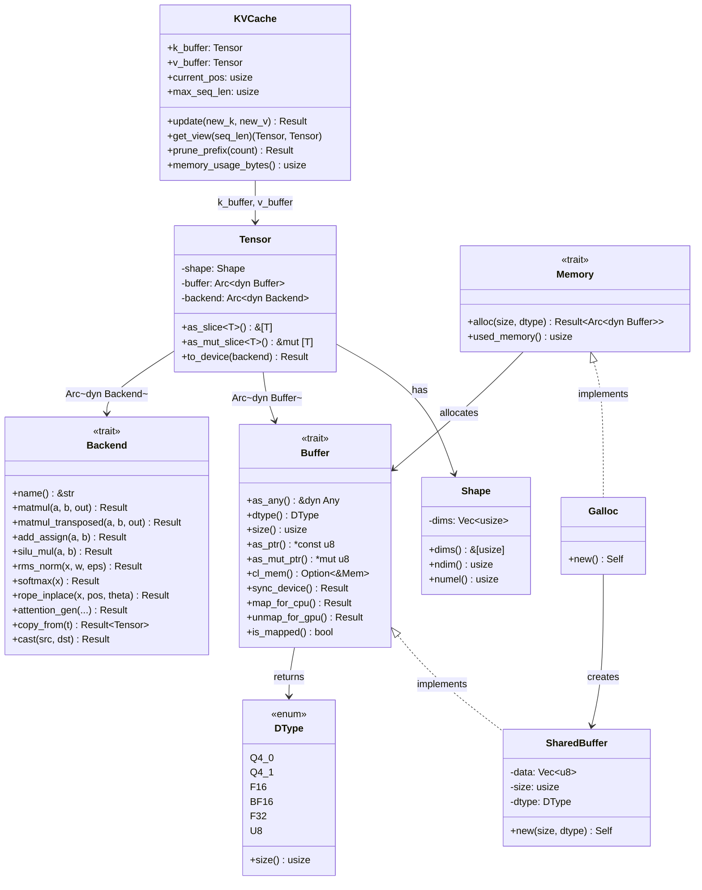

# Chapter 2: Core 추상화 (Core Abstractions)

**이전**: [01. 설계 결정](01_design_rationale.md) | **다음**: [03. CPU 백엔드](03_cpu_backend.md)

---

이 장에서는 Antigravity 프레임워크의 핵심 추상화 계층을 다룹니다. 데이터 타입 정의부터 텐서, 버퍼, 백엔드 trait까지 — 모든 연산과 메모리 관리의 기반이 되는 구조체와 인터페이스를 살펴봅니다.

---

## 2.1 DType Enum

**파일**: `src/core/buffer.rs`

`DType`은 프레임워크에서 지원하는 모든 데이터 타입을 열거합니다.

```rust
#[derive(Debug, Clone, Copy, PartialEq, Eq)]
pub enum DType {
    Q4_0,
    Q4_1,
    F16,
    BF16,
    F32,
    U8,
}
```

`size()` 메서드는 각 타입의 **요소당 바이트 수**를 반환합니다. Q4_0/Q4_1은 블록 양자화 방식이므로 실제 요소당 크기가 아닌 `1`을 반환하며, 블록 단위 산술은 별도로 처리됩니다.

```rust
impl DType {
    pub fn size(&self) -> usize {
        match self {
            DType::Q4_0 | DType::Q4_1 => 1, // 블록 양자화, 별도 처리
            DType::F16 | DType::BF16 => 2,
            DType::F32 => 4,
            DType::U8 => 1,
        }
    }
}
```

### DType 비교 표

| DType | `size()` 반환값 | 실제 요소 크기 | 주요 용도 |
|-------|----------------|---------------|-----------|
| `Q4_0` | 1 | 18B / 32요소 (블록) | 모델 가중치 (weight) 저장 |
| `Q4_1` | 1 | 20B / 32요소 (블록) | 모델 가중치 저장 (min 포함) |
| `F16` | 2 | 2B | KV cache, 중간 변환 |
| `BF16` | 2 | 2B | (예약됨) |
| `F32` | 4 | 4B | 활성화(activation), 연산 중간값 |
| `U8` | 1 | 1B | 토큰 인덱스, 범용 바이트 버퍼 |

---

## 2.2 Buffer Trait

**파일**: `src/core/buffer.rs`

`Buffer`는 **물리 메모리 추상화**입니다. CPU 힙 메모리든, GPU OpenCL 버퍼든 동일한 인터페이스로 접근할 수 있게 해줍니다.

```rust
pub trait Buffer: Send + Sync {
    fn as_any(&self) -> &dyn Any;
    fn dtype(&self) -> DType;
    fn size(&self) -> usize;           // 총 바이트 수
    fn as_ptr(&self) -> *const u8;     // 읽기 전용 CPU 포인터
    fn as_mut_ptr(&self) -> *mut u8;   // 가변 CPU 포인터

    #[cfg(feature = "opencl")]
    fn cl_mem(&self) -> Option<&Mem>;  // OpenCL 메모리 핸들
    #[cfg(not(feature = "opencl"))]
    fn cl_mem(&self) -> Option<()>;

    fn sync_device(&self) -> Result<()>;

    // --- Zero-Copy 공유 메모리 지원 ---
    fn map_for_cpu(&self) -> Result<()>   { Ok(()) }  // 기본값: no-op
    fn unmap_for_gpu(&self) -> Result<()> { Ok(()) }  // 기본값: no-op
    fn is_mapped(&self) -> bool           { true }     // CPU 버퍼는 항상 매핑 상태
}
```

핵심 설계 포인트:

- **`as_any()`**: 다운캐스팅 지원. `buffer.as_any().downcast_ref::<OpenCLBuffer>()`와 같이 구체 타입에 접근할 때 사용합니다.
- **`cl_mem()`**: `"opencl"` feature flag에 따라 조건부 컴파일됩니다. CPU 전용 버퍼는 `None`을 반환합니다.
- **Zero-copy 메서드들**: ARM SoC에서 `CL_MEM_ALLOC_HOST_PTR`을 통해 GPU 버퍼를 CPU 포인터로 매핑할 때 사용합니다. 기본 구현은 no-op이므로, CPU 전용 버퍼에서는 아무 작업도 하지 않습니다.

---

## 2.3 SharedBuffer

**파일**: `src/buffer/shared_buffer.rs`

`SharedBuffer`는 **CPU 전용 Buffer 구현체**입니다. 내부적으로 `Vec<u8>`로 힙 메모리를 관리합니다.

```rust
pub struct SharedBuffer {
    data: Vec<u8>,
    size: usize,
    dtype: DType,
}

impl SharedBuffer {
    pub fn new(size: usize, dtype: DType) -> Self {
        let data = vec![0u8; size];
        Self { data, size, dtype }
    }
}
```

Buffer trait 구현의 핵심:

- **`as_ptr()` / `as_mut_ptr()`**: `Vec` 내부 데이터를 직접 가리킵니다. `as_mut_ptr()`은 `&self`에서 `*mut u8`을 반환합니다. 이는 `self.data.as_ptr() as *mut u8`로 구현되며, 엄밀히는 `UnsafeCell` 없이 `&self`에서 가변 포인터를 얻는 것이므로 **안전하지 않습니다(unsound)**. 실제로는 `Arc` 래핑 환경에서 동시 접근이 발생하지 않도록 주의하여 사용합니다.
- **`cl_mem()`**: 항상 `None` 반환 — GPU 메모리가 없습니다.
- **`sync_device()`**: no-op — CPU 메모리는 항상 동기화 상태입니다.

단순하지만 CPU 백엔드에서는 이것으로 충분합니다. 모든 텐서 데이터의 기본 저장소로 사용됩니다.

---

## 2.4 Shape Struct

**파일**: `src/core/shape.rs`

`Shape`는 텐서의 차원 정보를 담는 구조체입니다.

```rust
#[derive(Debug, Clone, PartialEq, Eq)]
pub struct Shape {
    dims: Vec<usize>,
}
```

주요 메서드:

| 메서드 | 반환 타입 | 설명 |
|--------|----------|------|
| `dims()` | `&[usize]` | 차원 배열 참조 |
| `ndim()` | `usize` | 차원 수 (rank) |
| `numel()` | `usize` | 전체 요소 수 (모든 차원의 곱, 빈 경우 0) |

```rust
impl Shape {
    pub fn numel(&self) -> usize {
        if self.dims.is_empty() { 0 }
        else { self.dims.iter().product() }
    }
}

impl From<Vec<usize>> for Shape {
    fn from(dims: Vec<usize>) -> Self { Self::new(dims) }
}
```

예시: `Shape::new(vec![1, 128, 8, 64])`는 batch=1, seq_len=128, heads=8, head_dim=64인 텐서를 나타내며, `numel()` = 1 x 128 x 8 x 64 = 65,536입니다.

---

## 2.5 Tensor Struct

**파일**: `src/core/tensor.rs`

`Tensor`는 프레임워크의 핵심 데이터 단위로, 세 가지 구성 요소를 가집니다.

```rust
#[derive(Clone)]
pub struct Tensor {
    shape: Shape,
    buffer: Arc<dyn Buffer>,
    backend: Arc<dyn Backend>,
}
```

| 구성 요소 | 타입 | 역할 |
|-----------|------|------|
| `shape` | `Shape` | 논리적 차원 정보 |
| `buffer` | `Arc<dyn Buffer>` | 물리 메모리 (데이터 저장) |
| `backend` | `Arc<dyn Backend>` | 연산 수행 주체 (CPU/GPU) |

`Arc` 래핑을 통해 스레드 간 공유 소유권(shared ownership)이 가능합니다. `Clone`은 레퍼런스 카운트만 증가시키므로 가볍습니다.

### 타입 지정 접근자

```rust
pub fn as_slice<T>(&self) -> &[T] {
    unsafe {
        std::slice::from_raw_parts(
            self.as_ptr() as *const T,
            self.size() / std::mem::size_of::<T>(),
        )
    }
}

pub fn as_mut_slice<T>(&mut self) -> &mut [T] {
    unsafe {
        std::slice::from_raw_parts_mut(
            self.as_mut_ptr() as *mut T,
            self.size() / std::mem::size_of::<T>(),
        )
    }
}
```

원시 바이트 버퍼를 `f32`, `f16`, `BlockQ4_0` 등 원하는 타입의 슬라이스로 재해석합니다. 호출자가 올바른 타입을 지정해야 합니다.

### 디바이스 마이그레이션

```rust
pub fn to_device(&mut self, backend: Arc<dyn Backend>) -> Result<()> {
    if self.backend.name() == backend.name() {
        return Ok(());  // 같은 백엔드면 no-op
    }
    let new_tensor = backend.copy_from(self)?;
    *self = new_tensor;
    Ok(())
}
```

대상 백엔드의 `copy_from`을 호출하여 데이터를 복사하고, 자기 자신을 새 텐서로 교체합니다. CPU에서 GPU로, 또는 그 반대로 이동할 때 사용합니다.

> **구현 참고**: `CpuBackendNeon`과 `CpuBackendAVX2`의 `copy_from`은 내부적으로 `CpuBackendCommon::new().copy_from(t)`를 호출합니다. 이때 반환되는 텐서의 `backend`는 호출한 NEON/AVX2 인스턴스가 아닌 **`CpuBackendCommon`**으로 설정됩니다. CPU 내부에서는 문제되지 않으나, 이 동작을 알아두어야 합니다.

---

## 2.6 Memory Trait

**파일**: `src/core/memory.rs`

`Memory`는 버퍼 할당을 추상화하는 trait입니다.

```rust
pub trait Memory: Send + Sync {
    fn alloc(&self, size: usize, dtype: DType) -> Result<Arc<dyn Buffer>>;
    fn used_memory(&self) -> usize;
}
```

| 메서드 | 설명 |
|--------|------|
| `alloc(size, dtype)` | 지정된 크기와 타입의 버퍼를 할당하여 반환 |
| `used_memory()` | 현재 사용 중인 메모리 양 (바이트) |

구현체로는 CPU용 `Galloc`과 GPU용 `OpenCLMemory`가 있습니다.

---

## 2.7 Galloc Allocator

**파일**: `src/memory/galloc.rs`

`Galloc`은 CPU용 메모리 할당자입니다. 상태를 갖지 않는(stateless) 단순한 구현입니다.

```rust
pub struct Galloc;

impl Memory for Galloc {
    fn alloc(&self, size: usize, dtype: DType) -> Result<Arc<dyn Buffer>> {
        let buf = SharedBuffer::new(size, dtype);
        Ok(Arc::new(buf))
    }

    fn used_memory(&self) -> usize {
        0  // 추적 미구현
    }
}
```

`alloc` 호출마다 새로운 `SharedBuffer`를 생성합니다. 메모리 추적이 구현되어 있지 않으므로 `used_memory()`는 항상 0을 반환합니다. 할당 후 해제를 별도로 관리하지 않는 "allocate and forget" 방식입니다 — `Arc`의 레퍼런스 카운팅이 자동으로 해제를 처리합니다.

---

## 2.8 BlockQ4_0 양자화 구조체

**파일**: `src/core/quant.rs`

`BlockQ4_0`은 4비트 양자화의 기본 블록 단위입니다. 32개의 요소를 18바이트로 압축합니다.

```rust
pub const QK4_0: usize = 32;

#[derive(Debug, Clone, Copy)]
#[repr(C)]
pub struct BlockQ4_0 {
    pub d: f16,              // scale factor (2바이트)
    pub qs: [u8; QK4_0 / 2], // 32개의 4비트 값이 16바이트에 패킹 (16바이트)
}

const _: () = assert!(std::mem::size_of::<BlockQ4_0>() == 18);
```

### 메모리 레이아웃

| 필드 | 크기 | 설명 |
|------|------|------|
| `d` | 2B | f16 scale factor |
| `qs` | 16B | 32개의 4비트 값 (바이트당 2개씩 패킹) |
| **합계** | **18B** | **32개 요소** |

### 역양자화 (Dequantization)

```rust
impl BlockQ4_0 {
    pub fn dequantize(&self, out: &mut [f32; QK4_0]) {
        let d = self.d.to_f32();
        for i in 0..(QK4_0 / 2) {
            let b = self.qs[i];
            let v0 = (b & 0x0F) as i8 - 8;   // 하위 니블 → 인덱스 0..15
            let v1 = (b >> 4) as i8 - 8;      // 상위 니블 → 인덱스 16..31

            out[i] = v0 as f32 * d;
            out[i + QK4_0 / 2] = v1 as f32 * d;
        }
    }
}
```

핵심 포인트:

- **하위 니블** (`byte & 0x0F`): 출력 인덱스 `0..15`에 매핑
- **상위 니블** (`byte >> 4`): 출력 인덱스 `16..31`에 매핑
- 각 니블에서 8을 빼서 부호 있는 범위(-8 ~ +7)로 변환
- 최종 값: `nibble * d` (scale factor 적용)

F32 대비 압축률: 18B / (32 x 4B) = **14.1%** (약 7.1배 압축)

---

## 2.9 BlockQ4_1

**파일**: `src/core/quant.rs`

`BlockQ4_1`은 Q4_0에 **최솟값(minimum)** 파라미터를 추가한 변형입니다.

```rust
#[derive(Debug, Clone, Copy)]
#[repr(C)]
pub struct BlockQ4_1 {
    pub d: f16,              // scale (2바이트)
    pub m: f16,              // minimum (2바이트)
    pub qs: [u8; QK4_1 / 2], // 패킹된 4비트 값 (16바이트)
}

const _: () = assert!(std::mem::size_of::<BlockQ4_1>() == 20);
```

| 필드 | 크기 | 설명 |
|------|------|------|
| `d` | 2B | scale factor |
| `m` | 2B | minimum (offset) |
| `qs` | 16B | 32개의 4비트 값 |
| **합계** | **20B** | **32개 요소** |

역양자화 공식: `value = nibble * d + m`

```rust
impl BlockQ4_1 {
    pub fn dequantize(&self, out: &mut [f32; QK4_1]) {
        let d = self.d.to_f32();
        let m = self.m.to_f32();
        for i in 0..(QK4_1 / 2) {
            let b = self.qs[i];
            let v0 = (b & 0x0F) as f32;  // 0..15 범위 (부호 없음)
            let v1 = (b >> 4) as f32;

            out[i] = v0 * d + m;
            out[i + QK4_1 / 2] = v1 * d + m;
        }
    }
}
```

Q4_0과의 차이: 니블 값에서 8을 빼지 않고, 대신 `m`(minimum)을 더합니다. 이는 비대칭 양자화(asymmetric quantization)를 지원합니다.

---

## 2.10 BlockQ8_0

**파일**: `src/core/quant.rs`

`BlockQ8_0`은 8비트 양자화 블록으로, 주로 **matmul 최적화를 위한 중간 형식**으로 사용됩니다.

```rust
pub const QK8_0: usize = 32;

#[derive(Debug, Clone, Copy)]
#[repr(C)]
pub struct BlockQ8_0 {
    pub d: f16,           // scale (2바이트)
    pub qs: [i8; QK8_0],  // 32개의 8비트 부호 있는 정수 (32바이트)
}

const _: () = assert!(std::mem::size_of::<BlockQ8_0>() == 34);
```

| 필드 | 크기 | 설명 |
|------|------|------|
| `d` | 2B | scale factor |
| `qs` | 32B | 32개의 i8 값 |
| **합계** | **34B** | **32개 요소** |

**사용 패턴**: Q4_0 가중치와의 matmul을 최적화할 때, 활성화 텐서(F32)를 Q8_0으로 양자화한 뒤 `vec_dot_q4_0_q8_0`으로 정수 내적을 수행합니다. 정수 연산은 부동소수점보다 SIMD에서 훨씬 효율적입니다.

```
F32 활성화 → quantize_row_q8_0 → BlockQ8_0
                                      ↓
BlockQ4_0 가중치 ←→ vec_dot_q4_0_q8_0 → F32 결과
```

---

## 2.11 KVCache Struct

**파일**: `src/core/kv_cache.rs`

`KVCache`는 Transformer의 Key-Value 캐시를 관리합니다. Autoregressive 생성 시 이전 토큰의 K/V를 저장하여 재계산을 방지합니다.

```rust
pub struct KVCache {
    pub k_buffer: Tensor,    // [1, max_seq_len, kv_heads, head_dim]
    pub v_buffer: Tensor,    // [1, max_seq_len, kv_heads, head_dim]
    pub current_pos: usize,  // 현재 저장된 토큰 수
    pub max_seq_len: usize,  // 최대 용량
}
```

### update(new_k, new_v)

새로운 K/V 텐서를 캐시의 `current_pos` 위치에 복사합니다.

```rust
pub fn update(&mut self, new_k: &Tensor, new_v: &Tensor) -> Result<()> {
    let seq_len = new_k.shape().dims()[1];

    // Q4_0 블록 양자화일 경우, offset/count를 블록 단위로 계산
    let (offset, count) = if self.k_buffer.dtype() == DType::Q4_0 {
        let blocks_per_pos = heads * dim / QK4_0;
        (self.current_pos * blocks_per_pos, seq_len * blocks_per_pos)
    } else {
        let height = heads * dim;
        (self.current_pos * height, seq_len * height)
    };

    backend.copy_slice(new_k, &mut self.k_buffer, 0, offset, count)?;
    backend.copy_slice(new_v, &mut self.v_buffer, 0, offset, count)?;
    self.current_pos += seq_len;
    Ok(())
}
```

### get_view()

전체 버퍼의 참조를 반환합니다. Attention 연산이 `current_pos`를 사용하여 유효한 범위를 결정합니다.

### prune_prefix(count)

캐시의 앞쪽 `count`개 토큰을 제거하고, 나머지 데이터를 앞으로 이동합니다 (`memmove`).

```
Before: [A][B][C][D][E]  (current_pos=5)
prune_prefix(2)
After:  [C][D][E][_][_]  (current_pos=3)
```

Q4_0 블록의 경우 블록 크기(18바이트) 단위로 바이트 오프셋을 계산합니다. GPU 전용 버퍼(null CPU 포인터)에서는 에러를 반환합니다.

### memory_usage_bytes()

현재 저장된 K/V 데이터의 메모리 사용량을 반환합니다.

```rust
pub fn memory_usage_bytes(&self) -> usize {
    // current_pos × heads × dim × type_size × 2 (K + V)
    per_buffer * 2
}
```

---

## 2.12 Backend Trait 개요

**파일**: `src/core/backend.rs`

`Backend`는 모든 텐서 연산을 정의하는 핵심 trait입니다. CPU와 OpenCL GPU 모두 이 trait을 구현합니다. 15개 이상의 연산을 카테고리별로 정리하면:

### 연산 카테고리

| 카테고리 | 연산 | 시그니처 |
|----------|------|----------|
| **Math** | `matmul` | `(a, b, out)` — [M,K] x [K,N] |
| | `matmul_transposed` | `(a, b, out)` — B가 전치된 형태 |
| | `matmul_slice` | `(a, b, rows, cols, out)` — 부분 행렬 |
| **In-place** | `add_assign` | `(a, b)` — a += b |
| | `scale` | `(x, v)` — x *= v |
| **Activation** | `silu_mul` | `(a, b)` — a = SiLU(a) * b |
| | `rms_norm` | `(x, w, eps)` — RMS 정규화 |
| | `softmax` | `(x)` — 행 단위 softmax |
| **Position** | `rope_inplace` | `(x, start_pos, theta)` — RoPE 위치 인코딩 |
| **Attention** | `attention_gen` | `(q, k, v, out, ...)` — 단일 쿼리 어텐션 (GQA) |
| **Embedding** | `gather` | `(src, indices, dst)` — 임베딩 룩업 |
| **Memory** | `copy_from` | `(t) -> Tensor` — 텐서 복사 |
| | `copy_slice` | `(src, dst, offsets, count)` — 부분 복사 |
| | `read_buffer` | `(t, dst)` — 버퍼를 CPU 메모리로 읽기 |
| **Type** | `cast` | `(src, dst)` — 타입 변환 (F32↔F16, F32→Q4_0) |
| **Sync** | `synchronize` | `()` — GPU 동기화 (벤치마킹용) |

### 기본 구현이 제공되는 연산

다음 연산들은 trait에 기본(default) 구현이 포함되어 있어, 백엔드가 반드시 오버라이드하지 않아도 동작합니다:

- **`attention_gen`**: F32 기반 순차 어텐션 (GQA ratio 처리 포함)
- **`gather`**: F32 임베딩 테이블 룩업
- **`copy_slice`**: `memcpy` 기반 바이트 복사
- **`read_buffer`**: 포인터 기반 바이트 복사
- **`synchronize`**: no-op

---

## 전체 구조 다이어그램

아래 다이어그램은 핵심 타입들 간의 관계를 보여줍니다.



---

**이전**: [01. 설계 결정](01_design_rationale.md) | **다음**: [03. CPU 백엔드](03_cpu_backend.md)
