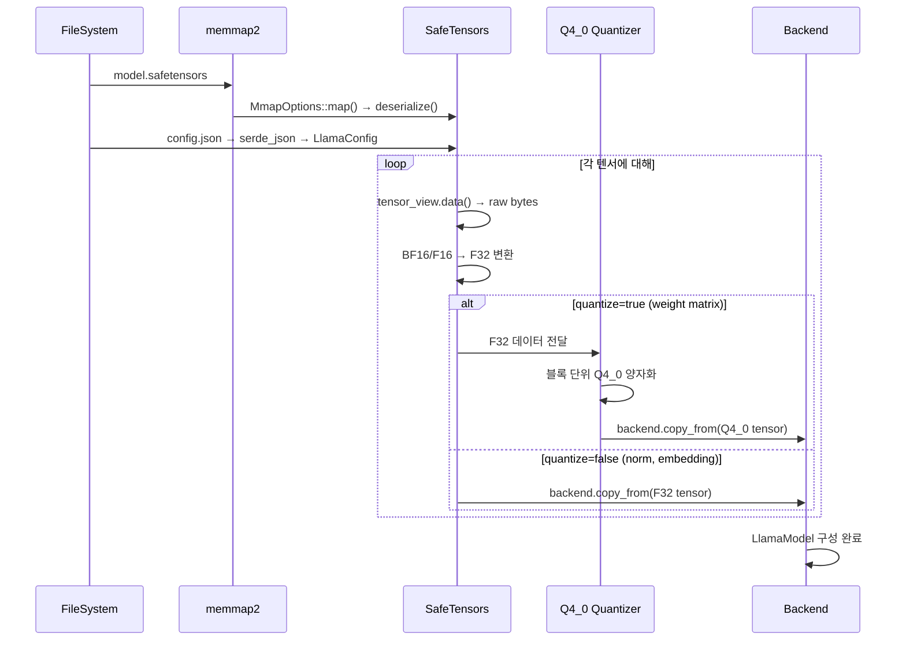

# Chapter 4: 모델 로딩 파이프라인 (Model Loading)

**이전**: [03. CPU 백엔드](03_cpu_backend.md) | **다음**: [05. 토크나이저 및 샘플링](05_tokenizer_and_sampling.md)

---

## 4.1 Overview

Antigravity는 HuggingFace Safetensors 포맷의 Llama 3.2 모델을 로드하여 Rust의 내부 `Tensor` 표현으로 변환합니다. 로딩 파이프라인은 다음 단계를 거칩니다:

1. **Memory-mapped I/O**: `memmap2`를 사용하여 safetensors 파일을 메모리에 매핑
2. **dtype 변환**: BF16/F16 → F32로 변환 (모든 연산은 F32 기반)
3. **선택적 Q4_0 양자화**: weight matrix에 대해 인라인 양자화 수행
4. **백엔드 전송**: CPU 텐서를 타겟 백엔드(CPU/OpenCL)로 복사



### 파일 위치
`src/models/llama/llama_model.rs`

---

## 4.2 LlamaConfig

`config.json` 파일을 `serde_json`으로 파싱하여 생성하는 모델 설정 구조체입니다. Llama 3.2 1B 기준 값:

```rust
#[derive(Debug, Deserialize)]
pub struct LlamaConfig {
    pub hidden_size: usize,         // 2048
    pub num_hidden_layers: usize,   // 16
    pub num_attention_heads: usize, // 32
    pub num_key_value_heads: usize, // 8 (GQA)
    pub head_dim: usize,            // 64
    pub intermediate_size: usize,   // 8192
    pub vocab_size: usize,          // 128256
    pub rms_norm_eps: f64,          // 1e-5
    pub rope_theta: f64,            // 500000.0
}
```

**GQA (Grouped Query Attention)**: `num_attention_heads=32`이지만 `num_key_value_heads=8`로, 4개의 query head가 1개의 KV head를 공유합니다. 이를 통해 KV cache 메모리를 4배 절약합니다.

---

## 4.3 Safetensors 로딩 과정

`LlamaModel::load()` 함수에서 수행되는 3단계 로딩 프로세스:

### Step 1: config.json 파싱

```rust
let config_file = File::open(path.join("config.json"))?;
let config: LlamaConfig = serde_json::from_reader(config_file)?;
```

`serde::Deserialize` derive 매크로를 통해 JSON 필드가 자동으로 `LlamaConfig` 구조체에 매핑됩니다.

### Step 2: Safetensors 파일 메모리 매핑

```rust
let st_file = File::open(path.join("model.safetensors"))?;
let mmap = unsafe { MmapOptions::new().map(&st_file)? };
let tensors = SafeTensors::deserialize(&mmap)?;
```

`memmap2::MmapOptions`를 사용하여 파일을 가상 메모리에 직접 매핑합니다. 이렇게 하면 파일 전체를 RAM에 올리지 않고도 필요한 텐서만 on-demand로 읽을 수 있습니다.

### Step 3: 텐서별 dtype 변환 (→ F32)

각 텐서의 원본 dtype에 따라 F32로 변환합니다:

| 원본 dtype | 변환 방법 | 비고 |
|-----------|----------|------|
| F32 | `std::ptr::copy_nonoverlapping` (direct memcpy) | 변환 없이 복사 |
| BF16 | `half::bf16::from_bits(u16).to_f32()` per element | Brain Floating Point |
| F16 | `half::f16::from_bits(u16).to_f32()` per element | IEEE 754 Half |

```rust
match tensor_view.dtype() {
    safetensors::Dtype::F32 => {
        // Direct memcpy - 가장 빠름
        unsafe {
            std::ptr::copy_nonoverlapping(
                tensor_view.data().as_ptr(),
                f32_data.as_mut_ptr() as *mut u8,
                tensor_view.data().len()
            );
        }
    },
    safetensors::Dtype::BF16 => {
        let u16_data = unsafe {
            std::slice::from_raw_parts(data.as_ptr() as *const u16, num_elements)
        };
        for (i, &b) in u16_data.iter().enumerate() {
            f32_data[i] = half::bf16::from_bits(b).to_f32();
        }
    },
    safetensors::Dtype::F16 => {
        // BF16과 동일한 패턴, half::f16 사용
        // ...
    },
    _ => return Err(anyhow!("Unsupported dtype")),
}
```

---

## 4.4 Q4_0 인라인 양자화

`quantize=true`로 지정된 weight matrix에 대해 로딩 시점에 F32 → Q4_0 양자화를 수행합니다. Norm weight와 embedding은 양자화하지 않습니다.

### Q4_0 블록 구조

```rust
pub struct BlockQ4_0 {
    pub d: f16,       // scale factor (2 bytes)
    pub qs: [u8; 16], // 32개 4-bit 값을 16바이트에 팩킹 (16 bytes)
}
// 총 18 bytes per block, 블록당 32개 원소
```

### 양자화 알고리즘 (블록 단위, 32 elements)

각 블록(32개 F32 값)에 대해 다음을 수행합니다:

1. **Scale 계산**: `max_val = max(|values|)`, `d = max_val / 7.0`, `id = 1.0 / d`
2. **양자화 + 팩킹**: 32개 값을 16바이트에 저장
   - 앞쪽 16개와 뒤쪽 16개를 짝지어 처리
   - `v0 = round(src[z] * id).clamp(-8, 7)` (앞쪽 16개 중 z번째)
   - `v1 = round(src[z+16] * id).clamp(-8, 7)` (뒤쪽 16개 중 z번째)
   - `qs[z] = (v0 + 8) | ((v1 + 8) << 4)` (2개의 4-bit 값을 1바이트에 팩킹)

```rust
let max_val = src.iter().map(|v| v.abs()).fold(0.0f32, |x, y| x.max(y));
let d = max_val / 7.0;
let id = if d == 0.0 { 0.0 } else { 1.0 / d };

block.d = f16::from_f32(d);
for z in 0..16 {
    let v0 = (src[z] * id).round().clamp(-8.0, 7.0) as i8;
    let v1 = (src[z + 16] * id).round().clamp(-8.0, 7.0) as i8;
    let b0 = (v0 + 8) as u8;
    let b1 = (v1 + 8) as u8;
    block.qs[z] = b0 | (b1 << 4);
}
```

### 메모리 절감 효과

`[N, K]` shape의 F32 텐서 → `(N × K/32)` 블록 × 18 bytes:

| 텐서 | 원본 (F32) | Q4_0 | 압축률 |
|------|-----------|------|--------|
| wq [2048, 2048] | 16 MB | 2.25 MB | 7.1x |
| lm_head [128256, 2048] | 1 GB | 144 MB | 7.1x |

> **참고**: `cols % 32 != 0`인 경우 양자화를 건너뛰고 F32로 유지합니다 (fallback).

---

## 4.5 HuggingFace 텐서 이름 매핑

HuggingFace Safetensors의 텐서 이름이 내부 `LlamaLayer` 필드에 어떻게 매핑되는지 정리합니다:

| HF 이름 | 내부 용도 | 양자화 | Shape |
|---------|----------|--------|-------|
| `model.embed_tokens.weight` | embed_tokens | No (F32) | [vocab_size, hidden_size] |
| `model.layers.{i}.input_layernorm.weight` | attention_norm | No (F32) | [hidden_size] |
| `model.layers.{i}.self_attn.q_proj.weight` | wq | Yes (Q4_0) | [hidden_size, hidden_size] |
| `model.layers.{i}.self_attn.k_proj.weight` | wk | Yes (Q4_0) | [kv_dim, hidden_size] |
| `model.layers.{i}.self_attn.v_proj.weight` | wv | Yes (Q4_0) | [kv_dim, hidden_size] |
| `model.layers.{i}.self_attn.o_proj.weight` | wo | Yes (Q4_0) | [hidden_size, hidden_size] |
| `model.layers.{i}.post_attention_layernorm.weight` | ffn_norm | No (F32) | [hidden_size] |
| `model.layers.{i}.mlp.gate_proj.weight` | w_gate | Yes (Q4_0) | [intermediate, hidden_size] |
| `model.layers.{i}.mlp.up_proj.weight` | w_up | Yes (Q4_0) | [intermediate, hidden_size] |
| `model.layers.{i}.mlp.down_proj.weight` | w_down | Yes (Q4_0) | [hidden_size, intermediate] |
| `model.norm.weight` | norm | No (F32) | [hidden_size] |
| `lm_head.weight` | lm_head | Yes (Q4_0) | [vocab_size, hidden_size] |

**규칙**: Norm weight(`input_layernorm`, `post_attention_layernorm`, `model.norm`)와 embedding(`embed_tokens`)은 F32로 유지하고, 나머지 weight matrix는 모두 Q4_0으로 양자화합니다.

---

## 4.6 Tied Weights (lm_head)

Llama 3.2는 **tied embeddings** 패턴을 사용합니다. `lm_head.weight`가 safetensors에 별도로 존재하지 않는 경우, `model.embed_tokens.weight`를 재사용합니다.

```rust
let lm_head = if tensors.names().contains(&"lm_head.weight") {
    load_tensor("lm_head.weight", true)?  // Q4_0으로 양자화
} else {
    // Tied weights: embed_tokens(F32)를 Q4_0으로 양자화하여 lm_head로 사용
    println!("lm_head not found, quantizing embed_tokens for lm_head...");
    load_tensor("model.embed_tokens.weight", true)?
};
```

동일한 `model.embed_tokens.weight`가 두 가지 용도로 사용됩니다:
- **embed_tokens**: F32 그대로 (embedding lookup은 양자화 불가)
- **lm_head**: Q4_0으로 양자화 (matmul 연산에 사용)

---

## 4.7 LlamaModel 구조체

로딩이 완료되면 다음 구조체가 생성됩니다:

```rust
pub struct LlamaModel {
    pub config: LlamaConfig,
    pub layers: Vec<LlamaLayer>,  // num_hidden_layers (16)
    pub embed_tokens: Tensor,      // [vocab_size, hidden_size] F32
    pub norm: Tensor,              // [hidden_size] F32
    pub lm_head: Tensor,           // [vocab_size, hidden_size] Q4_0
}
```

각 `LlamaLayer`는 transformer 블록 하나를 나타내며, 9개의 텐서를 포함합니다:

```rust
pub struct LlamaLayer {
    pub wq: Tensor,             // Q4_0
    pub wk: Tensor,             // Q4_0
    pub wv: Tensor,             // Q4_0
    pub wo: Tensor,             // Q4_0
    pub w_gate: Tensor,         // Q4_0
    pub w_up: Tensor,           // Q4_0
    pub w_down: Tensor,         // Q4_0
    pub attention_norm: Tensor, // F32
    pub ffn_norm: Tensor,       // F32
}
```

### 메모리 레이아웃

로딩 시점에 CPU 메모리(`Galloc`)에 텐서를 할당한 뒤, `backend.copy_from()`을 호출하여 타겟 백엔드로 복사합니다. OpenCL 백엔드의 경우 GPU 메모리(`cl_mem`)에 복사됩니다.

---

## 4.8 Forward Pass (forward_into)

`forward_into()`는 사전 할당된 출력 버퍼에 logits를 기록하는 통합 forward pass 함수입니다.

### LlamaModelForwardArgs

```rust
pub struct LlamaModelForwardArgs<'a> {
    pub input_tokens: &'a Tensor,          // [1, seq_len] 토큰 인덱스
    pub start_pos: usize,                   // RoPE 시작 위치
    pub kv_caches: &'a mut [KVCache],       // 레이어별 KV 캐시
    pub backend: &'a Arc<dyn Backend>,
    pub memory: &'a dyn Memory,
    pub logits_out: &'a mut Tensor,         // [1, seq_len, vocab_size] 출력
    pub x_gen: Option<&'a mut Tensor>,      // seq_len=1 시 재사용 버퍼
    pub workspace: Option<&'a mut LayerWorkspace>, // 레이어 workspace 재사용
    pub use_gpu_attn: bool,
    pub cache_manager: Option<&'a CacheManager>,
}
```

### Forward 실행 흐름

```
forward_into() 실행 순서:

1. Embedding Lookup
   gather(embed_tokens, input_tokens) → x
   * seq_len=1이면 x_gen 버퍼 재사용 (메모리 할당 없음)

2. Layer Iteration (i = 0..num_hidden_layers)
   LlamaLayer::forward(x, kv_cache[i], start_pos, ...)
   * workspace가 있으면 중간 버퍼 재사용

3. Cache Eviction (선택적)
   cache_manager.maybe_evict(kv_caches)
   * 메모리 압박 시 오래된 KV 엔트리 제거

4. Final RMSNorm
   rms_norm(x, norm, eps)

5. Output Projection
   matmul_transposed(x, lm_head) → logits_out
```

**Workspace 재사용**: decode 단계(`seq_len=1`)에서는 `x_gen`과 `LayerWorkspace`를 사전 할당하여 매 토큰 생성 시 메모리 할당을 완전히 제거합니다. 이는 on-device 환경에서 일관된 latency를 확보하는 핵심 최적화입니다.

**Eviction 결과 반환**: `forward_into()`는 `Option<EvictionResult>`를 반환하여 호출자가 eviction 발생 여부와 제거된 토큰 수를 파악할 수 있게 합니다.

---

**이전**: [03. CPU 백엔드](03_cpu_backend.md) | **다음**: [05. 토크나이저 및 샘플링](05_tokenizer_and_sampling.md)
