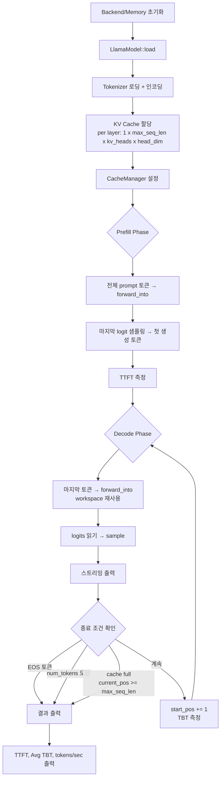
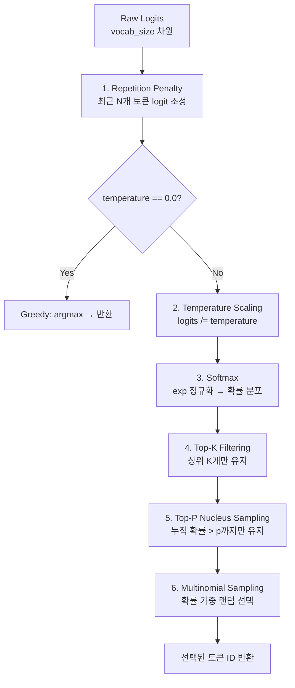

# Chapter 5: 토크나이저 및 샘플링 (Tokenizer & Sampling)

**이전**: [04. 모델 로딩](04_model_loading.md) | **다음**: [06. OpenCL 백엔드](06_opencl_backend.md)

---

## 5.1 HuggingFace Tokenizer 통합

Antigravity는 HuggingFace의 `tokenizers` crate(`onig` 백엔드)를 사용하여 텍스트를 토큰으로 변환합니다.

### 로딩

```rust
let tokenizer = Tokenizer::from_file(format!("{}/tokenizer.json", model_path))
    .map_err(|e| anyhow::anyhow!(e))?;
```

모델 디렉토리 내의 `tokenizer.json` 파일을 직접 로드합니다. HuggingFace에서 다운로드한 모델에 포함된 파일을 그대로 사용합니다.

### 인코딩 (텍스트 → 토큰)

```rust
let encoding = tokenizer.encode(prompt.as_str(), true)
    .map_err(|e| anyhow::anyhow!(e))?;
let input_ids: Vec<u32> = encoding.get_ids().to_vec();
```

두 번째 인자 `true`는 **BOS (Beginning of Sequence) 토큰을 자동 추가**합니다. Llama 3.2의 경우 `<|begin_of_text|>` 토큰이 시퀀스 앞에 삽입됩니다.

### 디코딩 (토큰 → 텍스트)

```rust
let current_text = tokenizer.decode(&tokens, true).unwrap_or_default();
```

`true` 인자는 special token을 건너뛰고 사람이 읽을 수 있는 텍스트만 반환합니다. 스트리밍 출력 시 이전에 출력한 길이(`printed_len`)를 추적하여 새로 생성된 부분만 출력합니다.

### EOS 감지

```rust
let eos_id = tokenizer.get_vocab(true)
    .get("</s>")
    .copied()
    .unwrap_or(u32::MAX);
```

`get_vocab(true)`로 special token을 포함한 전체 vocabulary를 가져온 뒤 `</s>` 토큰의 ID를 조회합니다. 생성 루프에서 이 토큰이 나오면 즉시 생성을 중단합니다.

---

## 5.2 추론 루프 구조

### 파일 위치
`src/bin/generate.rs`

전체 추론은 **Prefill Phase**와 **Decode Phase**로 나뉩니다.



### Phase별 상세

#### 1. 초기화

```rust
// Backend 선택
let backend: Arc<dyn Backend> = match args.backend.as_str() {
    "cpu" => Arc::new(CpuBackend::new()),
    "opencl" => Arc::new(OpenCLBackend::new()?),
    _ => anyhow::bail!("Unknown backend"),
};

// Memory 할당자 선택
let memory: Box<dyn Memory> = if args.backend == "opencl" {
    Box::new(OpenCLMemory::new(context, queue, args.zero_copy))
} else {
    Box::new(Galloc::new())
};
```

#### 2. KV Cache 할당

각 레이어마다 K와 V 텐서를 사전 할당합니다:

```rust
// Shape: [1, max_seq_len, kv_heads, head_dim]
// dtype: f32, f16, 또는 q4 (CLI 옵션으로 선택)
for _ in 0..num_layers {
    let k = Tensor::new(
        Shape::new(vec![1, max_seq_len, kv_heads, head_dim]),
        memory.alloc(kv_buf_size, kv_type)?,
        backend.clone(),
    );
    let v = Tensor::new(/* 동일 shape */);
    kv_caches.push(KVCache::new(k, v, max_seq_len));
}
```

#### 3. Prefill Phase

전체 prompt 토큰을 한 번에 처리합니다:

```rust
// 입력: [1, prompt_len] → 출력: [1, prompt_len, vocab_size]
model.forward_into(LlamaModelForwardArgs {
    input_tokens: &input_tensor,
    start_pos: 0,
    kv_caches: &mut kv_caches,
    logits_out: &mut prefill_logits,
    // ...
})?;

// 마지막 토큰 위치의 logit만 샘플링
let start_idx = (process_len - 1) * vocab_size;
let mut last_logits = logits_cpu[start_idx..start_idx + vocab_size].to_vec();
let next_token_id = sample(&mut last_logits, &tokens, vocab_size, &args);

ttft_ms = start_time.elapsed().as_secs_f64() * 1000.0;
start_pos += process_len;
```

#### 4. Decode Phase

토큰을 하나씩 생성하며, workspace를 재사용하여 메모리 할당을 제거합니다:

```rust
for _ in 0..(args.num_tokens - 1) {
    // 물리 캐시 용량 확인
    if kv_caches[0].current_pos >= max_seq_len {
        println!("\n[Stopped: Max context length reached]");
        break;
    }

    // 입력: [1, 1] → 출력: [1, 1, vocab_size]
    model.forward_into(LlamaModelForwardArgs {
        input_tokens: &gen_input_tensor,
        start_pos,
        x_gen: Some(&mut x_gen),           // 사전 할당 버퍼
        workspace: Some(&mut gen_ws),       // workspace 재사용
        cache_manager: cm_ref,              // eviction 관리
        // ...
    })?;

    let next_token_id = sample(&mut logits_cpu, &tokens, vocab_size, &args);
    tokens.push(next_token_id);

    // start_pos는 항상 증가 (eviction 후에도 RoPE 위치는 단조 증가)
    start_pos += 1;

    if next_token_id == eos_id { break; }
}
```

**핵심**: `start_pos`는 논리적 RoPE 위치를 추적하며, eviction이 발생하더라도 항상 `+1`씩 증가합니다. 물리적 캐시 위치(`current_pos`)와 독립적으로 관리됩니다.

---

## 5.3 샘플링 알고리즘

`sample()` 함수는 logits를 확률 분포로 변환하고 다음 토큰을 선택합니다.



### Step 1: Repetition Penalty

최근 `repetition_window`개 토큰에 대해 logit을 조정하여 반복 생성을 억제합니다:

```rust
let start_idx = tokens.len().saturating_sub(args.repetition_window);
for &token_id in &tokens[start_idx..] {
    let logit = &mut logits[token_id as usize];
    if *logit < 0.0 {
        *logit *= args.repetition_penalty;  // 음수 logit → 더 음수로
    } else {
        *logit /= args.repetition_penalty;  // 양수 logit → 더 작게
    }
}
```

양수 logit은 penalty로 **나누어** 확률을 낮추고, 음수 logit은 penalty를 **곱하여** 더 부정적으로 만듭니다. 기본값 `1.1`은 약 10% 감쇠 효과를 줍니다.

### Step 2: Temperature Scaling

```rust
if temp == 0.0 {
    // Greedy: 가장 높은 logit의 인덱스를 바로 반환
    return logits.iter().enumerate()
        .max_by(|(_, a), (_, b)| a.total_cmp(b))
        .map(|(idx, _)| idx as u32).unwrap();
}

for l in logits.iter_mut() {
    *l /= temp;
}
```

- `temperature = 0.0`: 결정적(deterministic) greedy decoding
- `temperature < 1.0`: 분포가 뾰족해짐 → 높은 확률 토큰에 집중
- `temperature > 1.0`: 분포가 평평해짐 → 더 다양한 출력

### Step 3: Softmax

```rust
let max_logit = logits.iter().fold(f32::NEG_INFINITY, |a, &b| a.max(b));
let mut exp_sum = 0.0;
for l in logits.iter_mut() {
    *l = (*l - max_logit).exp();  // 수치 안정성을 위해 max 빼기
    exp_sum += *l;
}
for l in logits.iter_mut() {
    *l /= exp_sum;  // 정규화: 합 = 1.0
}
```

`max_logit`을 빼는 것은 수치 안정성(numerical stability)을 위한 표준 기법입니다. `exp()` 함수의 overflow를 방지합니다.

### Step 4: Top-K Filtering

```rust
let mut indices: Vec<usize> = (0..logits.len()).collect();
indices.sort_by(|&a, &b| logits[b].total_cmp(&logits[a])); // 확률 내림차순

let top_k = args.top_k.min(vocab_size);
valid_indices.truncate(top_k);  // 상위 K개만 유지
```

확률이 높은 순서로 정렬한 뒤, 상위 `top_k`개(기본 40)만 남기고 나머지를 제거합니다.

### Step 5: Top-P (Nucleus) Sampling

```rust
let mut cumulative_prob = 0.0;
let mut cutoff_index = valid_indices.len();

for (i, &idx) in valid_indices.iter().enumerate() {
    cumulative_prob += logits[idx];
    if cumulative_prob > args.top_p {
        cutoff_index = i + 1;
        break;
    }
}
valid_indices.truncate(cutoff_index);
```

누적 확률이 `top_p`(기본 0.9)를 초과하는 지점까지만 토큰을 유지합니다. 이미 Top-K로 필터링된 후이므로 두 필터가 결합되어 적용됩니다.

### Step 6: Multinomial Sampling

```rust
let r: f32 = rand::Rng::random(&mut rng); // [0, 1)

let mut prob_sum = 0.0;
for &idx in &valid_indices {
    prob_sum += logits[idx];
}

let mut thread_r = r * prob_sum;
for &idx in &valid_indices {
    thread_r -= logits[idx];
    if thread_r <= 0.0 {
        return idx as u32;
    }
}
```

남은 토큰들의 확률에 비례하여 랜덤으로 하나를 선택합니다. `r * prob_sum`으로 스케일링한 뒤 확률을 순차적으로 빼가며 0 이하가 되는 지점의 토큰을 반환합니다.

---

## 5.4 CLI 옵션

`generate` 바이너리의 전체 커맨드라인 옵션입니다 (`clap::Parser` 기반):

| 옵션 | 기본값 | 설명 |
|------|--------|------|
| `--model-path` | `models/llama3.2-1b` | 모델 디렉토리 경로 |
| `--prompt` | `"Hello, world! I am a"` | 입력 프롬프트 |
| `--prompt-file` | (없음) | 프롬프트 파일 경로 (--prompt 대신 사용) |
| `--num-tokens` | `20` | 생성할 토큰 수 |
| `--backend` | `cpu` | 백엔드 선택: `cpu` 또는 `opencl` |
| `--temperature` | `0.8` | 샘플링 온도 (0.0 = greedy) |
| `--top-p` | `0.9` | Nucleus sampling 확률 임계값 |
| `--top-k` | `40` | Top-K 필터링 수 |
| `--repetition-penalty` | `1.1` | 반복 패널티 계수 |
| `--repetition-window` | `64` | 반복 검사 윈도우 크기 (토큰 수) |
| `--kv-type` | `q4` | KV 캐시 dtype: `f32`, `f16`, `q4` |
| `--max-seq-len` | `2048` | 최대 시퀀스 길이 |
| `--eviction-policy` | `none` | 캐시 eviction 정책: `none`, `sliding`, `snapkv` |
| `--eviction-window` | `1024` | Eviction 윈도우 크기 |
| `--protected-prefix` | `0` | Eviction에서 보호할 prefix 토큰 수 |
| `--gpu-attn` | `false` | GPU attention 커널 사용 여부 |
| `--zero-copy` | `false` | Zero-copy 공유 메모리 사용 |
| `--memory-threshold-mb` | `256` | Eviction 트리거 메모리 임계값 (MB) |

### 사용 예시

```bash
# 기본 CPU 추론
./generate --model-path models/llama3.2-1b --prompt "Once upon a time" -n 128

# OpenCL GPU + Q4 KV cache + sliding window eviction
./generate --backend opencl --kv-type q4 \
    --eviction-policy sliding --eviction-window 512 \
    --max-seq-len 2048 --num-tokens 256

# Greedy decoding (temperature=0)
./generate --temperature 0.0 --prompt "The capital of France is"

# 긴 프롬프트 파일 사용
./generate --prompt-file long_prompt.txt --num-tokens 512
```

---

## 5.5 성능 측정

`generate` 바이너리는 두 가지 핵심 latency 지표를 자동으로 측정합니다.

### TTFT (Time To First Token)

Prefill 시작부터 첫 번째 생성 토큰이 샘플링될 때까지의 시간입니다:

```rust
// Prefill 완료 후
ttft_ms = start_time.elapsed().as_secs_f64() * 1000.0;
```

TTFT는 prompt 길이에 비례하여 증가합니다. 전체 prompt를 한 번에 처리하므로, 긴 prompt일수록 TTFT가 높아집니다.

### TBT (Time Between Tokens)

Decode 단계에서 각 토큰 생성 간의 시간입니다:

```rust
let now = std::time::Instant::now();
let tbt = now.duration_since(last_token_time).as_secs_f64() * 1000.0;
tbt_values.push(tbt);
last_token_time = now;
```

### 출력 형식

```
TTFT: 245.32 ms
Avg TBT: 38.15 ms (26.2 tokens/sec)
```

```rust
// 평균 TBT와 처리량(tokens/sec) 계산
let avg_tbt: f64 = tbt_values.iter().sum::<f64>() / tbt_values.len() as f64;
println!("Avg TBT: {:.2} ms ({:.1} tokens/sec)", avg_tbt, 1000.0 / avg_tbt);
```

### 성능 지표 해석

| 지표 | 의미 | 영향 요인 |
|------|------|----------|
| TTFT | 사용자 체감 응답 시작 시간 | prompt 길이, 백엔드, 모델 크기 |
| Avg TBT | 토큰 생성 속도의 역수 | 백엔드, KV cache dtype, workspace 재사용 |
| tokens/sec | 초당 생성 토큰 수 (`1000 / avg_tbt`) | decode 효율 종합 지표 |

> **참고**: TTFT에는 모델 로딩 시간이 포함되지 않습니다. `start_time`은 KV cache 할당 직전에 설정되므로, TTFT에는 KV cache 할당 + 토크나이저 인코딩 + prefill forward pass 시간이 모두 포함됩니다 (모델 로딩은 제외). 보다 상세한 프로파일링은 `scripts/android_profile.py`를 사용하세요.

---

**이전**: [04. 모델 로딩](04_model_loading.md) | **다음**: [06. OpenCL 백엔드](06_opencl_backend.md)
