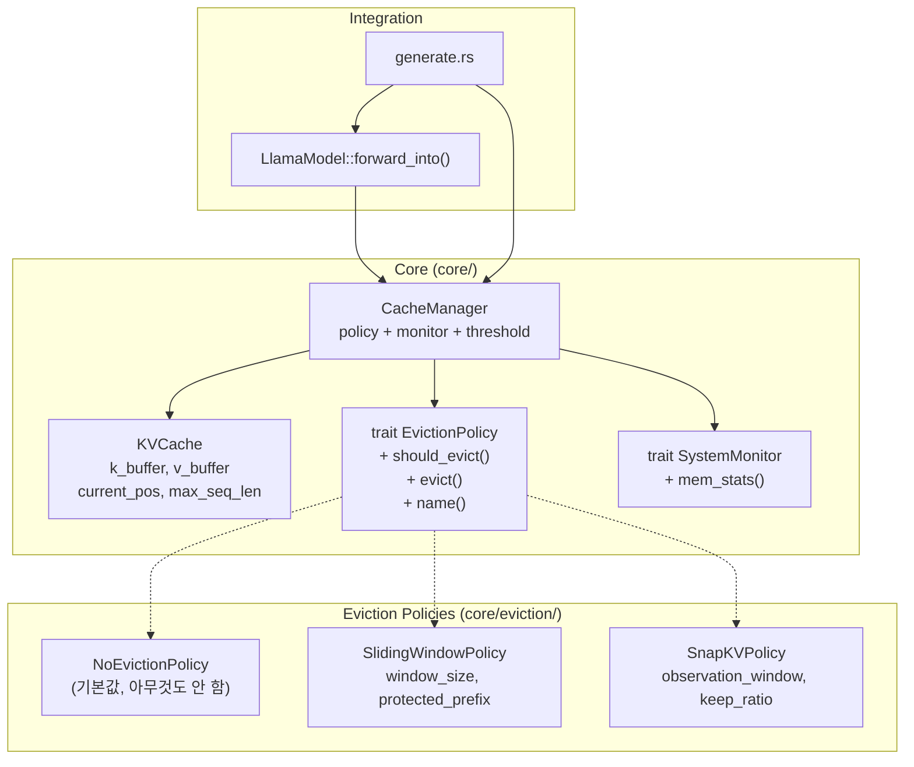
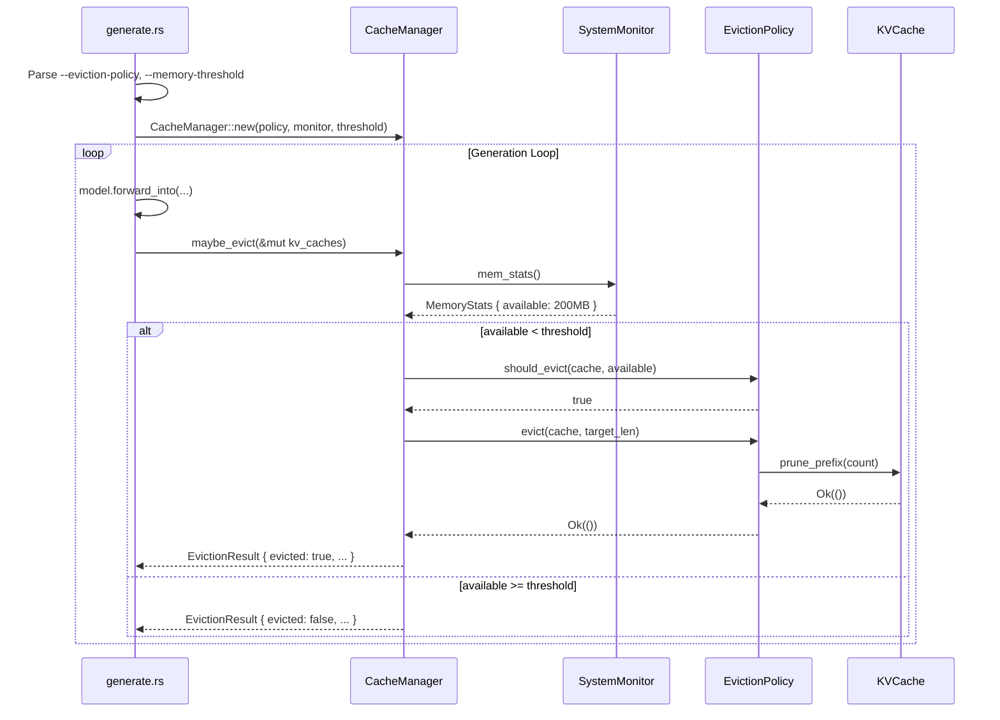

# Chapter 11: KV Cache 관리 전략

> **이전**: [10. 모델 추론](10_model_inference.md) | **다음**: [12. 하이브리드 추론](12_hybrid_inference.md)

## 11.1 Overview

LLM 추론 시 KV Cache는 시퀀스 길이에 비례하여 메모리를 차지합니다. 모바일/엣지 환경에서는 긴 시퀀스 생성 시 메모리 부족(OOM)이 발생할 수 있으며, 이를 동적으로 관리하기 위한 확장 가능한 캐시 관리 전략이 필요합니다.

### 핵심 목표
- **동적 메모리 관리**: 시스템 메모리 압력에 따라 자동으로 캐시를 축소
- **전략 교체 가능**: SOLID 원칙에 따라 새로운 eviction 전략을 기존 코드 수정 없이 추가
- **기본 동작 무변경**: 기본값은 "전략 없음"으로 기존 동작과 완전히 동일

---

## 11.2 아키텍처

### 컴포넌트 다이어그램



### SOLID 원칙 적용

| 원칙 | 적용 방법 |
|------|-----------|
| **S** (Single Responsibility) | `KVCache`는 저장만, `EvictionPolicy`는 전략 판단만, `CacheManager`는 조율만 담당 |
| **O** (Open/Closed) | 새 전략 추가 시 `EvictionPolicy` trait을 구현하면 됨. 기존 코드 수정 불필요 |
| **L** (Liskov Substitution) | 모든 policy는 `EvictionPolicy` trait을 통해 완전히 교체 가능 |
| **I** (Interface Segregation) | `EvictionPolicy`: `should_evict()`, `evict()`, `name()` 3개 메서드만 정의 |
| **D** (Dependency Inversion) | `CacheManager`는 구체 클래스가 아닌 `dyn EvictionPolicy`에 의존 |

---

## 11.3 핵심 인터페이스

### 11.3.1 EvictionPolicy Trait

```rust
// core/eviction/mod.rs

pub trait EvictionPolicy: Send + Sync {
    /// 현재 캐시 상태와 가용 메모리를 기반으로 eviction 필요 여부를 판단
    fn should_evict(&self, cache: &KVCache, mem_available: usize) -> bool;

    /// 실제 eviction 수행. target_len은 eviction 후 유지할 토큰 수
    fn evict(&self, cache: &mut KVCache, target_len: usize) -> Result<()>;

    /// 정책 이름 (로깅/디버깅용)
    fn name(&self) -> &str;
}
```

### 11.3.2 CacheManager

```rust
// core/cache_manager.rs

pub struct CacheManager {
    policy: Box<dyn EvictionPolicy>,
    monitor: Box<dyn SystemMonitor>,
    threshold_bytes: usize,  // 가용 메모리가 이 이하면 eviction 트리거
    target_ratio: f32,       // eviction 시 캐시를 이 비율로 축소 (e.g., 0.75)
}

impl CacheManager {
    /// 각 generation step 후에 호출
    /// 메모리 압력에 따라 동적으로 eviction 수행
    pub fn maybe_evict(&self, caches: &mut [KVCache]) -> Result<EvictionResult>;
}

pub struct EvictionResult {
    pub evicted: bool,
    pub tokens_removed: usize,
    pub new_pos: usize,
}
```

---

## 11.4 Eviction 전략

### 11.4.1 NoEvictionPolicy (기본값)

아무것도 하지 않는 전략. `should_evict()`가 항상 `false`를 반환합니다.
기존 동작과 완전히 동일하며, 캐시가 가득 차면 에러를 반환합니다.

```
[토큰 0][토큰 1][토큰 2]...[토큰 N]  → 변화 없음
```

### 11.4.2 SlidingWindowPolicy (Moving Window)

가장 최근 `window_size`개의 토큰만 유지하고, 나머지는 앞에서부터 제거합니다.
`protected_prefix`를 설정하면 시스템 프롬프트 등 앞부분 토큰을 보호할 수 있습니다.

```
설정: window_size=1024, protected_prefix=64

Before (current_pos = 2048):
[SYS 0..63][토큰 64][토큰 65]...[토큰 1023][토큰 1024]...[토큰 2047]
 ↑ protected                      ↑ 제거 대상              ↑ 유지

After (current_pos = 1088):
[SYS 0..63][토큰 1024][토큰 1025]...[토큰 2047]
 ↑ protected  ↑ 앞으로 이동
```

**구현 핵심**: `KVCache::prune_prefix(count)` → `memmove`로 데이터를 앞으로 이동

### 11.4.3 SnapKVPolicy (Attention-based)

Attention score를 기반으로 중요한 토큰을 선택적으로 유지하는 전략입니다.
자주 attention 되는 토큰은 보존하고, 거의 참조되지 않는 토큰을 제거합니다.

```
Before:
[토큰 0][토큰 1][토큰 2][토큰 3][토큰 4][토큰 5]
 score:  0.8     0.1     0.05    0.7     0.02    0.3

After (keep_ratio=0.5, 상위 50% 유지):
[토큰 0][토큰 3][토큰 5]  ← 높은 attention score 토큰만 유지
```

> **Note**: SnapKV는 attention score 접근이 필요합니다. 현재 attention 계산이
> `LlamaLayer` 내부에서 직접 이루어지므로, 실제 score 기반 동작을 위해서는
> attention score를 외부로 노출하는 추가 리팩토링이 필요합니다.
> **초기 구현에서는 인터페이스만 정의하고 fallback으로 sliding window를 사용합니다.**

---

## 11.5 KVCache 확장

기존 `KVCache`에 eviction 지원 메서드를 추가합니다.

### 추가 메서드

```rust
impl KVCache {
    /// 앞쪽 count개 토큰을 제거하고 나머지를 앞으로 이동
    ///
    /// Before: [A][B][C][D][E] (current_pos=5)
    /// prune_prefix(2)
    /// After:  [C][D][E][_][_] (current_pos=3)
    pub fn prune_prefix(&mut self, count: usize) -> Result<()>;

    /// 현재 사용 중인 KV 캐시 메모리 (bytes)
    pub fn memory_usage_bytes(&self) -> usize;
}
```

### prune_prefix 동작 원리

```
KV Buffer: [Batch, MaxSeqLen, KVHeads, HeadDim]

1. 보존할 영역 계산: src_offset = count * heads * dim
2. 보존할 크기 계산: move_count = (current_pos - count) * heads * dim
3. memmove 수행:     buffer[0..move_count] = buffer[src_offset..src_offset+move_count]
4. current_pos 업데이트: current_pos -= count
```

---

## 11.6 동적 메모리 감지

### SystemMonitor + MemoryPressure

`CacheManager`는 `SystemMonitor` trait을 통해 시스템 메모리 상태를 조회합니다.
Linux/Android에서는 `/proc/meminfo`를 파싱하여 `MemAvailable`을 읽습니다.

```
┌──────────────────────────────────────────────────┐
│  Generation Loop (매 토큰마다)                    │
│                                                    │
│  1. model.forward_into(...)                       │
│  2. cache_manager.maybe_evict(&mut kv_caches)     │
│     ├─ monitor.mem_stats() → MemoryStats          │
│     ├─ if available < threshold:                  │
│     │    policy.should_evict(cache, available)     │
│     │    policy.evict(cache, target_len)           │
│     └─ return EvictionResult                      │
│  3. sample next token                             │
└──────────────────────────────────────────────────┘
```

---

## 11.7 파일 구조

```
src/core/
├── kv_cache.rs         // [수정] prune_prefix(), memory_usage_bytes() 추가
├── cache_manager.rs    // [신규] CacheManager 오케스트레이터
├── sys_monitor.rs      // [기존] SystemMonitor trait + LinuxSystemMonitor
├── eviction/           // [신규] 모듈 디렉토리 (기존 eviction.rs 대체)
│   ├── mod.rs          //   EvictionPolicy trait + re-exports
│   ├── no_eviction.rs  //   NoEvictionPolicy
│   ├── sliding_window.rs // SlidingWindowPolicy
│   └── snap_kv.rs      //   SnapKVPolicy (stub)
└── mod.rs              // [수정] eviction, cache_manager, sys_monitor 등록
```

---

## 11.8 통합 흐름

### CLI 옵션

```
--eviction-policy <none|sliding|snapkv>  (default: none)
--eviction-window <usize>                (default: 1024)
--memory-threshold <MB>                  (default: 256)
```

### Sequence Diagram



---

## 11.9 새로운 전략 추가 가이드

SOLID의 Open/Closed 원칙에 따라, 새 전략 추가 시 기존 코드를 수정할 필요가 없습니다.

### Step 1: Policy 파일 생성

`src/core/eviction/my_policy.rs` 생성:

```rust
use crate::core::eviction::EvictionPolicy;
use crate::core::kv_cache::KVCache;
use anyhow::Result;

pub struct MyCustomPolicy {
    // 전략별 설정값
}

impl EvictionPolicy for MyCustomPolicy {
    fn should_evict(&self, cache: &KVCache, mem_available: usize) -> bool {
        // 판단 로직
    }

    fn evict(&self, cache: &mut KVCache, target_len: usize) -> Result<()> {
        // eviction 로직
    }

    fn name(&self) -> &str { "my_custom" }
}
```

### Step 2: 모듈 등록

`src/core/eviction/mod.rs`에 추가:

```rust
pub mod my_policy;
pub use my_policy::MyCustomPolicy;
```

### Step 3: CLI 연동

`generate.rs`의 policy match에 추가:

```rust
"my_custom" => Box::new(MyCustomPolicy::new(...)),
```

---

## 11.10 향후 확장 계획

| 항목 | 설명 | 의존성 |
|------|------|--------|
| SnapKV 실제 구현 | Attention score 기반 선택적 토큰 유지 | Attention score 외부 노출 리팩토링 필요 |
| H2O (Heavy Hitter Oracle) | 자주 참조되는 토큰을 누적 score로 추적 | Attention score 외부 노출 필요 |
| Adaptive 전략 | 메모리 압력 수준에 따라 전략 자동 전환 | CacheManager 확장 |
| Per-layer 독립 전략 | 레이어별로 다른 eviction 전략 적용 | CacheManager 확장 |
