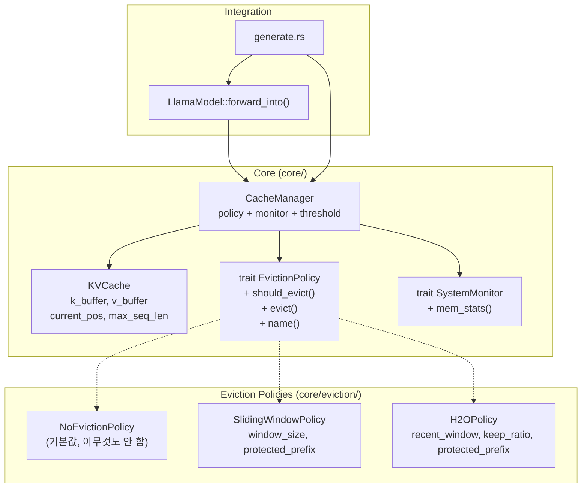
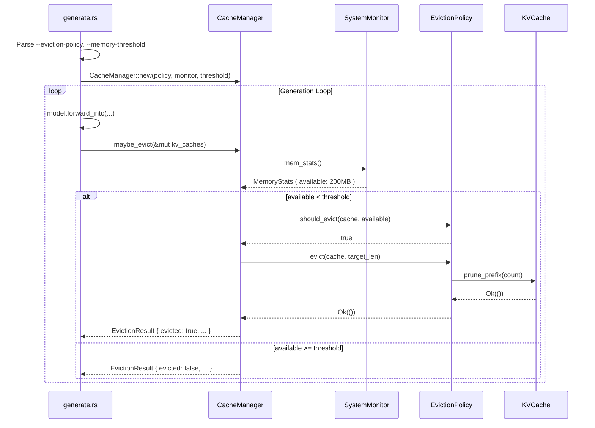

# Chapter 11: KV Cache 관리 전략

> **이전**: [10. 모델 추론](10_model_inference.md) | **다음**: [12. 하이브리드 추론](12_hybrid_inference.md)

## 11.1 Overview

LLM 추론 시 KV Cache는 시퀀스 길이에 비례하여 메모리를 차지합니다. 모바일/엣지 환경에서는 긴 시퀀스 생성 시 메모리 부족(OOM)이 발생할 수 있으며, 이를 동적으로 관리하기 위한 확장 가능한 캐시 관리 전략이 필요합니다.

### 핵심 목표
- **Signal-driven eviction**: 모든 eviction, throttle 등 성능에 영향을 주는 로직은 Resilience 시그널을 받았을 때만 동작
- **전략 교체 가능**: SOLID 원칙에 따라 새로운 eviction 전략을 기존 코드 수정 없이 추가
- **기본 동작 무변경**: 기본값은 "전략 없음"으로 기존 동작과 완전히 동일

### 대 원칙: Signal-Driven Eviction

> **모든 eviction, delay, throttle 등 추론 성능에 영향을 주는 로직은 Resilience 시그널을
> 받았을 때만 동작합니다.**
>
> - 추론 루프(`forward_into`)에서 자동으로 eviction을 트리거하지 않습니다.
> - Score 누적(bookkeeping)은 매 토큰마다 수행되지만, 실제 eviction 결정은 외부
>   Resilience Manager가 내립니다.
> - `CacheManager::force_evict()` / `force_evict_with_scores()`가 시그널 수신 시 호출됩니다.
> - H2O의 `should_evict()`는 항상 `false`를 반환합니다.

---

## 11.2 아키텍처

### 컴포넌트 다이어그램


```mermaid
graph TB
    subgraph "Core (core/)"
        KVCache["KVCache<br/>k_buffer, v_buffer<br/>current_pos, max_seq_len"]
        EvictionPolicy["trait EvictionPolicy<br/>+ should_evict()<br/>+ evict()<br/>+ name()"]
        CacheManager["CacheManager<br/>policy + monitor + threshold"]
        SystemMonitor["trait SystemMonitor<br/>+ mem_stats()"]
    end

    subgraph "Eviction Policies (core/eviction/)"
        NoEviction["NoEvictionPolicy<br/>(기본값, 아무것도 안 함)"]
        SlidingWindow["SlidingWindowPolicy<br/>window_size, protected_prefix"]
        H2O["H2OPolicy<br/>recent_window, keep_ratio, protected_prefix"]
    end

    subgraph "Integration"
        LlamaModel["LlamaModel::forward_into()"]
        GenerateBin["generate.rs"]
    end

    CacheManager --> EvictionPolicy
    CacheManager --> SystemMonitor
    CacheManager --> KVCache

    EvictionPolicy -.-> NoEviction
    EvictionPolicy -.-> SlidingWindow
    EvictionPolicy -.-> H2O

    LlamaModel --> CacheManager
    GenerateBin --> CacheManager
    GenerateBin --> LlamaModel
```

### SOLID 원칙 적용

| 원칙 | 적용 방법 |
|------|-----------|
| **S** (Single Responsibility) | `KVCache`는 저장만, `EvictionPolicy`는 전략 판단만, `CacheManager`는 조율만 담당 |
| **O** (Open/Closed) | 새 전략 추가 시 `EvictionPolicy` trait을 구현하면 됨. 기존 코드 수정 불필요 |
| **L** (Liskov Substitution) | 모든 policy는 `EvictionPolicy` trait을 통해 완전히 교체 가능 |
| **I** (Interface Segregation) | `EvictionPolicy`: `should_evict()`, `evict()`, `name()` 3개 메서드만 정의 |
| **D** (Dependency Inversion) | `CacheManager`는 구체 클래스가 아닌 `dyn EvictionPolicy`에 의존 |

---

## 11.3 핵심 인터페이스

### 11.3.1 EvictionPolicy Trait

```rust
// core/eviction/mod.rs

pub trait EvictionPolicy: Send + Sync {
    /// 현재 캐시 상태와 가용 메모리를 기반으로 eviction 필요 여부를 판단
    fn should_evict(&self, cache: &KVCache, mem_available: usize) -> bool;

    /// 실제 eviction 수행. target_len은 eviction 후 유지할 토큰 수
    fn evict(&self, cache: &mut KVCache, target_len: usize) -> Result<()>;

    /// Importance score 기반 eviction (H2O 등). 기본 구현은 score를 무시하고 evict() 위임.
    fn evict_with_scores(
        &self,
        cache: &mut KVCache,
        target_len: usize,
        scores: &[f32],
    ) -> Result<()> {
        let _ = scores;
        self.evict(cache, target_len)
    }

    /// 정책 이름 (로깅/디버깅용)
    fn name(&self) -> &str;
}
```

### 11.3.2 CacheManager

```rust
// core/cache_manager.rs

pub struct CacheManager {
    policy: Box<dyn EvictionPolicy>,
    monitor: Box<dyn SystemMonitor>,
    threshold_bytes: usize,  // 가용 메모리가 이 이하면 eviction 트리거
    target_ratio: f32,       // eviction 시 캐시를 이 비율로 축소 (e.g., 0.75)
}

impl CacheManager {
    /// 각 generation step 후에 호출 (Sliding Window용).
    /// H2O에서는 사용하지 않음 (signal-driven).
    pub fn maybe_evict(&self, caches: &mut [KVCache]) -> Result<EvictionResult>;

    /// Resilience 시그널 수신 시 호출. score 없이 eviction 실행.
    pub fn force_evict(&self, caches: &mut [KVCache]) -> Result<EvictionResult>;

    /// Resilience 시그널 수신 시 호출. importance score 기반 3-partition eviction.
    pub fn force_evict_with_scores(
        &self,
        caches: &mut [KVCache],
        scores: &[f32],
    ) -> Result<EvictionResult>;

    /// score 기반 eviction 시도 (score 있으면 force_evict_with_scores, 없으면 force_evict).
    pub fn maybe_evict_with_scores(
        &self,
        caches: &mut [KVCache],
        scores: Option<&[f32]>,
    ) -> Result<EvictionResult>;
}

pub struct EvictionResult {
    pub evicted: bool,
    pub tokens_removed: usize,
    pub new_pos: usize,
}
```

---

## 11.4 Eviction 전략

### 11.4.1 NoEvictionPolicy (기본값)

아무것도 하지 않는 전략. `should_evict()`가 항상 `false`를 반환합니다.
기존 동작과 완전히 동일하며, 캐시가 가득 차면 에러를 반환합니다.

```
[토큰 0][토큰 1][토큰 2]...[토큰 N]  → 변화 없음
```

### 11.4.2 SlidingWindowPolicy (Moving Window)

가장 최근 `window_size`개의 토큰만 유지하고, 나머지는 앞에서부터 제거합니다.
`protected_prefix`를 설정하면 시스템 프롬프트 등 앞부분 토큰을 보호할 수 있습니다.

```
설정: window_size=1024, protected_prefix=64

Before (current_pos = 2048):
[SYS 0..63][토큰 64][토큰 65]...[토큰 1023][토큰 1024]...[토큰 2047]
 ↑ protected                      ↑ 제거 대상              ↑ 유지

After (current_pos = 1088):
[SYS 0..63][토큰 1024][토큰 1025]...[토큰 2047]
 ↑ protected  ↑ 앞으로 이동
```

**구현 핵심**: `KVCache::prune_prefix(count)` → `memmove`로 데이터를 앞으로 이동

### 11.4.3 H2OPolicy (Attention-based, 3-Partition)

H2O 논문의 3-partition 모델을 구현합니다. KV cache를 세 영역으로 나누어 관리합니다:

```
Cache layout:
[Protected Prefix] [Heavy Hitters (score 경쟁)] [Recent Window (항상 보호)]
 ← prefix개 →       ← evictable 영역 →           ← recent_window개 →
```

- **Protected Prefix**: 처음 N개 토큰(attention sink / 시스템 프롬프트)은 절대 evict되지 않습니다.
- **Recent Window**: 최근 M개 토큰은 score와 무관하게 항상 보호됩니다. 방금 생성된 토큰이 낮은 score로 evict되는 것을 방지합니다.
- **Heavy Hitters**: 나머지 evictable 영역에서 누적 attention score 상위 K개를 유지합니다.

```
Before (current=30, prefix=4, recent_window=5):
[P0..P3][T4][T5]...[T24][T25][T26][T27][T28][T29]
 prefix   evictable (score 경쟁)     recent (보호)

After (keep_ratio=0.5, hh_budget=6):
[P0..P3][T7][T10][T12][T15][T18][T20][T25][T26][T27][T28][T29]
 prefix   heavy hitters (score 상위 6개)    recent window
```

**Edge cases**:
- `recent_window=0` → 기존 동작과 동일 (모든 비-prefix 토큰이 score로 경쟁)
- `recent_window >= current - prefix` → evictable 영역 없음, eviction skip
- `prefix + recent >= keep budget` → hh_budget=0, sliding window로 퇴화

**CLI 옵션**:

| 옵션 | 기본값 | 설명 |
|------|--------|------|
| `--h2o-recent-window` | 128 | 항상 보호되는 최근 토큰 수 |
| `--h2o-keep-ratio` | 0.5 | Heavy hitter 유지 비율 (0.0~1.0) |
| `--h2o-tracked-layers` | 3 | Importance score 추적 레이어 수 (마지막 N개) |
| `--h2o-decay` | 0.1 | 매 step마다의 importance score 감쇠율 |

> **Signal-driven**: H2O eviction은 Resilience 시그널(`ResilienceAction::Evict`)을 받았을 때만
> 실행됩니다. `forward_into()`에서는 `AttentionScoreAccumulator`를 통해 score만 누적하고,
> `CacheManager`는 전달하지 않습니다(`cm_ref=None`). 시그널 수신 시
> `CacheManager::force_evict_with_scores()`가 호출되어 3-partition eviction이 실행됩니다.
> Score 없이 호출될 경우 fallback으로 recent window를 보호하는 sliding window 방식으로 동작합니다.

---

## 11.5 KVCache 확장

기존 `KVCache`에 eviction 지원 메서드를 추가합니다.

### 추가 메서드

```rust
impl KVCache {
    /// 앞쪽 count개 토큰을 제거하고 나머지를 앞으로 이동
    ///
    /// Before: [A][B][C][D][E] (current_pos=5)
    /// prune_prefix(2)
    /// After:  [C][D][E][_][_] (current_pos=3)
    pub fn prune_prefix(&mut self, count: usize) -> Result<()>;

    /// 현재 사용 중인 KV 캐시 메모리 (bytes)
    pub fn memory_usage_bytes(&self) -> usize;
}
```

### prune_prefix 동작 원리

```
KV Buffer: [Batch, MaxSeqLen, KVHeads, HeadDim]

1. 보존할 영역 계산: src_offset = count * heads * dim
2. 보존할 크기 계산: move_count = (current_pos - count) * heads * dim
3. memmove 수행:     buffer[0..move_count] = buffer[src_offset..src_offset+move_count]
4. current_pos 업데이트: current_pos -= count
```

---

## 11.6 GPU 전용 버퍼 지원

### buffer_shift의 버퍼 타입별 동작

`prune_prefix()`는 내부적으로 `backend.buffer_shift()`를 호출합니다. OpenCL 백엔드에서는 버퍼 타입에 따라 자동으로 적절한 경로를 선택합니다:

| 버퍼 타입 | CPU 포인터 | 경로 | 메커니즘 |
|-----------|-----------|------|----------|
| SharedBuffer | 유효 | CPU | `std::ptr::copy` (memmove) |
| UnifiedBuffer (mapped) | 유효 | CPU | `std::ptr::copy` (memmove) |
| UnifiedBuffer (unmapped) | null | GPU | `enqueue_copy_buffer` |
| OpenCLBuffer (device-only) | null | GPU | `enqueue_copy_buffer` |

### 오버랩 처리

OpenCL spec에서 같은 버퍼 내 겹치는 영역의 `clEnqueueCopyBuffer`는 undefined behavior입니다. 오버랩 감지 시 임시 버퍼를 통한 2-pass 복사를 수행합니다:

```
1. src → temp (enqueue_copy_buffer)
2. temp → dst (enqueue_copy_buffer)
```

`prune_prefix()`는 항상 `src_offset > 0, dst_offset = 0`으로 호출하므로, 오버랩은 `remaining > count` (50% 미만 eviction)일 때만 발생합니다.

### 동기화

In-order command queue를 사용하므로 `buffer_shift()` 후 별도의 `queue.finish()` 호출은 불필요합니다. 후속 커널 dispatch는 같은 queue에서 자동으로 직렬화됩니다. 오버랩 경로의 임시 버퍼도 drop 시 `clReleaseMemObject`가 pending commands 완료까지 실제 해제를 지연하므로 안전합니다.

---

## 11.7 동적 메모리 감지

### SystemMonitor + MemoryPressure

`CacheManager`는 `SystemMonitor` trait을 통해 시스템 메모리 상태를 조회합니다.
Linux/Android에서는 `/proc/meminfo`를 파싱하여 `MemAvailable`을 읽습니다.

```
┌──────────────────────────────────────────────────────┐
│  Generation Loop (매 토큰마다)                        │
│                                                        │
│  1. score_accumulator.begin_step()  (decay)           │
│  2. model.forward_into(...)                           │
│     └─ score_accumulator captures attention weights   │
│     └─ cache_manager: None (H2O는 auto-eviction 없음) │
│  3. Resilience checkpoint:                            │
│     └─ if ResilienceAction::Evict received:           │
│        cache_manager.force_evict_with_scores(...)     │
│  4. sample next token                                 │
└──────────────────────────────────────────────────────┘
```

---

## 11.8 파일 구조

```
src/core/
├── kv_cache.rs         // [수정] prune_prefix(), memory_usage_bytes() 추가
├── cache_manager.rs    // [신규] CacheManager 오케스트레이터
├── sys_monitor.rs      // [기존] SystemMonitor trait + LinuxSystemMonitor
├── eviction/           // [신규] 모듈 디렉토리 (기존 eviction.rs 대체)
│   ├── mod.rs          //   EvictionPolicy trait + re-exports
│   ├── no_eviction.rs  //   NoEvictionPolicy
│   ├── sliding_window.rs // SlidingWindowPolicy
│   └── h2o.rs          //   H2OPolicy (3-partition)
└── mod.rs              // [수정] eviction, cache_manager, sys_monitor 등록
```

---

## 11.9 통합 흐름

### CLI 옵션

```
--eviction-policy <none|sliding|h2o>  (default: none)
--eviction-window <usize>             (default: 1024)    # sliding window 전용
--h2o-recent-window <usize>           (default: 128)     # H2O recent window
--h2o-keep-ratio <f32>                (default: 0.5)     # H2O heavy hitter 비율
--h2o-tracked-layers <usize>          (default: 3)       # score 추적 레이어 수
--h2o-decay <f32>                     (default: 0.1)     # score 감쇠율
--protected-prefix <usize>            (default: prompt length)
--memory-threshold-mb <MB>            (default: 256)
--eviction-target-ratio <f32>         (default: 0.75)
```

### Sequence Diagram


```mermaid
sequenceDiagram
    participant CLI as generate.rs
    participant CM as CacheManager
    participant Mon as SystemMonitor
    participant Pol as EvictionPolicy
    participant KV as KVCache

    CLI->>CLI: Parse --eviction-policy, --memory-threshold
    CLI->>CM: CacheManager::new(policy, monitor, threshold)

    loop Generation Loop
        CLI->>CLI: model.forward_into(...)
        CLI->>CM: maybe_evict(&mut kv_caches)
        CM->>Mon: mem_stats()
        Mon-->>CM: MemoryStats { available: 200MB }

        alt available < threshold
            CM->>Pol: should_evict(cache, available)
            Pol-->>CM: true
            CM->>Pol: evict(cache, target_len)
            Pol->>KV: prune_prefix(count)
            KV-->>Pol: Ok(())
            Pol-->>CM: Ok(())
            CM-->>CLI: EvictionResult { evicted: true, ... }
        else available >= threshold
            CM-->>CLI: EvictionResult { evicted: false, ... }
        end
    end
```

---

## 11.10 새로운 전략 추가 가이드

SOLID의 Open/Closed 원칙에 따라, 새 전략 추가 시 기존 코드를 수정할 필요가 없습니다.

### Step 1: Policy 파일 생성

`src/core/eviction/my_policy.rs` 생성:

```rust
use crate::core::eviction::EvictionPolicy;
use crate::core::kv_cache::KVCache;
use anyhow::Result;

pub struct MyCustomPolicy {
    // 전략별 설정값
}

impl EvictionPolicy for MyCustomPolicy {
    fn should_evict(&self, cache: &KVCache, mem_available: usize) -> bool {
        // 판단 로직
    }

    fn evict(&self, cache: &mut KVCache, target_len: usize) -> Result<()> {
        // eviction 로직
    }

    fn name(&self) -> &str { "my_custom" }
}
```

### Step 2: 모듈 등록

`src/core/eviction/mod.rs`에 추가:

```rust
pub mod my_policy;
pub use my_policy::MyCustomPolicy;
```

### Step 3: CLI 연동

`generate.rs`의 policy match에 추가:

```rust
"my_custom" => Box::new(MyCustomPolicy::new(...)),
```

---

## 11.11 AttentionScoreAccumulator

H2O의 importance score 누적을 담당하는 컴포넌트.

**파일**: `src/core/attention_scores.rs`

```rust
pub struct AttentionScoreAccumulator {
    importance: Vec<f32>,    // 토큰별 누적 importance score
    tracked_layers: usize,   // score를 추적하는 레이어 수 (마지막 N개)
    decay: f32,              // 매 step마다 기존 score에 곱하는 감쇠율 (e.g., 0.9)
}
```

**주요 메서드**:

| 메서드 | 설명 |
|--------|------|
| `begin_step()` | 매 토큰 생성 시작 시 호출. 기존 score에 `(1.0 - decay)`를 곱하여 감쇠 |
| `accumulate(layer, scores)` | tracked layer에서 attention weight를 누적 |
| `importance_scores()` | 현재 누적된 importance score 슬라이스 반환 |
| `reset()` | Eviction 후 score 배열 초기화 |

**Generation 루프에서의 사용 흐름**:
1. `score_accumulator.begin_step()` — decay 적용
2. `model.forward_into()` — 내부에서 tracked layer의 attention weight를 `accumulate()` 호출
3. Resilience 시그널 수신 시 `cache_manager.force_evict_with_scores(scores)` 호출
4. Eviction 완료 후 `score_accumulator.reset()`

---

## 11.12 향후 확장 계획

| 항목 | 설명 | 의존성 |
|------|------|--------|
| Importance score compaction | Eviction 후 importance 배열도 compact (reset 대신) | EvictionPolicy trait 시그니처 변경 |
| Per-head importance | GQA 모델에서 head별 중요도 추적 | 품질 테스트 후 결정 |
| Adaptive 전략 | 메모리 압력 수준에 따라 전략 자동 전환 | CacheManager 확장 |
| Per-layer 독립 전략 | 레이어별로 다른 eviction 전략 적용 | CacheManager 확장 |
