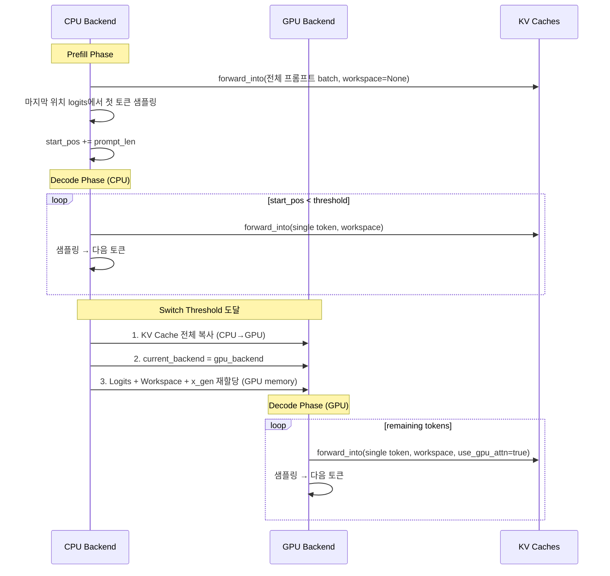

# Chapter 12: 하이브리드 추론 (Hybrid Inference)

**이전**: [11. KV 캐시 관리](11_kv_cache_management.md) | **다음**: [13. 테스트 및 벤치마크](13_testing_and_benchmarks.md)

---

## 12.1 Overview

`generate_hybrid.rs`는 CPU prefill → GPU decode 전환을 구현하는 하이브리드 추론 바이너리이다.

**동기**: CPU는 prefill 단계(단일 대규모 batch)에서 효율적이고, GPU는 decode 단계(반복적인 single-token 생성)에서 메모리 대역폭 우위로 효율적이다. 두 백엔드의 장점을 결합하여 전체 추론 성능을 극대화한다.

**전환 트리거**: decode loop 내에서 `start_pos >= switch_threshold` 조건이 충족되면 CPU에서 GPU로 전환한다. 기본 threshold는 512 토큰이다.

## 12.2 전체 흐름



## 12.3 백엔드 초기화

두 개의 독립적인 백엔드와 메모리 시스템을 초기화한다.

| 구성 요소 | CPU 측 | GPU 측 |
|-----------|--------|--------|
| Backend | `CpuBackend` | `OpenCLBackend` |
| Memory | `Galloc` (cpu_memory) | `OpenCLMemory` (gpu_memory, zero_copy=false) |

초기화 순서:

1. **양쪽 Backend 생성**: `CpuBackend::new()`, `OpenCLBackend::new()`
2. **모델 로딩**: CPU backend + Galloc으로 Safetensors 파일을 로드
3. **토크나이저**: `Tokenizer::from_file(tokenizer.json)`
4. **KV Cache 할당**: CPU 메모리에 F32 형식, shape `[1, max_seq_len, kv_heads, head_dim]`
5. **Logits 버퍼**: CPU 메모리에 `[1, 1, vocab_size]` F32
6. **GPU 메모리 컨텍스트**: `OpenCLMemory` 생성하되 실제 사용은 전환 시점까지 지연

## 12.4 Prefill 단계

전체 프롬프트를 CPU에서 batch 처리한다.

```rust
// Prefill logits: [1, process_len, vocab_size]
model.forward_into(LlamaModelForwardArgs {
    input_tokens: &input_tensor,  // [1, process_len]
    start_pos: 0,
    kv_caches: &mut kv_caches,
    backend: &cpu_backend,
    memory: cpu_memory.as_ref(),
    logits_out: &mut prefill_logits,
    x_gen: None,        // prefill은 workspace 불필요
    workspace: None,
    use_gpu_attn: false,
    cache_manager: None,
});

// 마지막 위치의 logits에서 첫 번째 생성 토큰 샘플링
let start_idx = (process_len - 1) * vocab_size;
let next_token = sample(&mut logits[start_idx..], ...);
start_pos += process_len;
```

Prefill 완료 후 `start_pos`는 프롬프트 길이만큼 증가하며, KV cache에는 전체 프롬프트의 K/V 값이 채워진다.

## 12.5 전환 프로세스 (Backend Switch)

Decode loop 내에서 `!is_gpu && start_pos >= switch_threshold` 조건이 충족되면 다음 **3단계를 순차적으로** 수행한다.

### 단계 1: KV Cache 마이그레이션

각 레이어의 KV cache 데이터를 CPU에서 GPU 메모리로 복사한다.

```rust
for kv in kv_caches.iter_mut() {
    // 1. CPU 버퍼에서 raw bytes 읽기
    let mut k_data = vec![0u8; k_size];
    cpu_backend.read_buffer(&kv.k_buffer, &mut k_data)?;

    // 2. 임시 CPU Tensor 생성 (데이터 복사)
    let k_cpu_tensor = Tensor::new(shape, k_cpu_buf, cpu_backend.clone());

    // 3. GPU로 복사 → 새 KVCache 구성
    *kv = KVCache::new(
        gpu_backend.copy_from(&k_cpu_tensor)?,  // GPU K tensor
        gpu_backend.copy_from(&v_cpu_tensor)?,  // GPU V tensor
        max_seq_len,                             // max_seq_len으로 재구성
    );
}
```

> **주의**: `KVCache::new(k, v, max_seq_len)` 호출로 재구성하므로 `current_pos`는 0으로 리셋된다. 실제 캐시 위치는 `start_pos`로 추적된다.

### 단계 2: Backend 전환

```rust
current_backend = gpu_backend.clone();
```

### 단계 3: Logits + Workspace 재할당 (GPU 메모리)

```rust
// Logits: GPU 메모리에 재할당
let logits_gpu_buf = gpu_memory.alloc(vocab_size * 4, DType::F32)?;
logits = Tensor::new(Shape::new(vec![1, 1, vocab_size]), logits_gpu_buf, gpu_backend.clone());

// x_gen + LayerWorkspace: GPU 메모리 + GPU backend로 재생성
let (gpu_x_gen, gpu_ws) = setup_workspace(&gpu_backend, gpu_memory.as_ref())?;
x_gen = Some(gpu_x_gen);
gen_ws = Some(gpu_ws);

is_gpu = true;
```

> 코드 내 실제 순서: (1) KV 마이그레이션 → (2) `current_backend = gpu_backend` → (3) Logits/Workspace 재할당

## 12.6 전환 후 Decode Loop

GPU 전환 후 입력 토큰은 항상 CPU에서 먼저 생성한 뒤 GPU로 복사한다.

```rust
let input_tensor = if is_gpu {
    let cpu_t = Tensor::new(..., cpu_backend.clone());
    gpu_backend.copy_from(&cpu_t)?  // CPU → GPU 복사
} else {
    Tensor::new(..., cpu_backend.clone())  // CPU 직접 사용
};

model.forward_into(LlamaModelForwardArgs {
    // ...
    backend: &current_backend,  // gpu_backend
    use_gpu_attn: is_gpu,       // true → GPU attention kernel 사용
    // ...
});
```

`use_gpu_attn`은 별도 변수가 아니라 `is_gpu` 값을 인라인으로 전달한다.

## 12.7 CLI 옵션

| 옵션 | 기본값 | 설명 |
|------|--------|------|
| `--model-path` (`-m`) | `models/llama3.2-1b` | 모델 경로 |
| `--prompt` (`-p`) | `"Hello, world! I am a"` | 입력 프롬프트 |
| `--num-tokens` (`-n`) | 20 | 생성할 토큰 수 |
| `--max-seq-len` | 2048 | 최대 시퀀스 길이 (KV cache 크기) |
| `--switch-threshold` | 512 | CPU→GPU 전환 토큰 수 |
| `--temperature` | 0.8 | 샘플링 temperature |
| `--top-p` | 0.9 | Nucleus sampling 확률 |
| `--top-k` | 40 | Top-K filtering |
| `--repetition-penalty` | 1.1 | 반복 패널티 |
| `--repetition-window` | 64 | 반복 패널티 적용 윈도우 |

사용 예시:

```bash
# 기본 설정 (threshold=512)
./.agent/skills/testing/scripts/run_android.sh generate_hybrid --prompt "Hello" -n 256

# 전환 시점 조정
./.agent/skills/testing/scripts/run_android.sh generate_hybrid \
    --switch-threshold 256 --max-seq-len 4096 --prompt "Hello" -n 1024
```

## 12.8 한계 및 향후 개선

- **전환 시 KV cache 전체 복사**: 모든 레이어의 KV cache를 CPU→GPU로 복사해야 하므로 전환 시 대기 시간 발생. `num_layers * max_seq_len * kv_heads * head_dim * 4 * 2` bytes.
- **Zero-copy 미적용**: `OpenCLMemory`를 `zero_copy=false`로 초기화. ARM SoC의 `CL_MEM_ALLOC_HOST_PTR` 기반 zero-copy를 활용하면 마이그레이션 비용을 제거할 수 있다.
- **모델 가중치는 CPU에 잔류**: 전환 후에도 모델 가중치 Tensor들은 CPU 메모리에 남아 있다. `forward_into`에서 matmul 시 backend가 GPU여도 가중치 접근은 CPU 메모리를 통한다.
- **Eviction 미지원**: `CacheManager`가 통합되지 않아 `max_seq_len` 초과 시 추론 중단.
- **역방향 전환 (GPU→CPU) 미구현**: 단방향 전환만 지원.
- **KV cache는 F32 고정**: `generate.rs`와 달리 Q4_0/F16 KV 옵션 없음.

---

**이전**: [11. KV 캐시 관리](11_kv_cache_management.md) | **다음**: [13. 테스트 및 벤치마크](13_testing_and_benchmarks.md)
