# 14. Component Quality Gates

This document tracks component-level quality gates for the llm.rs (llm_rs2) inference framework. Each component is assigned a tier that determines its testing requirements and gate criteria.

> **Auto-update**: Sections 3 and 4 are automatically maintained by `scripts/update_test_status.py`.

---

## 1. Component Diagram

```mermaid
graph TB
    subgraph BinaryLayer ["Binaries"]
        Generate["generate"]
        GenerateHybrid["generate_hybrid"]
        MicroBench["micro_bench"]
        TestBackend["test_backend"]
    end

    subgraph ModelComponent ["Model"]
        LlamaModel["LlamaModel"]
        LlamaLayer["LlamaLayer"]
        LayerWS["LayerWorkspace"]
        Attention["Attention (CPU fallback)"]
    end

    subgraph CoreComponent ["Core"]
        BackendTrait["Backend trait"]
        MemoryTrait["Memory trait"]
        BufferTrait["Buffer trait"]
        KVCache["KVCache"]
        Tensor["Tensor"]
        Shape["Shape"]
        Quant["Quant (Q4_0)"]
    end

    subgraph EvictionSubsystem ["KV Cache Eviction"]
        CacheManager["CacheManager"]
        EvictionPolicy["EvictionPolicy trait"]
        NoEviction["NoEvictionPolicy"]
        SlidingWindow["SlidingWindowPolicy"]
        H2O["H2OPolicy (3-partition)"]
        SysMonitor["SystemMonitor trait"]
        LinuxMonitor["LinuxSystemMonitor"]
    end

    subgraph BackendComponent ["Compute Backends"]
        CpuBackend["CpuBackend"]
        OpenCLBackend["OpenCLBackend"]
    end

    subgraph MemoryComponent ["Memory Management"]
        Galloc["Galloc"]
        SharedBuffer["SharedBuffer"]
    end

    Generate --> LlamaModel
    GenerateHybrid --> LlamaModel
    LlamaModel --> LlamaLayer
    LlamaLayer --> LayerWS
    LlamaLayer --> Attention
    LlamaLayer --> KVCache

    LlamaModel --> CacheManager
    CacheManager --> EvictionPolicy
    CacheManager --> SysMonitor
    NoEviction -.->|impl| EvictionPolicy
    SlidingWindow -.->|impl| EvictionPolicy
    H2O -.->|impl| EvictionPolicy
    LinuxMonitor -.->|impl| SysMonitor
    EvictionPolicy --> KVCache

    Tensor --> BufferTrait
    Tensor --> BackendTrait
    Tensor --> Shape

    CpuBackend -.-> BackendTrait
    OpenCLBackend -.-> BackendTrait
    Galloc -.-> MemoryTrait
    SharedBuffer -.-> BufferTrait
    Galloc --> SharedBuffer
```

---

## 2. Quality Gate Definition

### Tier Classification

| Tier | Scope | Components | Gate Criteria |
|:-----|:------|:-----------|:--------------|
| **T1: Foundation** | Data structures, memory primitives | Shape, Tensor, Buffer/DType, Quant, SharedBuffer, Galloc | Host unit tests required, all must PASS |
| **T2: Algorithm** | Algorithms, policies, CPU-testable logic | KVCache, NoEvictionPolicy, SlidingWindowPolicy, H2OPolicy, CacheManager, SystemMonitor, Attention | Host unit tests required, all must PASS |
| **T3: Backend** | Hardware-specific backends | CpuBackend, OpenCLBackend | Device verification via `test_backend`, host N/A |
| **T4: Integration** | Model layers, GPU buffers | LlamaLayer, LayerWorkspace, LlamaModel, UnifiedBuffer | E2E device verification, host N/A |

### Gate Status

| Status | Meaning |
|:-------|:--------|
| PASS | All tests pass |
| **FAIL** | One or more tests fail |
| **BLOCKED** | T1/T2 component with zero tests — quality unknown |
| N/A | T3/T4 component — requires device, not testable on host |

### Maturity Levels

| Level | Meaning |
|:------|:--------|
| Stable | Production-ready, well-tested |
| Beta | Functional but under active development |
| Stub | Placeholder implementation |

### Overall Gate Rule

The overall gate is **FAIL** if any T1 or T2 component has status BLOCKED or FAIL. T3/T4 components are excluded from the overall gate since they require device access.

---

## 3. Component Quality Status

<!-- AUTO-GENERATED:TEST_STATUS:START -->
_Last updated: 2026-03-07 20:56:14_

### Quality Gate Summary

| Component | Tier | Maturity | Tests | Passed | Skipped | Gate |
|:----------|:-----|:---------|------:|-------:|--------:|:-----|
| Buffer/DType | T1 | Stable | 5 | 5 | 0 | PASS |
| Galloc | T1 | Stable | 3 | 3 | 0 | PASS |
| Quant | T1 | Stable | 6 | 6 | 0 | PASS |
| Shape | T1 | Stable | 3 | 3 | 0 | PASS |
| SharedBuffer | T1 | Stable | 5 | 5 | 0 | PASS |
| Tensor | T1 | Stable | 6 | 6 | 0 | PASS |
| Attention | T2 | Stable | 5 | 5 | 0 | PASS |
| CacheManager | T2 | Stable | 13 | 13 | 0 | PASS |
| H2OPolicy | T2 | Stable | 13 | 13 | 0 | PASS |
| KVCache | T2 | Stable | 15 | 15 | 0 | PASS |
| NoEvictionPolicy | T2 | Stable | 3 | 3 | 0 | PASS |
| OperatingMode | T2 | Stable | 5 | 5 | 0 | PASS |
| ResilienceManager | T2 | Stable | 9 | 9 | 0 | PASS |
| Signal/Level | T2 | Stable | 0 | 0 | 0 | **BLOCKED** |
| SlidingWindowPolicy | T2 | Stable | 7 | 7 | 0 | PASS |
| Strategy | T2 | Stable | 16 | 16 | 0 | PASS |
| SystemMonitor | T2 | Stable | 3 | 3 | 0 | PASS |
| CpuBackend | T3 | Stable | 14 | 14 | 0 | PASS |
| OpenCLBackend | T3 | Stable | 0 | 0 | 0 | N/A |
| LayerWorkspace | T4 | Stable | 4 | 4 | 0 | PASS |
| LlamaLayer | T4 | Stable | 0 | 0 | 0 | N/A |
| LlamaModel | T4 | Stable | 0 | 0 | 0 | N/A |
| UnifiedBuffer | T4 | Stable | 3 | 0 | 0 | **FAIL** |
| **Overall** | | | **138** | **135** | **0** | **FAIL** |
| Integration | - | - | 74 | 74 | PASS |

### Test Details

| Test | Component | Result |
|:-----|:----------|:------:|
| `test_buffer_default_impls` | Buffer/DType | PASS |
| `test_buffer_metadata_accessors` | Buffer/DType | PASS |
| `test_dtype_all_variant_sizes` | Buffer/DType | PASS |
| `test_dtype_equality_and_copy` | Buffer/DType | PASS |
| `test_dtype_size` | Buffer/DType | PASS |
| `test_galloc_allocation` | Galloc | PASS |
| `test_galloc_used_memory` | Galloc | PASS |
| `test_galloc_zero_size_allocation` | Galloc | PASS |
| `test_block_q4_0_dequantize` | Quant | PASS |
| `test_block_q4_0_zero_scale` | Quant | PASS |
| `test_block_q4_1_dequantize` | Quant | PASS |
| `test_block_q4_1_zero_scale` | Quant | PASS |
| `test_block_q8_0_dequantize` | Quant | PASS |
| `test_struct_sizes` | Quant | PASS |
| `test_empty_shape_scalar` | Shape | PASS |
| `test_one_dimensional_empty` | Shape | PASS |
| `test_shape_creation_and_metadata` | Shape | PASS |
| `test_cl_mem_with_feature_opencl` | SharedBuffer | PASS |
| `test_shared_buffer_creation` | SharedBuffer | PASS |
| `test_shared_buffer_mutability_semantics` | SharedBuffer | PASS |
| `test_shared_buffer_zero_size` | SharedBuffer | PASS |
| `test_sync_device` | SharedBuffer | PASS |
| `test_tensor_as_slice_bounds` | Tensor | PASS |
| `test_tensor_clone_shares_buffer` | Tensor | PASS |
| `test_tensor_creation_and_metadata` | Tensor | PASS |
| `test_tensor_matmul_unimplemented` | Tensor | PASS |
| `test_tensor_to_device` | Tensor | PASS |
| `test_tensor_to_device_different_backend` | Tensor | PASS |
| `test_flash_attention_decode_causal_mask` | Attention | PASS |
| `test_flash_attention_single_token` | Attention | PASS |
| `test_flash_attention_vs_naive` | Attention | PASS |
| `test_identity_qk_reproduces_v` | Attention | PASS |
| `test_naive_attention_sanity` | Attention | PASS |
| `test_empty_caches` | CacheManager | PASS |
| `test_eviction_across_all_layers` | CacheManager | PASS |
| `test_force_evict_bypasses_should_evict` | CacheManager | PASS |
| `test_force_evict_empty_caches` | CacheManager | PASS |
| `test_force_evict_ratio_clamping` | CacheManager | PASS |
| `test_force_evict_with_scores_bypasses_checks` | CacheManager | PASS |
| `test_maybe_evict_with_scores_no_eviction_needed` | CacheManager | PASS |
| `test_maybe_evict_with_scores_triggers` | CacheManager | PASS |
| `test_monitor_error_skips_eviction` | CacheManager | PASS |
| `test_no_eviction_with_plenty_memory` | CacheManager | PASS |
| `test_policy_name` | CacheManager | PASS |
| `test_sliding_window_with_memory_pressure` | CacheManager | PASS |
| `test_target_ratio_clamping` | CacheManager | PASS |
| `test_evict_below_threshold_noop` | H2OPolicy | PASS |
| `test_evict_fallback_with_recent_window` | H2OPolicy | PASS |
| `test_evict_falls_back_to_sliding` | H2OPolicy | PASS |
| `test_evict_with_prefix` | H2OPolicy | PASS |
| `test_evict_with_scores_fallback` | H2OPolicy | PASS |
| `test_evict_with_scores_preserves_prefix` | H2OPolicy | PASS |
| `test_name` | H2OPolicy | PASS |
| `test_recent_window_covers_all_evictable` | H2OPolicy | PASS |
| `test_recent_window_exceeds_budget` | H2OPolicy | PASS |
| `test_recent_window_order_preservation` | H2OPolicy | PASS |
| `test_recent_window_protection` | H2OPolicy | PASS |
| `test_recent_window_zero_backward_compat` | H2OPolicy | PASS |
| `test_should_evict_always_false` | H2OPolicy | PASS |
| `test_cache_creation` | KVCache | PASS |
| `test_dynamic_growth_basic` | KVCache | PASS |
| `test_dynamic_growth_capped` | KVCache | PASS |
| `test_dynamic_growth_doubling` | KVCache | PASS |
| `test_dynamic_overflow` | KVCache | PASS |
| `test_dynamic_with_eviction` | KVCache | PASS |
| `test_get_view` | KVCache | PASS |
| `test_memory_usage_bytes` | KVCache | PASS |
| `test_new_backward_compat` | KVCache | PASS |
| `test_non_dynamic_grow_fails` | KVCache | PASS |
| `test_prune_prefix_all` | KVCache | PASS |
| `test_prune_prefix_basic` | KVCache | PASS |
| `test_prune_prefix_over_count` | KVCache | PASS |
| `test_prune_prefix_zero` | KVCache | PASS |
| `test_update_overflow` | KVCache | PASS |
| `test_no_eviction_evict_is_noop` | NoEvictionPolicy | PASS |
| `test_no_eviction_name` | NoEvictionPolicy | PASS |
| `test_no_eviction_never_evicts` | NoEvictionPolicy | PASS |
| `test_all_normal_yields_normal_mode` | OperatingMode | PASS |
| `test_any_emergency_yields_suspended` | OperatingMode | PASS |
| `test_mixed_levels_worst_wins` | OperatingMode | PASS |
| `test_single_critical_yields_minimal` | OperatingMode | PASS |
| `test_single_warning_yields_degraded` | OperatingMode | PASS |
| `test_execute_limit_tokens` | ResilienceManager | PASS |
| `test_execute_restore_clears_constraints` | ResilienceManager | PASS |
| `test_execute_suspend_sets_flag` | ResilienceManager | PASS |
| `test_execute_throttle_sets_delay` | ResilienceManager | PASS |
| `test_manager_handles_multiple_signals` | ResilienceManager | PASS |
| `test_manager_poll_returns_empty_when_no_signals` | ResilienceManager | PASS |
| `test_manager_processes_memory_signal` | ResilienceManager | PASS |
| `test_manager_state_transitions` | ResilienceManager | PASS |
| `test_manager_survives_channel_disconnect` | ResilienceManager | PASS |
| `test_evict_no_action_needed` | SlidingWindowPolicy | PASS |
| `test_evict_no_prefix` | SlidingWindowPolicy | PASS |
| `test_evict_with_protected_prefix` | SlidingWindowPolicy | PASS |
| `test_minimum_protected_prefix_enforced` | SlidingWindowPolicy | PASS |
| `test_name` | SlidingWindowPolicy | PASS |
| `test_should_evict` | SlidingWindowPolicy | PASS |
| `test_should_evict_with_prefix` | SlidingWindowPolicy | PASS |
| `test_compute_critical_switches_backend` | Strategy | PASS |
| `test_compute_warning_does_not_switch` | Strategy | PASS |
| `test_energy_emergency_suspends_and_rejects` | Strategy | PASS |
| `test_energy_normal_restores` | Strategy | PASS |
| `test_memory_critical_triggers_eviction` | Strategy | PASS |
| `test_memory_emergency_evicts_and_rejects` | Strategy | PASS |
| `test_memory_normal_restores_defaults` | Strategy | PASS |
| `test_cpu_always_wins_over_gpu` | Strategy | PASS |
| `test_empty_input_returns_empty` | Strategy | PASS |
| `test_largest_delay_wins` | Strategy | PASS |
| `test_most_aggressive_eviction_wins` | Strategy | PASS |
| `test_restore_alone_passes_through` | Strategy | PASS |
| `test_restore_only_when_no_other_constraints` | Strategy | PASS |
| `test_suspend_overrides_all` | Strategy | PASS |
| `test_thermal_critical_throttles_proportionally` | Strategy | PASS |
| `test_thermal_emergency_suspends` | Strategy | PASS |
| `test_linux_monitor_parsing` | SystemMonitor | PASS |
| `test_parse_meminfo_bad_format_error` | SystemMonitor | PASS |
| `test_parse_meminfo_missing_field_error` | SystemMonitor | PASS |
| `test_add_assign_oracle` | CpuBackend | PASS |
| `test_cast_f32_to_f16_oracle` | CpuBackend | PASS |
| `test_copy_from_identity` | CpuBackend | PASS |
| `test_gather_oracle` | CpuBackend | PASS |
| `test_matmul_slice_f32_oracle` | CpuBackend | PASS |
| `test_matmul_transposed_f32_large_oracle` | CpuBackend | PASS |
| `test_matmul_transposed_f32_oracle` | CpuBackend | PASS |
| `test_matmul_transposed_q4_0_oracle` | CpuBackend | PASS |
| `test_matmul_transposed_q4_1_oracle` | CpuBackend | PASS |
| `test_rms_norm_oracle` | CpuBackend | PASS |
| `test_rope_oracle` | CpuBackend | PASS |
| `test_scale_oracle` | CpuBackend | PASS |
| `test_silu_mul_oracle` | CpuBackend | PASS |
| `test_softmax_oracle` | CpuBackend | PASS |
| `test_workspace_allocation_shapes` | LayerWorkspace | PASS |
| `test_workspace_scores_size` | LayerWorkspace | PASS |
| `test_workspace_small_config` | LayerWorkspace | PASS |
| `test_workspace_tensors_writable` | LayerWorkspace | PASS |
| `test_alloc_unified_buffer` | UnifiedBuffer | **FAIL** |
| `test_map_returns_valid_ptr` | UnifiedBuffer | **FAIL** |
| `test_unmap_and_remap` | UnifiedBuffer | **FAIL** |
| `default_config_all_monitors_enabled` | Integration | PASS |
| `parse_external_config` | Integration | PASS |
| `parse_full_config` | Integration | PASS |
| `parse_minimal_toml` | Integration | PASS |
| `test_accumulate_multi_layer` | Integration | PASS |
| `test_accumulate_single_layer` | Integration | PASS |
| `test_decay` | Integration | PASS |
| `test_inactive_no_accumulation` | Integration | PASS |
| `test_reset` | Integration | PASS |
| `test_should_track_layer` | Integration | PASS |
| `emit_without_client_is_noop` | Integration | PASS |
| `roundtrip_signal_over_socket` | Integration | PASS |
| `ascending_escalation_path` | Integration | PASS |
| `ascending_hysteresis_prevents_oscillation` | Integration | PASS |
| `ascending_multi_level_recovery` | Integration | PASS |
| `ascending_skip_to_emergency` | Integration | PASS |
| `ascending_stay_in_hysteresis_zone` | Integration | PASS |
| `descending_escalation_path` | Integration | PASS |
| `descending_hysteresis_prevents_oscillation` | Integration | PASS |
| `descending_multi_level_recovery` | Integration | PASS |
| `descending_skip_to_emergency` | Integration | PASS |
| `descending_step_recovery` | Integration | PASS |
| `no_emergency_level` | Integration | PASS |
| `test_extract_top_k_logits` | Integration | PASS |
| `test_extract_top_k_logits_k_larger_than_len` | Integration | PASS |
| `test_schedule_signals_at` | Integration | PASS |
| `test_summary_record_serialization` | Integration | PASS |
| `test_system_sampler_interval_respects_interval` | Integration | PASS |
| `test_system_sampler_interval_zero_returns_none` | Integration | PASS |
| `test_system_sampler_snapshot_always_returns` | Integration | PASS |
| `test_token_record_serialization` | Integration | PASS |
| `balanced_recommendation` | Integration | PASS |
| `both_loaded_recommendation` | Integration | PASS |
| `compute_delta_calculation` | Integration | PASS |
| `cpu_bottleneck_recommendation` | Integration | PASS |
| `cpu_snapshot_parsing` | Integration | PASS |
| `no_emergency_level` | Integration | PASS |
| `recommendation_change_without_level_change` | Integration | PASS |
| `find_battery` | Integration | PASS |
| `monitor_battery_depletion` | Integration | PASS |
| `monitor_charging_overrides` | Integration | PASS |
| `monitor_no_battery` | Integration | PASS |
| `monitor_with_battery` | Integration | PASS |
| `read_battery_charging` | Integration | PASS |
| `read_battery_discharging` | Integration | PASS |
| `initial_signal_is_none` | Integration | PASS |
| `parse_memory_signal` | Integration | PASS |
| `parse_valid_signal` | Integration | PASS |
| `skips_invalid_lines` | Integration | PASS |
| `unix_socket_injection` | Integration | PASS |
| `monitor_builds_signal` | Integration | PASS |
| `monitor_escalation` | Integration | PASS |
| `monitor_reclaim_scales_with_level` | Integration | PASS |
| `parse_meminfo_valid` | Integration | PASS |
| `detects_throttling` | Integration | PASS |
| `monitor_fallback_on_no_match` | Integration | PASS |
| `monitor_throttle_ratio` | Integration | PASS |
| `monitor_zone_discovery` | Integration | PASS |
| `monitor_zone_filter` | Integration | PASS |
| `reads_hottest_zone` | Integration | PASS |
| `test_listener_forwards_to_channel` | Integration | PASS |
| `test_listener_stops_on_disconnect` | Integration | PASS |
| `test_listener_stops_when_receiver_dropped` | Integration | PASS |
| `test_listener_survives_parse_errors` | Integration | PASS |
| `test_mock_channel_disconnect` | Integration | PASS |
| `test_mock_channel_send_recv` | Integration | PASS |
| `test_mock_connect_always_ok` | Integration | PASS |
| `test_mock_from_signals_delivers_all` | Integration | PASS |
| `test_unix_socket_connect_fail` | Integration | PASS |
| `test_unix_socket_connection_closed` | Integration | PASS |
| `test_unix_socket_multiple_messages` | Integration | PASS |
| `test_unix_socket_oversized_rejected` | Integration | PASS |
| `test_unix_socket_parse_error` | Integration | PASS |
| `test_unix_socket_round_trip` | Integration | PASS |
<!-- AUTO-GENERATED:TEST_STATUS:END -->

---

## 4. Test History

<!-- AUTO-GENERATED:TEST_HISTORY:START -->
| Date | Total | Passed | Failed | Pass Rate |
|:-----|------:|-------:|-------:|----------:|
| 2026-03-02T23:49:10 | 85 | 85 | 0 | 100.0% |
| 2026-03-02T23:49:14 | 88 | 85 | 3 | 96.6% |
| 2026-03-02T23:49:19 | 88 | 85 | 3 | 96.6% |
| 2026-03-02T23:49:24 | 88 | 85 | 3 | 96.6% |
| 2026-03-02T23:49:28 | 85 | 85 | 0 | 100.0% |
| 2026-03-02T23:49:33 | 88 | 85 | 3 | 96.6% |
| 2026-03-02T23:49:37 | 88 | 85 | 3 | 96.6% |
| 2026-03-02T23:49:42 | 85 | 85 | 0 | 100.0% |
| 2026-03-02T23:49:47 | 85 | 85 | 0 | 100.0% |
| 2026-03-02T23:49:52 | 88 | 85 | 3 | 96.6% |
| 2026-03-02T23:49:57 | 88 | 85 | 3 | 96.6% |
| 2026-03-02T23:50:01 | 86 | 85 | 1 | 98.8% |
| 2026-03-02T23:50:06 | 86 | 85 | 1 | 98.8% |
| 2026-03-02T23:52:33 | 88 | 85 | 3 | 96.6% |
| 2026-03-06T12:39:06 | 0 | 0 | 0 | 0.0% |
| 2026-03-07T09:08:46 | 204 | 201 | 3 | 98.5% |
| 2026-03-07T20:18:22 | 204 | 201 | 3 | 98.5% |
| 2026-03-07T20:23:03 | 201 | 201 | 0 | 100.0% |
| 2026-03-07T20:45:22 | 209 | 209 | 0 | 100.0% |
| 2026-03-07T20:56:14 | 212 | 209 | 3 | 98.6% |
<!-- AUTO-GENERATED:TEST_HISTORY:END -->
