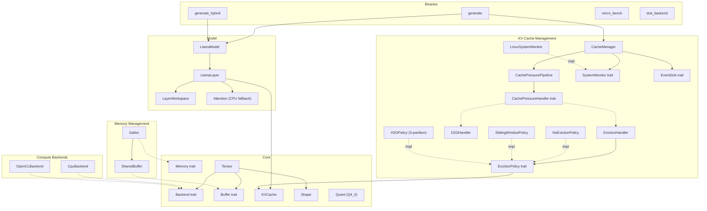

# 14. Component Quality Gates

This document tracks component-level quality gates for the llm.rs (llm_rs2) inference framework. Each component is assigned a tier that determines its testing requirements and gate criteria.

> **Auto-update**: Sections 3 and 4 are automatically maintained by `scripts/update_test_status.py`.

---

## 1. Component Diagram

---

## 2. Quality Gate Definition

### Tier Classification

| Tier | Scope | Components | Gate Criteria |
|:-----|:------|:-----------|:--------------|
| **T1: Foundation** | Data structures, memory primitives | Shape, Tensor, Buffer/DType, Quant, SharedBuffer, Galloc | Host unit tests required, all must PASS |
| **T2: Algorithm** | Algorithms, policies, CPU-testable logic | KVCache, NoEvictionPolicy, SlidingWindowPolicy, H2OPolicy, D2OHandler, CacheManager, SystemMonitor, Attention | Host unit tests required, all must PASS |
| **T3: Backend** | Hardware-specific backends | CpuBackend, OpenCLBackend | Device verification via `test_backend`, host N/A |
| **T4: Integration** | Model layers, GPU buffers | LlamaLayer, LayerWorkspace, LlamaModel, UnifiedBuffer | E2E device verification, host N/A |

### Gate Status

| Status | Meaning |
|:-------|:--------|
| PASS | All tests pass |
| **FAIL** | One or more tests fail |
| **BLOCKED** | T1/T2 component with zero tests — quality unknown |
| N/A | T3/T4 component — requires device, not testable on host |

### Maturity Levels

| Level | Meaning |
|:------|:--------|
| Stable | Production-ready, well-tested |
| Beta | Functional but under active development |
| Stub | Placeholder implementation |

### Overall Gate Rule

The overall gate is **FAIL** if any T1 or T2 component has status BLOCKED or FAIL. T3/T4 components are excluded from the overall gate since they require device access.

---

## 3. Component Quality Status

<!-- AUTO-GENERATED:TEST_STATUS:START -->
_Last updated: 2026-03-14 21:03:09_

### Quality Gate Summary

| Component | Tier | Maturity | Tests | Passed | Skipped | Gate |
|:----------|:-----|:---------|------:|-------:|--------:|:-----|
| Buffer/DType | T1 | Stable | 5 | 5 | 0 | PASS |
| Galloc | T1 | Stable | 0 | 0 | 0 | **BLOCKED** |
| Quant | T1 | Stable | 0 | 0 | 0 | **BLOCKED** |
| Shape | T1 | Stable | 0 | 0 | 0 | **BLOCKED** |
| SharedBuffer | T1 | Stable | 5 | 5 | 0 | PASS |
| Tensor | T1 | Stable | 0 | 0 | 0 | **BLOCKED** |
| Attention | T2 | Stable | 0 | 0 | 0 | **BLOCKED** |
| CacheManager | T2 | Stable | 22 | 22 | 0 | PASS |
| H2OPolicy | T2 | Stable | 44 | 44 | 0 | PASS |
| KVCache | T2 | Stable | 30 | 30 | 0 | PASS |
| NoEvictionPolicy | T2 | Stable | 3 | 3 | 0 | PASS |
| OperatingMode | T2 | Stable | 0 | 0 | 0 | **BLOCKED** |
| ResilienceManager | T2 | Stable | 0 | 0 | 0 | **BLOCKED** |
| Signal/Level | T2 | Stable | 0 | 0 | 0 | **BLOCKED** |
| SlidingWindowPolicy | T2 | Stable | 7 | 7 | 0 | PASS |
| Strategy | T2 | Stable | 0 | 0 | 0 | **BLOCKED** |
| SystemMonitor | T2 | Stable | 0 | 0 | 0 | **BLOCKED** |
| CpuBackend | T3 | Stable | 14 | 14 | 0 | PASS |
| OpenCLBackend | T3 | Stable | 0 | 0 | 0 | N/A |
| LayerWorkspace | T4 | Stable | 0 | 0 | 0 | N/A |
| LlamaLayer | T4 | Stable | 0 | 0 | 0 | N/A |
| LlamaModel | T4 | Stable | 0 | 0 | 0 | N/A |
| UnifiedBuffer | T4 | Stable | 3 | 0 | 0 | **FAIL** |
| **Overall** | | | **133** | **130** | **0** | **FAIL** |
| Integration | - | - | 134 | 134 | PASS |

### Test Details

| Test | Component | Result |
|:-----|:----------|:------:|
| `test_buffer_default_impls` | Buffer/DType | PASS |
| `test_buffer_metadata_accessors` | Buffer/DType | PASS |
| `test_dtype_all_variant_sizes` | Buffer/DType | PASS |
| `test_dtype_equality_and_copy` | Buffer/DType | PASS |
| `test_dtype_size` | Buffer/DType | PASS |
| `test_cl_mem_with_feature_opencl` | SharedBuffer | PASS |
| `test_shared_buffer_creation` | SharedBuffer | PASS |
| `test_shared_buffer_mutability_semantics` | SharedBuffer | PASS |
| `test_shared_buffer_zero_size` | SharedBuffer | PASS |
| `test_sync_device` | SharedBuffer | PASS |
| `test_empty_caches` | CacheManager | PASS |
| `test_eviction_across_all_layers` | CacheManager | PASS |
| `test_force_evict_bypasses_should_evict` | CacheManager | PASS |
| `test_force_evict_empty_caches` | CacheManager | PASS |
| `test_force_evict_ratio_clamping` | CacheManager | PASS |
| `test_force_evict_with_scores_bypasses_checks` | CacheManager | PASS |
| `test_maybe_evict_with_scores_no_eviction_needed` | CacheManager | PASS |
| `test_maybe_evict_with_scores_triggers` | CacheManager | PASS |
| `test_monitor_error_skips_eviction` | CacheManager | PASS |
| `test_no_eviction_with_plenty_memory` | CacheManager | PASS |
| `test_pipeline_manager_empty_pipeline` | CacheManager | PASS |
| `test_pipeline_manager_evicts_at_pressure` | CacheManager | PASS |
| `test_pipeline_manager_force_evict` | CacheManager | PASS |
| `test_pipeline_manager_force_evict_with_scores` | CacheManager | PASS |
| `test_pipeline_manager_monitor_error_skips` | CacheManager | PASS |
| `test_pipeline_manager_multi_level_graduated_response` | CacheManager | PASS |
| `test_pipeline_manager_no_action_at_normal` | CacheManager | PASS |
| `test_pipeline_manager_policy_name` | CacheManager | PASS |
| `test_pipeline_manager_with_scores` | CacheManager | PASS |
| `test_policy_name` | CacheManager | PASS |
| `test_sliding_window_with_memory_pressure` | CacheManager | PASS |
| `test_target_ratio_clamping` | CacheManager | PASS |
| `test_aggressive_eviction_large_to_small` | H2OPolicy | PASS |
| `test_budget_calculation_exact_values` | H2OPolicy | PASS |
| `test_budget_rounding_odd_available` | H2OPolicy | PASS |
| `test_budget_split_50_50` | H2OPolicy | PASS |
| `test_compaction_adjacent_hh_no_unnecessary_shift` | H2OPolicy | PASS |
| `test_compaction_multihead_cache` | H2OPolicy | PASS |
| `test_compaction_noncontiguous_hh_exact_data` | H2OPolicy | PASS |
| `test_custom_prefix_size` | H2OPolicy | PASS |
| `test_evict_below_threshold_noop` | H2OPolicy | PASS |
| `test_evict_fallback_keeps_recent` | H2OPolicy | PASS |
| `test_evict_fallback_works` | H2OPolicy | PASS |
| `test_evict_preserves_prefix` | H2OPolicy | PASS |
| `test_evictable_boundary_token` | H2OPolicy | PASS |
| `test_evictable_fewer_than_hh_budget` | H2OPolicy | PASS |
| `test_hh_ignores_prefix_region_scores` | H2OPolicy | PASS |
| `test_hh_ignores_recent_region_scores` | H2OPolicy | PASS |
| `test_hh_selects_highest_scores` | H2OPolicy | PASS |
| `test_high_hh_ratio` | H2OPolicy | PASS |
| `test_k_v_buffers_stay_synchronized` | H2OPolicy | PASS |
| `test_keep_ratio_one_no_recent` | H2OPolicy | PASS |
| `test_keep_ratio_zero_no_hh` | H2OPolicy | PASS |
| `test_low_score_tokens_evicted` | H2OPolicy | PASS |
| `test_name` | H2OPolicy | PASS |
| `test_no_eviction_when_below_target` | H2OPolicy | PASS |
| `test_order_preservation` | H2OPolicy | PASS |
| `test_repeated_eviction_data_integrity` | H2OPolicy | PASS |
| `test_reset_allows_former_hh_to_be_evicted` | H2OPolicy | PASS |
| `test_reset_prevents_score_position_misalignment` | H2OPolicy | PASS |
| `test_score_ranking_ascending_pattern` | H2OPolicy | PASS |
| `test_score_ranking_descending_pattern` | H2OPolicy | PASS |
| `test_score_ranking_v_shape_pattern` | H2OPolicy | PASS |
| `test_should_evict_always_false` | H2OPolicy | PASS |
| `test_tie_breaking_prefers_earlier_position` | H2OPolicy | PASS |
| `test_without_reset_stale_scores_cause_wrong_eviction` | H2OPolicy | PASS |
| `test_current_pos_uniform_after_eviction` | H2OPolicy | PASS |
| `test_evict_fallback` | H2OPolicy | PASS |
| `test_flat_scores_fallback` | H2OPolicy | PASS |
| `test_name` | H2OPolicy | PASS |
| `test_noop_when_below_target` | H2OPolicy | PASS |
| `test_per_head_different_hh` | H2OPolicy | PASS |
| `test_per_head_eviction_basic` | H2OPolicy | PASS |
| `test_per_head_preserves_prefix` | H2OPolicy | PASS |
| `test_per_head_preserves_recent` | H2OPolicy | PASS |
| `test_should_evict_always_false` | H2OPolicy | PASS |
| `test_accessors` | KVCache | PASS |
| `test_cache_creation` | KVCache | PASS |
| `test_cross_layout_equivalence` | KVCache | PASS |
| `test_dynamic_growth_basic` | KVCache | PASS |
| `test_dynamic_growth_capped` | KVCache | PASS |
| `test_dynamic_growth_doubling` | KVCache | PASS |
| `test_dynamic_overflow` | KVCache | PASS |
| `test_dynamic_with_eviction` | KVCache | PASS |
| `test_get_view` | KVCache | PASS |
| `test_hm_dynamic_growth` | KVCache | PASS |
| `test_hm_prune_prefix` | KVCache | PASS |
| `test_hm_shift_positions` | KVCache | PASS |
| `test_hm_update_multi_token` | KVCache | PASS |
| `test_hm_update_single_token` | KVCache | PASS |
| `test_layout_default_is_seq_major` | KVCache | PASS |
| `test_memory_usage_bytes` | KVCache | PASS |
| `test_new_backward_compat` | KVCache | PASS |
| `test_non_dynamic_grow_fails` | KVCache | PASS |
| `test_offset_head_major` | KVCache | PASS |
| `test_offset_seq_major` | KVCache | PASS |
| `test_prune_prefix_all` | KVCache | PASS |
| `test_prune_prefix_basic` | KVCache | PASS |
| `test_prune_prefix_over_count` | KVCache | PASS |
| `test_prune_prefix_zero` | KVCache | PASS |
| `test_shift_positions_for_head_basic` | KVCache | PASS |
| `test_shift_positions_for_head_multi_count` | KVCache | PASS |
| `test_shift_positions_for_head_noop` | KVCache | PASS |
| `test_strides_head_major` | KVCache | PASS |
| `test_strides_seq_major` | KVCache | PASS |
| `test_update_overflow` | KVCache | PASS |
| `test_no_eviction_evict_is_noop` | NoEvictionPolicy | PASS |
| `test_no_eviction_name` | NoEvictionPolicy | PASS |
| `test_no_eviction_never_evicts` | NoEvictionPolicy | PASS |
| `test_evict_no_action_needed` | SlidingWindowPolicy | PASS |
| `test_evict_no_prefix` | SlidingWindowPolicy | PASS |
| `test_evict_with_protected_prefix` | SlidingWindowPolicy | PASS |
| `test_minimum_protected_prefix_enforced` | SlidingWindowPolicy | PASS |
| `test_name` | SlidingWindowPolicy | PASS |
| `test_should_evict` | SlidingWindowPolicy | PASS |
| `test_should_evict_with_prefix` | SlidingWindowPolicy | PASS |
| `test_add_assign_oracle` | CpuBackend | PASS |
| `test_cast_f32_to_f16_oracle` | CpuBackend | PASS |
| `test_copy_from_identity` | CpuBackend | PASS |
| `test_gather_oracle` | CpuBackend | PASS |
| `test_matmul_slice_f32_oracle` | CpuBackend | PASS |
| `test_matmul_transposed_f32_large_oracle` | CpuBackend | PASS |
| `test_matmul_transposed_f32_oracle` | CpuBackend | PASS |
| `test_matmul_transposed_q4_0_oracle` | CpuBackend | PASS |
| `test_matmul_transposed_q4_1_oracle` | CpuBackend | PASS |
| `test_rms_norm_oracle` | CpuBackend | PASS |
| `test_rope_oracle` | CpuBackend | PASS |
| `test_scale_oracle` | CpuBackend | PASS |
| `test_silu_mul_oracle` | CpuBackend | PASS |
| `test_softmax_oracle` | CpuBackend | PASS |
| `test_alloc_unified_buffer` | UnifiedBuffer | **FAIL** |
| `test_map_returns_valid_ptr` | UnifiedBuffer | **FAIL** |
| `test_unmap_and_remap` | UnifiedBuffer | **FAIL** |
| `default_config_all_monitors_enabled` | Integration | PASS |
| `parse_external_config` | Integration | PASS |
| `parse_full_config` | Integration | PASS |
| `parse_minimal_toml` | Integration | PASS |
| `test_accumulate_gqa_groups_q_heads` | Integration | PASS |
| `test_accumulate_multi_layer_uses_max` | Integration | PASS |
| `test_accumulate_single_layer` | Integration | PASS |
| `test_cumulative_across_steps` | Integration | PASS |
| `test_decay` | Integration | PASS |
| `test_end_step_without_begin_step` | Integration | PASS |
| `test_gqa_also_updates_flat` | Integration | PASS |
| `test_gqa_decay` | Integration | PASS |
| `test_gqa_multi_layer_max` | Integration | PASS |
| `test_gqa_reset` | Integration | PASS |
| `test_head_importance_accessor` | Integration | PASS |
| `test_inactive_no_accumulation` | Integration | PASS |
| `test_max_preserves_single_layer_critical_token` | Integration | PASS |
| `test_max_vs_sum_divergent_hh_ranking` | Integration | PASS |
| `test_per_layer_max_preserves_critical_tokens` | Integration | PASS |
| `test_post_softmax_score_total_equals_n_heads` | Integration | PASS |
| `test_reset` | Integration | PASS |
| `test_should_track_layer` | Integration | PASS |
| `test_two_stage_aggregation_within_step_max_across_steps_sum` | Integration | PASS |
| `test_build_score_snapshot_all_prefix` | Integration | PASS |
| `test_build_score_snapshot_basic` | Integration | PASS |
| `test_build_score_snapshot_empty_returns_none` | Integration | PASS |
| `test_build_score_snapshot_sigma_distribution` | Integration | PASS |
| `test_collecting_sink_captures_events` | Integration | PASS |
| `test_noop_sink_is_zero_cost` | Integration | PASS |
| `test_kivi_cache_basic` | Integration | PASS |
| `test_kivi_cache_compression_ratio` | Integration | PASS |
| `test_kivi_cache_flush_and_quantize` | Integration | PASS |
| `test_kivi_cache_get_view_after_flush` | Integration | PASS |
| `test_kivi_cache_incremental_deq` | Integration | PASS |
| `test_kivi_cache_memory_usage` | Integration | PASS |
| `test_kivi_cache_multi_token_update` | Integration | PASS |
| `test_kivi_cache_overflow` | Integration | PASS |
| `test_kivi_cache_residual_only` | Integration | PASS |
| `test_kivi_cache_vec_capacity_no_realloc` | Integration | PASS |
| `test_disk_store_append_from_empty` | Integration | PASS |
| `test_disk_store_append_token` | Integration | PASS |
| `test_disk_store_cleanup_on_drop` | Integration | PASS |
| `test_disk_store_clear` | Integration | PASS |
| `test_disk_store_empty_load` | Integration | PASS |
| `test_disk_store_roundtrip` | Integration | PASS |
| `test_decrease_with_patience` | Integration | PASS |
| `test_increase_on_stall` | Integration | PASS |
| `test_max_depth_cap` | Integration | PASS |
| `test_no_oscillation` | Integration | PASS |
| `test_warmup_no_adjust` | Integration | PASS |
| `test_bitshuffle_large_roundtrip_f16` | Integration | PASS |
| `test_bitshuffle_plane_structure_f16` | Integration | PASS |
| `test_bitshuffle_roundtrip_f16` | Integration | PASS |
| `test_bitshuffle_roundtrip_f32` | Integration | PASS |
| `test_bytedelta_constant_stream` | Integration | PASS |
| `test_bytedelta_roundtrip` | Integration | PASS |
| `test_bytedelta_with_shuffle_f16` | Integration | PASS |
| `test_bytedelta_with_shuffle_f32` | Integration | PASS |
| `test_bytedelta_wrapping` | Integration | PASS |
| `test_shuffle_dispatch` | Integration | PASS |
| `test_shuffle_f16_layout` | Integration | PASS |
| `test_shuffle_f32_layout` | Integration | PASS |
| `test_shuffle_realistic_f16_data` | Integration | PASS |
| `test_shuffle_unshuffle_f16_roundtrip` | Integration | PASS |
| `test_shuffle_unshuffle_f32_roundtrip` | Integration | PASS |
| `test_trunc_prec_f16_masks_low_bits` | Integration | PASS |
| `test_trunc_prec_f16_max_bits` | Integration | PASS |
| `test_trunc_prec_f16_over_10_noop` | Integration | PASS |
| `test_trunc_prec_f16_zero_bits_noop` | Integration | PASS |
| `test_trunc_prec_f32_masks_low_bits` | Integration | PASS |
| `test_trunc_then_shuffle_pipeline_f16` | Integration | PASS |
| `test_integration_base_vs_disk_f16_accuracy` | Integration | PASS |
| `test_integration_base_vs_disk_f32_accuracy` | Integration | PASS |
| `test_integration_base_vs_zram_f16_accuracy` | Integration | PASS |
| `test_integration_base_vs_zram_f32_accuracy` | Integration | PASS |
| `test_integration_speed_and_compression` | Integration | PASS |
| `test_offload_kvcache_decode_loop` | Integration | PASS |
| `test_offload_kvcache_empty_view` | Integration | PASS |
| `test_offload_kvcache_f32_bit_exact` | Integration | PASS |
| `test_offload_kvcache_f32_zram_bit_exact` | Integration | PASS |
| `test_offload_kvcache_memory_usage` | Integration | PASS |
| `test_offload_kvcache_ops_disk` | Integration | PASS |
| `test_offload_kvcache_ops_zram` | Integration | PASS |
| `test_offload_kvcache_overflow` | Integration | PASS |
| `test_out_buf_reuse` | Integration | PASS |
| `test_preload_concurrent_split_at_mut` | Integration | PASS |
| `test_preload_empty_cache` | Integration | PASS |
| `test_preload_idempotent` | Integration | PASS |
| `test_preload_skips_io_in_get_view` | Integration | PASS |
| `test_preload_update_append_to_attn_buf` | Integration | PASS |
| `test_release_buffers_frees_memory` | Integration | PASS |
| `test_reset_preload` | Integration | PASS |
| `emit_without_client_is_noop` | Integration | PASS |
| `roundtrip_signal_over_socket` | Integration | PASS |
| `ascending_escalation_path` | Integration | PASS |
| `ascending_hysteresis_prevents_oscillation` | Integration | PASS |
| `ascending_multi_level_recovery` | Integration | PASS |
| `ascending_skip_to_emergency` | Integration | PASS |
| `ascending_stay_in_hysteresis_zone` | Integration | PASS |
| `descending_escalation_path` | Integration | PASS |
| `descending_hysteresis_prevents_oscillation` | Integration | PASS |
| `descending_multi_level_recovery` | Integration | PASS |
| `descending_skip_to_emergency` | Integration | PASS |
| `descending_step_recovery` | Integration | PASS |
| `no_emergency_level` | Integration | PASS |
| `balanced_recommendation` | Integration | PASS |
| `both_loaded_recommendation` | Integration | PASS |
| `compute_delta_calculation` | Integration | PASS |
| `cpu_bottleneck_recommendation` | Integration | PASS |
| `cpu_snapshot_parsing` | Integration | PASS |
| `no_emergency_level` | Integration | PASS |
| `recommendation_change_without_level_change` | Integration | PASS |
| `find_battery` | Integration | PASS |
| `monitor_battery_depletion` | Integration | PASS |
| `monitor_charging_overrides` | Integration | PASS |
| `monitor_no_battery` | Integration | PASS |
| `monitor_with_battery` | Integration | PASS |
| `read_battery_charging` | Integration | PASS |
| `read_battery_discharging` | Integration | PASS |
| `initial_signal_is_none` | Integration | PASS |
| `parse_memory_signal` | Integration | PASS |
| `parse_valid_signal` | Integration | PASS |
| `skips_invalid_lines` | Integration | PASS |
| `unix_socket_injection` | Integration | PASS |
| `monitor_builds_signal` | Integration | PASS |
| `monitor_escalation` | Integration | PASS |
| `monitor_reclaim_scales_with_level` | Integration | PASS |
| `parse_meminfo_valid` | Integration | PASS |
| `detects_throttling` | Integration | PASS |
| `monitor_fallback_on_no_match` | Integration | PASS |
| `monitor_throttle_ratio` | Integration | PASS |
| `monitor_zone_discovery` | Integration | PASS |
| `monitor_zone_filter` | Integration | PASS |
| `reads_hottest_zone` | Integration | PASS |
<!-- AUTO-GENERATED:TEST_STATUS:END -->

---

## 4. Test History

<!-- AUTO-GENERATED:TEST_HISTORY:START -->
| Date | Total | Passed | Failed | Pass Rate |
|:-----|------:|-------:|-------:|----------:|
| 2026-03-12T20:28:49 | 459 | 459 | 0 | 100.0% |
| 2026-03-12T20:32:02 | 462 | 459 | 3 | 99.4% |
| 2026-03-12T20:42:24 | 461 | 459 | 2 | 99.6% |
| 2026-03-12T22:32:21 | 467 | 466 | 1 | 99.8% |
| 2026-03-14T10:56:35 | 469 | 466 | 3 | 99.4% |
| 2026-03-14T11:07:21 | 484 | 484 | 0 | 100.0% |
| 2026-03-14T11:12:03 | 486 | 484 | 2 | 99.6% |
| 2026-03-14T11:44:58 | 272 | 269 | 3 | 98.9% |
| 2026-03-14T12:15:22 | 264 | 261 | 3 | 98.9% |
| 2026-03-14T13:56:45 | 267 | 264 | 3 | 98.9% |
| 2026-03-14T14:17:09 | 267 | 265 | 2 | 99.3% |
| 2026-03-14T14:41:00 | 262 | 260 | 2 | 99.2% |
| 2026-03-14T15:38:38 | 267 | 264 | 3 | 98.9% |
| 2026-03-14T16:19:31 | 264 | 264 | 0 | 100.0% |
| 2026-03-14T16:28:41 | 267 | 264 | 3 | 98.9% |
| 2026-03-14T19:30:45 | 266 | 263 | 3 | 98.9% |
| 2026-03-14T20:00:11 | 268 | 266 | 2 | 99.3% |
| 2026-03-14T20:41:48 | 275 | 275 | 0 | 100.0% |
| 2026-03-14T20:48:03 | 267 | 264 | 3 | 98.9% |
| 2026-03-14T21:03:09 | 267 | 264 | 3 | 98.9% |
<!-- AUTO-GENERATED:TEST_HISTORY:END -->
