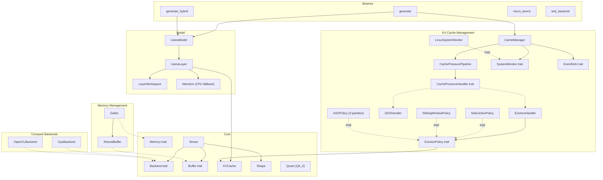

# 14. Component Quality Gates

This document tracks component-level quality gates for the llm.rs (llm_rs2) inference framework. Each component is assigned a tier that determines its testing requirements and gate criteria.

> **Auto-update**: Sections 3 and 4 are automatically maintained by `scripts/update_test_status.py`.

---

## 1. Component Diagram

---

## 2. Quality Gate Definition

### Tier Classification

| Tier | Scope | Components | Gate Criteria |
|:-----|:------|:-----------|:--------------|
| **T1: Foundation** | Data structures, memory primitives | Shape, Tensor, Buffer/DType, Quant, SharedBuffer, Galloc | Host unit tests required, all must PASS |
| **T2: Algorithm** | Algorithms, policies, CPU-testable logic | KVCache, NoEvictionPolicy, SlidingWindowPolicy, H2OPolicy, D2OHandler, CacheManager, SystemMonitor, Attention | Host unit tests required, all must PASS |
| **T3: Backend** | Hardware-specific backends | CpuBackend, OpenCLBackend | Device verification via `test_backend`, host N/A |
| **T4: Integration** | Model layers, GPU buffers | LlamaLayer, LayerWorkspace, LlamaModel, UnifiedBuffer | E2E device verification, host N/A |

### Gate Status

| Status | Meaning |
|:-------|:--------|
| PASS | All tests pass |
| **FAIL** | One or more tests fail |
| **BLOCKED** | T1/T2 component with zero tests — quality unknown |
| N/A | T3/T4 component — requires device, not testable on host |

### Maturity Levels

| Level | Meaning |
|:------|:--------|
| Stable | Production-ready, well-tested |
| Beta | Functional but under active development |
| Stub | Placeholder implementation |

### Overall Gate Rule

The overall gate is **FAIL** if any T1 or T2 component has status BLOCKED or FAIL. T3/T4 components are excluded from the overall gate since they require device access.

---

## 3. Component Quality Status

<!-- AUTO-GENERATED:TEST_STATUS:START -->
_Last updated: 2026-03-15 15:56:07_

### Quality Gate Summary

| Component | Tier | Maturity | Tests | Passed | Skipped | Gate |
|:----------|:-----|:---------|------:|-------:|--------:|:-----|
| Buffer/DType | T1 | Stable | 5 | 5 | 0 | PASS |
| Galloc | T1 | Stable | 3 | 3 | 0 | PASS |
| Quant | T1 | Stable | 15 | 15 | 0 | PASS |
| Shape | T1 | Stable | 3 | 3 | 0 | PASS |
| SharedBuffer | T1 | Stable | 5 | 5 | 0 | PASS |
| Tensor | T1 | Stable | 6 | 6 | 0 | PASS |
| Attention | T2 | Stable | 5 | 5 | 0 | PASS |
| CacheManager | T2 | Stable | 22 | 22 | 0 | PASS |
| H2OPolicy | T2 | Stable | 44 | 44 | 0 | PASS |
| KVCache | T2 | Stable | 30 | 30 | 0 | PASS |
| NoEvictionPolicy | T2 | Stable | 3 | 3 | 0 | PASS |
| OperatingMode | T2 | Stable | 5 | 5 | 0 | PASS |
| ResilienceManager | T2 | Stable | 9 | 9 | 0 | PASS |
| Signal/Level | T2 | Stable | 0 | 0 | 0 | **BLOCKED** |
| SlidingWindowPolicy | T2 | Stable | 7 | 7 | 0 | PASS |
| Strategy | T2 | Stable | 16 | 16 | 0 | PASS |
| SystemMonitor | T2 | Stable | 3 | 3 | 0 | PASS |
| CpuBackend | T3 | Stable | 14 | 14 | 0 | PASS |
| OpenCLBackend | T3 | Stable | 0 | 0 | 0 | N/A |
| LayerWorkspace | T4 | Stable | 4 | 4 | 0 | PASS |
| LlamaLayer | T4 | Stable | 3 | 3 | 0 | PASS |
| LlamaModel | T4 | Stable | 0 | 0 | 0 | N/A |
| UnifiedBuffer | T4 | Stable | 3 | 0 | 0 | **FAIL** |
| **Overall** | | | **205** | **202** | **0** | **FAIL** |
| Integration | - | - | 260 | 260 | PASS |

### Test Details

| Test | Component | Result |
|:-----|:----------|:------:|
| `test_buffer_default_impls` | Buffer/DType | PASS |
| `test_buffer_metadata_accessors` | Buffer/DType | PASS |
| `test_dtype_all_variant_sizes` | Buffer/DType | PASS |
| `test_dtype_equality_and_copy` | Buffer/DType | PASS |
| `test_dtype_size` | Buffer/DType | PASS |
| `test_galloc_allocation` | Galloc | PASS |
| `test_galloc_used_memory` | Galloc | PASS |
| `test_galloc_zero_size_allocation` | Galloc | PASS |
| `test_block_q2_0_constant` | Quant | PASS |
| `test_block_q2_0_dequantize_known` | Quant | PASS |
| `test_block_q2_0_manual_pack` | Quant | PASS |
| `test_block_q2_0_negative_range` | Quant | PASS |
| `test_block_q2_0_round_trip` | Quant | PASS |
| `test_block_q2_0_zeros` | Quant | PASS |
| `test_block_q4_0_dequantize` | Quant | PASS |
| `test_block_q4_0_quantize_round_trip` | Quant | PASS |
| `test_block_q4_0_quantize_zeros` | Quant | PASS |
| `test_block_q4_0_zero_scale` | Quant | PASS |
| `test_block_q4_1_dequantize` | Quant | PASS |
| `test_block_q4_1_zero_scale` | Quant | PASS |
| `test_block_q8_0_dequantize` | Quant | PASS |
| `test_quantize_dequantize_slice_q2` | Quant | PASS |
| `test_struct_sizes` | Quant | PASS |
| `test_empty_shape_scalar` | Shape | PASS |
| `test_one_dimensional_empty` | Shape | PASS |
| `test_shape_creation_and_metadata` | Shape | PASS |
| `test_cl_mem_with_feature_opencl` | SharedBuffer | PASS |
| `test_shared_buffer_creation` | SharedBuffer | PASS |
| `test_shared_buffer_mutability_semantics` | SharedBuffer | PASS |
| `test_shared_buffer_zero_size` | SharedBuffer | PASS |
| `test_sync_device` | SharedBuffer | PASS |
| `test_tensor_as_slice_bounds` | Tensor | PASS |
| `test_tensor_clone_shares_buffer` | Tensor | PASS |
| `test_tensor_creation_and_metadata` | Tensor | PASS |
| `test_tensor_matmul_unimplemented` | Tensor | PASS |
| `test_tensor_to_device` | Tensor | PASS |
| `test_tensor_to_device_different_backend` | Tensor | PASS |
| `test_flash_attention_decode_causal_mask` | Attention | PASS |
| `test_flash_attention_single_token` | Attention | PASS |
| `test_flash_attention_vs_naive` | Attention | PASS |
| `test_identity_qk_reproduces_v` | Attention | PASS |
| `test_naive_attention_sanity` | Attention | PASS |
| `test_empty_caches` | CacheManager | PASS |
| `test_eviction_across_all_layers` | CacheManager | PASS |
| `test_force_evict_bypasses_should_evict` | CacheManager | PASS |
| `test_force_evict_empty_caches` | CacheManager | PASS |
| `test_force_evict_ratio_clamping` | CacheManager | PASS |
| `test_force_evict_with_scores_bypasses_checks` | CacheManager | PASS |
| `test_maybe_evict_with_scores_no_eviction_needed` | CacheManager | PASS |
| `test_maybe_evict_with_scores_triggers` | CacheManager | PASS |
| `test_monitor_error_skips_eviction` | CacheManager | PASS |
| `test_no_eviction_with_plenty_memory` | CacheManager | PASS |
| `test_pipeline_manager_empty_pipeline` | CacheManager | PASS |
| `test_pipeline_manager_evicts_at_pressure` | CacheManager | PASS |
| `test_pipeline_manager_force_evict` | CacheManager | PASS |
| `test_pipeline_manager_force_evict_with_scores` | CacheManager | PASS |
| `test_pipeline_manager_monitor_error_skips` | CacheManager | PASS |
| `test_pipeline_manager_multi_level_graduated_response` | CacheManager | PASS |
| `test_pipeline_manager_no_action_at_normal` | CacheManager | PASS |
| `test_pipeline_manager_policy_name` | CacheManager | PASS |
| `test_pipeline_manager_with_scores` | CacheManager | PASS |
| `test_policy_name` | CacheManager | PASS |
| `test_sliding_window_with_memory_pressure` | CacheManager | PASS |
| `test_target_ratio_clamping` | CacheManager | PASS |
| `test_aggressive_eviction_large_to_small` | H2OPolicy | PASS |
| `test_budget_calculation_exact_values` | H2OPolicy | PASS |
| `test_budget_rounding_odd_available` | H2OPolicy | PASS |
| `test_budget_split_50_50` | H2OPolicy | PASS |
| `test_compaction_adjacent_hh_no_unnecessary_shift` | H2OPolicy | PASS |
| `test_compaction_multihead_cache` | H2OPolicy | PASS |
| `test_compaction_noncontiguous_hh_exact_data` | H2OPolicy | PASS |
| `test_custom_prefix_size` | H2OPolicy | PASS |
| `test_evict_below_threshold_noop` | H2OPolicy | PASS |
| `test_evict_fallback_keeps_recent` | H2OPolicy | PASS |
| `test_evict_fallback_works` | H2OPolicy | PASS |
| `test_evict_preserves_prefix` | H2OPolicy | PASS |
| `test_evictable_boundary_token` | H2OPolicy | PASS |
| `test_evictable_fewer_than_hh_budget` | H2OPolicy | PASS |
| `test_hh_ignores_prefix_region_scores` | H2OPolicy | PASS |
| `test_hh_ignores_recent_region_scores` | H2OPolicy | PASS |
| `test_hh_selects_highest_scores` | H2OPolicy | PASS |
| `test_high_hh_ratio` | H2OPolicy | PASS |
| `test_k_v_buffers_stay_synchronized` | H2OPolicy | PASS |
| `test_keep_ratio_one_no_recent` | H2OPolicy | PASS |
| `test_keep_ratio_zero_no_hh` | H2OPolicy | PASS |
| `test_low_score_tokens_evicted` | H2OPolicy | PASS |
| `test_name` | H2OPolicy | PASS |
| `test_no_eviction_when_below_target` | H2OPolicy | PASS |
| `test_order_preservation` | H2OPolicy | PASS |
| `test_repeated_eviction_data_integrity` | H2OPolicy | PASS |
| `test_reset_allows_former_hh_to_be_evicted` | H2OPolicy | PASS |
| `test_reset_prevents_score_position_misalignment` | H2OPolicy | PASS |
| `test_score_ranking_ascending_pattern` | H2OPolicy | PASS |
| `test_score_ranking_descending_pattern` | H2OPolicy | PASS |
| `test_score_ranking_v_shape_pattern` | H2OPolicy | PASS |
| `test_should_evict_always_false` | H2OPolicy | PASS |
| `test_tie_breaking_prefers_earlier_position` | H2OPolicy | PASS |
| `test_without_reset_stale_scores_cause_wrong_eviction` | H2OPolicy | PASS |
| `test_current_pos_uniform_after_eviction` | H2OPolicy | PASS |
| `test_evict_fallback` | H2OPolicy | PASS |
| `test_flat_scores_fallback` | H2OPolicy | PASS |
| `test_name` | H2OPolicy | PASS |
| `test_noop_when_below_target` | H2OPolicy | PASS |
| `test_per_head_different_hh` | H2OPolicy | PASS |
| `test_per_head_eviction_basic` | H2OPolicy | PASS |
| `test_per_head_preserves_prefix` | H2OPolicy | PASS |
| `test_per_head_preserves_recent` | H2OPolicy | PASS |
| `test_should_evict_always_false` | H2OPolicy | PASS |
| `test_accessors` | KVCache | PASS |
| `test_cache_creation` | KVCache | PASS |
| `test_cross_layout_equivalence` | KVCache | PASS |
| `test_dynamic_growth_basic` | KVCache | PASS |
| `test_dynamic_growth_capped` | KVCache | PASS |
| `test_dynamic_growth_doubling` | KVCache | PASS |
| `test_dynamic_overflow` | KVCache | PASS |
| `test_dynamic_with_eviction` | KVCache | PASS |
| `test_get_view` | KVCache | PASS |
| `test_hm_dynamic_growth` | KVCache | PASS |
| `test_hm_prune_prefix` | KVCache | PASS |
| `test_hm_shift_positions` | KVCache | PASS |
| `test_hm_update_multi_token` | KVCache | PASS |
| `test_hm_update_single_token` | KVCache | PASS |
| `test_layout_default_is_seq_major` | KVCache | PASS |
| `test_memory_usage_bytes` | KVCache | PASS |
| `test_new_backward_compat` | KVCache | PASS |
| `test_non_dynamic_grow_fails` | KVCache | PASS |
| `test_offset_head_major` | KVCache | PASS |
| `test_offset_seq_major` | KVCache | PASS |
| `test_prune_prefix_all` | KVCache | PASS |
| `test_prune_prefix_basic` | KVCache | PASS |
| `test_prune_prefix_over_count` | KVCache | PASS |
| `test_prune_prefix_zero` | KVCache | PASS |
| `test_shift_positions_for_head_basic` | KVCache | PASS |
| `test_shift_positions_for_head_multi_count` | KVCache | PASS |
| `test_shift_positions_for_head_noop` | KVCache | PASS |
| `test_strides_head_major` | KVCache | PASS |
| `test_strides_seq_major` | KVCache | PASS |
| `test_update_overflow` | KVCache | PASS |
| `test_no_eviction_evict_is_noop` | NoEvictionPolicy | PASS |
| `test_no_eviction_name` | NoEvictionPolicy | PASS |
| `test_no_eviction_never_evicts` | NoEvictionPolicy | PASS |
| `test_all_normal_yields_normal_mode` | OperatingMode | PASS |
| `test_any_emergency_yields_suspended` | OperatingMode | PASS |
| `test_mixed_levels_worst_wins` | OperatingMode | PASS |
| `test_single_critical_yields_minimal` | OperatingMode | PASS |
| `test_single_warning_yields_degraded` | OperatingMode | PASS |
| `test_execute_limit_tokens` | ResilienceManager | PASS |
| `test_execute_restore_clears_constraints` | ResilienceManager | PASS |
| `test_execute_suspend_sets_flag` | ResilienceManager | PASS |
| `test_execute_throttle_sets_delay` | ResilienceManager | PASS |
| `test_manager_handles_multiple_signals` | ResilienceManager | PASS |
| `test_manager_poll_returns_empty_when_no_signals` | ResilienceManager | PASS |
| `test_manager_processes_memory_signal` | ResilienceManager | PASS |
| `test_manager_state_transitions` | ResilienceManager | PASS |
| `test_manager_survives_channel_disconnect` | ResilienceManager | PASS |
| `test_evict_no_action_needed` | SlidingWindowPolicy | PASS |
| `test_evict_no_prefix` | SlidingWindowPolicy | PASS |
| `test_evict_with_protected_prefix` | SlidingWindowPolicy | PASS |
| `test_minimum_protected_prefix_enforced` | SlidingWindowPolicy | PASS |
| `test_name` | SlidingWindowPolicy | PASS |
| `test_should_evict` | SlidingWindowPolicy | PASS |
| `test_should_evict_with_prefix` | SlidingWindowPolicy | PASS |
| `test_compute_critical_switches_backend` | Strategy | PASS |
| `test_compute_warning_does_not_switch` | Strategy | PASS |
| `test_energy_emergency_suspends_and_rejects` | Strategy | PASS |
| `test_energy_normal_restores` | Strategy | PASS |
| `test_memory_critical_triggers_eviction` | Strategy | PASS |
| `test_memory_emergency_evicts_and_rejects` | Strategy | PASS |
| `test_memory_normal_restores_defaults` | Strategy | PASS |
| `test_cpu_always_wins_over_gpu` | Strategy | PASS |
| `test_empty_input_returns_empty` | Strategy | PASS |
| `test_largest_delay_wins` | Strategy | PASS |
| `test_most_aggressive_eviction_wins` | Strategy | PASS |
| `test_restore_alone_passes_through` | Strategy | PASS |
| `test_restore_only_when_no_other_constraints` | Strategy | PASS |
| `test_suspend_overrides_all` | Strategy | PASS |
| `test_thermal_critical_throttles_proportionally` | Strategy | PASS |
| `test_thermal_emergency_suspends` | Strategy | PASS |
| `test_linux_monitor_parsing` | SystemMonitor | PASS |
| `test_parse_meminfo_bad_format_error` | SystemMonitor | PASS |
| `test_parse_meminfo_missing_field_error` | SystemMonitor | PASS |
| `test_add_assign_oracle` | CpuBackend | PASS |
| `test_cast_f32_to_f16_oracle` | CpuBackend | PASS |
| `test_copy_from_identity` | CpuBackend | PASS |
| `test_gather_oracle` | CpuBackend | PASS |
| `test_matmul_slice_f32_oracle` | CpuBackend | PASS |
| `test_matmul_transposed_f32_large_oracle` | CpuBackend | PASS |
| `test_matmul_transposed_f32_oracle` | CpuBackend | PASS |
| `test_matmul_transposed_q4_0_oracle` | CpuBackend | PASS |
| `test_matmul_transposed_q4_1_oracle` | CpuBackend | PASS |
| `test_rms_norm_oracle` | CpuBackend | PASS |
| `test_rope_oracle` | CpuBackend | PASS |
| `test_scale_oracle` | CpuBackend | PASS |
| `test_silu_mul_oracle` | CpuBackend | PASS |
| `test_softmax_oracle` | CpuBackend | PASS |
| `test_workspace_allocation_shapes` | LayerWorkspace | PASS |
| `test_workspace_scores_size` | LayerWorkspace | PASS |
| `test_workspace_small_config` | LayerWorkspace | PASS |
| `test_workspace_tensors_writable` | LayerWorkspace | PASS |
| `test_accumulator_receives_post_softmax_scores` | LlamaLayer | PASS |
| `test_compute_attention_scores_f16_post_softmax` | LlamaLayer | PASS |
| `test_inline_softmax_produces_valid_probabilities` | LlamaLayer | PASS |
| `test_alloc_unified_buffer` | UnifiedBuffer | **FAIL** |
| `test_map_returns_valid_ptr` | UnifiedBuffer | **FAIL** |
| `test_unmap_and_remap` | UnifiedBuffer | **FAIL** |
| `default_config_all_monitors_enabled` | Integration | PASS |
| `parse_external_config` | Integration | PASS |
| `parse_full_config` | Integration | PASS |
| `parse_minimal_toml` | Integration | PASS |
| `test_accumulate_gqa_groups_q_heads` | Integration | PASS |
| `test_accumulate_multi_layer_uses_max` | Integration | PASS |
| `test_accumulate_single_layer` | Integration | PASS |
| `test_cumulative_across_steps` | Integration | PASS |
| `test_decay` | Integration | PASS |
| `test_end_step_without_begin_step` | Integration | PASS |
| `test_gqa_also_updates_flat` | Integration | PASS |
| `test_gqa_decay` | Integration | PASS |
| `test_gqa_multi_layer_max` | Integration | PASS |
| `test_gqa_reset` | Integration | PASS |
| `test_head_importance_accessor` | Integration | PASS |
| `test_inactive_no_accumulation` | Integration | PASS |
| `test_max_preserves_single_layer_critical_token` | Integration | PASS |
| `test_max_vs_sum_divergent_hh_ranking` | Integration | PASS |
| `test_per_layer_max_preserves_critical_tokens` | Integration | PASS |
| `test_post_softmax_score_total_equals_n_heads` | Integration | PASS |
| `test_reset` | Integration | PASS |
| `test_should_track_layer` | Integration | PASS |
| `test_two_stage_aggregation_within_step_max_across_steps_sum` | Integration | PASS |
| `test_build_score_snapshot_all_prefix` | Integration | PASS |
| `test_build_score_snapshot_basic` | Integration | PASS |
| `test_build_score_snapshot_empty_returns_none` | Integration | PASS |
| `test_build_score_snapshot_sigma_distribution` | Integration | PASS |
| `test_collecting_sink_captures_events` | Integration | PASS |
| `test_noop_sink_is_zero_cost` | Integration | PASS |
| `test_compare_kivi_vs_baseline` | Integration | PASS |
| `test_kivi_cache_basic` | Integration | PASS |
| `test_kivi_cache_compression_ratio` | Integration | PASS |
| `test_kivi_cache_flush_and_quantize` | Integration | PASS |
| `test_kivi_cache_get_view_after_flush` | Integration | PASS |
| `test_kivi_cache_incremental_deq` | Integration | PASS |
| `test_kivi_cache_memory_usage` | Integration | PASS |
| `test_kivi_cache_multi_token_update` | Integration | PASS |
| `test_kivi_cache_overflow` | Integration | PASS |
| `test_kivi_cache_residual_only` | Integration | PASS |
| `test_kivi_cache_vec_capacity_no_realloc` | Integration | PASS |
| `test_decrease_with_patience` | Integration | PASS |
| `test_increase_on_stall` | Integration | PASS |
| `test_max_depth_cap` | Integration | PASS |
| `test_no_oscillation` | Integration | PASS |
| `test_warmup_no_adjust` | Integration | PASS |
| `test_pool_basic` | Integration | PASS |
| `test_pool_concurrent_tasks` | Integration | PASS |
| `test_pool_drop_joins_workers` | Integration | PASS |
| `test_pool_result_timing` | Integration | PASS |
| `test_raw_store_append_token` | Integration | PASS |
| `test_raw_store_basic` | Integration | PASS |
| `test_raw_store_clear` | Integration | PASS |
| `test_raw_store_empty` | Integration | PASS |
| `test_deferred_flush_on_release` | Integration | PASS |
| `test_deferred_get_view_with_store_behind` | Integration | PASS |
| `test_deferred_preload_after_behind` | Integration | PASS |
| `test_deferred_write_skips_store` | Integration | PASS |
| `test_deferred_write_with_raw_store` | Integration | PASS |
| `test_integration_base_vs_offload_f16_accuracy` | Integration | PASS |
| `test_non_retained_update_writes_store_immediately` | Integration | PASS |
| `test_offload_kvcache_empty_view` | Integration | PASS |
| `test_offload_kvcache_memory_usage` | Integration | PASS |
| `test_offload_kvcache_ops` | Integration | PASS |
| `test_offload_kvcache_overflow` | Integration | PASS |
| `test_out_buf_reuse` | Integration | PASS |
| `test_preload_concurrent_split_at_mut` | Integration | PASS |
| `test_preload_empty_cache` | Integration | PASS |
| `test_preload_idempotent` | Integration | PASS |
| `test_preload_skips_io_in_get_view` | Integration | PASS |
| `test_preload_update_append_to_attn_buf` | Integration | PASS |
| `test_release_buffers_frees_memory` | Integration | PASS |
| `test_reset_preload` | Integration | PASS |
| `test_retain_preload_cross_token` | Integration | PASS |
| `test_retain_preload_depth_decrease` | Integration | PASS |
| `test_retain_preload_guards_none_bufs` | Integration | PASS |
| `test_compress_name` | Integration | PASS |
| `test_compress_returns_noop` | Integration | PASS |
| `test_cosine_identical_vectors` | Integration | PASS |
| `test_cosine_opposite_vectors` | Integration | PASS |
| `test_cosine_orthogonal_vectors` | Integration | PASS |
| `test_cosine_zero_vector` | Integration | PASS |
| `test_ema_initialization` | Integration | PASS |
| `test_ema_update` | Integration | PASS |
| `test_find_nearest_cosine_head_major` | Integration | PASS |
| `test_find_nearest_cosine_seq_major` | Integration | PASS |
| `test_handler_empty_caches` | Integration | PASS |
| `test_handler_evicts_head_major` | Integration | PASS |
| `test_handler_evicts_tokens` | Integration | PASS |
| `test_handler_layout_equivalence` | Integration | PASS |
| `test_handler_multi_layer` | Integration | PASS |
| `test_handler_name` | Integration | PASS |
| `test_handler_noop_below_target` | Integration | PASS |
| `test_handler_noop_no_importance` | Integration | PASS |
| `test_handler_q4_evicts` | Integration | PASS |
| `test_keep_ratio_3_to_1` | Integration | PASS |
| `test_merge_weights_sum_to_one` | Integration | PASS |
| `test_prefix_always_protected` | Integration | PASS |
| `test_q4_dequantize_k` | Integration | PASS |
| `test_q4_find_nearest_cosine` | Integration | PASS |
| `test_q4_weighted_merge` | Integration | PASS |
| `test_quantize_round_trip` | Integration | PASS |
| `test_weighted_merge_values` | Integration | PASS |
| `test_h2o_fallback_without_scores` | Integration | PASS |
| `test_name_delegates_to_policy` | Integration | PASS |
| `test_noop_on_empty_caches` | Integration | PASS |
| `test_noop_when_below_target` | Integration | PASS |
| `test_target_ratio_clamping` | Integration | PASS |
| `test_wraps_h2o_with_scores` | Integration | PASS |
| `test_wraps_sliding_window` | Integration | PASS |
| `test_merge_name` | Integration | PASS |
| `test_merge_returns_noop` | Integration | PASS |
| `test_quantize_name` | Integration | PASS |
| `test_quantize_returns_noop` | Integration | PASS |
| `test_sparse_name` | Integration | PASS |
| `test_sparse_returns_noop` | Integration | PASS |
| `test_swap_name` | Integration | PASS |
| `test_swap_returns_noop` | Integration | PASS |
| `test_action_result_is_action` | Integration | PASS |
| `test_context_updated_after_eviction` | Integration | PASS |
| `test_empty_pipeline` | Integration | PASS |
| `test_pipeline_executes_matching_stages` | Integration | PASS |
| `test_pipeline_len` | Integration | PASS |
| `test_pipeline_ordering_sorts_by_level` | Integration | PASS |
| `test_pipeline_skips_all_at_normal` | Integration | PASS |
| `test_same_level_multiple_handlers` | Integration | PASS |
| `test_compute_log_prob_peaked` | Integration | PASS |
| `test_compute_log_prob_sums_to_one` | Integration | PASS |
| `test_compute_log_prob_uniform` | Integration | PASS |
| `test_greedy_sampling` | Integration | PASS |
| `test_greedy_with_negative_logits` | Integration | PASS |
| `test_repetition_penalty_reduces_repeated` | Integration | PASS |
| `emit_without_client_is_noop` | Integration | PASS |
| `roundtrip_signal_over_socket` | Integration | PASS |
| `ascending_escalation_path` | Integration | PASS |
| `ascending_hysteresis_prevents_oscillation` | Integration | PASS |
| `ascending_multi_level_recovery` | Integration | PASS |
| `ascending_skip_to_emergency` | Integration | PASS |
| `ascending_stay_in_hysteresis_zone` | Integration | PASS |
| `descending_escalation_path` | Integration | PASS |
| `descending_hysteresis_prevents_oscillation` | Integration | PASS |
| `descending_multi_level_recovery` | Integration | PASS |
| `descending_skip_to_emergency` | Integration | PASS |
| `descending_step_recovery` | Integration | PASS |
| `no_emergency_level` | Integration | PASS |
| `test_extract_top_k_logits` | Integration | PASS |
| `test_extract_top_k_logits_k_larger_than_len` | Integration | PASS |
| `test_schedule_signals_at` | Integration | PASS |
| `test_summary_record_serialization` | Integration | PASS |
| `test_system_sampler_interval_respects_interval` | Integration | PASS |
| `test_system_sampler_interval_zero_returns_none` | Integration | PASS |
| `test_system_sampler_snapshot_always_returns` | Integration | PASS |
| `test_token_record_serialization` | Integration | PASS |
| `balanced_recommendation` | Integration | PASS |
| `both_loaded_recommendation` | Integration | PASS |
| `compute_delta_calculation` | Integration | PASS |
| `cpu_bottleneck_recommendation` | Integration | PASS |
| `cpu_snapshot_parsing` | Integration | PASS |
| `no_emergency_level` | Integration | PASS |
| `recommendation_change_without_level_change` | Integration | PASS |
| `find_battery` | Integration | PASS |
| `monitor_battery_depletion` | Integration | PASS |
| `monitor_charging_overrides` | Integration | PASS |
| `monitor_no_battery` | Integration | PASS |
| `monitor_with_battery` | Integration | PASS |
| `read_battery_charging` | Integration | PASS |
| `read_battery_discharging` | Integration | PASS |
| `initial_signal_is_none` | Integration | PASS |
| `parse_memory_signal` | Integration | PASS |
| `parse_valid_signal` | Integration | PASS |
| `skips_invalid_lines` | Integration | PASS |
| `unix_socket_injection` | Integration | PASS |
| `monitor_builds_signal` | Integration | PASS |
| `monitor_escalation` | Integration | PASS |
| `monitor_reclaim_scales_with_level` | Integration | PASS |
| `parse_meminfo_valid` | Integration | PASS |
| `detects_throttling` | Integration | PASS |
| `monitor_fallback_on_no_match` | Integration | PASS |
| `monitor_throttle_ratio` | Integration | PASS |
| `monitor_zone_discovery` | Integration | PASS |
| `monitor_zone_filter` | Integration | PASS |
| `reads_hottest_zone` | Integration | PASS |
| `test_cache_tracker_empty` | Integration | PASS |
| `test_cache_tracker_growth_and_eviction` | Integration | PASS |
| `test_cache_tracker_many_records` | Integration | PASS |
| `test_cache_tracker_record` | Integration | PASS |
| `test_cache_tracker_to_json` | Integration | PASS |
| `test_cache_tracker_to_json_empty` | Integration | PASS |
| `test_cache_tracker_utilization_calculation` | Integration | PASS |
| `test_cache_tracker_zero_capacity` | Integration | PASS |
| `test_entropy_tracker_empty` | Integration | PASS |
| `test_entropy_tracker_multiple_steps` | Integration | PASS |
| `test_entropy_tracker_record_from_scores` | Integration | PASS |
| `test_entropy_tracker_to_json` | Integration | PASS |
| `test_entropy_tracker_to_json_empty` | Integration | PASS |
| `test_entropy_tracker_zero_heads_noop` | Integration | PASS |
| `test_shannon_entropy_binary` | Integration | PASS |
| `test_shannon_entropy_peaked` | Integration | PASS |
| `test_shannon_entropy_skewed` | Integration | PASS |
| `test_shannon_entropy_uniform` | Integration | PASS |
| `test_latency_tracker_cache_len_increases` | Integration | PASS |
| `test_latency_tracker_empty` | Integration | PASS |
| `test_latency_tracker_record_and_access` | Integration | PASS |
| `test_latency_tracker_summary` | Integration | PASS |
| `test_latency_tracker_summary_single_record` | Integration | PASS |
| `test_latency_tracker_to_json_empty` | Integration | PASS |
| `test_latency_tracker_to_json_includes_summary` | Integration | PASS |
| `test_latency_tracker_to_json_structure` | Integration | PASS |
| `test_op_profiler_default_is_zero` | Integration | PASS |
| `test_op_profiler_to_json_percentages` | Integration | PASS |
| `test_op_profiler_to_json_structure` | Integration | PASS |
| `test_op_profiler_to_json_zero_count` | Integration | PASS |
| `test_op_profiler_to_json_zero_total` | Integration | PASS |
| `test_op_profiler_total` | Integration | PASS |
| `test_compute_h2o_evicted_indices_basic` | Integration | PASS |
| `test_compute_h2o_evicted_indices_no_eviction_needed` | Integration | PASS |
| `test_eviction_event_with_indices_and_scores` | Integration | PASS |
| `test_prefix_tokens_never_die` | Integration | PASS |
| `test_record_eviction` | Integration | PASS |
| `test_record_multiple_evictions` | Integration | PASS |
| `test_score_tracker_default` | Integration | PASS |
| `test_score_tracker_new` | Integration | PASS |
| `test_snapshot_interval_min_one` | Integration | PASS |
| `test_snapshot_with_position_map` | Integration | PASS |
| `test_take_snapshot_basic` | Integration | PASS |
| `test_take_snapshot_cache_len_bounds` | Integration | PASS |
| `test_take_snapshot_clones_data` | Integration | PASS |
| `test_take_snapshot_head_importance_not_tracked` | Integration | PASS |
| `test_take_snapshot_interval_skip` | Integration | PASS |
| `test_take_snapshot_with_head_importance` | Integration | PASS |
| `test_to_json_combined` | Integration | PASS |
| `test_to_json_empty` | Integration | PASS |
| `test_to_json_with_evictions` | Integration | PASS |
| `test_to_json_with_head_importance` | Integration | PASS |
| `test_to_json_with_snapshots` | Integration | PASS |
| `test_token_lifetime_json` | Integration | PASS |
| `test_token_lifetime_tracking` | Integration | PASS |
| `test_export_json_creates_file` | Integration | PASS |
| `test_export_json_optional_probes_null_when_disabled` | Integration | PASS |
| `test_full_lifecycle_scores_and_eviction` | Integration | PASS |
| `test_on_eviction_records_event` | Integration | PASS |
| `test_on_step_end_no_snapshot_without_scores` | Integration | PASS |
| `test_on_step_end_records_latency` | Integration | PASS |
| `test_on_step_end_records_score_snapshot` | Integration | PASS |
| `test_on_step_end_with_head_importance` | Integration | PASS |
| `test_profiler_creation_with_default_probes` | Integration | PASS |
| `test_profiler_creation_with_optional_probes` | Integration | PASS |
| `test_listener_forwards_to_channel` | Integration | PASS |
| `test_listener_stops_on_disconnect` | Integration | PASS |
| `test_listener_stops_when_receiver_dropped` | Integration | PASS |
| `test_listener_survives_parse_errors` | Integration | PASS |
| `test_mock_channel_disconnect` | Integration | PASS |
| `test_mock_channel_send_recv` | Integration | PASS |
| `test_mock_connect_always_ok` | Integration | PASS |
| `test_mock_from_signals_delivers_all` | Integration | PASS |
| `test_unix_socket_connect_fail` | Integration | PASS |
| `test_unix_socket_connection_closed` | Integration | PASS |
| `test_unix_socket_multiple_messages` | Integration | PASS |
| `test_unix_socket_oversized_rejected` | Integration | PASS |
| `test_unix_socket_parse_error` | Integration | PASS |
| `test_unix_socket_round_trip` | Integration | PASS |
<!-- AUTO-GENERATED:TEST_STATUS:END -->

---

## 4. Test History

<!-- AUTO-GENERATED:TEST_HISTORY:START -->
| Date | Total | Passed | Failed | Pass Rate |
|:-----|------:|-------:|-------:|----------:|
| 2026-03-14T14:41:00 | 262 | 260 | 2 | 99.2% |
| 2026-03-14T15:38:38 | 267 | 264 | 3 | 98.9% |
| 2026-03-14T16:19:31 | 264 | 264 | 0 | 100.0% |
| 2026-03-14T16:28:41 | 267 | 264 | 3 | 98.9% |
| 2026-03-14T19:30:45 | 266 | 263 | 3 | 98.9% |
| 2026-03-14T20:00:11 | 268 | 266 | 2 | 99.3% |
| 2026-03-14T20:41:48 | 275 | 275 | 0 | 100.0% |
| 2026-03-14T20:48:03 | 267 | 264 | 3 | 98.9% |
| 2026-03-14T21:03:09 | 267 | 264 | 3 | 98.9% |
| 2026-03-14T21:03:48 | 265 | 264 | 1 | 99.6% |
| 2026-03-14T21:08:24 | 267 | 264 | 3 | 98.9% |
| 2026-03-14T21:11:17 | 265 | 264 | 1 | 99.6% |
| 2026-03-14T22:17:48 | 270 | 267 | 3 | 98.9% |
| 2026-03-14T22:38:05 | 273 | 271 | 2 | 99.3% |
| 2026-03-14T23:55:49 | 284 | 281 | 3 | 98.9% |
| 2026-03-15T00:01:53 | 281 | 281 | 0 | 100.0% |
| 2026-03-15T00:21:59 | 476 | 476 | 0 | 100.0% |
| 2026-03-15T00:28:49 | 477 | 476 | 1 | 99.8% |
| 2026-03-15T12:42:47 | 478 | 476 | 2 | 99.6% |
| 2026-03-15T15:56:07 | 465 | 462 | 3 | 99.4% |
<!-- AUTO-GENERATED:TEST_HISTORY:END -->
