# 14. Component Quality Gates

This document tracks component-level quality gates for the Antigravity (llm_rs2) inference framework. Each component is assigned a tier that determines its testing requirements and gate criteria.

> **Auto-update**: Sections 3 and 4 are automatically maintained by `scripts/update_test_status.py`.

---

## 1. Component Diagram

```mermaid
graph TB
    subgraph BinaryLayer ["Binaries"]
        Generate["generate"]
        GenerateHybrid["generate_hybrid"]
        MicroBench["micro_bench"]
        TestBackend["test_backend"]
    end

    subgraph ModelComponent ["Model"]
        LlamaModel["LlamaModel"]
        LlamaLayer["LlamaLayer"]
        LayerWS["LayerWorkspace"]
        Attention["Attention (CPU fallback)"]
    end

    subgraph CoreComponent ["Core"]
        BackendTrait["Backend trait"]
        MemoryTrait["Memory trait"]
        BufferTrait["Buffer trait"]
        KVCache["KVCache"]
        Tensor["Tensor"]
        Shape["Shape"]
        Quant["Quant (Q4_0)"]
    end

    subgraph EvictionSubsystem ["KV Cache Eviction"]
        CacheManager["CacheManager"]
        EvictionPolicy["EvictionPolicy trait"]
        NoEviction["NoEvictionPolicy"]
        SlidingWindow["SlidingWindowPolicy"]
        SnapKV["SnapKVPolicy (stub)"]
        SysMonitor["SystemMonitor trait"]
        LinuxMonitor["LinuxSystemMonitor"]
    end

    subgraph BackendComponent ["Compute Backends"]
        CpuBackend["CpuBackend"]
        OpenCLBackend["OpenCLBackend"]
    end

    subgraph MemoryComponent ["Memory Management"]
        Galloc["Galloc"]
        SharedBuffer["SharedBuffer"]
    end

    Generate --> LlamaModel
    GenerateHybrid --> LlamaModel
    LlamaModel --> LlamaLayer
    LlamaLayer --> LayerWS
    LlamaLayer --> Attention
    LlamaLayer --> KVCache

    LlamaModel --> CacheManager
    CacheManager --> EvictionPolicy
    CacheManager --> SysMonitor
    NoEviction -.->|impl| EvictionPolicy
    SlidingWindow -.->|impl| EvictionPolicy
    SnapKV -.->|impl| EvictionPolicy
    LinuxMonitor -.->|impl| SysMonitor
    EvictionPolicy --> KVCache

    Tensor --> BufferTrait
    Tensor --> BackendTrait
    Tensor --> Shape

    CpuBackend -.-> BackendTrait
    OpenCLBackend -.-> BackendTrait
    Galloc -.-> MemoryTrait
    SharedBuffer -.-> BufferTrait
    Galloc --> SharedBuffer
```

---

## 2. Quality Gate Definition

### Tier Classification

| Tier | Scope | Components | Gate Criteria |
|:-----|:------|:-----------|:--------------|
| **T1: Foundation** | Data structures, memory primitives | Shape, Tensor, Buffer/DType, Quant, SharedBuffer, Galloc | Host unit tests required, all must PASS |
| **T2: Algorithm** | Algorithms, policies, CPU-testable logic | KVCache, NoEvictionPolicy, SlidingWindowPolicy, SnapKVPolicy, CacheManager, SystemMonitor, Attention | Host unit tests required, all must PASS |
| **T3: Backend** | Hardware-specific backends | CpuBackend, OpenCLBackend | Device verification via `test_backend`, host N/A |
| **T4: Integration** | Model layers, GPU buffers | LlamaLayer, LayerWorkspace, LlamaModel, UnifiedBuffer | E2E device verification, host N/A |

### Gate Status

| Status | Meaning |
|:-------|:--------|
| PASS | All tests pass |
| **FAIL** | One or more tests fail |
| **BLOCKED** | T1/T2 component with zero tests — quality unknown |
| N/A | T3/T4 component — requires device, not testable on host |

### Maturity Levels

| Level | Meaning |
|:------|:--------|
| Stable | Production-ready, well-tested |
| Beta | Functional but under active development |
| Stub | Placeholder implementation |

### Overall Gate Rule

The overall gate is **FAIL** if any T1 or T2 component has status BLOCKED or FAIL. T3/T4 components are excluded from the overall gate since they require device access.

---

## 3. Component Quality Status

<!-- AUTO-GENERATED:TEST_STATUS:START -->
_Last updated: 2026-02-22 10:39:41_

### Quality Gate Summary

| Component | Tier | Maturity | Tests | Passed | Gate |
|:----------|:-----|:---------|------:|-------:|:-----|
| Buffer/DType | T1 | Stable | 2 | 2 | PASS |
| Galloc | T1 | Stable | 3 | 3 | PASS |
| Quant | T1 | Stable | 5 | 5 | PASS |
| Shape | T1 | Stable | 3 | 3 | PASS |
| SharedBuffer | T1 | Stable | 5 | 5 | PASS |
| Tensor | T1 | Stable | 4 | 4 | PASS |
| Attention | T2 | Stable | 2 | 2 | PASS |
| CacheManager | T2 | Stable | 5 | 5 | PASS |
| KVCache | T2 | Stable | 5 | 5 | PASS |
| NoEvictionPolicy | T2 | Stable | 3 | 3 | PASS |
| SlidingWindowPolicy | T2 | Stable | 6 | 6 | PASS |
| SnapKVPolicy | T2 | Stub | 4 | 4 | PASS |
| SystemMonitor | T2 | Stable | 1 | 1 | PASS |
| CpuBackend | T3 | Stable | 0 | 0 | N/A |
| OpenCLBackend | T3 | Stable | 0 | 0 | N/A |
| LayerWorkspace | T4 | Stable | 0 | 0 | N/A |
| LlamaLayer | T4 | Stable | 0 | 0 | N/A |
| LlamaModel | T4 | Stable | 0 | 0 | N/A |
| UnifiedBuffer | T4 | Stable | 4 | 0 | **FAIL** |
| **Overall** | | | **52** | **48** | PASS |

### Test Details

| Test | Component | Result |
|:-----|:----------|:------:|
| `test_buffer_default_impls` | Buffer/DType | PASS |
| `test_dtype_size` | Buffer/DType | PASS |
| `test_galloc_allocation` | Galloc | PASS |
| `test_galloc_used_memory` | Galloc | PASS |
| `test_galloc_zero_size_allocation` | Galloc | PASS |
| `test_block_q4_0_dequantize` | Quant | PASS |
| `test_block_q4_0_zero_scale` | Quant | PASS |
| `test_block_q4_1_dequantize` | Quant | PASS |
| `test_block_q8_0_dequantize` | Quant | PASS |
| `test_struct_sizes` | Quant | PASS |
| `test_empty_shape_scalar` | Shape | PASS |
| `test_one_dimensional_empty` | Shape | PASS |
| `test_shape_creation_and_metadata` | Shape | PASS |
| `test_cl_mem_with_feature_opencl` | SharedBuffer | PASS |
| `test_shared_buffer_creation` | SharedBuffer | PASS |
| `test_shared_buffer_mutability_semantics` | SharedBuffer | PASS |
| `test_shared_buffer_zero_size` | SharedBuffer | PASS |
| `test_sync_device` | SharedBuffer | PASS |
| `test_tensor_as_slice_bounds` | Tensor | PASS |
| `test_tensor_creation_and_metadata` | Tensor | PASS |
| `test_tensor_matmul_unimplemented` | Tensor | PASS |
| `test_tensor_to_device` | Tensor | PASS |
| `test_flash_attention_vs_naive` | Attention | PASS |
| `test_naive_attention_sanity` | Attention | PASS |
| `test_empty_caches` | CacheManager | PASS |
| `test_eviction_across_all_layers` | CacheManager | PASS |
| `test_no_eviction_with_plenty_memory` | CacheManager | PASS |
| `test_policy_name` | CacheManager | PASS |
| `test_sliding_window_with_memory_pressure` | CacheManager | PASS |
| `test_memory_usage_bytes` | KVCache | PASS |
| `test_prune_prefix_all` | KVCache | PASS |
| `test_prune_prefix_basic` | KVCache | PASS |
| `test_prune_prefix_over_count` | KVCache | PASS |
| `test_prune_prefix_zero` | KVCache | PASS |
| `test_no_eviction_evict_is_noop` | NoEvictionPolicy | PASS |
| `test_no_eviction_name` | NoEvictionPolicy | PASS |
| `test_no_eviction_never_evicts` | NoEvictionPolicy | PASS |
| `test_evict_no_action_needed` | SlidingWindowPolicy | PASS |
| `test_evict_no_prefix` | SlidingWindowPolicy | PASS |
| `test_evict_with_protected_prefix` | SlidingWindowPolicy | PASS |
| `test_name` | SlidingWindowPolicy | PASS |
| `test_should_evict` | SlidingWindowPolicy | PASS |
| `test_should_evict_with_prefix` | SlidingWindowPolicy | PASS |
| `test_evict_stub_falls_back_to_sliding` | SnapKVPolicy | PASS |
| `test_evict_with_prefix` | SnapKVPolicy | PASS |
| `test_name` | SnapKVPolicy | PASS |
| `test_should_evict` | SnapKVPolicy | PASS |
| `test_linux_monitor_parsing` | SystemMonitor | PASS |
| `test_alloc_unified_buffer` | UnifiedBuffer | **FAIL** |
| `test_map_returns_valid_ptr` | UnifiedBuffer | **FAIL** |
| `test_map_write_unmap_cycle` | UnifiedBuffer | **FAIL** |
| `test_unmap_and_remap` | UnifiedBuffer | **FAIL** |
<!-- AUTO-GENERATED:TEST_STATUS:END -->

---

## 4. Test History

<!-- AUTO-GENERATED:TEST_HISTORY:START -->
| Date | Total | Passed | Failed | Pass Rate |
|:-----|------:|-------:|-------:|----------:|
| 2026-02-22T08:55:52 | 30 | 26 | 4 | 86.7% |
| 2026-02-22T09:57:31 | 30 | 26 | 4 | 86.7% |
| 2026-02-22T10:07:30 | 30 | 26 | 4 | 86.7% |
| 2026-02-22T10:38:52 | 52 | 48 | 4 | 92.3% |
| 2026-02-22T10:39:04 | 52 | 48 | 4 | 92.3% |
| 2026-02-22T10:39:41 | 52 | 48 | 4 | 92.3% |
<!-- AUTO-GENERATED:TEST_HISTORY:END -->
