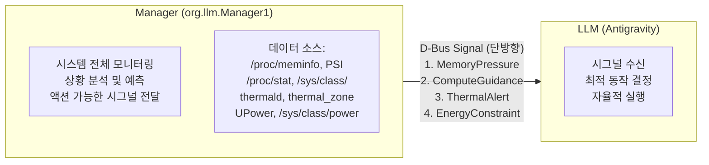
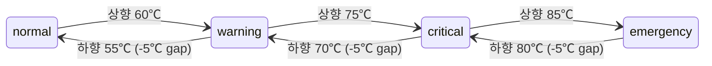
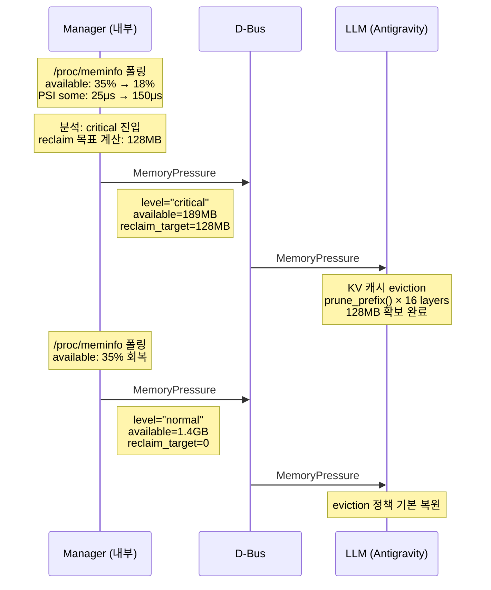
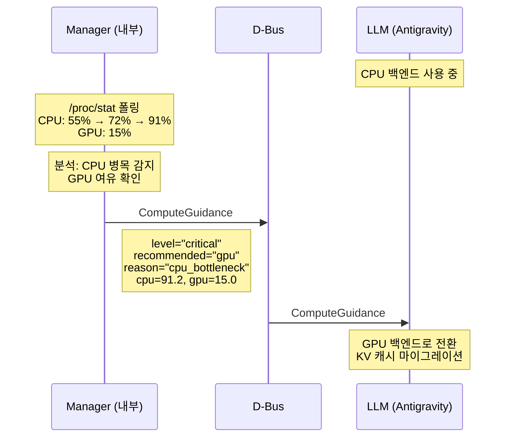
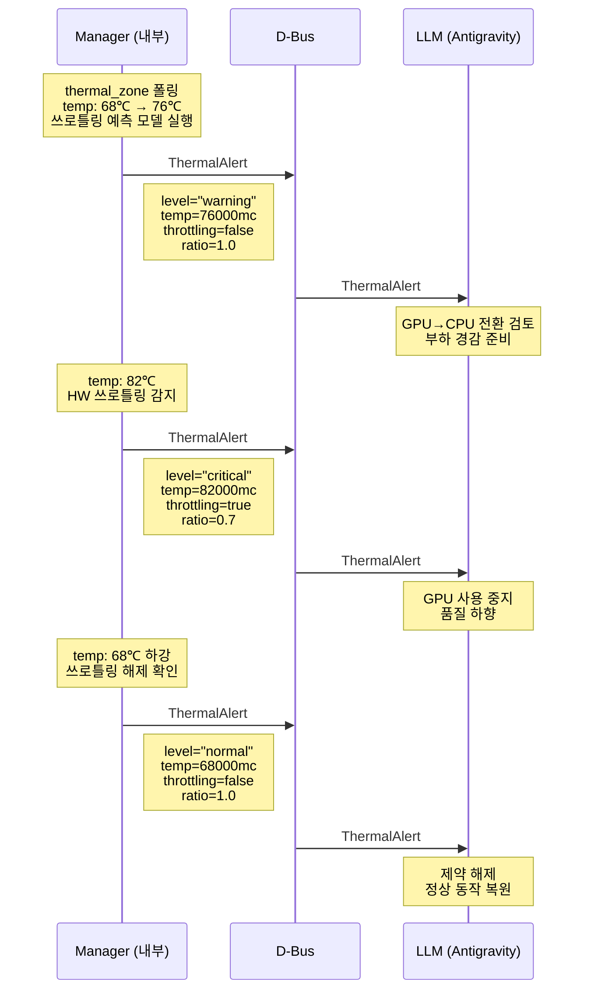
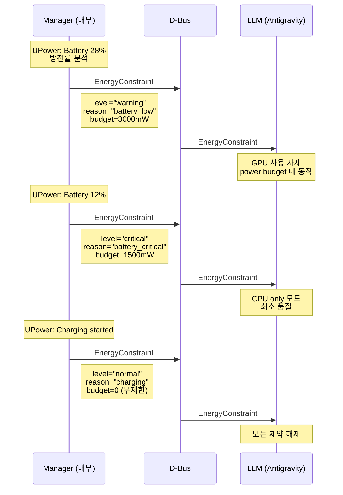
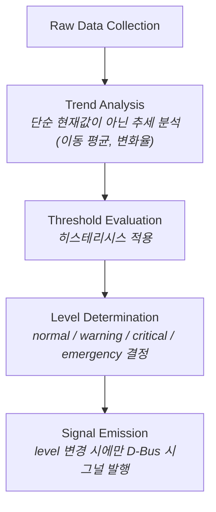

# D-Bus IPC Specification

> Phase 0 설계 문서 | Antigravity LLM Resilience System
> Version: 2.0 (redesigned)

## 1. Overview

임베디드 환경에서 LLM 추론의 resilience를 확보하기 위한 D-Bus IPC 인터페이스 명세.

### 1.1 핵심 전제

**Manager와 LLM의 역할 분리:**



- **Manager**: 시스템 리소스를 종합적으로 모니터링하고, 분석/예측 결과를 LLM에 전달
- **LLM**: Manager의 시그널만 수신하여 최적의 동작을 자율적으로 수행
- **단방향**: Manager → LLM 시그널만 존재. LLM은 수신만 함
- **LLM 전용**: Manager는 LLM 서빙에 특화된 전용 리소스 매니저

### 1.2 Design Principles

- **역할 분리**: Manager가 분석, LLM이 실행. LLM은 시스템 모니터링 로직을 모름
- **Minimal Overhead**: LLM은 시그널 수신만 하므로 추론 hot path에 영향 없음
- **Actionable Signals**: raw 데이터가 아닌, LLM이 즉시 행동할 수 있는 분석된 정보를 전달
- **Fail-Safe**: Manager가 죽어도 LLM은 독립적으로 추론 계속 가능

### 1.3 Bus Configuration

| 항목 | 값 |
|------|-----|
| **Bus Type** | System Bus |
| **Well-known Name** | `org.llm.Manager1` |
| **Object Path** | `/org/llm/Manager1` |
| **Interface** | `org.llm.Manager1` |

---

## 2. Signal Definitions

Manager가 LLM에 보내는 4개의 시그널.

모든 시그널은 `level` 필드를 공유하며, 상태 호전 시 `normal`을 보내어 LLM이 제약을 해제할 수 있도록 한다.

### 공통 Level 정의

| Level | 의미 | LLM의 일반적 반응 |
|-------|------|-------------------|
| `normal` | 정상 상태로 복귀 | 제약 해제, 원래 동작 복원 |
| `warning` | 임계 접근 중, 준비 필요 | 선제적 대응 준비 |
| `critical` | 임계 도달, 즉각 대응 필요 | 적극적 대응 실행 |
| `emergency` | 즉시 조치 불가 시 장애 발생 | 최대 수준 대응 |

---

### 2.1 MemoryPressure

OOM 발생 직전 상황을 알려, LLM이 KV 캐시를 줄일 수 있도록 한다.

```xml
<signal name="MemoryPressure">
  <arg name="level" type="s"/>
  <arg name="available_bytes" type="t"/>
  <arg name="reclaim_target_bytes" type="t"/>
</signal>
```

| Argument | Type | Description |
|----------|------|-------------|
| `level` | `s` | `"normal"`, `"warning"`, `"critical"`, `"emergency"` |
| `available_bytes` | `t` | 현재 사용 가능한 메모리 (bytes) |
| `reclaim_target_bytes` | `t` | LLM이 확보해야 하는 메모리 양 (bytes). Manager가 계산한 권장값 |

**Manager의 판단 기준 (내부 구현, LLM은 모름):**

| Level | Manager 내부 조건 (예시) | reclaim_target_bytes |
|-------|------------------------|---------------------|
| `normal` | available > 40% | 0 |
| `warning` | available 20~40% | 예상 부족분의 25% |
| `critical` | available 10~20% | 예상 부족분의 50% |
| `emergency` | available < 10% 또는 PSI critical | 가능한 최대 |

**LLM의 예상 반응:**

| Level | 반응 |
|-------|------|
| `normal` | eviction 정책을 기본으로 복원 |
| `warning` | 보수적 eviction 준비 (target_ratio 조정) |
| `critical` | 적극적 KV 캐시 eviction 실행 |
| `emergency` | 긴급 eviction + 신규 추론 거부 |

---

### 2.2 ComputeGuidance

CPU 또는 GPU에 병목이 발생하여, LLM이 어떤 연산 HW를 사용해야 하는지 안내한다.

```xml
<signal name="ComputeGuidance">
  <arg name="level" type="s"/>
  <arg name="recommended_backend" type="s"/>
  <arg name="reason" type="s"/>
  <arg name="cpu_usage_pct" type="d"/>
  <arg name="gpu_usage_pct" type="d"/>
</signal>
```

| Argument | Type | Description |
|----------|------|-------------|
| `level` | `s` | `"normal"`, `"warning"`, `"critical"` |
| `recommended_backend` | `s` | `"cpu"`, `"gpu"`, `"any"` — Manager가 권장하는 백엔드 |
| `reason` | `s` | 권장 이유 (아래 표 참조) |
| `cpu_usage_pct` | `d` | 현재 시스템 전체 CPU 사용률 (0.0~100.0) |
| `gpu_usage_pct` | `d` | 현재 GPU 사용률 (0.0~100.0) |

**reason 값:**

| Reason | Description |
|--------|-------------|
| `cpu_bottleneck` | CPU 과부하. GPU 사용 권장 |
| `gpu_bottleneck` | GPU 과부하. CPU 사용 권장 |
| `cpu_available` | CPU 여유 있음. CPU 사용 가능 |
| `gpu_available` | GPU 여유 있음. GPU 사용 가능 |
| `both_loaded` | CPU/GPU 모두 부하 높음. 부하 축소 필요 |
| `balanced` | 균형 상태. 자유 선택 |

**LLM의 예상 반응:**

| Level | recommended_backend | 반응 |
|-------|--------------------|------|
| `normal` | `"any"` | 현재 백엔드 유지 |
| `warning` | `"gpu"` | GPU로 전환 준비 (다음 적절한 시점에) |
| `warning` | `"cpu"` | CPU로 전환 준비 |
| `critical` | `"gpu"` | 즉시 GPU로 전환 (KV 캐시 마이그레이션) |
| `critical` | `"cpu"` | 즉시 CPU로 전환 |
| `critical` | `"any"` (both_loaded) | 추론 속도 제한 (throttle) |

---

### 2.3 ThermalAlert

발열로 인한 쓰로틀링 발생 예측 및 실제 발생 상황을 안내한다.

```xml
<signal name="ThermalAlert">
  <arg name="level" type="s"/>
  <arg name="temperature_mc" type="i"/>
  <arg name="throttling_active" type="b"/>
  <arg name="throttle_ratio" type="d"/>
</signal>
```

| Argument | Type | Description |
|----------|------|-------------|
| `level` | `s` | `"normal"`, `"warning"`, `"critical"`, `"emergency"` |
| `temperature_mc` | `i` | 현재 온도 (millidegrees Celsius, 예: 75000 = 75.0℃) |
| `throttling_active` | `b` | HW 쓰로틀링이 현재 발생 중인지 여부 |
| `throttle_ratio` | `d` | 예상/현재 쓰로틀링 비율. 1.0 = 쓰로틀 없음, 0.5 = 절반 성능 |

**Level 의미:**

| Level | 의미 |
|-------|------|
| `normal` | 온도 정상. 쓰로틀링 없음 |
| `warning` | 온도 상승 중. **쓰로틀링이 곧 발생할 것으로 예측** |
| `critical` | **쓰로틀링 발생 중**. 성능 저하 진행 |
| `emergency` | 온도 위험. 시스템 보호를 위해 즉각 부하 감소 필요 |

**LLM의 예상 반응:**

| Level | throttling_active | 반응 |
|-------|-------------------|------|
| `normal` | false | 제약 해제, 정상 동작 |
| `warning` | false | GPU→CPU 전환 검토, 부하 경감 준비 |
| `critical` | true | GPU 사용 중지, 품질 하향, 생성 속도 제한 |
| `emergency` | true | 추론 일시 중단 (pause) |

---

### 2.4 EnergyConstraint

에너지 소모가 높은 경우 경고하고 제약 수준을 안내한다.

```xml
<signal name="EnergyConstraint">
  <arg name="level" type="s"/>
  <arg name="reason" type="s"/>
  <arg name="power_budget_mw" type="u"/>
</signal>
```

| Argument | Type | Description |
|----------|------|-------------|
| `level` | `s` | `"normal"`, `"warning"`, `"critical"`, `"emergency"` |
| `reason` | `s` | 에너지 제약 원인 (아래 표 참조) |
| `power_budget_mw` | `u` | LLM에 허용된 전력 예산 (milliwatts). 0 = 제한 없음 |

**reason 값:**

| Reason | Description |
|--------|-------------|
| `battery_low` | 배터리 잔량 부족 |
| `battery_critical` | 배터리 위험 수준 |
| `power_limit` | 시스템 전력 한도 초과 |
| `thermal_power` | 발열로 인한 전력 제한 (thermal와 연계) |
| `charging` | 충전 중 — 제약 해제 가능 |
| `none` | 제약 없음 (normal 복귀 시) |

**LLM의 예상 반응:**

| Level | 반응 |
|-------|------|
| `normal` | 전력 제약 없음, 정상 동작 |
| `warning` | GPU 사용 자제, power_budget_mw 내에서 동작 |
| `critical` | CPU only 모드, 최소 품질, 생성 토큰 수 제한 |
| `emergency` | 신규 추론 거부, 진행 중인 추론 즉시 종료 |

---

## 3. Signal Timing and Delivery

### 3.1 시그널 발행 시점

| Signal | 발행 조건 |
|--------|----------|
| `MemoryPressure` | level 변경 시 + critical/emergency에서는 주기적 반복 (1초) |
| `ComputeGuidance` | level 변경 시 + recommended_backend 변경 시 |
| `ThermalAlert` | level 변경 시 + throttling_active 변경 시 |
| `EnergyConstraint` | level 변경 시 |

### 3.2 Hysteresis (히스테리시스)

상태 전환 시 진동(oscillation) 방지를 위해, 상향/하향 임계값을 다르게 설정:



Manager가 히스테리시스 로직을 내부적으로 처리. LLM은 수신한 level만 신뢰하면 됨.

### 3.3 초기 상태

LLM이 시작될 때 Manager에 연결하면, Manager는 현재 상태를 4개 시그널 모두 즉시 발행.
LLM은 별도 조회 없이 시그널 수신으로 초기 상태를 파악.

---

## 4. Event Flow Diagrams

### 4.1 Memory OOM 직전 → KV 캐시 축소



### 4.2 CPU 병목 → 백엔드 전환 가이드



### 4.3 발열 경고 → 쓰로틀링 예측 → 실제 쓰로틀링



### 4.4 에너지 제약 → 단계적 제약



---

## 5. D-Bus Introspection XML

```xml
<!DOCTYPE node PUBLIC "-//freedesktop//DTD D-BUS Object Introspection 1.0//EN"
 "http://www.freedesktop.org/standards/dbus/1.0/introspect.dtd">
<node name="/org/llm/Manager1">
  <interface name="org.llm.Manager1">

    <signal name="MemoryPressure">
      <arg name="level" type="s"/>
      <arg name="available_bytes" type="t"/>
      <arg name="reclaim_target_bytes" type="t"/>
    </signal>

    <signal name="ComputeGuidance">
      <arg name="level" type="s"/>
      <arg name="recommended_backend" type="s"/>
      <arg name="reason" type="s"/>
      <arg name="cpu_usage_pct" type="d"/>
      <arg name="gpu_usage_pct" type="d"/>
    </signal>

    <signal name="ThermalAlert">
      <arg name="level" type="s"/>
      <arg name="temperature_mc" type="i"/>
      <arg name="throttling_active" type="b"/>
      <arg name="throttle_ratio" type="d"/>
    </signal>

    <signal name="EnergyConstraint">
      <arg name="level" type="s"/>
      <arg name="reason" type="s"/>
      <arg name="power_budget_mw" type="u"/>
    </signal>

  </interface>
</node>
```

---

## 6. D-Bus Configuration

### 6.1 Manager Policy File

`/etc/dbus-1/system.d/org.llm.Manager1.conf`:

```xml
<?xml version="1.0" encoding="UTF-8"?>
<!DOCTYPE busconfig PUBLIC
 "-//freedesktop//DTD D-BUS Bus Configuration 1.0//EN"
 "http://www.freedesktop.org/standards/dbus/1.0/busconfig.dtd">
<busconfig>
  <!-- Manager가 이름을 소유하고 시그널을 발행할 수 있도록 허용 -->
  <policy user="llm-manager">
    <allow own="org.llm.Manager1"/>
    <allow send_destination="org.llm.Manager1"/>
    <allow send_interface="org.llm.Manager1"/>
    <!-- signals are emitted on the org.llm.Manager1 interface directly -->
  </policy>

  <!-- 모든 사용자가 Manager의 시그널을 수신할 수 있도록 허용 -->
  <policy context="default">
    <allow receive_sender="org.llm.Manager1"/>
  </policy>

  <!-- Manager가 시스템 서비스 시그널을 수신할 수 있도록 허용 -->
  <policy user="llm-manager">
    <allow receive_sender="org.freedesktop.thermald"/>
    <allow receive_sender="org.freedesktop.UPower"/>
    <allow receive_sender="org.freedesktop.systemd1"/>
  </policy>
</busconfig>
```

### 6.2 Systemd Service Unit

`/etc/systemd/system/llm-manager.service`:

```ini
[Unit]
Description=LLM Resource Manager - System monitor for LLM inference resilience
After=dbus.service thermald.service upower.service
Requires=dbus.service

[Service]
Type=dbus
BusName=org.llm.Manager1
ExecStart=/usr/local/bin/llm-manager
User=llm-manager
Group=llm-manager
Restart=always
RestartSec=3

# Manager 자체는 가벼워야 함
MemoryMax=64M
CPUQuota=5%

[Install]
WantedBy=multi-user.target
```

---

## 7. Manager Internal Architecture (참고)

LLM은 Manager의 내부 구현을 알 필요가 없으나, 스펙 문서의 완전성을 위해 기술.

### 7.1 Manager의 데이터 소스

| 리소스 | 소스 | 수집 방법 |
|--------|------|----------|
| 메모리 | `/proc/meminfo`, `/proc/pressure/memory` (PSI) | 주기적 폴링 (1초) |
| CPU | `/proc/stat` | 주기적 폴링 (1초) |
| GPU | `/sys/class/devfreq/`, vendor sysfs | 주기적 폴링 (1초) |
| 온도 | `/sys/class/thermal/thermal_zone*/temp`, thermald D-Bus | 폴링 + D-Bus 수신 |
| 배터리 | UPower D-Bus (`PropertiesChanged`) | D-Bus 수신 |
| 전력 | `/sys/class/power_supply/`, UPower | 폴링 + D-Bus 수신 |

### 7.2 Manager의 분석 로직 (개념)



### 7.3 Manager 설정 파일

`/etc/llm-manager/config.toml`:

```toml
[monitor]
poll_interval_ms = 1000

[memory]
warning_available_pct = 40
critical_available_pct = 20
emergency_available_pct = 10
hysteresis_pct = 5

[compute]
cpu_warning_pct = 70
cpu_critical_pct = 90
gpu_warning_pct = 70
gpu_critical_pct = 90
hysteresis_pct = 5

[thermal]
warning_temp_mc = 60000     # 60℃ in millidegrees
critical_temp_mc = 75000
emergency_temp_mc = 85000
hysteresis_mc = 5000
# thermald D-Bus 수신도 가능. trip point와 연동
use_thermald = true

[energy]
warning_battery_pct = 30
critical_battery_pct = 15
emergency_battery_pct = 5
# 전력 예산 (milliwatts)
warning_power_budget_mw = 3000
critical_power_budget_mw = 1500
emergency_power_budget_mw = 500
ignore_when_charging = true
```

---

## 8. LLM Side: Signal Reception Contract

LLM이 지켜야 하는 시그널 수신 규약.

### 8.1 수신 방법

LLM은 System Bus에서 다음 match rule로 4개 시그널을 구독:

```
type='signal', sender='org.llm.Manager1', interface='org.llm.Manager1'
```

### 8.2 수신 보장

- LLM은 시그널을 **비동기로** 수신하여 추론 루프를 블로킹하지 않아야 함
- 시그널 수신 실패 시 LLM은 직전 상태를 유지 (안전 방향)
- Manager 연결 불가 시 LLM은 모든 level을 `normal`로 간주하고 독립 동작

### 8.3 Level 전이 규칙

LLM은 수신한 level에 대해:

1. **상향 전이** (normal→warning→critical→emergency): **즉시 반응**
2. **하향 전이** (emergency→critical→warning→normal): **지연 반응 허용** (안정성 확보를 위해 LLM 자체적으로 지연 가능)
3. **동일 level 재수신**: 무시하거나 상태 갱신만 (MemoryPressure의 reclaim_target 등 변경 가능)

---

## 9. Versioning

- 인터페이스 이름에 버전 포함: `org.llm.Manager1`
- 시그널 인자 추가는 하위 호환 (기존 클라이언트는 추가 인자 무시)
- 시그널 삭제 또는 인자 타입 변경 시 `org.llm.Manager2`로 버전업
