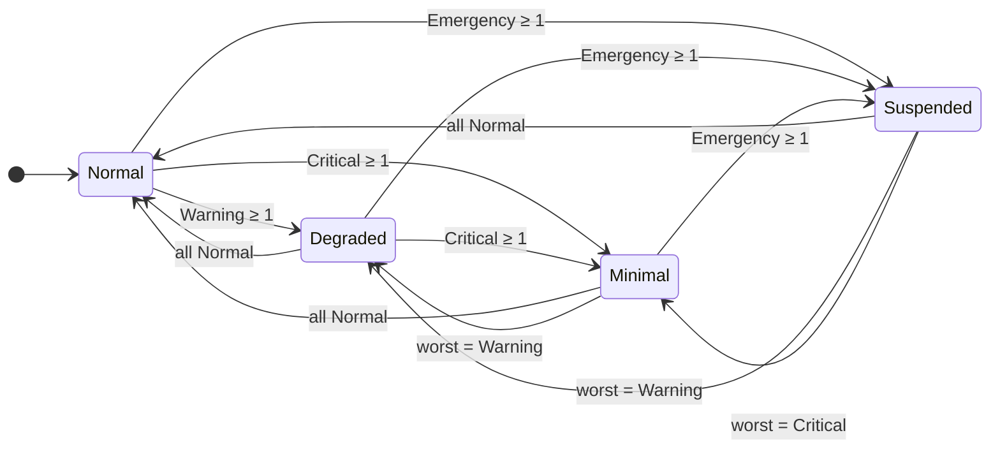
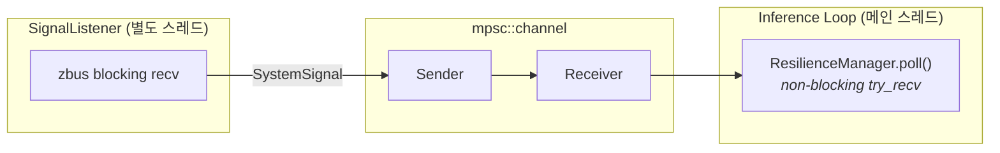
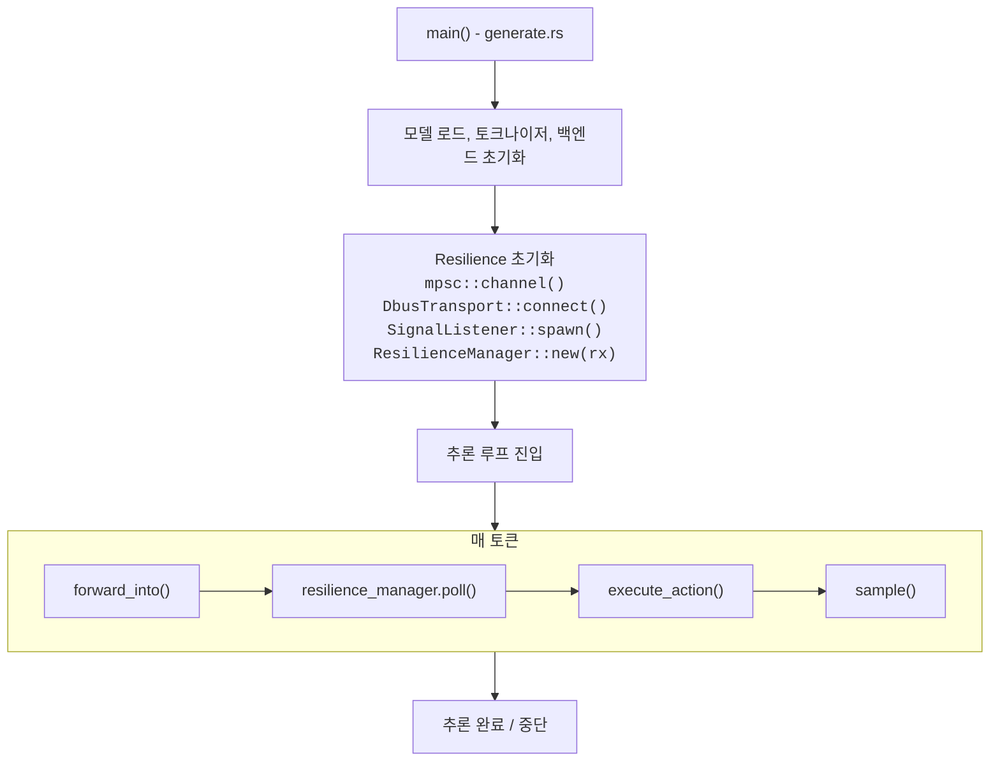
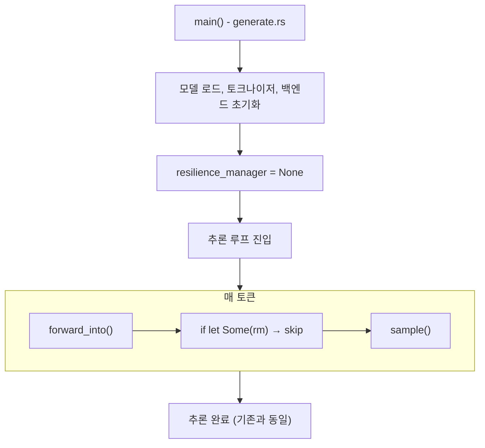
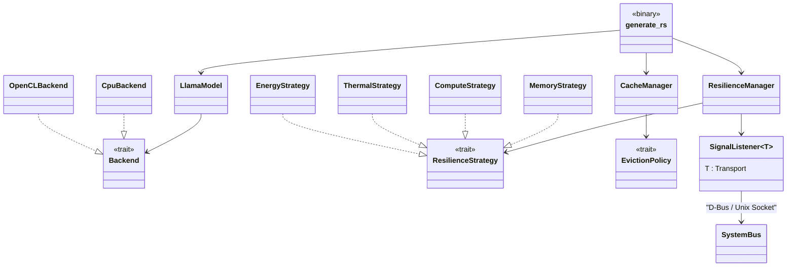

# Resilience Architecture

> Phase 0 설계 문서 | LLM 내부 시그널 수신 및 반응 아키텍처

## 1. Overview

Manager로부터 수신한 D-Bus 시그널에 대해 LLM이 내부적으로 어떻게 반응하는지를 정의한다.

### 1.1 핵심 원칙

- **비침습적 통합**: 기존 추론 루프(`generate.rs`)의 구조를 최소한으로 변경
- **Non-blocking**: 시그널 수신이 추론 hot path를 블로킹하지 않음
- **기존 코드 재활용**: `CacheManager`, `EvictionPolicy`, `Backend` trait를 그대로 활용
- **Strategy 패턴**: 시그널별 반응 전략을 독립적인 trait 구현체로 분리
- **Fail-open**: Resilience 모듈 장애 시 추론은 정상 계속

### 1.2 현재 코드베이스와의 관계

| 기존 컴포넌트 | 역할 | Resilience와의 관계 |
|---|---|---|
| `CacheManager` | 메모리 기반 KV eviction | ResilienceManager가 target_ratio를 동적 조정 |
| `EvictionPolicy` | eviction 전략 (sliding window 등) | 그대로 사용. Resilience는 "언제/얼마나" 를 조정 |
| `Backend` trait | CPU/GPU 연산 추상화 | Resilience가 백엔드 전환을 지시 |
| `SystemMonitor` | /proc/meminfo 폴링 | D-Bus 시그널로 대체/보완 가능 |
| `generate.rs` 추론 루프 | 토큰 단위 생성 | 루프 내 체크포인트에서 ResilienceManager 호출 |

---

## 2. Module Structure

```
src/
├── lib.rs                    # + pub mod resilience;
├── resilience/
│   ├── mod.rs                # 모듈 exports
│   ├── signal.rs             # D-Bus 시그널 타입 정의 (Rust enum)
│   ├── state.rs              # 운영 모드 상태 머신
│   ├── manager.rs            # ResilienceManager (중앙 조율)
│   ├── transport.rs          # Transport trait + SignalListener<T> (수신 스레드)
│   ├── dbus_transport.rs    # DbusTransport (zbus blocking, Transport 구현)
│   └── strategy/
│       ├── mod.rs            # ResilienceStrategy trait
│       ├── memory.rs         # MemoryPressure 반응
│       ├── compute.rs        # ComputeGuidance 반응
│       ├── thermal.rs        # ThermalAlert 반응
│       └── energy.rs         # EnergyConstraint 반응
```

---

## 3. Signal Types (signal.rs)

D-Bus 시그널을 Rust 타입으로 매핑한다. 이 타입들은 D-Bus 의존성 없이 사용 가능하다.

```rust
/// 공통 심각도 수준. 모든 시그널이 공유.
#[derive(Debug, Clone, Copy, PartialEq, Eq, PartialOrd, Ord)]
pub enum Level {
    Normal,
    Warning,
    Critical,
    Emergency,
}

#[derive(Debug, Clone)]
pub enum SystemSignal {
    MemoryPressure {
        level: Level,
        available_bytes: u64,
        reclaim_target_bytes: u64,
    },
    ComputeGuidance {
        level: Level,
        recommended_backend: RecommendedBackend,
        reason: ComputeReason,
        cpu_usage_pct: f64,
        gpu_usage_pct: f64,
    },
    ThermalAlert {
        level: Level,
        temperature_mc: i32,
        throttling_active: bool,
        throttle_ratio: f64,
    },
    EnergyConstraint {
        level: Level,
        reason: EnergyReason,
        power_budget_mw: u32,
    },
}

#[derive(Debug, Clone, Copy, PartialEq, Eq)]
pub enum RecommendedBackend {
    Cpu,
    Gpu,
    Any,
}

#[derive(Debug, Clone, Copy, PartialEq, Eq)]
pub enum ComputeReason {
    CpuBottleneck,
    GpuBottleneck,
    CpuAvailable,
    GpuAvailable,
    BothLoaded,
    Balanced,
}

#[derive(Debug, Clone, Copy, PartialEq, Eq)]
pub enum EnergyReason {
    BatteryLow,
    BatteryCritical,
    PowerLimit,
    ThermalPower,
    Charging,
    None,
}
```

---

## 4. Operating Mode State Machine (state.rs)

LLM의 운영 상태를 상태 머신으로 관리한다. 시그널 수신 시 상태가 전이되며,
각 상태에서 허용되는 동작이 달라진다.

### 4.1 상태 정의

```rust
#[derive(Debug, Clone, Copy, PartialEq, Eq)]
pub enum OperatingMode {
    /// 정상 동작. 모든 기능 사용 가능.
    Normal,
    /// 경감 모드. 일부 리소스 제약 적용.
    /// (예: GPU 자제, 보수적 eviction)
    Degraded,
    /// 최소 모드. 최소 리소스로 동작.
    /// (예: CPU only, 적극적 eviction, 품질 하향)
    Minimal,
    /// 일시 중단. 추론 일시 정지.
    /// (예: emergency thermal, emergency memory)
    Suspended,
}
```

### 4.2 상태 전이 다이어그램



### 4.3 전이 조건

상태 전이는 4개 시그널의 level 조합으로 결정된다.

```rust
impl OperatingMode {
    /// 4개 시그널의 level을 종합하여 운영 모드를 결정.
    /// 가장 심각한 시그널이 모드를 결정한다.
    pub fn from_levels(
        memory: Level,
        compute: Level,
        thermal: Level,
        energy: Level,
    ) -> Self {
        let worst = memory.max(compute).max(thermal).max(energy);
        match worst {
            Level::Normal => OperatingMode::Normal,
            Level::Warning => OperatingMode::Degraded,
            Level::Critical => OperatingMode::Minimal,
            Level::Emergency => OperatingMode::Suspended,
        }
    }
}
```

### 4.4 모드별 동작 제약

| 항목 | Normal | Degraded | Minimal | Suspended |
|------|--------|----------|---------|-----------|
| 백엔드 | auto | 시그널 따름 | CPU only | — |
| KV eviction | 기본 정책 | 보수적 축소 | 적극적 축소 | — |
| 신규 추론 | 허용 | 허용 | 허용 (제한적) | 거부 |
| 생성 토큰 수 | 제한 없음 | 제한 없음 | 축소 | 0 |
| GPU 사용 | 허용 | 조건부 | 금지 | — |

---

## 5. ResilienceManager (manager.rs)

시그널 수신 채널과 전략을 조율하는 중앙 컴포넌트.

### 5.1 구조

```rust
use std::sync::mpsc;

pub struct ResilienceManager {
    /// D-Bus 리스너로부터 시그널을 수신하는 채널.
    rx: mpsc::Receiver<SystemSignal>,

    /// 현재 운영 모드.
    mode: OperatingMode,

    /// 각 시그널의 최신 level 캐시.
    current_levels: SignalLevels,

    /// 시그널별 전략.
    strategies: Strategies,
}

/// 4개 시그널의 최신 level.
struct SignalLevels {
    memory: Level,
    compute: Level,
    thermal: Level,
    energy: Level,
}

/// 시그널별 전략 구현체.
struct Strategies {
    memory: Box<dyn ResilienceStrategy>,
    compute: Box<dyn ResilienceStrategy>,
    thermal: Box<dyn ResilienceStrategy>,
    energy: Box<dyn ResilienceStrategy>,
}
```

### 5.2 핵심 메서드

```rust
impl ResilienceManager {
    /// 비차단(non-blocking)으로 채널에서 시그널을 모두 꺼내고,
    /// 필요한 액션을 반환한다.
    ///
    /// 추론 루프에서 매 토큰 생성 후 호출.
    pub fn poll(&mut self) -> Vec<ResilienceAction> {
        let mut actions = Vec::new();

        // 1. 채널에서 대기 중인 시그널을 모두 drain (non-blocking)
        while let Ok(signal) = self.rx.try_recv() {
            self.process_signal(signal, &mut actions);
        }

        actions
    }

    fn process_signal(&mut self, signal: SystemSignal, actions: &mut Vec<ResilienceAction>) {
        // 2. level 캐시 갱신
        let new_level = match &signal {
            SystemSignal::MemoryPressure { level, .. } => {
                self.current_levels.memory = *level;
                *level
            }
            SystemSignal::ComputeGuidance { level, .. } => {
                self.current_levels.compute = *level;
                *level
            }
            SystemSignal::ThermalAlert { level, .. } => {
                self.current_levels.thermal = *level;
                *level
            }
            SystemSignal::EnergyConstraint { level, .. } => {
                self.current_levels.energy = *level;
                *level
            }
        };

        // 3. 운영 모드 재계산
        let new_mode = OperatingMode::from_levels(
            self.current_levels.memory,
            self.current_levels.compute,
            self.current_levels.thermal,
            self.current_levels.energy,
        );

        let mode_changed = new_mode != self.mode;
        self.mode = new_mode;

        // 4. 해당 시그널의 전략에 액션 요청
        let strategy_actions = match &signal {
            SystemSignal::MemoryPressure { .. } =>
                self.strategies.memory.react(&signal, self.mode),
            SystemSignal::ComputeGuidance { .. } =>
                self.strategies.compute.react(&signal, self.mode),
            SystemSignal::ThermalAlert { .. } =>
                self.strategies.thermal.react(&signal, self.mode),
            SystemSignal::EnergyConstraint { .. } =>
                self.strategies.energy.react(&signal, self.mode),
        };

        actions.extend(strategy_actions);
    }
}
```

### 5.3 추론 루프 통합

기존 `generate.rs` 추론 루프에 최소한의 변경으로 통합한다.

```
기존 추론 루프 (generate.rs):
  for _ in 0..num_tokens {
      model.forward_into(..., cache_manager)?;   // ← 기존 eviction
      sample();
      start_pos += 1;
  }

변경 후:
  for _ in 0..num_tokens {
      model.forward_into(..., cache_manager)?;   // ← 기존 eviction 유지

      // ── Resilience 체크포인트 (추가) ──
      if let Some(ref mut rm) = resilience_manager {
          for action in rm.poll() {
              execute_action(action, &mut kv_caches, &backend, ...);
          }
          if rm.mode() == OperatingMode::Suspended {
              break;  // 추론 중단
          }
      }

      sample();
      start_pos += 1;
  }
```

변경량: **추론 루프에 약 10줄 추가**. 기존 `model.forward_into()`, `CacheManager` 코드는 수정 없음.

---

## 6. ResilienceStrategy Trait (strategy/mod.rs)

```rust
/// 시그널에 대한 반응 전략 인터페이스.
///
/// 기존 EvictionPolicy 패턴과 동일한 Strategy 패턴 적용.
pub trait ResilienceStrategy: Send + Sync {
    /// 시그널을 받아 실행할 액션 목록을 반환.
    /// 빈 Vec이면 아무 동작 안 함.
    fn react(
        &mut self,
        signal: &SystemSignal,
        mode: OperatingMode,
    ) -> Vec<ResilienceAction>;

    /// 전략 이름 (로깅용).
    fn name(&self) -> &str;
}
```

### 6.1 ResilienceAction

전략이 반환하는 액션 열거형. 추론 루프가 이를 해석하여 실행한다.

```rust
#[derive(Debug, Clone)]
pub enum ResilienceAction {
    /// KV 캐시 eviction 실행.
    /// target_ratio: 현재 캐시 대비 목표 비율 (0.0~1.0).
    Evict { target_ratio: f32 },

    /// 백엔드 전환.
    SwitchBackend { to: RecommendedBackend },

    /// 생성 토큰 수 상한 변경.
    LimitTokens { max_tokens: usize },

    /// 토큰 생성 간 딜레이 삽입 (ms).
    Throttle { delay_ms: u64 },

    /// 추론 일시 중단.
    Suspend,

    /// 신규 추론 거부 플래그 설정.
    RejectNew,

    /// 이전 제약 해제 (normal 복귀 시).
    RestoreDefaults,
}
```

---

## 7. Strategy Implementations

### 7.1 MemoryStrategy (strategy/memory.rs)

`MemoryPressure` 시그널에 반응하여 KV 캐시 eviction을 제어.

```rust
pub struct MemoryStrategy {
    /// 직전 level (중복 방지).
    last_level: Level,
}

impl ResilienceStrategy for MemoryStrategy {
    fn react(&mut self, signal: &SystemSignal, _mode: OperatingMode) -> Vec<ResilienceAction> {
        let SystemSignal::MemoryPressure {
            level, reclaim_target_bytes, ..
        } = signal else { return vec![] };

        if *level == self.last_level && *level == Level::Normal {
            return vec![];
        }
        self.last_level = *level;

        match level {
            Level::Normal => vec![ResilienceAction::RestoreDefaults],
            Level::Warning => vec![
                ResilienceAction::Evict { target_ratio: 0.85 },
            ],
            Level::Critical => vec![
                ResilienceAction::Evict { target_ratio: 0.50 },
            ],
            Level::Emergency => vec![
                ResilienceAction::Evict { target_ratio: 0.25 },
                ResilienceAction::RejectNew,
            ],
        }
    }

    fn name(&self) -> &str { "memory" }
}
```

**기존 CacheManager와의 관계:**
- `CacheManager::maybe_evict()`는 기존처럼 매 토큰마다 호출 (변경 없음)
- `MemoryStrategy`는 D-Bus 시그널 수신 시 `target_ratio`를 **동적으로 조정**
- 두 메커니즘이 병행: CacheManager = 로컬 메모리 기반, MemoryStrategy = Manager의 시스템 전체 분석 기반

### 7.2 ComputeStrategy (strategy/compute.rs)

`ComputeGuidance` 시그널에 반응하여 백엔드 전환을 제어.

```rust
pub struct ComputeStrategy {
    current_backend: RecommendedBackend,
}

impl ResilienceStrategy for ComputeStrategy {
    fn react(&mut self, signal: &SystemSignal, _mode: OperatingMode) -> Vec<ResilienceAction> {
        let SystemSignal::ComputeGuidance {
            level, recommended_backend, ..
        } = signal else { return vec![] };

        match level {
            Level::Normal => {
                self.current_backend = RecommendedBackend::Any;
                vec![ResilienceAction::RestoreDefaults]
            }
            Level::Warning => {
                // 준비만. 다음 적절한 시점에 전환.
                self.current_backend = *recommended_backend;
                vec![]  // 아직 전환하지 않음
            }
            Level::Critical => {
                if *recommended_backend != self.current_backend {
                    self.current_backend = *recommended_backend;
                    vec![ResilienceAction::SwitchBackend { to: *recommended_backend }]
                } else {
                    // 이미 권장 백엔드. 추가로 throttle.
                    vec![ResilienceAction::Throttle { delay_ms: 50 }]
                }
            }
            _ => vec![],
        }
    }

    fn name(&self) -> &str { "compute" }
}
```

**기존 generate_hybrid.rs와의 관계:**
- `generate_hybrid`의 임계값 기반 전환은 기존 유지
- `ComputeStrategy`는 **Manager의 시스템 분석에 기반한 전환**을 추가
- 두 전환이 충돌할 경우 Resilience가 우선 (시스템 전체 관점이므로)

### 7.3 ThermalStrategy (strategy/thermal.rs)

`ThermalAlert` 시그널에 반응하여 부하를 경감.

```rust
pub struct ThermalStrategy;

impl ResilienceStrategy for ThermalStrategy {
    fn react(&mut self, signal: &SystemSignal, _mode: OperatingMode) -> Vec<ResilienceAction> {
        let SystemSignal::ThermalAlert {
            level, throttle_ratio, ..
        } = signal else { return vec![] };

        match level {
            Level::Normal => vec![ResilienceAction::RestoreDefaults],
            Level::Warning => vec![
                ResilienceAction::SwitchBackend { to: RecommendedBackend::Cpu },
            ],
            Level::Critical => {
                // 쓰로틀링 비율에 비례한 딜레이 삽입
                let delay = ((1.0 - throttle_ratio) * 100.0) as u64;
                vec![
                    ResilienceAction::SwitchBackend { to: RecommendedBackend::Cpu },
                    ResilienceAction::Throttle { delay_ms: delay },
                    ResilienceAction::LimitTokens { max_tokens: 64 },
                ]
            }
            Level::Emergency => vec![ResilienceAction::Suspend],
        }
    }

    fn name(&self) -> &str { "thermal" }
}
```

### 7.4 EnergyStrategy (strategy/energy.rs)

`EnergyConstraint` 시그널에 반응하여 전력 예산을 준수.

```rust
pub struct EnergyStrategy;

impl ResilienceStrategy for EnergyStrategy {
    fn react(&mut self, signal: &SystemSignal, _mode: OperatingMode) -> Vec<ResilienceAction> {
        let SystemSignal::EnergyConstraint {
            level, ..
        } = signal else { return vec![] };

        match level {
            Level::Normal => vec![ResilienceAction::RestoreDefaults],
            Level::Warning => vec![
                ResilienceAction::SwitchBackend { to: RecommendedBackend::Cpu },
            ],
            Level::Critical => vec![
                ResilienceAction::SwitchBackend { to: RecommendedBackend::Cpu },
                ResilienceAction::LimitTokens { max_tokens: 64 },
                ResilienceAction::Throttle { delay_ms: 30 },
            ],
            Level::Emergency => vec![
                ResilienceAction::Suspend,
                ResilienceAction::RejectNew,
            ],
        }
    }

    fn name(&self) -> &str { "energy" }
}
```

---

## 8. Signal Listener (transport.rs)

`Transport` trait를 통해 시그널 수신 방식을 추상화하고, `SignalListener<T: Transport>`가 별도 스레드에서 수신하여 `mpsc::Sender`로 전달.

### 8.1 구조

```rust
use std::sync::mpsc;

/// 시그널 수신 Transport 추상화.
pub trait Transport: Send + 'static {
    /// 블로킹 수신. 시그널을 하나 받아 반환.
    fn recv(&mut self) -> anyhow::Result<SystemSignal>;
}

/// Transport를 래핑하는 시그널 리스너. 별도 스레드에서 실행.
pub struct SignalListener<T: Transport> {
    transport: T,
    tx: mpsc::Sender<SystemSignal>,
}

impl<T: Transport> SignalListener<T> {
    pub fn new(transport: T, tx: mpsc::Sender<SystemSignal>) -> Self {
        Self { transport, tx }
    }

    /// 별도 스레드에서 시그널 수신 루프를 시작.
    /// Transport 에러 시 로그 후 종료 (fail-open).
    pub fn spawn(self) -> std::thread::JoinHandle<()> {
        std::thread::spawn(move || {
            let mut listener = self;
            loop {
                match listener.transport.recv() {
                    Ok(signal) => {
                        if listener.tx.send(signal).is_err() {
                            break; // receiver dropped
                        }
                    }
                    Err(e) => {
                        log::warn!("Signal listener exited: {}. LLM continues without resilience.", e);
                        break;
                    }
                }
            }
        })
    }
}
```

`DbusTransport`는 `Transport` trait을 구현하며, zbus blocking으로 D-Bus System Bus에서 시그널을 수신합니다 (`dbus_transport.rs`).

### 8.2 스레드 모델



- D-Bus 리스너는 **별도 스레드**에서 blocking으로 시그널을 대기
- `mpsc::Sender`로 `SystemSignal`을 전송
- 추론 루프는 `mpsc::Receiver::try_recv()`로 **non-blocking** 수신
- 채널이 끊기면 (리스너 스레드 종료) `try_recv()`가 `Err`를 반환 → 무시

---

## 9. Action Executor

`ResilienceAction`을 실제로 실행하는 함수. 추론 루프에서 호출된다.

```rust
/// 추론 루프의 가변 상태를 묶은 컨텍스트.
pub struct InferenceContext<'a> {
    pub kv_caches: &'a mut [KVCache],
    pub backend: &'a mut Arc<dyn Backend>,
    pub max_tokens: &'a mut usize,
    pub throttle_delay_ms: &'a mut u64,
    pub suspended: &'a mut bool,
    pub reject_new: &'a mut bool,
}

pub fn execute_action(action: ResilienceAction, ctx: &mut InferenceContext) {
    match action {
        ResilienceAction::Evict { target_ratio } => {
            // 기존 CacheManager의 eviction 로직 재활용
            let current_pos = ctx.kv_caches[0].current_pos;
            let target_len = ((current_pos as f32) * target_ratio) as usize;
            let target_len = target_len.max(1);
            for cache in ctx.kv_caches.iter_mut() {
                let _ = cache.prune_prefix(current_pos - target_len);
            }
        }
        ResilienceAction::SwitchBackend { to } => {
            // Phase 3b에서 구현.
            // generate_hybrid.rs의 KV 마이그레이션 로직 재활용.
            log::info!("[Resilience] Backend switch requested: {:?}", to);
        }
        ResilienceAction::LimitTokens { max_tokens } => {
            *ctx.max_tokens = (*ctx.max_tokens).min(max_tokens);
        }
        ResilienceAction::Throttle { delay_ms } => {
            *ctx.throttle_delay_ms = delay_ms;
        }
        ResilienceAction::Suspend => {
            *ctx.suspended = true;
        }
        ResilienceAction::RejectNew => {
            *ctx.reject_new = true;
        }
        ResilienceAction::RestoreDefaults => {
            *ctx.throttle_delay_ms = 0;
            *ctx.reject_new = false;
            // max_tokens는 원래 값으로 복원 (별도 저장 필요)
        }
    }
}
```

---

## 10. Conflict Resolution

여러 시그널이 동시에 도착하면 액션이 충돌할 수 있다.

### 10.1 충돌 유형 및 해결

| 충돌 | 예시 | 해결 규칙 |
|------|------|----------|
| 백엔드 충돌 | Compute → GPU, Thermal → CPU | **안전 우선**: CPU를 선택 (발열 우선) |
| Eviction 중복 | Memory + Thermal 모두 eviction | **더 공격적인 ratio** 적용 |
| Throttle 중복 | Thermal 50ms + Energy 30ms | **더 큰 delay** 적용 |
| Suspend vs Evict | Emergency thermal + Critical memory | **Suspend 우선** (eviction 무의미) |

### 10.2 구현

```rust
/// 여러 전략의 액션을 병합하여 충돌을 해결.
fn resolve_conflicts(actions: Vec<ResilienceAction>) -> Vec<ResilienceAction> {
    let mut resolved = Vec::new();
    let mut min_evict_ratio = 1.0f32;
    let mut max_delay = 0u64;
    let mut min_tokens = usize::MAX;
    let mut target_backend = None;
    let mut has_suspend = false;
    let mut has_reject = false;
    let mut has_restore = false;

    for action in actions {
        match action {
            ResilienceAction::Evict { target_ratio } => {
                min_evict_ratio = min_evict_ratio.min(target_ratio);
            }
            ResilienceAction::SwitchBackend { to } => {
                // CPU가 더 안전. GPU가 이미 선택되었더라도 CPU로 덮어쓴다.
                target_backend = Some(match (target_backend, to) {
                    (Some(RecommendedBackend::Cpu), _) => RecommendedBackend::Cpu,
                    (_, RecommendedBackend::Cpu) => RecommendedBackend::Cpu,
                    (_, other) => other,
                });
            }
            ResilienceAction::LimitTokens { max_tokens } => {
                min_tokens = min_tokens.min(max_tokens);
            }
            ResilienceAction::Throttle { delay_ms } => {
                max_delay = max_delay.max(delay_ms);
            }
            ResilienceAction::Suspend => has_suspend = true,
            ResilienceAction::RejectNew => has_reject = true,
            ResilienceAction::RestoreDefaults => has_restore = true,
        }
    }

    // Suspend가 있으면 다른 액션은 무의미
    if has_suspend {
        return vec![ResilienceAction::Suspend];
    }

    // RestoreDefaults는 다른 제약이 없을 때만
    if has_restore && min_evict_ratio >= 1.0 && max_delay == 0
        && min_tokens == usize::MAX && target_backend.is_none() && !has_reject {
        return vec![ResilienceAction::RestoreDefaults];
    }

    // 병합된 액션 생성
    if min_evict_ratio < 1.0 {
        resolved.push(ResilienceAction::Evict { target_ratio: min_evict_ratio });
    }
    if let Some(backend) = target_backend {
        resolved.push(ResilienceAction::SwitchBackend { to: backend });
    }
    if min_tokens < usize::MAX {
        resolved.push(ResilienceAction::LimitTokens { max_tokens: min_tokens });
    }
    if max_delay > 0 {
        resolved.push(ResilienceAction::Throttle { delay_ms: max_delay });
    }
    if has_reject {
        resolved.push(ResilienceAction::RejectNew);
    }

    resolved
}
```

---

## 11. Initialization Flow

### 11.1 Resilience 활성화 시



### 11.2 Resilience 비활성화 시 (D-Bus 없음)



feature flag `resilience`로 컴파일 타임에도 제어 가능:
```toml
[features]
default = ["opencl"]
resilience = ["zbus"]
```

---

## 12. Testing Strategy

### 12.1 Unit Test: Strategy 독립 테스트

```rust
#[test]
fn test_memory_strategy_critical() {
    let mut strategy = MemoryStrategy::new();
    let signal = SystemSignal::MemoryPressure {
        level: Level::Critical,
        available_bytes: 100 * 1024 * 1024,
        reclaim_target_bytes: 50 * 1024 * 1024,
    };
    let actions = strategy.react(&signal, OperatingMode::Minimal);
    assert!(actions.iter().any(|a| matches!(a, ResilienceAction::Evict { .. })));
}
```

### 12.2 Unit Test: Conflict Resolution

```rust
#[test]
fn test_conflict_cpu_wins_over_gpu() {
    let actions = vec![
        ResilienceAction::SwitchBackend { to: RecommendedBackend::Gpu },
        ResilienceAction::SwitchBackend { to: RecommendedBackend::Cpu },
    ];
    let resolved = resolve_conflicts(actions);
    assert!(matches!(resolved[0], ResilienceAction::SwitchBackend { to: RecommendedBackend::Cpu }));
}
```

### 12.3 Integration Test: 채널 기반 시뮬레이션

```rust
#[test]
fn test_resilience_manager_with_mock_signals() {
    let (tx, rx) = mpsc::channel();
    let mut manager = ResilienceManager::new(rx);

    // Mock signal 전송
    tx.send(SystemSignal::ThermalAlert {
        level: Level::Warning,
        temperature_mc: 76000,
        throttling_active: false,
        throttle_ratio: 1.0,
    }).unwrap();

    let actions = manager.poll();
    assert!(!actions.is_empty());
    assert_eq!(manager.mode(), OperatingMode::Degraded);
}
```

### 12.4 Mock DbusListener

테스트용으로 D-Bus 없이 시그널을 주입하는 mock:

```rust
/// 테스트용. 미리 정의된 시그널 시퀀스를 재생.
pub struct MockSignalSource {
    signals: Vec<(Duration, SystemSignal)>,
}
```

D-Bus 의존성 없이 모든 전략을 단위 테스트 가능.

---

## 13. Component Dependency Diagram



---

## 14. Phase별 구현 범위

| 항목 | Phase 1 | Phase 2 | Phase 3a | Phase 3b | Phase 3c |
|------|---------|---------|----------|----------|----------|
| `signal.rs` | O | | | | |
| `state.rs` | O | | | | |
| `ResilienceStrategy` trait | O | | | | |
| `ResilienceManager` (채널 + poll) | O | | | | |
| `resolve_conflicts()` | O | | | | |
| `DbusListener` (zbus 연동) | | O | | | |
| `MemoryStrategy` | | | O | | |
| `ComputeStrategy` + 백엔드 전환 | | | | O | |
| `ThermalStrategy` + `EnergyStrategy` | | | | | O |
| `generate.rs` 통합 | | | O | O | O |
| Unit tests | O | O | O | O | O |
