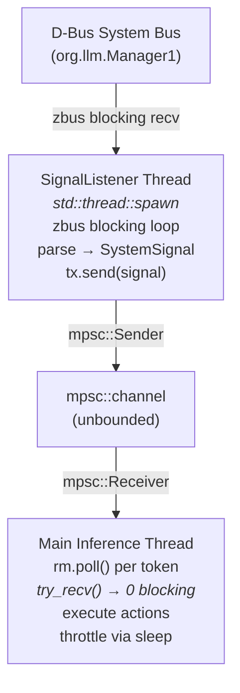
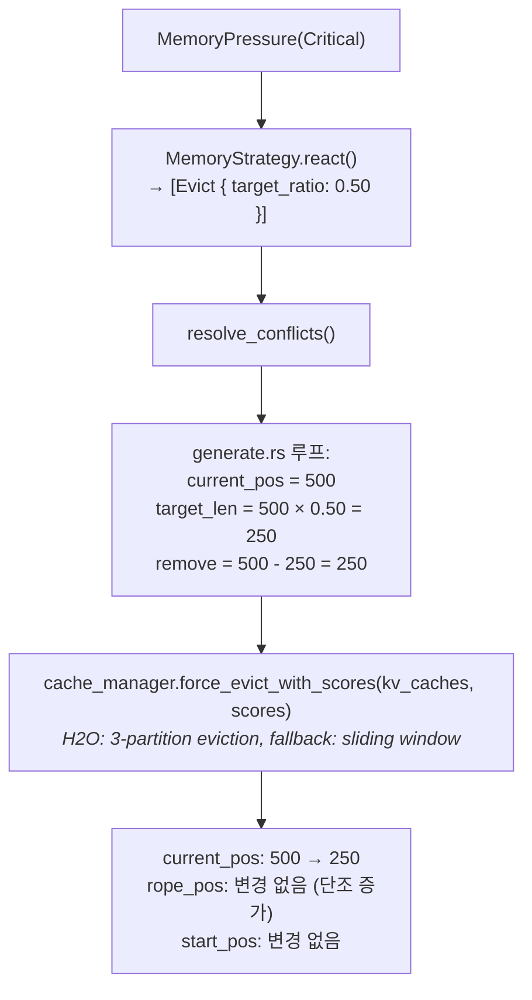
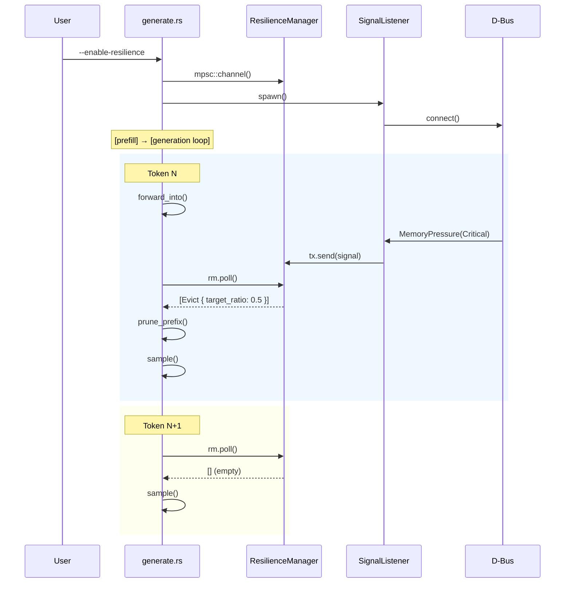

# 22. Resilience Manager — generate.rs 통합 설계

> **상태**: 구현 완료
> **선행 완료**: Phase 1 (타입/전략), Phase 2 (D-Bus 리스너)
> **대상**: Phase 3 — generate.rs 메인 루프 통합

---

## 1. 목표

Resilience Manager를 `generate.rs` 추론 루프에 통합하여, D-Bus 시스템 신호(메모리/CPU/발열/에너지)에 따라 추론 동작을 자동 조절한다.

**설계 원칙**:
- **비블로킹**: 추론 루프의 토큰 생성 지연 0 (try_recv 기반 폴링)
- **Fail-open**: Manager/D-Bus 불가 시 추론 정상 지속
- **Opt-in**: `--enable-resilience` 플래그로 활성화 (기본 비활성)
- **No tokio**: `std::thread` + `std::sync::mpsc` 사용

---

## 2. 스레드 모델



동기화 비용: **없음** — mpsc::try_recv()은 lock-free, 채널이 비어있으면 즉시 반환.

---

## 3. generate.rs 변경 명세

### 3.1 CLI 인자 추가

```rust
// Args 구조체에 추가
/// Enable D-Bus resilience manager for adaptive inference
#[arg(long, default_value_t = false)]
enable_resilience: bool,
```

### 3.2 초기화 (모델 로드 후, 추론 루프 전)

```rust
use std::sync::mpsc;
use llm_rs2::resilience::{
    SignalListener, DbusTransport, ResilienceManager, InferenceContext,
    OperatingMode, ResilienceAction, execute_action,
};

// 선택적 초기화
let mut resilience_manager = if args.enable_resilience {
    let (tx, rx) = mpsc::channel();
    let transport = DbusTransport::connect()?; // 또는 선택된 transport
    let listener = SignalListener::new(transport, tx);
    let _listener_handle = listener.spawn();  // 시그널 수신 스레드 시작
    println!("[Resilience] Manager enabled — listening for signals");
    Some(ResilienceManager::new(rx))
} else {
    None
};

// 추론 상태 변수
let mut throttle_delay_ms: u64 = 0;
let mut suspended = false;
let original_num_tokens = args.num_tokens;
```

### 3.3 토큰 생성 루프 통합 (핵심)

`for _ in 0..(args.num_tokens - 1)` 루프 내부, `model.forward_into()` 호출 후, 샘플링 전:

```rust
// ── Resilience checkpoint ─────────────────────────
if let Some(rm) = &mut resilience_manager {
    let mut reject_new = false;
    let mut ctx = InferenceContext {
        max_tokens: &mut args.num_tokens,
        throttle_delay_ms: &mut throttle_delay_ms,
        suspended: &mut suspended,
        reject_new: &mut reject_new,
    };

    for action in rm.poll() {
        // Evict: CacheManager를 통해 eviction 실행
        if let ResilienceAction::Evict { target_ratio: _ } = &action {
            let scores = score_accumulator.as_ref().map(|sa| sa.importance_scores());
            if let Err(e) = cache_manager.maybe_evict_with_scores(&mut kv_caches, scores) {
                eprintln!("[Resilience] Eviction error: {}", e);
            }
            if let Some(sa) = &mut score_accumulator {
                sa.reset();
            }
        } else {
            execute_action(&action, &mut ctx);
        }
    }

    // Suspended → 추론 중단
    if suspended {
        eprintln!("\n[Resilience] Inference suspended by system signal");
        break;
    }

    // Throttle → 토큰 간 지연 삽입
    if throttle_delay_ms > 0 {
        std::thread::sleep(std::time::Duration::from_millis(throttle_delay_ms));
    }
}
// ── End Resilience checkpoint ─────────────────────
```

### 3.4 Prefill 후 체크포인트 (선택)

Prefill 완료 직후, 생성 루프 진입 전에도 한 번 폴링:

```rust
// Prefill 완료 후
if let Some(rm) = &mut resilience_manager {
    let actions = rm.poll();
    if rm.mode() == OperatingMode::Suspended {
        eprintln!("[Resilience] Inference suspended before generation");
        // early return or skip generation
    }
}
```

---

## 4. 액션별 실행 상세

| Action | 실행 위치 | 동작 |
|--------|-----------|------|
| **Evict** | 토큰 루프 내 | `cache_manager.force_evict_with_scores()` — H2O 3-partition 또는 sliding fallback |
| **SwitchBackend** | Phase 3b (미구현) | generate_hybrid의 KV 마이그레이션 로직 참조. 단일 백엔드 generate에선 로그만 출력 |
| **LimitTokens** | ctx 통해 | `args.num_tokens = min(current, limit)` |
| **Throttle** | 토큰 루프 끝 | `thread::sleep(Duration::from_millis(delay))` |
| **Suspend** | 토큰 루프 끝 | `break` — 추론 중단 |
| **RejectNew** | ctx 통해 | 현재 단일 요청이므로 로그만. 서버 모드에서 활용 |
| **RestoreDefaults** | ctx 통해 | throttle=0, reject=false 복원 |

### Evict 상세 흐름



**주의**: `start_pos`(RoPE 논리 위치)는 eviction 후에도 변경하지 않는다. 기존 `prune_prefix()` 설계와 일치.

---

## 5. 에러 처리

| 시나리오 | 동작 |
|----------|------|
| D-Bus 연결 실패 | 리스너 스레드 종료, 경고 로그, 추론 계속 |
| 채널 끊김 (리스너 패닉) | `try_recv()` → Err, 무시, 마지막 상태 유지 |
| Eviction 실패 | eprintln 경고, 건너뜀, 추론 계속 |
| 잘못된 D-Bus 메시지 | 파싱 실패 → 해당 메시지 무시 |

모든 경우 **추론은 중단되지 않는다** (Suspend 액션 제외).

---

## 6. 시퀀스 다이어그램



---

## 7. 테스트 전략

### 7.1 유닛 테스트 (호스트, cargo test)

이미 구현 완료:
- `manager.rs`: poll, 상태 전이, 채널 끊김, 액션 실행
- `strategy/*.rs`: 레벨별 반응, 충돌 해결

### 7.2 통합 테스트 (호스트, mock 기반)

추가 필요:
```rust
#[test]
fn test_generate_resilience_eviction_flow() {
    // 1. 채널 생성, ResilienceManager 초기화
    // 2. KVCache 생성 (더미 버퍼, 100 토큰)
    // 3. MemoryPressure(Critical) 시그널 전송
    // 4. rm.poll() → Evict { target_ratio: 0.50 }
    // 5. kv_cache.prune_prefix(50) 실행
    // 6. current_pos == 50 확인
}

#[test]
fn test_generate_resilience_throttle_flow() {
    // ThermalAlert(Warning) → Throttle { delay_ms: 50 }
    // ctx.throttle_delay_ms == 50 확인
}

#[test]
fn test_generate_resilience_suspend_flow() {
    // EnergyConstraint(Emergency) → Suspend
    // ctx.suspended == true 확인
}

#[test]
fn test_generate_resilience_disabled_noop() {
    // resilience_manager = None → 루프에 영향 없음
}
```

### 7.3 디바이스 테스트 (Android)

`stress_test_adb.py` 확장:
- Mock D-Bus Manager 실행 → 시간 경과에 따라 신호 발송
- 추론 중 eviction 발생 확인 (로그 파싱)
- 1시간 연속 추론 안정성

---

## 8. 구현 체크리스트

| # | 작업 | 파일 | 예상 변경 |
|---|------|------|-----------|
| 1 | CLI 인자 `--enable-resilience` 추가 | `src/bin/generate.rs` | +3줄 |
| 2 | import 추가 | `src/bin/generate.rs` | +4줄 |
| 3 | 초기화 블록 (채널, 리스너, 매니저) | `src/bin/generate.rs` | +15줄 |
| 4 | 토큰 루프 내 체크포인트 삽입 | `src/bin/generate.rs` | +30줄 |
| 5 | Prefill 후 체크포인트 (선택) | `src/bin/generate.rs` | +5줄 |
| 6 | 통합 테스트 추가 | `tests/test_resilience_integration.rs` | +80줄 |
| 7 | TODO 상태 업데이트 | `.agent/todos/*.md` | 상태 변경 |

**총 변경량**: generate.rs에 ~55줄 추가. 기존 코드 수정 없음.

---

## 9. 제약 및 미래 확장

### Phase 3 범위 (현재)
- Evict: `cache_manager.force_evict_with_scores()` 호출
- Throttle/Suspend/LimitTokens: InferenceContext를 통해
- SwitchBackend: 로그만 (단일 백엔드 generate.rs에서는 전환 불가)

### Phase 4 (향후)
- `generate_hybrid.rs`에도 동일 패턴 적용 + SwitchBackend 실제 구현
- KV 캐시 마이그레이션 (CPU↔GPU)
- 웹 대시보드 Resilience 탭 연동 (JSON 메트릭 출력)
- 서버 모드에서 RejectNew 실제 동작
