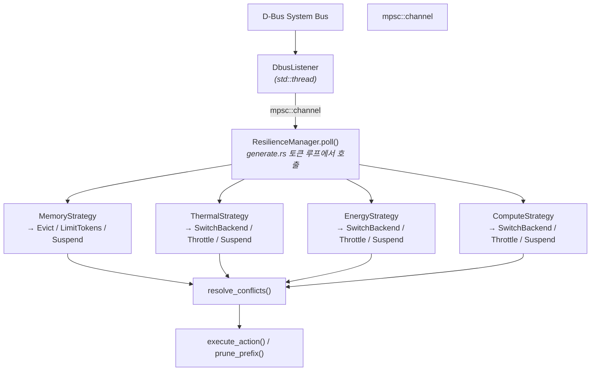

# 24. Resilience 시스템 사용 가이드

> Resilience Manager를 활성화하여 시스템 자원 압박에 자동 대응하는 추론을 실행하는 방법.

**다음**: [25. Troubleshooting Guide](25_troubleshooting.md) | [26. API Reference](26_api_reference.md)

---

## 1. 개요

Resilience Manager는 D-Bus 시스템 신호(메모리, CPU, 온도, 에너지)를 모니터링하여 추론 동작을 자동 조절합니다.

**핵심 특성**:
- **Opt-in**: `--enable-resilience` 플래그로 활성화 (기본 비활성)
- **비블로킹**: 토큰당 `try_recv()` 폴링, idle 시 오버헤드 0
- **Fail-open**: D-Bus 불가 시 추론 정상 지속
- **No tokio**: `std::thread` + `std::sync::mpsc` 만 사용

---

## 2. 빌드

Resilience 기능은 `resilience` feature로 게이팅되어 있습니다.

```bash
# resilience feature 포함 빌드
cargo build --release --bin generate --features resilience

# Android 크로스 컴파일 (run_device.py가 hosts.toml로 NDK env 자동 주입)
python scripts/run_device.py -d pixel --skip-exec generate
# 또는 cargo 직접 호출 (비권장):
# source android.source && cargo build --target aarch64-linux-android --release \
#   --bin generate --features resilience
```

feature 없이 빌드하면 `--enable-resilience` 플래그가 존재하지만 아무 동작도 하지 않습니다 (dead code 제거됨).

---

## 3. 실행

### 3.1 기본 사용

```bash
./target/release/generate \
  --model-path models/llama3.2-1b \
  --prompt "Hello" -n 200 \
  --backend cpu \
  --enable-resilience
```

성공 시 stderr에 다음 메시지 출력:
```
[Resilience] Manager enabled — listening for D-Bus signals
```

### 3.2 Eviction과 함께 사용

```bash
./target/release/generate \
  --model-path models/llama3.2-1b \
  --prompt "Hello" -n 500 \
  --backend cpu \
  --eviction-policy sliding --eviction-window 256 \
  --enable-resilience
```

CacheManager의 정책 기반 eviction과 Resilience의 신호 기반 eviction은 **독립적으로** 동작합니다:
- **CacheManager**: `memory_threshold_mb` 초과 시 정책에 따라 자동 eviction
- **Resilience**: D-Bus MemoryPressure 신호 수신 시 `target_ratio`로 eviction

---

## 4. D-Bus Manager 설정

### 4.1 Manager 서비스

Resilience Manager는 D-Bus System Bus의 `org.llm.Manager1` 서비스에서 신호를 수신합니다.

| 속성 | 값 |
|------|-----|
| Bus | System Bus |
| Destination | `org.llm.Manager1` |
| Path | `/org/llm/Manager1` |
| Interface | `org.llm.Manager1` |

### 4.2 지원 신호

| 신호 | 파라미터 | 설명 |
|------|----------|------|
| `MemoryPressure` | `(level: s, available_bytes: t, reclaim_target_bytes: t)` | 메모리 압박 |
| `ThermalAlert` | `(level: s, temperature_mc: i, throttling_active: b, throttle_ratio: d)` | 온도 경고 |
| `ComputeGuidance` | `(level: s, backend: s, reason: s, cpu_pct: d, gpu_pct: d)` | CPU/GPU 가이드 |
| `EnergyConstraint` | `(level: s, reason: s, power_budget_mw: u)` | 에너지 제약 |

**Level 값**: `normal`, `warning`, `critical`, `emergency`

### 4.3 Mock Manager (테스트용)

```bash
# resilience feature로 빌드
cargo build --release --bin mock_manager --features resilience

# 실행 (D-Bus System Bus에 신호 전송)
./target/release/mock_manager
```

---

## 5. 신호 → 액션 매핑

### 5.1 운영 모드

| 모드 | 조건 | 동작 |
|------|------|------|
| **Normal** | 모든 신호 Normal | 제한 없음 |
| **Degraded** | 하나 이상 Warning | 경량 제약 (SwitchBackend) |
| **Minimal** | 하나 이상 Critical | 적극적 제약 (Evict + Throttle + LimitTokens) |
| **Suspended** | 하나 이상 Emergency | 추론 중단 |

### 5.2 전략별 반응

#### MemoryStrategy

| Level | 액션 |
|-------|------|
| Normal | RestoreDefaults |
| Warning | Evict(0.85) |
| Critical | Evict(0.50) + LimitTokens(32) |
| Emergency | Suspend |

#### ThermalStrategy

| Level | 액션 |
|-------|------|
| Normal | RestoreDefaults |
| Warning | SwitchBackend(CPU) |
| Critical | SwitchBackend(CPU) + Throttle(delay) + LimitTokens(64) |
| Emergency | Suspend |

#### EnergyStrategy

| Level | 액션 |
|-------|------|
| Normal | RestoreDefaults |
| Warning | SwitchBackend(CPU) |
| Critical | SwitchBackend(CPU) + Throttle(100ms) |
| Emergency | Suspend |

#### ComputeStrategy

| Level | 액션 |
|-------|------|
| Normal | RestoreDefaults |
| Warning | SwitchBackend(recommended) |
| Critical | SwitchBackend(CPU) + Throttle(50ms) |
| Emergency | Suspend |

### 5.3 충돌 해결

다중 신호가 동시에 도착하면 `resolve_conflicts()`가 병합합니다:
- **Suspend**가 있으면 모든 것을 대체
- Evict: 가장 공격적인 ratio (최소값)
- Throttle: 가장 큰 delay
- LimitTokens: 가장 작은 limit
- RestoreDefaults: 다른 제약이 없을 때만 적용

---

## 6. 에러 처리 & 트러블슈팅

### 6.1 D-Bus 연결 실패

```
[Resilience] D-Bus listener exited: Connection refused. LLM continues without resilience.
```

**원인**: D-Bus System Bus 접근 불가 또는 Manager 서비스 미등록
**해결**: Fail-open이므로 추론은 정상 진행. Manager 서비스 확인 후 재시작.

### 6.2 Eviction 에러

```
[Resilience] Eviction error: Buffer does not support CPU pointer access
```

**원인**: GPU 전용 버퍼에서 `prune_prefix()` 시도
**해결**: `--zero-copy` 옵션으로 CPU 매핑 가능 버퍼 사용, 또는 `--backend cpu`

### 6.3 로그 활성화

```bash
RUST_LOG=debug ./target/release/generate --enable-resilience ...
```

로그 레벨별 출력:
- `info`: D-Bus 연결, 리스너 시작/종료
- `debug`: 수신된 신호 상세, 액션 처리
- `warn`: 파싱 실패, 연결 끊김

---

## 7. Hierarchical Policy Mode (신규)

> **설계 문서**: [36. Policy Design](36_policy_design.md) | [37. Protocol Design](37_protocol_design.md)

기존 threshold 기반 정책(§5)을 대체하는 계층형 정책 모드. PI Controller → Supervisory Layer → Cross-Domain Action Selector 파이프라인으로 동작한다.

### 7.1 Manager 실행

```bash
# Manager 시작 (hierarchical mode + Unix socket)
RUST_LOG=info cargo run -p llm_manager -- \
    --transport unix:/tmp/llm_manager.sock \
    --policy-config policy_config.toml \
    --client-timeout 10
```

| 플래그 | 설명 | 기본값 |
|--------|------|--------|
| `--transport unix:<path>` | Unix socket 경로 | `dbus` |
| `--policy-config <path>` | 정책 설정 파일 (TOML) | 내장 기본값 |
| `--client-timeout <sec>` | Engine 연결 대기 시간 | 60 |
| `--legacy-passthrough` | 기존 SystemSignal 직접 방출 모드 | false |

`--legacy-passthrough`를 지정하지 않으면 자동으로 hierarchical pipeline 모드로 동작한다.

### 7.2 Mock Engine (프로토콜 검증)

Manager의 directive 전송을 검증하기 위한 Mock Engine:

```bash
# Mock Engine 연결
RUST_LOG=info cargo run -p llm_manager --bin mock_engine -- \
    --socket /tmp/llm_manager.sock \
    --heartbeat-ms 100 \
    --duration-secs 30
```

| 플래그 | 설명 | 기본값 |
|--------|------|--------|
| `--socket <path>` | Manager의 Unix socket 경로 | (필수) |
| `--heartbeat-ms <ms>` | Heartbeat 전송 주기 | 100 |
| `--kv-occupancy <f32>` | 초기 KV cache 점유율 (0.0~1.0) | 0.5 |
| `--device <str>` | 초기 활성 디바이스 | `opencl` |
| `--duration-secs <sec>` | 실행 시간 | 30 |

Mock Engine은:
- Manager로부터 `EngineDirective`를 수신하여 로그 출력
- 수신한 커맨드에 따라 내부 상태 업데이트 (kv_occupancy, device 전환 등)
- `CommandResponse`를 Manager에 전송

### 7.3 E2E 테스트 절차

```bash
# 터미널 1: Manager 시작
RUST_LOG=info cargo run -p llm_manager -- \
    --transport unix:/tmp/llm_manager.sock \
    --policy-config policy_config.toml \
    --client-timeout 10

# 터미널 2: Mock Engine 연결
RUST_LOG=info cargo run -p llm_manager --bin mock_engine -- \
    --socket /tmp/llm_manager.sock \
    --duration-secs 30

# 터미널 3: 외부 신호 주입 (선택)
# ExternalMonitor를 통해 SystemSignal을 직접 주입할 수 있다.
# Manager config에 [external] enabled=true 설정 후,
# mock_manager로 D-Bus 신호를 주입한다.
```

Manager의 Monitor들이 실제 시스템 자원을 읽어 pressure가 발생하면, PolicyPipeline이 directive를 생성하여 Mock Engine에 전달한다.

### 7.4 정책 설정 파일

`policy_config.toml` (프로젝트 루트에 기본 파일 제공):

```toml
[pi_controller]
compute_kp = 1.5
compute_ki = 0.3
compute_setpoint = 0.70    # CPU 70% 이상에서 pressure 발생

[supervisory]
warning_threshold = 0.4    # pressure > 0.4 → Warning mode
critical_threshold = 0.7   # pressure > 0.7 → Critical mode
hold_time_secs = 4.0       # 하강 시 안정 유지 시간

[selector]
latency_budget = 0.5       # 허용 TBT 증가율 (50%)
algorithm = "exhaustive"

[actions.kv_evict_sliding]
alpha = 0.12               # QCF→cost 변환 계수
reversible = false

[exclusion_groups]
eviction = ["kv_evict_sliding", "kv_evict_h2o"]
```

전체 설정은 `policy_config.toml` 참조. 상세 설계는 `docs/36_policy_design.md` §7, §13 참조.

### 7.5 로그 확인

```bash
RUST_LOG=info cargo run -p llm_manager -- ...
```

| 로그 | 의미 |
|------|------|
| `PolicyPipeline initialized (hierarchical mode)` | 파이프라인 초기화 성공 |
| `Directive seq=N: M commands [mode=Warning]` | Directive 생성 및 전송 |
| `[MockEngine] Directive #N seq=M: K commands` | Mock Engine이 directive 수신 |

---

## 8. 아키텍처 참조

상세 설계:
- [`docs/22_resilience_integration.md`](22_resilience_integration.md) — (구) Engine 측 통합 설계
- [`docs/36_policy_design.md`](36_policy_design.md) — Hierarchical Policy 설계
- [`docs/37_protocol_design.md`](37_protocol_design.md) — Manager ↔ Engine 프로토콜


