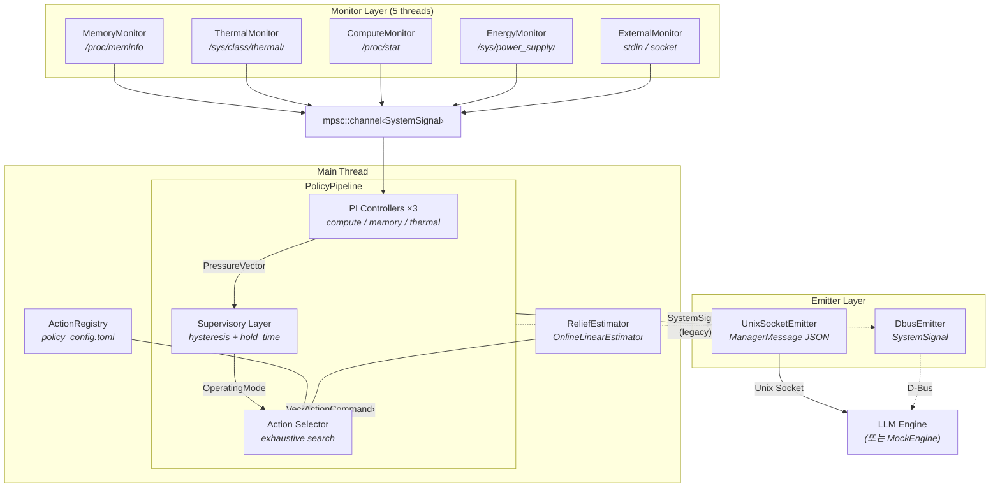
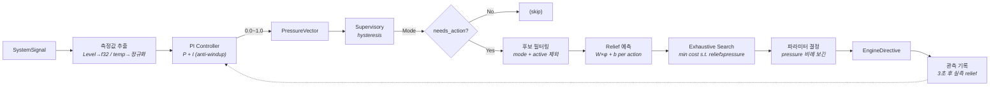
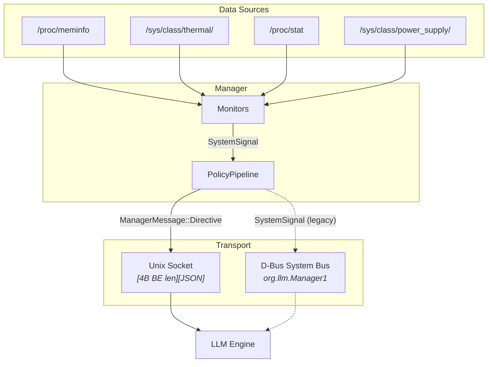
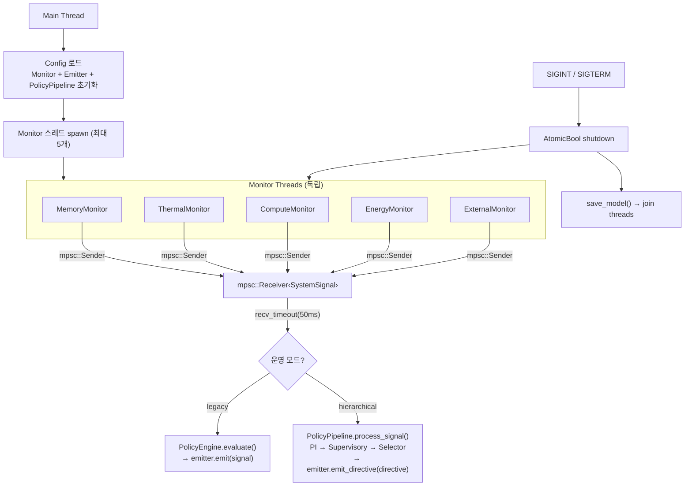

# 27. Manager Service Architecture

> LLM Resource Manager 내부 아키텍처 문서
> Crate: `llm_manager` (`manager/`)
>
> **최종 갱신**: 2026-03-20 — Hierarchical Policy Pipeline 구현 반영

---

## 1. Overview

Manager는 시스템 리소스를 모니터링하고, 계층형 정책 파이프라인(PI Controller → Supervisory → Action Selector)을 통해 LLM Engine에 `EngineDirective`를 전달하는 독립 서비스이다.

**핵심 원칙:**
- **양방향 프로토콜**: Manager ↔ Engine 간 `ManagerMessage` / `EngineMessage` 교환 (§8 참조)
- **Fail-Safe**: Manager가 죽어도 Engine은 독립적으로 추론 계속
- **OCP**: ReliefEstimator trait (Strategy 패턴)으로 학습 알고리즘 교체 가능
- **No async**: `std::thread` + `std::sync::mpsc`만 사용
- **Legacy 호환**: `--legacy-passthrough` 플래그로 기존 SystemSignal 직접 방출 모드 유지

---

## 2. 컴포넌트 다이어그램

### 2-1. 전체 구조



### 2-2. Policy Pipeline 내부 흐름



### 2-3. 데이터 소스 → 전송 경로



---

## 3. 운영 모드

Manager는 두 가지 운영 모드를 지원한다.

| 모드 | 플래그 | 정책 경로 | 출력 |
|------|--------|----------|------|
| **Hierarchical** (기본) | (없음) | PolicyPipeline → Action Selector | `EngineDirective` via `emit_directive()` |
| **Legacy passthrough** | `--legacy-passthrough` | PolicyEngine (threshold 규칙) | `SystemSignal` via `emit()` |

---

## 4. Module Structure

```
manager/
├── Cargo.toml
└── src/
    ├── lib.rs                        # pub mod 선언 (12개 모듈)
    ├── main.rs                       # CLI, 스레드 오케스트레이션, 메인 루프
    │
    │   ── 핵심 타입 ──
    ├── types.rs                      # ActionId, ReliefVector, PressureVector,
    │                                 # OperatingMode, FeatureVector, ActionCommand
    ├── config.rs                     # Config (모니터) + PolicyConfig (PI/Supervisory/Selector)
    │
    │   ── Policy Pipeline (§5) ──
    ├── pipeline.rs                   # PolicyPipeline — 전체 파이프라인 캡슐화
    ├── pi_controller.rs              # PiController — 연속 pressure 변환
    ├── supervisory.rs                # SupervisoryLayer — 모드 결정 (hysteresis)
    ├── selector.rs                   # ActionSelector — cross-domain 최적 조합 탐색
    ├── action_registry.rs            # ActionRegistry — 액션 카탈로그 + 제약
    ├── relief/
    │   ├── mod.rs                    # ReliefEstimator trait (Strategy 패턴)
    │   └── linear.rs                 # OnlineLinearEstimator (RLS, 세션 누적)
    │
    │   ── Legacy Policy ──
    ├── policy.rs                     # PolicyEngine — threshold 기반 (legacy 경로)
    ├── evaluator.rs                  # ThresholdEvaluator — 히스테리시스 임계값
    │
    │   ── Monitor Layer ──
    ├── monitor/
    │   ├── mod.rs                    # Monitor trait
    │   ├── memory.rs                 # /proc/meminfo (Descending)
    │   ├── thermal.rs                # /sys/class/thermal/ (Ascending)
    │   ├── compute.rs                # /proc/stat CPU delta (Ascending)
    │   ├── energy.rs                 # /sys/class/power_supply/ (Descending)
    │   └── external.rs              # stdin/socket 신호 주입 (연구용)
    │
    │   ── Emitter Layer ──
    ├── emitter/
    │   ├── mod.rs                    # Emitter trait (emit + emit_directive)
    │   ├── dbus.rs                   # DbusEmitter — System Bus 신호
    │   └── unix_socket.rs            # UnixSocketEmitter — length-prefixed JSON
    │
    │   ── Binaries ──
    └── bin/
        ├── mock_manager.rs           # D-Bus 신호 발신 (테스트용)
        └── mock_engine.rs            # Manager directive 수신 검증 (E2E)
```

**코드 규모:** ~5,600줄 (테스트 포함), 134개 유닛 테스트

---

## 5. Policy Pipeline 상세

`PolicyPipeline` (`pipeline.rs`)은 4개 컴포넌트를 순차 연결한다.

### 5-1. PI Controller (`pi_controller.rs`)

Monitor의 `SystemSignal`에서 측정값을 추출하여 0.0~1.0 연속 pressure로 변환.

```rust
struct PiController {
    kp: f32, ki: f32, setpoint: f32,
    integral: f32, integral_clamp: f32,
    can_act: bool,  // anti-windup
}
```

| 도메인 | 입력 | setpoint | 폴링 |
|--------|------|----------|------|
| compute | CPU utilization | 0.70 | ~100ms |
| memory | Level → 정규화 (0.0/0.55/0.80/1.0) | 0.75 | ~100ms |
| thermal | temperature_mc / 85000 | 0.80 | ~1000ms |

출력: `PressureVector { compute, memory, thermal }` — 각 0.0~1.0

### 5-2. Supervisory Layer (`supervisory.rs`)

PressureVector → `OperatingMode` 결정. Hysteresis 적용.

```
peak = max(compute, memory, thermal)

상승 (즉시):     peak ≥ 0.7 → Critical,  peak ≥ 0.4 → Warning
하강 (hold_time): peak < 0.50 → Warning,  peak < 0.25 → Normal
```

- 상승은 다단계 점프 가능 (Normal → Critical)
- 하강은 1단계씩 + hold_time(기본 4초) 안정 유지 필요

### 5-3. Action Selector (`selector.rs`)

Pressure + Mode + EngineState → 최적 액션 조합 선택.

**알고리즘**: Exhaustive search (비트마스크 열거, ~128 조합, μs 단위)

```
minimize  Σ D(action)                    — 총 품질 열화
subject to:
    Σ relief_d(a) ≥ pressure_d          — 모든 도메인 해소
    Σ relief_latency(a) ≥ -latency_budget — latency 상한
    exclusion group 제약                 — eviction 1종만
    mode 제약                           — Warning → lossless만
```

입력 의존성:
- `ActionRegistry` — 액션 카탈로그, alpha, reversible, exclusion groups
- `ReliefEstimator` — 액션별 예측 relief (4D: compute, memory, thermal, latency)
- QCF values — Engine이 보고하는 품질 비용 (현재는 기본값 1.0)

### 5-4. Relief Estimator (`relief/`)

Strategy 패턴 — `ReliefEstimator` trait + `OnlineLinearEstimator` 구현.

```rust
trait ReliefEstimator: Send + Sync {
    fn predict(&self, action: &ActionId, state: &FeatureVector) -> ReliefVector;
    fn observe(&mut self, action: &ActionId, state: &FeatureVector, actual: &ReliefVector);
    fn save(&self, path: &Path) -> io::Result<()>;
    fn load(&mut self, path: &Path) -> io::Result<()>;
}
```

- 각 액션별 4×13 가중치 행렬 (RLS 업데이트, forgetting factor λ=0.995)
- 13개 feature: kv_occupancy, is_gpu, token_progress, is_prefill, kv_dtype_norm, tbt_ratio, tokens_generated_norm, active_action × 6
- 세션 간 누적 학습 (JSON save/load)

---

## 6. Monitor Layer

### 6-1. Monitor Trait

```rust
pub trait Monitor: Send + 'static {
    fn run(&mut self, tx: mpsc::Sender<SystemSignal>, shutdown: Arc<AtomicBool>) -> Result<()>;
    fn initial_signal(&self) -> Option<SystemSignal>;
    fn name(&self) -> &str;
}
```

각 Monitor는 전용 스레드에서 실행. 내부에서 `ThresholdEvaluator`로 히스테리시스 평가 후 `SystemSignal`을 채널로 전송.

### 6-2. 구현체

| Monitor | 데이터 소스 | 방향 | 특이사항 |
|---------|------------|------|---------|
| MemoryMonitor | `/proc/meminfo` | Descending | `reclaim_target` = level별 총메모리의 5/10/20% |
| ThermalMonitor | `/sys/class/thermal/` | Ascending | zone 필터링, 최고 온도 기준, throttle 감지 |
| ComputeMonitor | `/proc/stat` | Ascending | CPU delta 계산, Emergency 없음, GPU 미구현 (0.0) |
| EnergyMonitor | `/sys/class/power_supply/` | Descending | 충전 중 강제 Normal, 배터리 없으면 항상 Normal |
| ExternalMonitor | stdin / Unix socket | Passthrough | JSON Lines, 연구/테스트용 신호 주입 |

---

## 7. Emitter Layer

### 7-1. Emitter Trait

```rust
pub trait Emitter: Send {
    fn emit(&mut self, signal: &SystemSignal) -> Result<()>;
    fn emit_initial(&mut self, signals: &[SystemSignal]) -> Result<()>;
    fn emit_directive(&mut self, directive: &EngineDirective) -> Result<()>;
    fn name(&self) -> &str;
}
```

`emit_directive()`는 hierarchical 모드에서 사용. 기본 구현은 로그만 출력.

### 7-2. 구현체

| 구현체 | 전송 방식 | emit() | emit_directive() | 플랫폼 |
|--------|----------|--------|------------------|--------|
| DbusEmitter | System Bus 신호 | SystemSignal 발신 | 로그만 (기본) | Linux |
| UnixSocketEmitter | `[4B BE len][JSON]` | SystemSignal JSON | ManagerMessage JSON | Android / 범용 |

---

## 8. Wire Protocol

### 8-1. Unix Socket (양방향)

```
┌──────────┬─────────────────────────────────┐
│ 4 bytes  │ N bytes                         │
│ BE u32 N │ UTF-8 JSON                      │
│          │ (ManagerMessage 또는 EngineMessage)│
└──────────┴─────────────────────────────────┘
```

| 방향 | 메시지 타입 | 사용 경로 |
|------|-----------|----------|
| Manager → Engine | `ManagerMessage::Directive(EngineDirective)` | hierarchical |
| Manager → Engine | `SystemSignal` JSON | legacy passthrough |
| Engine → Manager | `EngineMessage::Capability(EngineCapability)` | 등록 (1회) |
| Engine → Manager | `EngineMessage::Heartbeat(EngineStatus)` | 주기적 |
| Engine → Manager | `EngineMessage::Response(CommandResponse)` | directive 응답 |

상세 프로토콜: [37. Protocol Design](37_protocol_design.md)

### 8-2. D-Bus (단방향, legacy)

| 항목 | 값 |
|------|-----|
| Bus | System Bus |
| Interface | `org.llm.Manager1` |
| Path | `/org/llm/Manager1` |
| 신호 | `MemoryPressure`, `ComputeGuidance`, `ThermalAlert`, `EnergyConstraint` |

---

## 9. Threading Model



---

## 10. Configuration

### 10-1. Monitor 설정 (`--config`)

TOML 파일. 모든 필드에 기본값. 기본 경로: `/etc/llm-manager/config.toml`

```toml
[manager]
poll_interval_ms = 1000

[memory]
enabled = true
warning_pct = 40.0
critical_pct = 20.0
emergency_pct = 10.0

[thermal]
enabled = true
zone_types = []              # 빈 배열 = 전체 zone
warning_mc = 60000
critical_mc = 75000
emergency_mc = 85000

[compute]
enabled = true
warning_pct = 70.0
critical_pct = 90.0

[energy]
enabled = true
ignore_when_charging = true
```

### 10-2. Policy 설정 (`--policy-config`)

별도 TOML 파일. 프로젝트 루트의 `policy_config.toml` 참조.

```toml
[pi_controller]
compute_kp = 1.5
compute_ki = 0.3
compute_setpoint = 0.70

[supervisory]
warning_threshold = 0.4
critical_threshold = 0.7
hold_time_secs = 4.0

[selector]
latency_budget = 0.5
algorithm = "exhaustive"

[actions.kv_evict_sliding]
alpha = 0.12
reversible = false

[exclusion_groups]
eviction = ["kv_evict_sliding", "kv_evict_h2o"]
```

전체 스키마: [36. Policy Design](36_policy_design.md) §7, [37. Protocol Design](37_protocol_design.md) §7

---

## 11. CLI

```bash
# Hierarchical mode (기본)
cargo run -p llm_manager -- \
    --transport unix:/tmp/llm.sock \
    --policy-config policy_config.toml \
    --client-timeout 10

# Legacy passthrough mode
cargo run -p llm_manager -- \
    --transport dbus \
    --legacy-passthrough

# Mock Engine (E2E 검증)
cargo run -p llm_manager --bin mock_engine -- \
    --socket /tmp/llm.sock \
    --duration-secs 30
```

| 옵션 | 기본값 | 설명 |
|------|--------|------|
| `-c, --config` | `/etc/llm-manager/config.toml` | Monitor 설정 파일 |
| `-t, --transport` | `dbus` | `dbus` 또는 `unix:<path>` |
| `--client-timeout` | `60` | Unix socket 클라이언트 대기 (초) |
| `--policy-cooldown-ms` | `500` | Legacy PolicyEngine 최소 발행 간격 |
| `--legacy-passthrough` | `false` | Legacy SystemSignal 직접 방출 |
| `--policy-config` | (내장 기본값) | Hierarchical policy TOML 경로 |

---

## 12. Binaries

| 바이너리 | 용도 | 주요 기능 |
|---------|------|----------|
| `llm_manager` | Manager 서비스 본체 | Monitor → Pipeline → Emitter |
| `mock_manager` | D-Bus 신호 발신 (테스트) | 단일 신호 / 시나리오 재생 |
| `mock_engine` | Directive 수신 검증 (E2E) | Capability 등록, Heartbeat 전송, Directive 로그/응답 |

---

## 13. 테스트

### 13-1. 유닛 테스트 (134개)

| 모듈 | 수 | 범위 |
|------|---|------|
| types | 6 | 벡터 연산, ActionId 직렬화 |
| config | 6 | TOML 파싱 (Monitor + PolicyConfig) |
| pi_controller | 7 | PI 응답, anti-windup, spike vs sustained |
| supervisory | 7 | 모드 전환, hysteresis, 단계적 하강 |
| relief::linear | 6 | RLS 수렴, 독립성, save/load roundtrip |
| action_registry | 7 | 분류, exclusion group |
| selector | 9 | cross-domain, latency budget, best-effort |
| pipeline | 15 | 입력 변환, directive 생성, 복원 |
| policy (legacy) | 11 | threshold 규칙 |
| evaluator | 10 | 히스테리시스 |
| emitter | 4 | SystemSignal + ManagerMessage roundtrip |
| monitor | 32 | Memory, Thermal, Compute, Energy, External |
| mock_engine | 12 | wire format, 커맨드 적용, response |

### 13-2. E2E 검증

```bash
# 터미널 1: Manager
RUST_LOG=info cargo run -p llm_manager -- \
    --transport unix:/tmp/llm.sock \
    --policy-config policy_config.toml --client-timeout 10

# 터미널 2: Mock Engine
RUST_LOG=info cargo run -p llm_manager --bin mock_engine -- \
    --socket /tmp/llm.sock --duration-secs 30
```

---

## 14. 의존성

| Crate | 용도 |
|-------|------|
| `llm_shared` | SystemSignal, EngineDirective, ManagerMessage 등 공유 타입 |
| `serde` + `serde_json` | 설정/신호/directive 직렬화 |
| `toml` | TOML 설정 파싱 |
| `clap` | CLI 인자 파싱 |
| `log` + `env_logger` | 로깅 |
| `libc` | SIGINT/SIGTERM 핸들러 |
| `zbus` (blocking-api) | D-Bus System Bus (async 미사용) |
| `tempfile` (dev) | 테스트용 임시 파일 |

---

## 15. Known Limitations

| 항목 | 현황 | 개선 방향 |
|------|------|----------|
| GPU 사용률 | 항상 0.0 | Adreno: `/sys/class/kgsl/` 파싱 |
| Engine heartbeat | Manager가 수신하지 않음 | Transport 양방향 확장 필요 |
| QCF on-demand | 기본값 1.0 사용 | Engine 프로토콜 통합 후 실제 QCF 조회 |
| Relief 학습 | Engine 미연결 시 observe() 미호출 | Mock Engine으로 시뮬레이션 가능 |
| 클라이언트 수 | Unix socket 1:1 | 멀티 클라이언트 시 accept loop |
| Android | 미검증 | sysfs 경로 차이, D-Bus 부재 |

---

## 16. 관련 문서

| 문서 | 내용 |
|------|------|
| [36. Policy Design](36_policy_design.md) | Hierarchical Policy 설계 (PI, Supervisory, Selector, Relief) |
| [37. Protocol Design](37_protocol_design.md) | Manager ↔ Engine 프로토콜 (메시지 타입, wire format) |
| [20. D-Bus IPC Spec](20_dbus_ipc_spec.md) | D-Bus 인터페이스 정의 (legacy 호환) |
| [24. Usage Guide](24_resilience_usage_guide.md) | 실행 방법, E2E 테스트 절차 |
