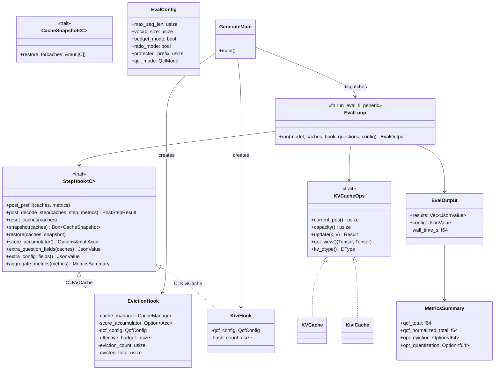
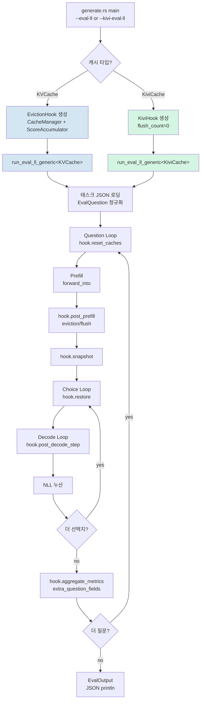

# 38. eval 루프 리팩토링 설계

## 개요

`generate.rs` 내 `run_eval_ll` / `run_kivi_eval_ll` 두 함수에 집중된 의미적 중복을 제거하고,
새 캐시 정책(EvictionHook, KiviHook)을 `StepHook` 트레이트 하나로 확장할 수 있는
제네릭 eval 루프 구조를 설계한다.

---

## 1. 문제

### 1.1 현황

| 함수 | 위치 (줄) | 역할 |
|------|-----------|------|
| `run_eval_ll` | 1908–2695 (787줄) | KVCache + CacheManager 기반 eval |
| `run_kivi_eval_ll` | 2700–3087 (387줄) | KiviCache 기반 eval |
| `run_ppl` | 4095–4561 (466줄) | PPL (연속 teacher-forcing) |
| `run_kivi_ppl` | 3092–3380 (288줄) | KIVI PPL |

`generate.rs` 전체 4,561줄 중 eval 관련 코드가 약 1,900줄(42%)를 차지하며,
두 eval 함수 사이에 약 700줄의 의미적 중복이 존재한다.

### 1.2 중복 목록

두 함수가 각자 독립적으로 구현하고 있는 로직:

1. **태스크 로딩**: `--eval-batch` JSON 파일 파싱 / `--eval-continuation` 단일 항목 정규화
2. **질문 루프 뼈대**: `for (q_idx, question) in questions.iter()` 패턴
3. **선택지 루프**: `for (c_idx, choice) in question.choices.iter()` + NLL 합산
4. **QCF 집계**: `qcf_metrics.iter().filter_map(|m| m["raw_value"].as_f64()).sum()` 패턴 (6회 이상 반복)
5. **JSON 빌더**: `choice_nlls`, `predicted`, `n_prompt_tokens` 등 공통 필드 조립
6. **캐시 리셋**: 루프 진입 시 `current_pos = 0` / `acc.reset()`
7. **에러 처리**: `prompt too long` skip, tokenize error 래핑
8. **Snapshot/Restore**: 선택지별 캐시 상태 복원 (eval_ll는 `Vec<KVCache>` 복제, kivi_eval_ll은 `Vec<KiviCache>` 복제)

### 1.3 산탄총 수술 문제

새 기능(OPR 컬럼 추가, QCF 모드 확장, 로깅 형식 변경 등)을 추가할 때 동일한 수정을
두 함수에 동시 적용해야 한다. 실제로 `layer_skip_qcf_normalized` 필드는
`run_eval_ll`에만 추가되고 `run_kivi_eval_ll`에는 적용이 지연되는 패턴이 반복됐다.

---

## 2. 설계

### 2.1 범위 결정

| 모드 | 처리 방향 | 근거 |
|------|-----------|------|
| `eval-ll` (KVCache) | 통합 — `EvictionHook` | 동일한 질문 루프 구조 |
| `kivi-eval-ll` (KiviCache) | 통합 — `KiviHook` | 동일한 질문 루프 구조 |
| `ppl` (KVCache) | **별도 유지** | 연속 teacher-forcing, 단일 NLL 스트림 |
| `kivi-ppl` (KiviCache) | **별도 유지** | 동상 |

PPL 모드는 선택지 루프가 없고 전체 토큰 시퀀스를 연속으로 처리하므로
eval 루프와 구조가 근본적으로 다르다. 단, QCF 집계 헬퍼는 공유한다.

### 2.2 핵심 트레이트

#### `StepHook<C: KVCacheOps>`

```rust
pub trait StepHook<C: KVCacheOps> {
    /// Prefill 완료 직후 호출.
    /// score_accumulator flush, chunked-prefill 중간 eviction 등을 처리한다.
    fn post_prefill(
        &mut self,
        caches: &mut [C],
        qcf_metrics: &mut Vec<serde_json::Value>,
    );

    /// 각 choice 토큰 decode 직후 호출.
    /// eviction / flush / QCF 수집 등을 처리하고 계속 여부를 반환한다.
    fn post_decode_step(
        &mut self,
        caches: &mut [C],
        step: usize,
        qcf_metrics: &mut Vec<serde_json::Value>,
    ) -> PostStepResult;

    /// 질문 루프 진입 시 캐시를 초기 상태로 리셋한다.
    fn reset_caches(&mut self, caches: &mut [C]);

    /// 선택지 루프 진입 전 캐시 스냅샷을 찍는다.
    fn snapshot(&self, caches: &[C]) -> Box<dyn CacheSnapshot<C>>;

    /// 스냅샷을 caches에 복원한다.
    fn restore(&self, caches: &mut [C], snapshot: &dyn CacheSnapshot<C>);

    /// EvictionHook만 보유. KiviHook은 None 반환.
    fn score_accumulator(&mut self) -> Option<&mut AttentionScoreAccumulator>;

    /// 결과 JSON에 캐시 구현체별 추가 필드를 주입한다.
    /// - EvictionHook: eviction_count, evicted_tokens, effective_budget
    /// - KiviHook: kivi_q2_tokens, kivi_res_pos
    fn extra_question_fields(&self, caches: &[C]) -> serde_json::Value;

    /// config 블록에 구현체별 필드를 추가한다.
    fn extra_config_fields(&self) -> serde_json::Value;

    /// 누적된 qcf_metrics 배열을 집계하여 요약 통계를 반환한다.
    fn aggregate_metrics(&self, qcf_metrics: &[serde_json::Value]) -> MetricsSummary;
}
```

#### `PostStepResult`

```rust
pub enum PostStepResult {
    /// 정상. 다음 토큰 계속.
    Continue,
    /// 캐시 용량 초과 등으로 해당 choice 디코딩을 중단.
    Abort,
}
```

#### `CacheSnapshot<C: KVCacheOps>`

```rust
pub trait CacheSnapshot<C: KVCacheOps>: Send {
    /// self에 저장된 스냅샷을 caches에 복원한다.
    fn restore_to(&self, caches: &mut [C]);
}
```

KVCache 구현은 `Vec<KVCache>` 클론, KiviCache 구현은 `Vec<KiviCache>` 클론으로
현재 동작과 동일하다. 향후 CoW(Copy-on-Write) 최적화로 교체 가능하다.

#### `MetricsSummary`

```rust
pub struct MetricsSummary {
    pub qcf_total: f64,
    pub qcf_normalized_total: f64,
    pub opr_eviction: Option<f64>,
    pub opr_quantization: Option<f64>,
    pub opr_eviction_events: Option<usize>,
    pub opr_quantization_events: Option<usize>,
}
```

### 2.3 두 Hook 구현

#### `EvictionHook` — KVCache 전용

```
EvictionHook {
    cache_manager: CacheManager,
    score_accumulator: Option<AttentionScoreAccumulator>,
    qcf_config: QcfConfig,
    effective_budget: usize,    // per-question으로 갱신
    eviction_count: usize,      // per-question 카운터
    evicted_total: usize,
}
```

- `post_prefill`: `score_accumulator.flush()`, chunked-prefill 진행 시 eviction 수행
- `post_decode_step`: `cache_manager.execute_dispatch()` 호출, eviction 결과를 qcf_metrics에 기록
- `reset_caches`: `cache.current_pos = 0`, `acc.reset()`
- `snapshot`/`restore`: `Vec<KVCache>` 클론 기반

#### `KiviHook` — KiviCache 전용

```
KiviHook {
    qcf_config: QcfConfig,
    flush_count: usize,
}
```

- `post_prefill`: no-op (KIVI는 prefill 단계 eviction 없음)
- `post_decode_step`: `kv_caches[0].take_flush_proxies()`로 NMSE 수집, kivi_opr 기록
- `reset_caches`: `cache.reset()`
- `snapshot`/`restore`: `Vec<KiviCache>` 클론 기반

### 2.4 제네릭 eval 루프

```rust
pub fn run_eval_ll_generic<C: KVCacheOps>(
    model: &TransformerModel,
    tokenizer: &Tokenizer,
    backend: &Arc<dyn Backend>,
    memory: &dyn Memory,
    kv_caches: &mut [C],
    hook: &mut dyn StepHook<C>,
    questions: &[EvalQuestion],
    eval_config: &EvalConfig,
) -> Result<EvalOutput>
```

`EvalConfig`는 `max_seq_len`, `vocab_size`, `budget_mode`, `ratio_mode` 등
현재 함수 인자로 산재한 설정값을 모은 구조체다.

루프 구조:

```
for question in questions:
    hook.reset_caches(caches)
    prefill(question.prompt)
    hook.post_prefill(caches, metrics)
    snapshot = hook.snapshot(caches)

    for choice in question.choices:
        hook.restore(caches, &snapshot)
        nll = 0.0
        for token in choice_tokens:
            decode(token)
            hook.post_decode_step(caches, step, metrics)
        choice_nlls.push(nll)

    summary = hook.aggregate_metrics(&metrics)
    results.push(build_result_json(question, choice_nlls, summary,
                                   hook.extra_question_fields(caches)))

EvalOutput { results, config, wall_time_s }
```

Chunked Prefill 분기는 `eval_loop.rs` 내부에서 `eval_config.budget` 기반으로 처리하며,
중간 토큰 디코딩 단계에서도 `hook.post_decode_step()`을 통해 통일된 인터페이스를 사용한다.

---

## 3. 컴포넌트 다이어그램



---

## 4. 데이터 흐름



---

## 5. 모듈 구조

```
engine/src/eval/
├── mod.rs           — pub use 재수출, EvalQuestion, load_tasks()
├── hook.rs          — StepHook, CacheSnapshot, PostStepResult, MetricsSummary
├── eviction_hook.rs — EvictionHook (C=KVCache)
├── kivi_hook.rs     — KiviHook (C=KiviCache)
├── eval_loop.rs     — run_eval_ll_generic, EvalConfig, EvalOutput
└── qcf_helpers.rs   — aggregate_qcf(), build_result_json(), normalize_qcf()
```

PPL 함수(`run_ppl`, `run_kivi_ppl`)는 `generate.rs`에 유지하되,
`qcf_helpers`의 공통 집계 함수를 사용하도록 내부 코드를 교체한다.

---

## 6. 트레이드오프

### 장점

- **OCP 준수**: 새 캐시 정책 추가 시 `StepHook` 구현체 1개만 작성하면 되고, 루프 코드 수정 불필요
- **단일 변경점**: QCF 필드 추가, 로그 형식 변경, JSON 스키마 확장 모두 루프 코드 1곳
- **테스트 용이성**: `MockHook`으로 루프 로직만 독립 단위 테스트 가능
- **DI 원칙**: 루프가 캐시 구현체를 직접 참조하지 않고 트레이트를 통해 접근

### 단점

- **간접 참조 비용**: `dyn StepHook<C>` vtable 디스패치 (hot path 아님 — 토큰당 1회)
- **학습 곡선**: 2개 함수 직접 읽기 → 트레이트 관계 파악 필요
- **초기 구현 비용**: 기존 코드 이식 + 테스트 작성에 약 1~2일 소요 예상

### 대안 비교

| 대안 | 이유 | 탈락 사유 |
|------|------|-----------|
| 함수 인자로 클로저 전달 | 단순 | 다중 메서드(reset/snapshot/restore)를 클로저로 표현 시 인자 폭발 |
| enum dispatch (EvalMode::Eviction / EvalMode::Kivi) | 타입 안전 | OCP 위반 — 새 모드 추가 시 match arm 추가 필요 |
| 매크로 공유 | 코드 중복 제거 | 디버깅/IDE 지원 열악, 타입 안전성 낮음 |

---

## 7. 리스크 분석

| ID | 리스크 | 심각도 | 완화 방안 |
|----|--------|--------|-----------|
| R1 | Rust 제네릭 + `dyn StepHook<C>` 조합 — object-safety 제약 | 높음 | `C`가 함수 레벨에서 단형화(monomorphized)되므로 object-safe 요건 충족. `snapshot` 반환 타입을 `Box<dyn CacheSnapshot<C>>`로 한정. |
| R2 | `Vec<KiviCache>` 클론 비용 — `snapshot()` 호출 시 선택지마다 발생 | 중간 | 현재 `run_kivi_eval_ll`도 동일 클론을 수행하므로 성능 동등. 향후 `Arc<RwLock<>>` + CoW로 개선 가능. |
| R3 | Chunked prefill 분기가 `StepHook` 추상화를 우회할 가능성 | 중간 | `eval_loop.rs`에서 chunked decode 토큰도 `post_decode_step()`으로 통일. 분기 로직은 루프 내부에만 존재. |
| R4 | `score_accumulator` 소유권 — `EvictionHook`이 소유, 루프가 빌림 | 중간 | `hook.score_accumulator()` 메서드로 대여. `forward_into()` 인자 전달 시 `Option<&mut Acc>` 패턴 유지. |
| R5 | JSON 출력 필드 호환성 — 기존 실험 결과 파서가 필드명에 의존 | 높음 | 리팩토링 후 golden 출력(기존 JSON) 대비 regression 테스트 필수. `extra_question_fields()`가 동일 필드명을 반환하도록 보장. |
| R6 | PPL 모드에 중복 잔존 | 낮음 | `qcf_helpers` 공통 함수 도입으로 ~80줄 절감. PPL 구조 자체는 리팩토링 범위 밖. |

---

## 8. 영향 범위

### 신규 파일

- `engine/src/eval/mod.rs`
- `engine/src/eval/hook.rs`
- `engine/src/eval/eviction_hook.rs`
- `engine/src/eval/kivi_hook.rs`
- `engine/src/eval/eval_loop.rs`
- `engine/src/eval/output.rs`
- `engine/src/eval/qcf_helpers.rs`

### 수정 파일

- `engine/src/bin/generate.rs` — `run_eval_ll`, `run_kivi_eval_ll` 제거, `run_eval_ll_generic` 호출로 교체. PPL 함수 내 QCF 집계를 `qcf_helpers` 함수 호출로 교체.
- `engine/src/lib.rs` — `pub mod eval;` 추가

### 비변경 파일

- `engine/src/core/kv_cache.rs` — `KVCacheOps` 트레이트 변경 없음
- `engine/src/core/kivi_cache.rs` — 변경 없음
- `engine/src/core/cache_manager.rs` — 변경 없음
- `engine/kernels/*.cl` — 변경 없음

---

## 9. 테스트 전략

### 9.1 단위 테스트 — `MockHook`

`StepHook` 트레이트를 구현하는 `MockHook`을 `#[cfg(test)]`로 정의하여
`run_eval_ll_generic` 루프 로직만 독립 테스트한다.

```rust
struct MockHook {
    pub reset_count: usize,
    pub decode_step_count: usize,
    pub snapshot_count: usize,
}

impl StepHook<MockCache> for MockHook { ... }
```

검증 항목:
- `reset_caches` 호출 횟수 = 질문 수
- `snapshot` 호출 횟수 = 질문 수
- `restore` 호출 횟수 = `sum(choice counts)`
- `post_decode_step` 호출 횟수 = 전체 choice 토큰 수

### 9.2 QCF 헬퍼 단위 테스트

`qcf_helpers::aggregate_qcf()` 입력/출력 검증:
- 빈 배열 → 모든 합계 0.0
- mixed action 타입 → `attn` / `caote` / `kivi_opr` 분리 집계 정확성

### 9.3 JSON 호환성 회귀 테스트

리팩토링 전후 동일 입력에 대해 JSON 출력 필드 집합이 동일한지 검증한다.
기존 `eval-ll` 실험 결과 파일을 golden fixture로 사용한다.

### 9.4 통합 테스트

`cargo test -p llm_rs2` 내 기존 모든 테스트가 통과해야 한다. 구조 변경이므로
실제 모델 추론 없이 `MockHook` + `MockCache` 조합으로 검증 가능하다.

---

## 10. 예상 효과

| 지표 | Before | After | 변화 |
|------|--------|-------|------|
| `generate.rs` LOC | 4,561 | ~2,800 | -39% |
| eval 중복 코드 | ~700줄 | 0 | 완전 제거 |
| 새 캐시 정책 추가 비용 | 6~8곳 수정 | `StepHook` 구현 1개 | -80% |
| QCF/OPR 집계 중복 | ~160줄 (4곳) | `qcf_helpers` 1곳 | -75% |
| eval 루프 단위 테스트 | 불가 (함수 내부) | MockHook으로 독립 검증 | 신규 |

---

## 11. 구현 순서 제안

1. `engine/src/eval/qcf_helpers.rs` — 집계 함수 추출 및 단위 테스트 작성
2. `engine/src/eval/hook.rs` — 트레이트 정의 (구현 없음)
3. `engine/src/eval/output.rs` — `EvalOutput`, `EvalConfig`, `MetricsSummary`
4. `engine/src/eval/eval_loop.rs` — `run_eval_ll_generic` (MockHook으로 루프 테스트 먼저)
5. `engine/src/eval/eviction_hook.rs` — `EvictionHook` 이식 및 테스트
6. `engine/src/eval/kivi_hook.rs` — `KiviHook` 이식 및 테스트
7. `engine/src/bin/generate.rs` — 두 함수 제거, 제네릭 호출로 교체
8. JSON 출력 golden 회귀 테스트 통과 확인

---

## 참고 문서

- `docs/11_kv_cache_management.md` — KVCache / KiviCache 구조
- `docs/30_evaluation_methodology.md` — eval-ll 평가 지표 정의
- `docs/35_experiment_runner_guide.md` — eval-ll CLI 사용 예시
- `engine/src/core/kv_cache.rs` — `KVCacheOps` 트레이트
- `engine/src/core/qcf/mod.rs` — `QcfConfig`, `QcfMode`
