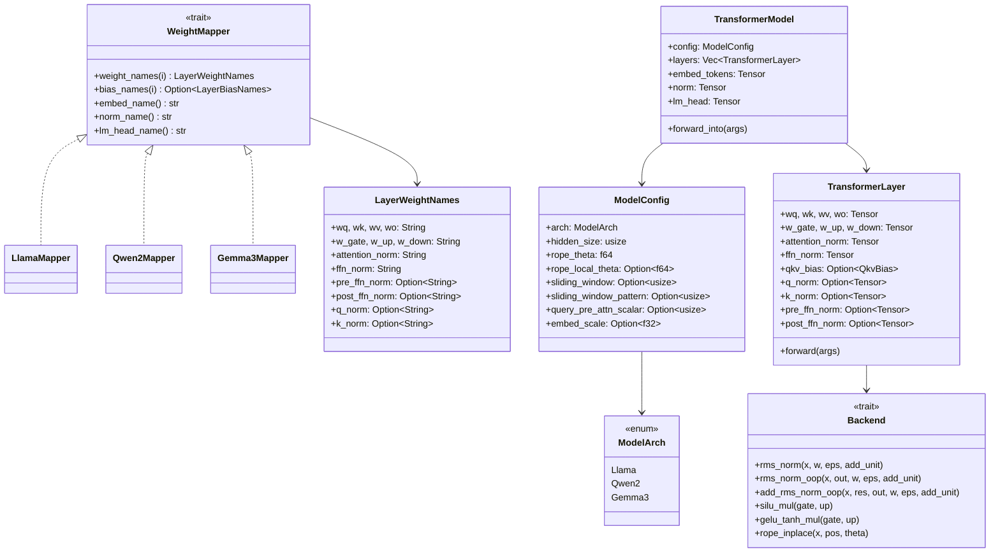
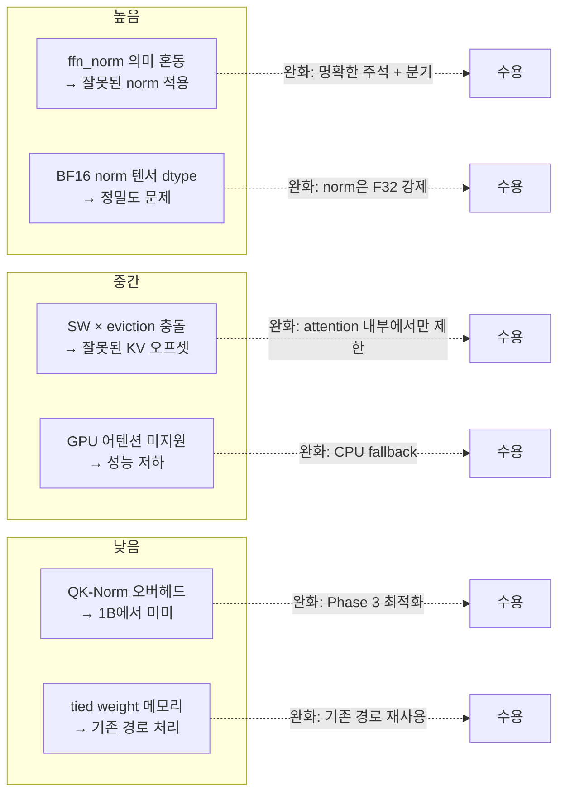

# Gemma 3 1B 지원 설계

## 1. 개요 및 목표

### 배경

llm.rs는 현재 Llama와 Qwen2 아키텍처를 `TransformerModel` + `TransformerLayer` 구조로 통합 지원한다. `WeightMapper` trait으로 가중치 이름 매핑을 추상화하고, `ModelArch` enum으로 아키텍처 분기를 한다.

Gemma 3 1B (google/gemma-3-1b-pt)를 세 번째 아키텍처로 추가한다.

### 목표

- `TransformerLayer`를 확장하여 Gemma 3의 추가 연산(Gemma RMSNorm, QK-Norm, post-norm, GELU_tanh, sliding window attention)을 수용한다
- 기존 Llama/Qwen2 forward 경로에 성능/정확성 영향을 주지 않는다
- 단계적으로 구현 가능한 설계: Phase 1(최소 동작) → Phase 2(로컬/글로벌 어텐션 최적화)

### 모델 스펙 요약

| 항목 | 값 |
|------|-----|
| architecture | `Gemma3ForCausalLM` / `gemma3_text` |
| hidden_size | 1152 |
| num_hidden_layers | 26 |
| num_attention_heads (Q) | 4 |
| num_key_value_heads (KV) | 1 (MQA) |
| head_dim | 256 |
| intermediate_size | 6912 |
| vocab_size | 262144 |
| max_position_embeddings | 32768 |
| rms_norm_eps | 1e-6 |
| rope_theta (글로벌) | 1,000,000.0 |
| rope_local_base_freq (로컬) | 10,000.0 |
| sliding_window | 512 |
| sliding_window_pattern | 6 (6의 배수 레이어 = 글로벌) |
| query_pre_attn_scalar | 256 (= head_dim) |
| hidden_activation | gelu_pytorch_tanh |
| tie_word_embeddings | true |

---

## 2. 아키텍처 비교표

| 항목 | Llama 3.2 1B | Qwen2 1.5B | Gemma 3 1B |
|------|-------------|------------|------------|
| RMSNorm 공식 | `x * w / rms(x)` | `x * w / rms(x)` | `x * (1+w) / rms(x)` (+1 오프셋) |
| 레이어당 Norm 수 | 2 (pre-attn, pre-ffn) | 2 (pre-attn, pre-ffn) | 4 (pre-attn, post-attn, pre-ffn, post-ffn) |
| QK-Norm | 없음 | 없음 | 있음 (Q, K 각각 head 단위 RMSNorm) |
| FFN Activation | SiLU | SiLU | GELU_tanh |
| Attention 범위 | 전체 시퀀스 | 전체 시퀀스 | 로컬(SW=512) / 글로벌 교차 |
| RoPE theta | 단일 500,000 | 단일 1,000,000 | 이중 (로컬 10,000 / 글로벌 1,000,000) |
| Embedding 스케일 | 없음 | 없음 | `× sqrt(hidden_size)` = ×33.94 |
| Attention 스케일 | `1/sqrt(head_dim)` | `1/sqrt(head_dim)` | `1/sqrt(query_pre_attn_scalar)` |
| QKV Bias | 없음 | 있음 (q,k,v) | 없음 |
| tied embeddings | false | true | true |
| 가중치 파일 형식 | safetensors | safetensors | safetensors (BF16) |

**글로벌 레이어 판별**: `(layer_idx + 1) % sliding_window_pattern == 0`  
→ 26레이어 중 5, 11, 17, 23번 레이어(0-indexed)가 글로벌, 나머지 22개가 로컬

---

## 3. 변경 항목별 상세 설계

### 3.1 ModelArch 및 ModelConfig 확장

**파일**: `engine/src/models/config.rs`

#### 변경 내용

```rust
// ModelArch에 Gemma3 추가
pub enum ModelArch {
    Llama,
    Qwen2,
    Gemma3,   // 추가
}

// ModelConfig에 Gemma3 전용 필드 추가 (Option으로 감싸 기존 모델 영향 없음)
pub struct ModelConfig {
    // ... 기존 필드 ...

    // Gemma 3 전용
    pub rope_local_theta: Option<f64>,       // 로컬 레이어 RoPE theta (10000.0)
    pub sliding_window: Option<usize>,       // 로컬 어텐션 윈도우 크기 (512)
    pub sliding_window_pattern: Option<usize>, // 글로벌 주기 (6)
    pub query_pre_attn_scalar: Option<usize>, // attention scale 분모 (256)
    pub embed_scale: Option<f32>,            // sqrt(hidden_size), 로딩 시 계산
}
```

`RawHfConfig`에 추가할 역직렬화 필드:

```rust
struct RawHfConfig {
    // ... 기존 필드 ...
    rope_local_base_freq: Option<f64>,
    sliding_window: Option<usize>,
    sliding_window_pattern: Option<usize>,
    query_pre_attn_scalar: Option<usize>,
    hidden_activation: Option<String>,       // "gelu_pytorch_tanh" 감지용
}
```

`detect_arch()` 확장:

```rust
"Gemma3ForCausalLM" => return Ok(ModelArch::Gemma3),
// model_type fallback:
"gemma3_text" | "gemma3" => return Ok(ModelArch::Gemma3),
```

`ModelConfig::from_json()` Gemma3 분기:

```rust
let (rope_local_theta, sliding_window, sliding_window_pattern,
     query_pre_attn_scalar, embed_scale) = match arch {
    ModelArch::Gemma3 => (
        Some(raw.rope_local_base_freq.unwrap_or(10000.0)),
        raw.sliding_window,
        raw.sliding_window_pattern,
        raw.query_pre_attn_scalar,
        Some((raw.hidden_size as f32).sqrt()),
    ),
    _ => (None, None, None, None, None),
};
```

**기존 경로 영향**: None. 모든 Gemma3 전용 필드는 `Option`이며 Llama/Qwen2에서는 `None`으로 초기화된다.

---

### 3.2 WeightMapper 확장 — Gemma3Mapper

**파일**: `engine/src/models/mappers/gemma3.rs` (신규), `engine/src/models/mappers/mod.rs`

Gemma 3의 가중치 이름 패턴 (HuggingFace safetensors 기준):

| 역할 | 텐서 이름 |
|------|---------|
| Q projection | `model.layers.{i}.self_attn.q_proj.weight` |
| K projection | `model.layers.{i}.self_attn.k_proj.weight` |
| V projection | `model.layers.{i}.self_attn.v_proj.weight` |
| O projection | `model.layers.{i}.self_attn.o_proj.weight` |
| gate_proj | `model.layers.{i}.mlp.gate_proj.weight` |
| up_proj | `model.layers.{i}.mlp.up_proj.weight` |
| down_proj | `model.layers.{i}.mlp.down_proj.weight` |
| pre_attn norm | `model.layers.{i}.input_layernorm.weight` |
| post_attn norm | `model.layers.{i}.post_attention_layernorm.weight` |
| pre_ffn norm | `model.layers.{i}.pre_feedforward_layernorm.weight` |
| post_ffn norm | `model.layers.{i}.post_feedforward_layernorm.weight` |
| q_norm | `model.layers.{i}.self_attn.q_norm.weight` |
| k_norm | `model.layers.{i}.self_attn.k_norm.weight` |
| embed | `model.embed_tokens.weight` |
| final norm | `model.norm.weight` |
| lm_head | 없음 (tied with embed_tokens) |

`LayerWeightNames`의 `ffn_norm` 필드가 현재 Llama/Qwen2에서 `post_attention_layernorm`을 담고 있는데, Gemma 3에서는 이 위치가 **post-attn norm**으로 역할이 바뀐다. 대신 pre-ffn norm과 post-ffn norm 두 가지가 추가된다.

이를 처리하기 위해 `LayerWeightNames`를 하위 호환성을 유지하며 확장한다:

```rust
pub struct LayerWeightNames {
    pub wq: String,
    pub wk: String,
    pub wv: String,
    pub wo: String,
    pub w_gate: String,
    pub w_up: String,
    pub w_down: String,
    pub attention_norm: String,  // pre-attn norm (모든 아키텍처 공통)
    pub ffn_norm: String,        // Llama/Qwen2: pre-ffn norm
                                 // Gemma3: post-attn norm (의미 변경 주의)
    // Gemma 3 전용 추가 필드
    pub pre_ffn_norm: Option<String>,  // Gemma3: pre_feedforward_layernorm
    pub post_ffn_norm: Option<String>, // Gemma3: post_feedforward_layernorm
    pub q_norm: Option<String>,        // Gemma3: QK-Norm for Q
    pub k_norm: Option<String>,        // Gemma3: QK-Norm for K
}
```

> **주의**: `ffn_norm` 필드의 의미가 Gemma3에서는 `post_attention_layernorm`이 된다. Llama/Qwen2에서도 이 이름의 텐서를 pre-ffn norm으로 사용하고 있으므로, 구현 시 `arch` 분기로 혼동을 방지해야 한다. 다음 설계안(3.3 참조)에서 `TransformerLayer`가 이를 명확히 구분한다.

`WeightMapper` trait에 추가 메서드 불필요. `LayerWeightNames` 구조체 확장으로 충분하다.

`create_mapper()` 확장:

```rust
pub fn create_mapper(arch: ModelArch) -> Box<dyn WeightMapper> {
    match arch {
        ModelArch::Llama  => Box::new(llama::LlamaMapper),
        ModelArch::Qwen2  => Box::new(qwen2::Qwen2Mapper),
        ModelArch::Gemma3 => Box::new(gemma3::Gemma3Mapper),  // 추가
    }
}
```

---

### 3.3 TransformerLayer 구조체 확장

**파일**: `engine/src/layers/transformer_layer/mod.rs`

Gemma 3의 레이어당 추가 가중치:

```rust
pub struct TransformerLayer {
    // --- 기존 필드 (변경 없음) ---
    pub wq: Tensor,
    pub wk: Tensor,
    pub wv: Tensor,
    pub wo: Tensor,
    pub w_gate: Tensor,
    pub w_up: Tensor,
    pub w_down: Tensor,
    pub attention_norm: Tensor,  // pre-attn norm
    pub ffn_norm: Tensor,        // Llama/Qwen2: pre-ffn norm
                                 // Gemma3: post-attn norm
    pub qkv_bias: Option<QkvBias>,

    // --- Gemma 3 전용 추가 필드 (Option) ---
    /// QK-Norm: Q head 단위 RMSNorm weight [n_heads_q, head_dim]
    pub q_norm: Option<Tensor>,
    /// QK-Norm: K head 단위 RMSNorm weight [n_heads_kv, head_dim]
    pub k_norm: Option<Tensor>,
    /// pre-FFN norm (Gemma3: pre_feedforward_layernorm)
    pub pre_ffn_norm: Option<Tensor>,
    /// post-FFN norm (Gemma3: post_feedforward_layernorm)
    pub post_ffn_norm: Option<Tensor>,
}
```

`LayerForwardArgs` / `ForwardGenArgs`에 Gemma3 동작 제어 필드 추가:

```rust
pub struct LayerForwardArgs<'a, C: KVCacheOps = KVCache> {
    // ... 기존 필드 ...

    /// Gemma3: embedding scale factor (sqrt(hidden_size)). None for Llama/Qwen2.
    pub embed_scale: Option<f32>,
    /// Gemma3: 이 레이어가 로컬 어텐션 레이어인지 여부.
    /// true → sliding window mask 적용 (window_size 토큰만 attend)
    /// false / None → 전체 시퀀스 attention (기존 동작)
    pub is_local_attn: Option<bool>,
    /// Gemma3 로컬 어텐션 윈도우 크기 (sliding_window 값)
    pub local_attn_window: Option<usize>,
    /// RMSNorm weight offset. true → `x * (1+w) / rms(x)` (Gemma), false → `x * w / rms(x)` (Llama/Qwen2)
    pub rms_norm_add_unit: bool,
    /// FFN activation. false → SiLU (Llama/Qwen2), true → GELU_tanh (Gemma3)
    pub use_gelu_tanh: bool,
}
```

**`ForwardGenArgs`에도 동일하게 추가**하되, `TransformerModel::forward_into()`에서 `config`를 참조하여 Gemma3 전용 필드를 채운다.

---

### 3.4 Forward 경로 변경

```mermaid
flowchart TD
    subgraph "Llama/Qwen2 경로 (변경 없음)"
        L1[input_layernorm] --> L2[Q K V proj]
        L2 --> L3[optional QKV bias]
        L3 --> L4[RoPE]
        L4 --> L5[KV cache update]
        L5 --> L6[attention]
        L6 --> L7[O proj + residual add]
        L7 --> L8[post_attention_layernorm = pre-FFN norm]
        L8 --> L9[gate × SiLU_up]
        L9 --> L10[down + residual add]
    end

    subgraph "Gemma 3 경로 (추가)"
        G1[input_layernorm *rms_norm add_unit=true*] --> G2[Q K V proj]
        G2 --> G3[q_norm per-head *rms_norm add_unit=true*]
        G3 --> G4[k_norm per-head *rms_norm add_unit=true*]
        G4 --> G5[RoPE *per-layer theta*]
        G5 --> G6[KV cache update]
        G6 --> G7[attention *local: SW mask / global: full*]
        G7 --> G8[O proj]
        G8 --> G9[post_attn_norm *rms_norm add_unit=true* + residual add]
        G9 --> G10[pre_ffn_norm *rms_norm add_unit=true*]
        G10 --> G11[gate × GELU_tanh_up]
        G11 --> G12[down]
        G12 --> G13[post_ffn_norm *rms_norm add_unit=true* + residual add]
    end
```



#### 3.4.1 RMSNorm `add_unit` 파라미터 확장

기존 `backend.rms_norm(x, w, eps)` 공식: `x * w / rms(x)`

Gemma 공식: `x * (1 + w) / rms(x)` — weight에 +1 오프셋

구현 방안:
- **기존 `rms_norm()` 시그니처에 `add_unit: bool` 파라미터를 추가**한다. 모델 이름을 trait 메서드에 넣지 않는다.
- `add_unit == true`이면 `(1.0 + w) * x / rms(x)`, `false`이면 기존 `w * x / rms(x)`.
- `rms_norm_oop()`, `add_rms_norm_oop()`도 동일하게 `add_unit` 파라미터를 추가한다.
- 기존 Llama/Qwen2 호출부는 `add_unit: false`를 전달하도록 기계적으로 수정한다.

```rust
// Backend trait — 시그니처 변경
fn rms_norm(&self, x: &mut Tensor, w: &Tensor, eps: f32, add_unit: bool) -> Result<()>;

fn rms_norm_oop(&self, x: &Tensor, out: &mut Tensor, w: &Tensor, eps: f32, add_unit: bool) -> Result<()> {
    self.copy_into(x, out)?;
    self.rms_norm(out, w, eps, add_unit)
}

fn add_rms_norm_oop(
    &self, x: &mut Tensor, residual: &Tensor, out: &mut Tensor,
    w: &Tensor, eps: f32, add_unit: bool,
) -> Result<()> {
    self.add_assign(x, residual)?;
    self.rms_norm_oop(x, out, w, eps, add_unit)
}
```

**구현체 변경 (CPU backend):**

```rust
// add_unit 분기만 추가
fn rms_norm(&self, x: &mut Tensor, w: &Tensor, eps: f32, add_unit: bool) -> Result<()> {
    // 기존 SIMD 구현 재사용, weight 적용 시:
    // let wi_eff = if add_unit { 1.0 + wi } else { wi };
    // *v = *v * wi_eff / rms;
}
```

**기존 호출부 변경 목록** (모두 `add_unit: false` 추가):

| 파일 | 호출 |
|------|------|
| `forward.rs:26` | `backend.rms_norm(x, &self.attention_norm, eps)` |
| `forward.rs:371` | `backend.rms_norm(x, &self.ffn_norm, eps)` |
| `forward_gen.rs:56` | `backend.rms_norm_oop(x, &mut ws.residual, ...)` |
| `forward_gen.rs:687` | `backend.add_rms_norm_oop(...)` |
| `transformer.rs:660,799,1129` | `backend.rms_norm(&mut x, &self.norm, ...)` |
| `test_backend.rs:472` | `backend.rms_norm(&mut c_gpu, ...)` |
| CPU backend 테스트 | `scalar.rms_norm(...)`, `auto.rms_norm(...)`, `avx2.rms_norm(...)` |

총 ~20개 호출부, 기계적 변경.

#### 3.4.2 QK-Norm

RoPE 적용 전에 Q와 K 각각에 head 단위 RMSNorm을 적용한다. `rms_norm(add_unit: true)`를 사용한다.

```
// Q: [batch, seq, n_heads_q * head_dim] → head별로 분리하여 RMSNorm
for h in 0..n_heads_q {
    q_head = q[h * head_dim .. (h+1) * head_dim]
    rms_norm(q_head, q_norm_weight[h], eps, add_unit: true)
}
```

`q_norm`, `k_norm` 텐서의 shape:
- `q_norm`: `[n_heads_q * head_dim]` — HF 저장 형식이 `[n_heads_q, head_dim]`으로 flatten
- `k_norm`: `[n_heads_kv * head_dim]`

forward_prefill과 forward_gen 양쪽에 `if let Some(ref qn) = self.q_norm` 분기를 추가한다.

#### 3.4.3 GELU_tanh Activation

기존: `backend.silu_mul(gate, up)` — gate에 SiLU를 적용하고 up과 element-wise multiply

Gemma3: `gate * gelu_tanh(up)` → 정확히는 `gate = gelu_tanh(gate); gate * up`  
수식: `gelu_tanh(x) = 0.5 * x * (1 + tanh(sqrt(2/π) * (x + 0.044715 * x³)))`

> 참고: HuggingFace Gemma3 구현에서는 `gate_proj → ACT_FN → * up_proj`이므로 gate에 activation을 적용한다.

구현 방안:
- `Backend` trait에 `gelu_tanh_mul()` 메서드를 **default 구현**으로 추가한다.
- `use_gelu_tanh: bool` 플래그로 `forward_prefill` / `forward_gen`에서 분기한다.

```rust
// Backend trait에 추가
fn gelu_tanh_mul(&self, gate: &mut Tensor, up: &Tensor) -> Result<()> {
    let gate_data = gate.as_mut_slice::<f32>();
    let up_data = up.as_slice::<f32>();
    let sqrt_2_over_pi: f32 = (2.0_f32 / std::f32::consts::PI).sqrt();
    for (g, &u) in gate_data.iter_mut().zip(up_data.iter()) {
        let x = *g;
        let inner = sqrt_2_over_pi * (x + 0.044715 * x * x * x);
        *g = 0.5 * x * (1.0 + inner.tanh()) * u;
    }
    Ok(())
}
```

**기존 경로 영향**: `silu_mul()` 메서드는 변경하지 않는다.

#### 3.4.4 Post-Norm 처리 (Gemma3 전용)

Gemma 3는 각 서브레이어 후에 추가 norm이 있다:

```
// post-attention:
attn_out = O_proj(attn_out)
x = x + rms_norm(attn_out, post_attn_norm_w, eps, add_unit: true)  // residual add 전에 norm

// post-ffn:
ffn_out = down_proj(...)
x = x + rms_norm(ffn_out, post_ffn_norm_w, eps, add_unit: true)    // residual add 전에 norm
```

`TransformerLayer`의 `ffn_norm` 필드가 Gemma3에서 `post_attn_norm_w`를 담는다 (Gemma3Mapper가 `ffn_norm`에 `post_attention_layernorm` 이름을 반환). `pre_ffn_norm`과 `post_ffn_norm`은 추가 Option 필드를 사용한다.

forward_prefill과 forward_gen에서 `if args.rms_norm_add_unit` 분기로 처리한다.

#### 3.4.5 Sliding Window Attention (로컬 레이어)

로컬 레이어에서는 현재 토큰 기준 최근 `sliding_window` 개 토큰에만 attention을 허용한다:

**Prefill**: `flash_attention_forward_strided()`에 `window_size` 파라미터를 추가하여 causal mask 생성 시 window 바깥 토큰의 score를 `-inf`로 설정한다.

**Generation (decode)**: `start_pos >= sliding_window`인 경우, `cache_seq_len` 대신 `min(start_pos + 1, sliding_window)` 범위만 attend한다. KV cache에서 유효한 토큰 범위를 `[start_pos + 1 - window_size, start_pos]`로 제한한다.

> **설계 결정**: 로컬 어텐션은 KV cache에서 오래된 토큰을 실제로 제거하지 않는다. `effective_cache_len`을 attention 계산 시에만 제한하는 방식으로 구현한다. 이는 KV cache 관리 로직(eviction pipeline)을 건드리지 않아도 된다는 장점이 있다.

```rust
// forward_gen에서 로컬 어텐션 처리
let effective_cache_len = if let Some(true) = args.is_local_attn {
    let window = args.local_attn_window.unwrap_or(usize::MAX);
    cache_seq_len.min(window)
} else {
    cache_seq_len
};

// KV cache에서 유효 오프셋 계산 (HeadMajor 레이아웃)
let kv_start_pos = cache_seq_len.saturating_sub(effective_cache_len);
```

**OpenCL GPU 어텐션 커널**: `.cl` 파일을 수정하지 않는 것이 원칙이므로, 로컬 어텐션은 CPU flash attention 경로를 사용한다. GPU 최적화는 Phase 2에서 별도 검토한다.

#### 3.4.6 이중 RoPE theta

`LayerForwardArgs.rope_theta`는 현재 단일 `f32` 값이다. `TransformerModel::forward_into()`에서 레이어별로 올바른 theta를 전달하도록 한다:

```rust
// TransformerModel::forward_into()에서
let rope_theta_for_layer = if let Some(true) = is_local {
    config.rope_local_theta.unwrap_or(config.rope_theta) as f32
} else {
    config.rope_theta as f32
};
```

`is_local` 판별:

```rust
fn is_local_layer(layer_idx: usize, sliding_window_pattern: Option<usize>) -> bool {
    match sliding_window_pattern {
        Some(p) if p > 0 => (layer_idx + 1) % p != 0,
        _ => false,
    }
}
```

#### 3.4.7 Embedding 스케일링

`TransformerModel::forward_into()`의 embedding gather 직후에 스케일링을 적용한다:

```rust
// gather_embed() 호출 후
if let Some(scale) = self.config.embed_scale {
    backend.scale(&mut x, scale)?;
}
```

**기존 경로 영향**: `embed_scale`이 `None`인 Llama/Qwen2는 이 분기를 건너뛴다.

---

### 3.5 TransformerModel 로딩 확장

**파일**: `engine/src/models/transformer.rs`

#### 레이어 로딩 (load_with_dtype)

```rust
for i in 0..config.num_hidden_layers {
    let names = mapper.weight_names(i);
    let qkv_bias = if let Some(bias_names) = mapper.bias_names(i) { ... };

    // Gemma3 추가 norm 로딩
    let (q_norm, k_norm, pre_ffn_norm, post_ffn_norm) =
        if names.q_norm.is_some() {
            (
                Some(load_tensor(names.q_norm.as_deref().unwrap(), false)?),
                Some(load_tensor(names.k_norm.as_deref().unwrap(), false)?),
                Some(load_tensor(names.pre_ffn_norm.as_deref().unwrap(), false)?),
                Some(load_tensor(names.post_ffn_norm.as_deref().unwrap(), false)?),
            )
        } else {
            (None, None, None, None)
        };

    let layer = TransformerLayer {
        wq: load_tensor(&names.wq, true)?,
        // ... 기존 필드 ...
        q_norm,
        k_norm,
        pre_ffn_norm,
        post_ffn_norm,
    };
}
```

#### forward_into() 레이어 루프 수정

```rust
for (i, layer) in self.layers.iter().enumerate() {
    // Gemma3: 레이어별 로컬/글로벌 판별
    let is_local = is_local_layer(i, self.config.sliding_window_pattern);
    let rope_theta = if is_local {
        self.config.rope_local_theta.unwrap_or(self.config.rope_theta) as f32
    } else {
        self.config.rope_theta as f32
    };

    let is_gemma3 = self.config.arch == ModelArch::Gemma3;

    layer.forward(LayerForwardArgs {
        // ... 기존 필드 ...
        rope_theta,
        embed_scale: self.config.embed_scale,
        is_local_attn: if is_gemma3 { Some(is_local) } else { None },
        local_attn_window: self.config.sliding_window,
        rms_norm_add_unit: is_gemma3,
        use_gelu_tanh: is_gemma3,
    })?;
}
```

---

### 3.6 전체 컴포넌트 다이어그램



---

## 4. 구현 Phase 분류

### Phase 1: 최소 동작 (CPU only, full-context attention)

목표: 모델이 로딩되고, 텍스트 생성이 작동하며, 출력이 의미 있는지 확인.

| 항목 | 작업 | 파일 |
|------|------|------|
| 1.1 | `ModelArch::Gemma3` 추가, `config.rs` 확장 | `models/config.rs` |
| 1.2 | `Gemma3Mapper` 구현 | `models/mappers/gemma3.rs` |
| 1.3 | `LayerWeightNames`에 optional 필드 추가 | `models/mappers/mod.rs` |
| 1.4 | `TransformerLayer`에 optional 텐서 필드 추가 | `layers/transformer_layer/mod.rs` |
| 1.5 | `LayerForwardArgs` / `ForwardGenArgs`에 Gemma3 플래그 추가 | `layers/transformer_layer/mod.rs` |
| 1.6 | `Backend` trait `rms_norm()` 시그니처에 `add_unit: bool` 추가 + `gelu_tanh_mul()` default 구현 추가 | `core/backend.rs`, CPU/OpenCL 구현체 |
| 1.7 | `forward_prefill()` 수정: post-norm, QK-norm, GELU_tanh 분기 추가 | `layers/transformer_layer/forward.rs` |
| 1.8 | `forward_gen()` 수정: post-norm, QK-norm, GELU_tanh 분기 추가 | `layers/transformer_layer/forward_gen.rs` |
| 1.9 | `TransformerModel::load_with_dtype()` 수정: Gemma3 레이어 로딩 | `models/transformer.rs` |
| 1.10 | `TransformerModel::forward_into()` 수정: embed_scale, is_local_attn 전달 | `models/transformer.rs` |
| 1.11 | 로컬 레이어에서도 전체 컨텍스트 어텐션 (SW mask 없이): 단순 동작 확인용 | — |

Phase 1 완료 기준: `cargo test`가 통과하고, Gemma 3 1B 모델로 텍스트 생성이 가능하다.

### Phase 2: Sliding Window Attention 구현

목표: 로컬 레이어에서 올바른 sliding window mask를 적용하여 정확도를 향상시킨다.

| 항목 | 작업 | 파일 |
|------|------|------|
| 2.1 | `flash_attention_forward_strided()`에 `window_size` 파라미터 추가 | `layers/attention.rs` |
| 2.2 | prefill 로컬 레이어에서 window_size 전달 | `layers/transformer_layer/forward.rs` |
| 2.3 | decode 로컬 레이어에서 `effective_cache_len` 계산 | `layers/transformer_layer/forward_gen.rs` |
| 2.4 | 슬라이딩 윈도우 어텐션 정확도 검증 테스트 추가 | — |

Phase 2 완료 기준: 로컬/글로벌 레이어 분리 동작, NIAH 또는 long-context 벤치마크에서 SW 효과 확인.

### Phase 3: 최적화 (선택적)

| 항목 | 작업 |
|------|------|
| 3.1 | `rms_norm(add_unit: true)` NEON 가속 분기 추가 |
| 3.2 | `gelu_tanh_mul()` NEON 가속 구현 |
| 3.3 | OpenCL Gemma RMSNorm 커널 추가 (별도 `.cl` 파일) |

---

## 5. 테스트 전략

### 5.1 단위 테스트 (호스트, `cargo test`)

```rust
// config.rs 테스트
#[test]
fn test_parse_gemma3_config() {
    // config.json 존재 여부와 무관하게 JSON 문자열로 직접 테스트
    let json = r#"{
        "architectures": ["Gemma3ForCausalLM"],
        "model_type": "gemma3_text",
        "hidden_size": 1152,
        "num_hidden_layers": 26,
        "num_attention_heads": 4,
        "num_key_value_heads": 1,
        "head_dim": 256,
        "intermediate_size": 6912,
        "vocab_size": 262144,
        "rms_norm_eps": 1e-6,
        "rope_theta": 1000000.0,
        "rope_local_base_freq": 10000.0,
        "sliding_window": 512,
        "sliding_window_pattern": 6,
        "query_pre_attn_scalar": 256,
        "tie_word_embeddings": true
    }"#;
    let config = ModelConfig::from_json_str(json).unwrap();  // 테스트용 from_json_str 추가 필요
    assert_eq!(config.arch, ModelArch::Gemma3);
    assert_eq!(config.hidden_size, 1152);
    assert_eq!(config.sliding_window, Some(512));
    assert_eq!(config.sliding_window_pattern, Some(6));
    assert_eq!(config.embed_scale, Some((1152f32).sqrt()));
}

// Gemma RMSNorm 수학적 정확성 테스트
#[test]
fn test_rms_norm_add_unit() {
    let backend = CpuBackend::new();
    let mut x = Tensor::from_vec(vec![1.0f32, 2.0, 3.0, 4.0], ...);
    let w = Tensor::from_vec(vec![0.1f32, 0.2, 0.3, 0.4], ...); // weight
    backend.rms_norm(&mut x, &w, 1e-6, true).unwrap();  // add_unit = true
    // 검증: (1+w[i]) * x[i] / rms(x) 공식 적용
}

// GELU_tanh 수학적 정확성 테스트
#[test]
fn test_gelu_tanh_known_values() {
    // gelu(0) = 0, gelu(1) ≈ 0.8413
    let backend = CpuBackend::new();
    let mut gate = Tensor::from_vec(vec![0.0f32, 1.0], ...);
    let up = Tensor::from_vec(vec![1.0f32, 1.0], ...);
    backend.gelu_tanh_mul(&mut gate, &up).unwrap();
    assert!((gate[0]).abs() < 1e-6);
    assert!((gate[1] - 0.8413).abs() < 1e-4);
}

// 로컬 레이어 판별 테스트
#[test]
fn test_is_local_layer_gemma3() {
    // pattern=6: 글로벌 레이어 = 5, 11, 17, 23 (0-indexed, (idx+1)%6==0)
    assert!(is_local_layer(0, Some(6)));   // 레이어 0: 로컬
    assert!(!is_local_layer(5, Some(6)));  // 레이어 5: 글로벌
    assert!(is_local_layer(6, Some(6)));   // 레이어 6: 로컬
    assert!(!is_local_layer(11, Some(6))); // 레이어 11: 글로벌
}

// WeightMapper 이름 검증
#[test]
fn test_gemma3_mapper_names() {
    let m = create_mapper(ModelArch::Gemma3);
    let names = m.weight_names(0);
    assert_eq!(names.wq, "model.layers.0.self_attn.q_proj.weight");
    assert_eq!(
        names.q_norm.as_deref(),
        Some("model.layers.0.self_attn.q_norm.weight")
    );
    assert_eq!(
        names.pre_ffn_norm.as_deref(),
        Some("model.layers.0.pre_feedforward_layernorm.weight")
    );
    assert_eq!(
        names.post_ffn_norm.as_deref(),
        Some("model.layers.0.post_feedforward_layernorm.weight")
    );
}
```

### 5.2 기존 경로 회귀 테스트

```rust
// Llama/Qwen2 forward가 새 플래그들로 인해 변하지 않음을 확인
#[test]
fn test_llama_forward_args_defaults() {
    // LayerForwardArgs의 새 필드가 None/false 기본값임을 확인
    let args = LayerForwardArgs { ...llama_defaults..., rms_norm_add_unit: false, use_gelu_tanh: false, is_local_attn: None, ... };
    // Llama forward가 이전과 동일하게 동작
}
```

### 5.3 모델 레벨 테스트 (모델 파일 필요)

```bash
# 모델 다운로드
huggingface-cli download google/gemma-3-1b-pt --local-dir models/gemma3-1b

# 기본 생성 테스트
cargo run --release --bin generate -- --model-path models/gemma3-1b --prompt "Hello, I am" -n 32

# 기존 Llama 모델 회귀 확인
cargo run --release --bin generate -- --model-path models/llama3.2-1b --prompt "Hello" -n 32
```

### 5.4 수치 검증 (선택적)

HuggingFace transformers와의 logit 비교:

```python
from transformers import AutoModelForCausalLM, AutoTokenizer
import torch

model = AutoModelForCausalLM.from_pretrained("google/gemma-3-1b-pt")
tokenizer = AutoTokenizer.from_pretrained("google/gemma-3-1b-pt")
inputs = tokenizer("Hello", return_tensors="pt")
with torch.no_grad():
    logits = model(**inputs).logits
# 상위 5개 토큰 비교
```

llm.rs와 상위 토큰이 일치하면 구현 정확성 확인 완료.

---

## 6. 위험 요소 및 대안

### 6.1 `ffn_norm` 필드 의미 이중성

**위험**: `TransformerLayer.ffn_norm`이 Llama/Qwen2에서는 pre-FFN norm이고 Gemma3에서는 post-attn norm이다. 필드 이름이 의미를 오해하게 만들 수 있다.

**완화 방안**:
- `TransformerLayer` 내부 주석으로 명확히 문서화한다.
- `rms_norm_add_unit: bool` 플래그를 통해 forward 경로에서 명확히 분기한다.
- Phase 3에서 필드를 `norm_after_attn`으로 리네임하는 리팩토링을 고려한다.

**대안**: 별도 `Gemma3Layer` 구조체를 만드는 방안. 단, 기존 `TransformerModel`의 `Vec<TransformerLayer>`를 변경해야 하고, 코드 중복이 커지므로 채택하지 않는다.

### 6.2 Sliding Window와 KV Cache 관리 충돌

**위험**: 로컬 레이어에서 sliding window attention을 사용할 때, KV cache eviction pipeline과 상호작용이 복잡해질 수 있다.

**완화 방안**:
- Phase 1에서는 SW mask 없이 전체 컨텍스트를 attend한다 (최소 동작 확인 우선).
- Phase 2에서 SW를 추가할 때 eviction pipeline의 `effective_cache_len` 계산과 충돌하지 않도록 attention 계산 내부에서만 제한한다. KV cache 자체의 크기나 eviction 로직은 변경하지 않는다.

### 6.3 QK-Norm 성능 오버헤드

**위험**: QK-Norm은 head 단위 루프로 구현하면 decode 경로에서 추가 오버헤드가 발생한다. Gemma 3 1B의 경우 n_heads_q=4, head_dim=256이므로 루프 비용은 낮지만, 이후 더 큰 모델에서 문제가 될 수 있다.

**완화 방안**:
- Phase 1에서는 scalar 구현으로 충분하다.
- Phase 3에서 NEON `vfma` 벡터화로 최적화한다.

### 6.4 BF16 가중치 지원

**위험**: Gemma 3 1B HF 모델은 기본적으로 BF16으로 저장된다. 현재 `load_with_dtype()`은 BF16을 F16 또는 F32로 변환하는 경로를 갖고 있어 기본 지원은 된다.

**확인 필요**: Gemma 3의 일부 norm 텐서(q_norm, k_norm 등)가 F32인지 BF16인지 실제 파일에서 확인 후 `is_weight: bool` 파라미터를 올바르게 설정해야 한다. norm 텐서는 `is_weight: false`(F32 변환)로 처리하는 것이 안전하다.

### 6.5 tied_word_embeddings와 lm_head

**위험**: Gemma 3는 `tie_word_embeddings: true`이므로 safetensors에 `lm_head.weight`가 없다. 기존 코드가 `has_lm_head == false` 경로로 분기하여 embed_tokens를 재사용한다. vocab_size=262144의 embed 텐서 크기가 크므로(262144 × 1152 × 2B = ~600MB F16) GPU 메모리 관리에 유의해야 한다.

**완화 방안**: 기존 tied weight 처리 경로를 그대로 활용한다. embed_tokens를 CPU에 유지하는 현재 전략이 GPU 메모리 절약에 기여한다.

### 6.6 OpenCL GPU 어텐션과 로컬 어텐션 미지원

**위험**: OpenCL GPU 어텐션 커널이 sliding window mask를 지원하지 않으므로, Phase 2에서 로컬 레이어는 CPU attention으로 fallback해야 한다. 이는 Gemma 3의 GPU 추론 성능을 저하시킨다.

**완화 방안**:
- Phase 1, 2에서는 로컬 레이어에 `use_gpu_attn: false` (또는 전체 컨텍스트 처리)로 CPU attention을 사용한다.
- Phase 3 이상에서 필요 시 별도 OpenCL 커널을 추가한다 (`.cl` 파일 신규 추가는 허용 범위).

---

## 7. 리스크 분석



| 리스크 | 심각도 | 발생 가능성 | 완화 방안 |
|--------|--------|------------|---------|
| `ffn_norm` 의미 이중성 → 잘못된 norm weight 적용 | 높음 | 중간 | 필드 주석 강화 + `rms_norm_add_unit` 플래그 분기 명확화 |
| BF16 norm 텐서가 F16으로 변환되어 정밀도 손실 | 높음 | 낮음 | norm 텐서를 `is_weight: false`로 F32 변환 강제 |
| Sliding window × eviction pipeline 충돌 | 중간 | 낮음 | Phase 2까지 SW 미구현, eviction 로직 변경 없음 |
| GPU 어텐션이 SW를 지원하지 않아 성능 저하 | 중간 | 높음 | 로컬 레이어에서 CPU attention fallback 사용 |
| QK-Norm 루프가 decode 성능에 영향 | 낮음 | 낮음 | n_heads_q=4이므로 영향 미미 |
| tied weight GPU 메모리 초과 | 낮음 | 낮음 | embed_tokens CPU 유지 전략 유효 |

---

## 8. 영향 범위

| 파일 | 변경 유형 | 내용 |
|------|----------|------|
| `engine/src/models/config.rs` | 수정 | `ModelArch::Gemma3`, Gemma3 전용 config 필드 5개, `detect_arch()` 확장 |
| `engine/src/models/mappers/mod.rs` | 수정 | `LayerWeightNames`에 optional 필드 4개 추가, `create_mapper()` 분기 추가 |
| `engine/src/models/mappers/gemma3.rs` | 신규 | `Gemma3Mapper` 구현 |
| `engine/src/models/transformer.rs` | 수정 | 레이어 로딩(optional 텐서), `forward_into()` Gemma3 분기, embed_scale 적용 |
| `engine/src/layers/transformer_layer/mod.rs` | 수정 | `TransformerLayer`에 optional 필드 4개, `LayerForwardArgs`/`ForwardGenArgs`에 Gemma3 플래그 |
| `engine/src/layers/transformer_layer/forward.rs` | 수정 | post-norm, QK-norm, GELU_tanh 분기 추가 |
| `engine/src/layers/transformer_layer/forward_gen.rs` | 수정 | post-norm, QK-norm, GELU_tanh, effective_cache_len 분기 추가 |
| `engine/src/core/backend.rs` | 수정 | `rms_norm()` 시그니처에 `add_unit: bool` 추가, `gelu_tanh_mul()` default 구현 추가 |
| `engine/src/layers/attention.rs` | 수정 (Phase 2) | `flash_attention_forward_strided()`에 `window_size` 파라미터 추가 |

**변경하지 않는 파일**:
- `engine/kernels/*.cl` — 커널 파일은 변경하지 않음 (Phase 3에서 별도 파일 추가 가능)
- `engine/src/core/kv_cache.rs` — KV cache 로직 변경 없음
- `engine/src/core/pressure/` — eviction pipeline 변경 없음
- `engine/src/bin/generate.rs` — CLI 인터페이스 변경 불필요 (동일 바이너리로 지원)
