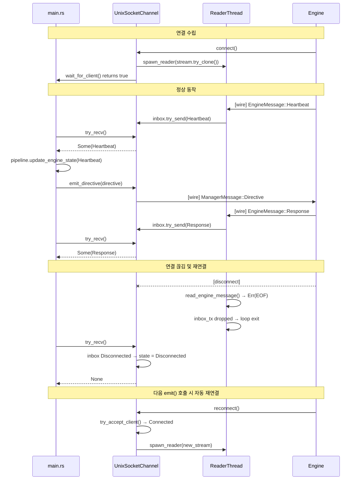

# 41. Manager 양방향 Unix Socket Transport 설계

> **Status**: Design (v1.0)
> **Author**: Architect
> **Date**: 2026-03-24
> **관련 문서**: `37_protocol_design.md` (프로토콜 명세), `27_manager_architecture.md` (Manager 구조)

---

## 1. 문제

### 1-1. 현재 상태

`UnixSocketEmitter`는 write-only 구조다. Engine이 전송하는 `EngineMessage::Capability`, `Heartbeat`, `Response`를 Manager가 수신하지 못한다.

```
현재:
  Manager → Engine: ManagerMessage::Directive  ✓  (UnixSocketEmitter)
  Manager ← Engine: EngineMessage::*           ✗  (수신 불가)
```

결과적으로 `pipeline.rs`의 `engine_state: FeatureVector`는 항상 zero vector로 유지되고, QCF 추정과 Action Selection이 실제 Engine 상태를 반영하지 못한다.

### 1-2. 초기 설계안의 문제 (UnixSocketEmitter에 reader 추가)

```rust
// 제안됐으나 채택하지 않는 방식
pub struct UnixSocketEmitter {
    socket_path: PathBuf,
    writer: Option<UnixStream>,
    reader_handle: Option<JoinHandle<()>>,  // 추가하면?
    listener: UnixListener,
}
```

이 방식에는 세 가지 SOLID 위반이 발생한다.

**SRP 위반**: 단일 struct가 소켓 서버 lifecycle, 아웃바운드 전송, 인바운드 수신을 모두 담당하게 된다. 연결 끊김 이벤트가 reader/writer 방향에서 비대칭으로 발생할 때 정리 로직이 얽힌다.

**ISP 위반**: `Emitter` trait에 `recv()` 메서드를 추가하면 `DbusEmitter`도 이를 구현해야 한다. D-Bus는 Engine이 직접 연결하지 않으므로 의미 있는 구현이 불가하다. `unimplemented!()` 또는 항상 `Ok(None)`을 반환하는 빈 구현이 강제된다.

**DIP 위반**: `main.rs`가 `Box<dyn Emitter>`를 통해서는 수신 기능에 접근할 수 없으므로, 인바운드 처리 로직을 위해 구체 타입 `UnixSocketEmitter`에 직접 의존해야 한다.

---

## 2. 제안 설계

### 2-1. 핵심 아이디어

**기존 `Emitter` trait은 수정하지 않는다. `EngineReceiver` trait을 별도로 추가한다.**

```
emitter/mod.rs         ← Emitter trait (기존 유지, 무수정)
emitter/unix_socket.rs ← UnixSocketEmitter (기존 유지, 무수정)
emitter/dbus.rs        ← DbusEmitter (기존 유지, 무수정)

channel/mod.rs         ← EngineReceiver trait, EngineChannel trait (신규)
channel/unix_socket.rs ← UnixSocketChannel (신규)
```

### 2-2. 새 Trait 정의

```rust
// manager/src/channel/mod.rs

use llm_shared::EngineMessage;
use crate::emitter::Emitter;

/// Engine → Manager 방향 수신 전용 인터페이스.
///
/// Emitter와 분리하여 ISP를 준수한다.
/// DbusEmitter 등 수신 기능이 없는 구현체는 이 trait을 구현하지 않는다.
pub trait EngineReceiver: Send {
    /// Engine으로부터 메시지를 수신한다 (non-blocking).
    /// 수신된 메시지가 없으면 Ok(None)을 반환한다.
    fn try_recv(&mut self) -> anyhow::Result<Option<EngineMessage>>;

    /// 수신 채널이 살아있는지 확인한다.
    fn is_connected(&self) -> bool;
}

/// Emitter + EngineReceiver를 모두 구현하는 구조체를 위한 조합 trait.
/// main.rs는 이 trait을 통해 양방향 채널에 접근한다.
pub trait EngineChannel: Emitter + EngineReceiver {}

// 블랭킷 구현 — Emitter + EngineReceiver를 모두 구현하면 자동으로 EngineChannel
impl<T: Emitter + EngineReceiver> EngineChannel for T {}
```

### 2-3. 연결 상태 State Machine

```rust
// manager/src/channel/unix_socket.rs

/// 연결 상태를 명시적으로 모델링한다.
///
/// Writer 에러와 Reader EOF 모두 Disconnected로 수렴하여
/// 비대칭 연결 끊김 처리를 단순화한다.
enum ConnectionState {
    /// 소켓을 bind했지만 클라이언트 미연결.
    Listening,
    /// 클라이언트 연결됨.
    Connected {
        writer: UnixStream,
        /// reader thread가 파싱한 메시지를 push하는 채널의 수신단.
        inbox: mpsc::Receiver<EngineMessage>,
        /// reader thread RAII 핸들.
        _reader: ReaderHandle,
    },
    /// 연결이 끊어짐 — 다음 emit() 호출 시 재연결 시도.
    Disconnected,
}

pub struct UnixSocketChannel {
    socket_path: PathBuf,
    listener: UnixListener,   // listener는 항상 보유 (재연결에 재사용)
    state: ConnectionState,
}
```

**상태 전이 규칙:**

```
Listening    ──(accept)──────────→ Connected
Connected    ──(write err)───────→ Disconnected
Connected    ──(inbox Disconnected)→ Disconnected
Disconnected ──(try_accept)──────→ Connected  (다음 emit() 호출 시)
```

### 2-4. Reader Thread

```rust
/// Reader thread를 RAII로 관리한다.
struct ReaderHandle {
    handle: JoinHandle<()>,
}

impl Drop for ReaderHandle {
    fn drop(&mut self) {
        // thread는 stream EOF 시 자연 종료된다.
        // handle은 의도적으로 join하지 않는다 (main loop 지연 방지).
    }
}

fn spawn_reader(
    mut stream: UnixStream,
    inbox_tx: mpsc::SyncSender<EngineMessage>,
) -> ReaderHandle {
    let handle = thread::Builder::new()
        .name("engine-reader".into())
        .spawn(move || {
            loop {
                match read_engine_message(&mut stream) {
                    Ok(msg) => {
                        if inbox_tx.try_send(msg).is_err() {
                            break; // channel full 또는 receiver dropped
                        }
                    }
                    Err(_) => break, // EOF 또는 I/O 에러
                }
            }
            // inbox_tx drop → Receiver::try_recv()가 Disconnected 반환
        })
        .expect("spawn engine-reader");
    ReaderHandle { handle }
}
```

**inbox 용량**: `mpsc::sync_channel(64)`를 권장한다. Engine의 heartbeat 빈도(~100ms)에 비해 충분하며, 처리 지연이 64개를 넘으면 reader thread가 차단되어 소켓 버퍼를 통한 자연스러운 백압력이 Engine에 전달된다.

### 2-5. Emitter + EngineReceiver 구현 패턴

```rust
impl Emitter for UnixSocketChannel {
    fn emit(&mut self, signal: &SystemSignal) -> anyhow::Result<()> {
        self.ensure_connected();
        if let ConnectionState::Connected { writer, .. } = &mut self.state {
            if write_signal(writer, signal).is_err() {
                self.state = ConnectionState::Disconnected;
            }
        }
        Ok(()) // 클라이언트 없음 또는 연결 끊김은 치명적이지 않음
    }
    // emit_initial, emit_directive도 동일 패턴
}

impl EngineReceiver for UnixSocketChannel {
    fn try_recv(&mut self) -> anyhow::Result<Option<EngineMessage>> {
        if let ConnectionState::Connected { inbox, .. } = &self.state {
            match inbox.try_recv() {
                Ok(msg) => return Ok(Some(msg)),
                Err(mpsc::TryRecvError::Empty) => return Ok(None),
                Err(mpsc::TryRecvError::Disconnected) => {
                    // reader thread 종료 감지 → 상태 전이
                }
            }
        }
        self.state = ConnectionState::Disconnected; // Connected에서 온 경우만 전이
        Ok(None)
    }

    fn is_connected(&self) -> bool {
        matches!(self.state, ConnectionState::Connected { .. })
    }
}
```

### 2-6. main.rs 통합

```rust
// 반환 타입:
// unix transport → (Box<dyn Emitter>, Some(Box<dyn EngineReceiver>))
// dbus transport → (Box<dyn Emitter>, None)

// main loop 내 engine 메시지 처리 (signal recv_timeout 루프 상단에 추가):
if let Some(ref mut receiver) = engine_receiver {
    while let Ok(Some(msg)) = receiver.try_recv() {
        match &msg {
            EngineMessage::Heartbeat(status) => {
                if let Some(ref mut p) = pipeline {
                    p.update_engine_state(&msg);
                }
                log::debug!("Engine heartbeat: kv={:.2}", status.kv_cache_utilization);
            }
            EngineMessage::Response(resp) => {
                log::info!("Engine response seq={}: {:?}", resp.seq_id, resp.results);
            }
            EngineMessage::Capability(cap) => {
                log::info!("Engine capability: devices={:?}", cap.available_devices);
            }
        }
    }
}
```

### 2-7. pipeline.rs 확장

```rust
impl PolicyPipeline {
    /// Engine heartbeat에서 engine_state feature vector를 갱신한다.
    ///
    /// 37_protocol_design.md §6의 Feature Vector 스키마를 따른다.
    pub fn update_engine_state(&mut self, msg: &EngineMessage) {
        if let EngineMessage::Heartbeat(status) = msg {
            self.engine_state.values[0] = status.kv_cache_utilization;
            self.engine_state.values[1] =
                if status.active_device == "opencl" { 1.0 } else { 0.0 };
            self.engine_state.values[7] =
                if status.state == EngineState::Running { 1.0 } else { 0.0 };
            self.engine_state.values[8] = status.memory_lossless_min;
            self.engine_state.values[9] = status.memory_lossy_min;
            // 나머지 인덱스는 37_protocol_design.md §6 참조
        }
    }
}
```

---

## 3. 아키텍처 다이어그램

```mermaid
classDiagram
    class Emitter {
        <<trait>>
        +emit(signal) Result
        +emit_initial(signals) Result
        +emit_directive(directive) Result
        +name() str
    }

    class EngineReceiver {
        <<trait>>
        +try_recv() Result~Option~EngineMessage~~
        +is_connected() bool
    }

    class EngineChannel {
        <<trait>>
    }

    class UnixSocketEmitter {
        -socket_path: PathBuf
        -client: Option~UnixStream~
        -listener: UnixListener
    }

    class DbusEmitter {
        -conn: Connection
    }

    class UnixSocketChannel {
        -socket_path: PathBuf
        -listener: UnixListener
        -state: ConnectionState
        +new(path) Result
        +wait_for_client(timeout) bool
    }

    class ConnectionState {
        <<enum>>
        Listening
        Connected~writer, inbox, _reader~
        Disconnected
    }

    class ReaderHandle {
        -handle: JoinHandle
    }

    Emitter <|.. UnixSocketEmitter : implements
    Emitter <|.. DbusEmitter : implements
    Emitter <|.. UnixSocketChannel : implements
    EngineReceiver <|.. UnixSocketChannel : implements
    EngineChannel <-- Emitter : requires
    EngineChannel <-- EngineReceiver : requires

    UnixSocketChannel --> ConnectionState : owns
    ConnectionState --> ReaderHandle : owns (Connected)
    ConnectionState --> "mpsc::Receiver~EngineMessage~" : owns (Connected)
```



---

## 4. 트레이드오프

| 방안 | 장점 | 단점 |
|------|------|------|
| **제안: 분리된 EngineReceiver trait** | ISP 준수, DbusEmitter/UnixSocketEmitter 무변경, 명확한 책임 분리 | channel/ 모듈 신규 추가 필요 |
| UnixSocketEmitter에 reader 추가 | 파일 추가 없음 | SRP/ISP/DIP 위반, 재연결 로직 복잡 |
| Emitter trait에 recv 추가 | 단일 trait으로 단순 | ISP 위반, DbusEmitter에 빈 구현 강제 |

---

## 5. 리스크 분석

| 리스크 | 심각도 | 완화 방안 |
|--------|--------|-----------|
| 기존 emit 동작 회귀 | 낮음 | UnixSocketEmitter 무수정. 기존 roundtrip_* 테스트 그대로 통과. |
| reader thread 누수 | 낮음 | ReaderHandle RAII. Disconnected 전이 시 이전 handle 자동 drop. |
| inbox 백압력 누락 | 낮음 | `sync_channel(64)` bounded channel로 자연 백압력 전달. |
| 재연결 시 중복 수락 | 중간 | `ensure_connected()`에서 상태 체크. 통합 테스트로 검증 필요. |
| engine_state 갱신 전 QCF 계산 | 낮음 | 단계적 적용: 1단계 수신 로깅만 → 2단계 pipeline 연결. |

---

## 6. 영향 범위

### 변경 필요 파일

| 파일 | 변경 종류 |
|------|---------|
| `manager/src/channel/mod.rs` | 신규 — `EngineReceiver`, `EngineChannel` trait |
| `manager/src/channel/unix_socket.rs` | 신규 — `UnixSocketChannel`, `ReaderHandle`, `ConnectionState` |
| `manager/src/lib.rs` | 추가 — `pub mod channel;` |
| `manager/src/main.rs` | 수정 — receiver 처리 루프, `pipeline.update_engine_state()` 연결 |
| `manager/src/pipeline.rs` | 수정 — `pub fn update_engine_state(&mut self, msg: &EngineMessage)` 추가 |

### 변경 없는 파일

| 파일 | 이유 |
|------|------|
| `manager/src/emitter/mod.rs` | Emitter trait 무변경 (ISP 준수의 핵심) |
| `manager/src/emitter/unix_socket.rs` | UnixSocketEmitter 무변경 |
| `manager/src/emitter/dbus.rs` | DbusEmitter 무변경 |
| `shared/src/lib.rs` | 공유 타입 무변경 |
| `engine/` 전체 | Engine 측 수정 없음 |

---

## 7. 테스트 전략

### 단위 테스트 (`channel/unix_socket.rs`)

```rust
// 1. 정상 수신
#[test]
fn try_recv_returns_heartbeat_from_engine()

// 2. 메시지 없음 (non-blocking)
#[test]
fn try_recv_returns_none_when_no_message()

// 3. reader thread EOF → Disconnected 전이
#[test]
fn disconnected_after_reader_eof()

// 4. 재연결 — 1st client disconnect → 2nd client connect → emit 정상
#[test]
fn reconnect_after_disconnect()

// 5. writer 에러 → Disconnected 전이
#[test]
fn disconnected_after_write_error()
```

### 단위 테스트 (`pipeline.rs`)

```rust
// engine_state vector 갱신 확인
#[test]
fn engine_state_updated_from_heartbeat()

// Capability, Response는 engine_state를 변경하지 않음
#[test]
fn non_heartbeat_message_does_not_change_engine_state()
```

### 통합 검증

기존 `mock_engine` 바이너리를 그대로 사용:

```bash
# Terminal 1
cargo run -p llm_manager -- --transport unix:/tmp/llm.sock

# Terminal 2
cargo run -p llm_manager --bin mock_engine -- --socket /tmp/llm.sock --heartbeat-ms 100
```

Manager 로그에서 `Engine heartbeat`, `Engine capability` 메시지가 출력되고,
`pipeline.engine_state`가 zero가 아닌 값으로 갱신되는지 확인한다.

---

## 8. 관련 문서

- `37_protocol_design.md` — Manager ↔ Engine 프로토콜 (EngineMessage, ManagerMessage 타입 정의)
- `27_manager_architecture.md` — Manager 서비스 내부 아키텍처
- `36_policy_design.md` — Hierarchical Policy 설계 (engine_state 사용 컨텍스트)
