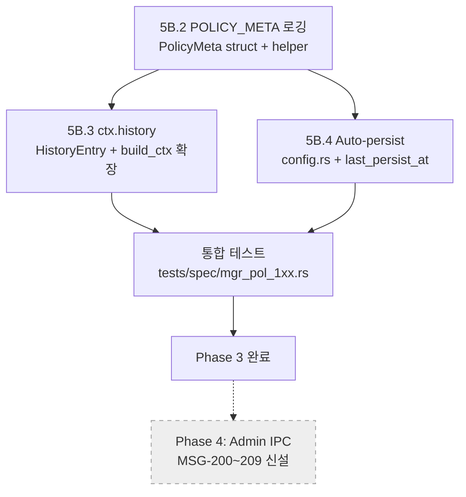

# Production Lua 정책 설계

> **작성일**: 2026-04-15
> **대상**: `manager/scripts/policy_example.lua`를 production 운영에 사용 가능한 수준으로 발전시키기 위한 설계 문서
> **관련**: `docs/42_policy_simulator_guide.md` (시뮬레이터 사용법), `manager/src/lua_policy.rs`, `manager/src/pipeline.rs`
> **Spec ID 후보**: MGR-POL-1xx 대역 (미할당, 본 문서 채택 시 `/spec-manage`로 할당)

> **파일 번호 주의**: 원래 요청은 `docs/42_production_lua_policy_design.md`였으나
> `docs/42_policy_simulator_guide.md`가 선점되어 있어 43으로 올렸다.

---

## 1. 현황 분석

### 1.1 `ctx` API 전체 목록

`manager/src/lua_policy.rs::build_ctx()`가 매 `process_signal()`마다 구성하는 Lua 테이블 전체:

```
ctx
├── engine                        -- EngineStatus heartbeat 미러 (없으면 defaults)
│   ├── device          : string  -- 현재 활성 백엔드 ("cpu" | "opencl" | "unknown")
│   ├── throughput      : f32     -- actual_throughput (tokens/s)
│   ├── kv_util         : f32     -- kv_cache_utilization (0.0~1.0)
│   ├── cache_tokens    : usize   -- kv_cache_tokens
│   ├── cache_bytes     : u64     -- kv_cache_bytes
│   ├── tokens_generated: usize
│   ├── state           : string  -- "idle" | "running" | "suspended"
│   ├── kv_dtype        : string  -- "", "f16", "q8", "q4", "q2"
│   ├── skip_ratio      : f32
│   ├── phase           : string  -- "", "prefill", "decode"
│   ├── prefill_pos     : usize
│   ├── prefill_total   : usize
│   ├── partition_ratio : f32
│   ├── cpu_pct         : f64     -- engine 프로세스 자체 CPU (MSG-067)
│   └── gpu_pct         : f64     -- Phase 1 placeholder(0.0) (MSG-068)
├── active : string[]             -- EngineStatus.active_actions 미러
├── signal
│   ├── memory.{available, total}            : u64
│   ├── compute.{cpu_pct, gpu_pct}           : f64
│   └── thermal.{temp_c, throttling}         : f64, bool
├── coef
│   ├── pressure.{gpu, cpu, memory, thermal, latency, main_app} : f32
│   ├── trigger.{tbt_degraded, mem_low, temp_high}              : bool
│   └── relief[action]
│         ├── gpu, cpu, mem, therm : f32  -- 압박 감소 (before − after, 양수=개선)
│         ├── lat                   : f32  -- 레이턴시 비용 (양수=감소, 음수=증가)
│         └── qos                   : f32  -- main_app QoS (after − before)
└── sys.* (전역)                   -- read, meminfo, thermal, gpu_busy, gpu_freq, cpu_freq, foreground_fps
```

`coef.relief`에 노출되는 액션 이름 집합 (`build_ctx` L601):

```
switch_hw, throttle, set_target_tbt, layer_skip,
kv_evict_h2o, kv_evict_sliding, kv_streaming,
kv_merge_d2o, kv_quant_dynamic, set_partition_ratio
```

### 1.2 `EngineCommand` 지원 매트릭스

`shared/src/lib.rs::EngineCommand`와 `parse_single_action()`의 일치성:

| EngineCommand variant | Lua 파서 지원 | `ctx.coef.relief` 노출 | harness apply | observable |
|---|---|---|---|---|
| `Throttle` | O | O | O | O |
| `SetTargetTbt` | O | O | O | X (의도적) |
| `LayerSkip` | O | O | O | O |
| `KvEvictH2o` | O | O | O | O |
| `KvEvictSliding` | O | O | O | O |
| `KvStreaming {sink_size, window_size}` | O | O | **X (apply 누락)** | **X** |
| `KvMergeD2o` | O | O | O | O (이름: `kv_evict_d2o`) |
| `KvQuantDynamic` | O | O | O | **X (observable 누락)** |
| `SwitchHw` | O | O | O | O |
| `RestoreDefaults` | O | - | O | X (의도적) |
| `Suspend` / `Resume` | O | **X** | **X** | X |
| `SetPartitionRatio` | O | O | O | O |
| `SetPrefillPolicy` | O | **X** | **X** | **X** |
| `RequestQcf` | **X** | **X** | - | - |
| `PrepareComputeUnit` | **X** | **X** | - | - |

### 1.3 `policy_example.lua` 현재 로직 요약

단일 함수 `decide(ctx)`, 85 줄, 결정 절차:

1. **Gate**: `trigger.tbt_degraded || mem_low || temp_high` 중 하나도 없으면 개입 없음
   - 예외: `#ctx.active > 0` 이고 모든 `pressure.{gpu,memory,thermal} < 0.3` → `restore_defaults`
2. **도메인 선정**: `pressure.{gpu, cpu, memory, thermal}` 중 최대값 1개 선택 (동률 시 알파벳 역순 tiebreak)
3. **액션 선정**: 해당 도메인에서 relief가 가장 큰 액션 중 `lat >= -0.15`인 것 (argmax)
4. **파라미터**: action 이름 기반 하드코딩 — 예를 들어 eviction류는 `keep_ratio=0.5` 고정, `throttle=50ms`, `target_bits=4`, `partition_ratio=0.5`
5. **반환**: 1개 액션 `{cmd}` 또는 빈 리스트

### 1.4 시뮬레이션 관측 결과 (2026-04-15)

사용자 보고 요약:

- memory_pressure Critical→Emergency(0.90) 구간에서 `kv_quant_dynamic → kv_evict_h2o → kv_evict_sliding → kv_merge_d2o` 4개 액션이 순환 발동
- 이유: 정책이 단일 action만 반환 → 매 tick 도메인 최대값이 여전히 memory → 직전 액션은 `active`에 포함되어 상태가 바뀌어도 도메인 압박은 거의 유지 → relief argmax가 tick마다 달라지면서 순환
- `kv_quant_dynamic` EWMA relief가 prior 0.5 → 0.19로 수렴 → quant가 선언된 prior만큼 효과적이지 않음을 학습 (정상 동작)

---

## 2. 갭 분석

### 2.1 필수 보완 사항 (P0 — production 운영 불가 사유)

#### P0-1. 단일 action 반환으로 인한 복합 대응 불가

`EngineDirective { commands: Vec<EngineCommand> }`는 구조적으로 복수 명령을 지원한다. `MemoryStrategy::react()`는 Emergency 수준에서 `[Evict{0.25}, RejectNew]` 2개를 반환한다. 현재 Lua는 단 1개만 반환하여 Rust 전략 대비 표현력이 떨어진다.

**실제 시뮬 증상**: Memory Emergency에서 Evict 하나만 나가므로 신규 요청 제한이 없고, Thermal Emergency에서 Suspend 하나만 나가므로 현재 진행 중 요청의 throttle이 없다.

**고려 사항**: `LuaPolicy::process_signal()`은 `commands.len() == 1`일 때만 observation을 큐잉하고, 멀티 커맨드일 때는 쌓여있던 관측을 `observation_overrun_count`로 폐기한다 (L815~820). 따라서 **복수 action 반환은 observation 귀속 불가**라는 명시적 트레이드오프가 있다. Production 정책에서는 "필수 복합 대응은 허용하되, relief 학습은 단일 action 경로로 수집"하는 하이브리드가 필요하다.

#### P0-2. Emergency 에스컬레이션 부재

현재 스크립트는 `pressure.memory = 0.95`나 `0.85`를 동일하게 처리한다. Rust `MemoryStrategy`는 Level별 differentiate:

| Level | MemoryStrategy | 현재 Lua |
|---|---|---|
| Warning | Evict(0.85) | pressure > 0.80 → argmax relief action |
| Critical | Evict(0.50) | 동일 |
| Emergency | Evict(0.25) + RejectNew | 동일 |

Warning/Critical/Emergency 구분이 실질적으로 없다. `ctx.signal.memory`에서 직접 계산 가능하나 `coef.pressure`만 사용한다.

#### P0-3. `SetPrefillPolicy` 미지원 (harness + observable 이중 갭)

Prefill 단계의 GPU 독점을 완화하는 유일한 메커니즘 (chunk_size, yield_ms, cpu_chunk_size). Production 게임 + LLM 동시 실행 시나리오의 핵심 도구인데 Lua에서 접근은 가능하지만 시뮬 harness가 apply하지 않고 `observable_action_name()`도 None을 반환한다. **harness는 Implementer 책임이므로 본 문서는 요구사항만 기록**.

#### P0-4. `Suspend` / `Resume` 미노출

Thermal Emergency에서 `ResilienceAction::Suspend`를 유일 액션으로 반환하는 게 Rust 전략 관행. 현재 Lua에는 `coef.relief["suspend"]`가 없고, 설사 수동으로 `{type="suspend"}`를 반환해도 simulator harness의 apply가 없다.

#### P0-5. Lua 런타임 오류에 대한 fallback 전무

`call_decide()`는 Lua 오류 시 `Vec::new()` (무행동)을 반환한다. 타입 mismatch 하나로 정책이 조용히 침묵할 수 있고, 운영자가 `log::error!`를 놓치면 압박 상황에서 무대응으로 이어진다.

### 2.2 권장 보완 사항 (P1 — 신뢰성/운영성 개선)

#### P1-1. Action 파라미터 동적화

현재 `keep_ratio = 0.5` 고정. 압박도에 따라 더 공격적인 eviction이 필요하다:

- `pressure.memory < 0.8`: keep_ratio = 0.85
- `pressure.memory < 0.9`: keep_ratio = 0.50
- `pressure.memory >= 0.9`: keep_ratio = 0.25

`kv_quant_dynamic.target_bits`도 마찬가지로 점진 하강 (16→8→4→2). 현재는 무조건 4bit.

#### P1-2. 학습값 활용 실패 — `lat` 제약이 너무 느슨

현재 `lat >= -0.15` 필터. `default_relief`에서 `kv_evict_h2o.lat = 0.0`, `switch_hw.lat = -0.1`로 설정되어 있어 실질적으로 모든 액션이 통과한다. `policy_config.toml` prior도 대부분 `lat ∈ [-0.2, 0.0]` 범위라 필터가 차단하는 경우가 없다. 관측된 relief가 수렴하기 전까지는 임계값이 의미 없다.

#### P1-3. 행동 직후 재평가 방지 (cooldown)

이미 `DirectiveDeduplicator`가 60s cooldown으로 동일 directive를 억제하지만, **다른** 액션이 번갈아 나가면 dedup이 통과한다. 시뮬 결과의 4개 액션 순환이 이 패턴이다. 정책 레벨에서 "직전 action이 아직 `active`에 있고 observation이 아직 성숙하지 않았으면 새 action을 내지 않는다"는 가드가 필요하다.

#### P1-4. `restore_defaults` 조건 부정확

현재 조건: `trigger가 모두 false` AND `active > 0` AND `pressure.{gpu, memory, thermal} < 0.3`.

- `pressure.cpu`는 빠져있음 — cpu 압박이 여전해도 restore
- trigger exit 임계값은 `mem_exit=0.60`, `tbt_exit=0.10`이지만 Lua에서는 0.3 임의 값 사용 → trigger 재진입 진동 가능
- trigger 기반으로 바꾸는 것이 일관적 (`trigger.mem_low == false`라면 `mem_exit` 이하라는 뜻)

#### P1-5. Hot-reload 부재

`LuaPolicy::new()`는 스크립트를 한 번만 읽는다. 정책 수정 시 전체 `llm_manager` 재시작 필요. SIGHUP 핸들러나 파일 mtime watch로 `decide` function 재로드가 필요.

#### P1-6. 정책 버전/시그니처

Lua 스크립트에서 `policy_version = "1.2.0"` 같은 전역을 선언하고 Manager가 로그에 기록하는 관행 필요. 현재는 `script_path`만 로그되므로 배포된 정책의 실제 내용을 추적 불가.

### 2.3 선택 개선 사항 (P2 — 고급 기능)

#### P2-1. 멀티 도메인 병렬 대응

현재 도메인 argmax 하나만 선택. 실제로는 메모리 + 써멀이 동시에 Warning 이상이면 각각 대응하는 게 맞다. 다만 P0-1 트레이드오프(observation 귀속)와 맞물려 설계 필요.

#### P2-2. `ctx.history` 제공

`ctx.engine`에 직전 tick 상태가 없다. Lua 스크립트가 전역 변수로 자체 저장 중이나 형식이 제각각. Rust에서 short history (예: 최근 10 tick의 pressure + active_actions)를 제공하면 정책이 더 정교한 패턴 인식 가능.

#### P2-3. `ctx.engine.cache_capacity` 미제공

현재 `cache_tokens`, `cache_bytes`는 있지만 capacity/max는 `EngineCapability` 메시지에만 있고 heartbeat에는 없다. Lua가 "앞으로 얼마나 더 쌓일 수 있는가"를 모른다. `EngineCapability`를 `LuaPolicy`가 보관하고 `ctx.engine.max_kv_tokens` / `bytes_per_kv_token` / `num_layers`를 노출해야 한다.

#### P2-4. `EnergyConstraint` signal이 `coef`에 미반영

`process_signal`의 EnergyConstraint 분기는 주석만 "Energy는 trigger에 포함되지 않음"이고 실제로 pressure 6D에도 반영되지 않는다. 배터리 상태에서 정책이 판단 불가.

---

## 3. 설계 결정

### 3.1 Action 파라미터 동적화 설계

파라미터는 Lua에서 `pressure.memory` 값을 직접 받아 결정하되, 경계값은 `policy_config.toml`에서 주입받는다.

**Lua 레벨 테이블 정의**:

```lua
-- 각 액션의 파라미터를 pressure level에 따라 생성하는 closure table.
local ACTION_BUILDERS = {
    kv_evict_sliding = function(pressure)
        local keep = 0.85
        if pressure.memory >= 0.90 then keep = 0.25
        elseif pressure.memory >= 0.80 then keep = 0.50
        elseif pressure.memory >= 0.70 then keep = 0.70
        end
        return {type = "kv_evict_sliding", keep_ratio = keep}
    end,
    kv_quant_dynamic = function(pressure)
        local bits = 16
        if pressure.memory >= 0.90 then bits = 2
        elseif pressure.memory >= 0.80 then bits = 4
        elseif pressure.memory >= 0.70 then bits = 8
        end
        return {type = "kv_quant_dynamic", target_bits = bits}
    end,
    throttle = function(pressure)
        -- CPU 도메인: 압박 * 200ms, 최소 20ms
        local delay = math.max(20, math.floor(pressure.cpu * 200))
        return {type = "throttle", delay_ms = delay}
    end,
    -- ... 기타 액션 동일 패턴
}
```

**설계 근거**:
- 하드코딩 분기를 Lua에 집중 → config 파일 포맷 확장 없이 정책만 교체 가능
- Relief 학습 결과는 **액션 선택**에 쓰고, **파라미터 선택**은 pressure 기반 룰로 분리 — relief 테이블의 차원이 폭증하는 것을 방지 (6D 그대로 유지)
- 파라미터가 pressure에 단조 증가하므로 Emergency → Warning 회복 시 자연스럽게 완화됨

**대안 검토**:
- (기각) 파라미터를 `ctx.coef.relief[action].param`으로 제공 — RELIEF_DIMS 확장 필요, prior 튜닝이 액션×파라미터 조합만큼 폭증
- (기각) `toml`의 `[action_params]` 섹션에 모든 경계값 외부화 — 정책 교체 시마다 config도 교체해야 함. Lua 자체가 이미 스크립트이므로 중복

### 3.2 멀티 커맨드 반환 설계 (관측성과의 트레이드오프)

정책을 **"주 action (관측 대상) + 보조 action (부가 효과)"** 2-tier로 구성.

```lua
function decide(ctx)
    local primary = select_primary(ctx)   -- 기존 argmax 로직
    if not primary then return {} end

    local result = {primary}
    -- Emergency 수준에서만 보조 액션 추가
    if ctx.coef.pressure.memory >= 0.90 then
        -- 메모리 Emergency: eviction + 신규 요청 차단 유사
        -- (EngineCommand에 RejectNew가 없으므로 SetTargetTbt로 강한 throttle)
        table.insert(result, {type = "set_target_tbt", target_ms = 500})
    end
    return result
end
```

**관측성 처리**:
- `LuaPolicy::process_signal`의 현재 로직 (`commands.len() == 1`이 아니면 관측 포기) 유지
- 대신 스크립트 관행으로 "primary action이 `active`에 이미 있으면 primary를 생략하고 보조만 반환" → observation이 필요 없는 경우를 구분
- **규칙**: "새 학습을 원하면 단일 action 반환, 복합 대응을 원하면 observation 포기"를 스크립트 주석으로 명시

**대안 검토**:
- (기각) `LuaPolicy`에 "primary action" 개념을 Rust에 추가하여 멀티에서도 관측 — 프로토콜 변경 범위 큼, 지금 단계에선 과잉
- (채택) 스크립트 convention으로 해결 + relief 학습은 단일 action 경로로 수렴할 때만 일어난다는 점을 문서화

### 3.3 Emergency 에스컬레이션 설계

```
pressure.memory   액션 조합
<0.70            (intervention 없음, restore_defaults 후보)
[0.70, 0.80)     kv_evict_sliding(keep=0.70)
[0.80, 0.90)     kv_evict_sliding(keep=0.50) + kv_quant_dynamic(bits=4)  [Critical]
>=0.90           kv_evict_sliding(keep=0.25) + set_target_tbt(500ms)     [Emergency]
                 + (optional) kv_quant_dynamic(bits=2)
```

**단, relief 학습 결과가 prior보다 확연히 낮으면** (예: `kv_quant_dynamic.mem = 0.19 << prior 0.50`) 해당 액션은 낮은 압박 구간에서만 사용하고 Emergency에서는 배제. 판정 로직:

```lua
-- 특정 action의 relief가 "실효 학습됨"인지 판정
local function is_learned(action)
    local r = ctx.coef.relief[action]
    -- default_relief 대비 실제 관측이 크게 낮아졌으면 회피
    -- (스크립트에서 prior 테이블도 복제 보관 필요 — ctx 에 없음)
    return PRIOR_SNAPSHOT[action] and r.mem >= PRIOR_SNAPSHOT[action].mem * 0.5
end
```

**(권장 ctx 확장)**: `ctx.coef.relief_prior[action]`으로 prior 값을 함께 노출하면 위 로직이 자체완결된다. Implementer 요청 대상.

### 3.4 에러 핸들링 + Fallback 설계

현재 `call_decide()`가 `Vec::new()` 반환. 다음과 같이 개선한다 (Implementer 요청 대상):

```
1. Lua runtime error → structured ERROR 이벤트 + fallback_policy 호출
2. fallback_policy는 Rust 하드코딩: MemoryStrategy와 동일한 Level 기반 매핑
3. 연속 N회(기본 3) 실패 시 영구 fallback 모드 전환 + 메트릭 증가
4. 관리 CLI로 Lua 재로드 시도
```

**관련 spec ID 후보**: `MGR-POL-110` (Lua fallback), `MGR-POL-111` (reload 핸들러), `INV-100` (fallback 전환 조건).

### 3.5 Hot-reload 설계

**옵션 A**: SIGHUP 핸들러 (POSIX 관행)
**옵션 B**: `mtime` watch (tokio 기반)
**옵션 C**: Admin IPC endpoint (`reload_policy` RPC)

Production에서는 B+C 조합 권장:
- B로 파일 수정 자동 감지 (개발자 편의)
- C로 명시적 제어 (운영 절차)
- 재로드 실패 시 기존 스크립트 유지, 에러만 로그

**주의**: `relief_table` 상태는 재로드 시 **보존**해야 한다 (재시작하면 학습 초기화). `LuaPolicy`의 `Lua` VM만 교체하고 `relief_table`, `trigger_engine`, `observations`는 그대로 유지.

### 3.6 정책 버전 관리 설계

Lua 스크립트 상단에 메타데이터 전역 선언 규약:

```lua
POLICY_META = {
    name    = "llm_default",
    version = "1.0.0",
    sha256  = "...",   -- CI에서 주입
    commit  = "...",   -- CI에서 주입
}
```

`LuaPolicy::new()`가 `POLICY_META`를 읽어 로그 + heartbeat 사이드 채널로 보고. 유효성 검증은 없음 (관습).

---

## 4. `default_relief` 적절성 분석

사용자 보고의 `kv_quant_dynamic.mem: 0.5 → 0.19` 수렴을 토대로 전체 prior를 재평가한다.

| Action | prior `mem` | 시뮬 추정 학습치 | 갭 | 판정 |
|---|---|---|---|---|
| `kv_evict_h2o` | 0.4 | — | — | 학습치 대기 |
| `kv_evict_sliding` | 0.3 | — | — | 학습치 대기 |
| `kv_merge_d2o` | 0.3 | — | — | 학습치 대기 |
| `kv_quant_dynamic` | **0.5** | **0.19** | **-0.31 (60% 감소)** | prior 과대평가 |
| `switch_hw` | 0.0 | — | — | 구조상 mem 무영향 |

**의미**: prior 0.5는 "quant로 메모리 절반 감소"를 가정하지만, 실제로는
- Q4_0은 이미 원래 weight가 Q4이므로 KV cache만 재-quant → 총 메모리 영향 제한적
- KV cache가 전체 메모리의 일부만 차지 (Llama 1B + 2048 컨텍스트 기준 약 256MB / 총 ~1GB)
- 따라서 `mem pressure 감소 ≈ 0.256 / total_mem_pressure_delta` → 0.15~0.20이 현실적

**조치안**:
1. 시뮬레이션 완료 후 학습된 relief를 `policy_config.toml`의 `default_relief`로 승격
2. prior weight를 현재 alpha-EWMA 방식에서 **belief-weighted average** (초기 관측 `prior_weight=5` 가상 관측에서 출발)로 전환하여 첫 관측의 영향을 줄임 — 이미 `hierarchical` feature의 `ReliefModelConfig.prior_weight`가 설계되어 있으나 LuaPolicy에는 적용 안 됨
3. prior 튜닝 가이드 문서화 — Tier별 디바이스 (Adreno 830, Mali G78 등)별로 실측 후 `default_relief_adreno830.toml` 등으로 분리

---

## 5. 구현 로드맵

### Phase 1 — 스크립트 레벨 개선 (순수 Lua, production 배포 즉시 가능)

P0-1, P0-2, P1-1, P1-2, P1-3, P1-4 대응:

1. `manager/scripts/policy_example.lua`를 `policy_default.lua`로 복사 후 개선
2. ACTION_BUILDERS 도입 (§3.1)
3. Level 에스컬레이션 분기 추가 (§3.3)
4. `POLICY_META` 전역 추가 (§3.6)
5. direct `active`-기반 cooldown (§P1-3): 전역 테이블에 `last_action_tick` 유지
6. sim_run으로 120s 시뮬 후 이전 버전 대비 관측 액션 다양성/순환 해소 확인

**산출물**: `manager/scripts/policy_default.lua`, `.agent/research/` 시뮬 결과

### Phase 2 — Lua runtime 인프라 (Rust 변경)

Implementer 작업 대상. Spec ID 할당 필요:

1. **P0-5 fallback**: `LuaPolicy` → `FallibleLuaPolicy` wrapper, 실패 시 Rust `DefaultPolicy` 위임
2. **P0-3 / P0-4 harness**: `sim/state.rs::apply_command`에 `KvStreaming`, `Suspend`, `Resume`, `SetPrefillPolicy` 처리 추가 + `observable_action_name()`에 `KvQuantDynamic`, `KvStreaming` 추가
3. **P1-5 reload**: SIGHUP 시그널 기반 `LuaPolicy::reload_script()` 메서드. VM만 새로 만들고 learned state 보존
4. **P2-3 capability 노출**: `LuaPolicy`가 `EngineCapability`도 보관, `ctx.engine.max_kv_tokens` 등 추가
5. **P2-4 energy signal**: `SignalState`에 `battery_pct` 등 추가, `pressure.energy` 6D 추가 → RELIEF_DIMS 확장 여부는 **별도 Spec 결정** (확장 시 JSON 포맷 변경, 마이그레이션 필요)

**산출물**: `manager/src/lua_policy.rs` 개정, `manager/src/lua_fallback.rs` (신규), `manager/src/sim/state.rs` 개정

### Phase 3 — Production hardening (운영 기능)

1. **P1-6 버전 로깅**: `POLICY_META` 읽어서 prometheus metric + heartbeat 확장
2. **P2-2 history**: ring buffer 구조체 + `ctx.history` 노출
3. Relief 테이블 auto-persist (현재는 `save_model` 호출 필요) + 체크섬 검증
4. Admin IPC: `GetPolicyStatus`, `ReloadPolicy`, `SetPolicyParam` RPC (manager CLI)

### Phase 4 — Prior 재-튜닝 (실측 기반)

1. 현재 `default_relief` 그대로 두고 production-like 시나리오 (compose 기반)에서 1000+ observation 수집
2. 디바이스별 (`Adreno 830`, `Mali G78`, `x86_64 dev`) 분리 `default_relief_<profile>.toml` 작성
3. 문서화: `docs/44_policy_prior_tuning.md` (신규) — 측정 절차, 디바이스별 prior 값, 주의 사항

---

## 5A. Phase 2 설계 결정 (2026-04-15 추가)

> Phase 2는 §5 로드맵의 두 번째 단계로, **Rust 레벨 production 안전 기능**을 `LuaPolicy`에 추가한다.
> 본 섹션은 구현 이전 설계 확정안이다. Implementer는 이 섹션의 시그니처/pseudo-code를 기준으로 구현한다.

### 5A.1 범위 및 목표

이번 Phase 2 작업은 다음 세 항목을 하나의 원자적 단위로 처리한다:

| 항목 | 카테고리 | 대상 파일 |
|---|---|---|
| **P0-5** Lua fallback | Rust 변경 | `manager/src/lua_policy.rs` |
| **P1-5** Hot-reload | Rust 변경 | `manager/src/lua_policy.rs`, `manager/src/main.rs` |
| **harness 갭** `KvQuantDynamic` observable | 시뮬 버그 수정 | `manager/src/sim/harness.rs` |

공통 불변식:
- **INV-101**: reload/fallback 전환 시 `relief_table`, `observations`, `observation_overrun_count`는 보존된다 (학습 초기화 금지).
- **INV-102**: fallback 경로가 생성한 action은 `relief_table.observe()`의 학습 대상이 아니다 (fallback은 "최후의 방어선"이며, Lua 정책의 학습 공간을 오염시키지 않는다).

### 5A.2 `LuaPolicy` 구조체 변경안

기존 `struct LuaPolicy` (lua_policy.rs:376)에 **2개 필드 추가**:

```rust
pub struct LuaPolicy {
    // ── 기존 필드 ── (변경 없음)
    lua: Lua,
    engine_state: Option<EngineStatus>,
    signal_state: SignalState,
    trigger_engine: TriggerEngine,
    relief_table: EwmaReliefTable,
    observations: VecDeque<ObservationContext>,
    adaptation_config: AdaptationConfig,
    clock: Arc<dyn Clock>,
    pending_relief_updates: Vec<ReliefUpdateEvent>,
    observation_overrun_count: u64,

    // ── Phase 2 신규 필드 ──
    /// Lua decide() 연속 실패 카운터. 성공 시 0으로 리셋.
    /// 3회 이상이면 `permanent_fallback = true`로 전환.
    consecutive_errors: u32,

    /// true면 Lua VM 호출을 우회하고 항상 fallback 정책을 실행한다.
    /// `reload_script()` 성공 시 false로 리셋.
    permanent_fallback: bool,

    /// 스크립트 경로 보관 (reload 시 재사용). `new()`에서 owned로 저장.
    /// 기존 `new()`는 `&str`만 받지만 내부적으로 `PathBuf`로 보관한다.
    script_path: std::path::PathBuf,
}
```

**추가 필드 선택 근거**:
- `consecutive_errors`: u32 — 3회 제한 + 메트릭 노출 가능성을 고려.
- `permanent_fallback`: bool — 상태 전이를 명시적으로 드러내어 로그/테스트 용이.
- `script_path: PathBuf` — reload 시 새 VM이 동일 스크립트를 재로드할 수 있게 한다 (`reload_script`가 `Option<&Path>` 인자를 받아도 되지만, SIGHUP 핸들러가 별도 인자 없이 reload를 호출할 수 있도록 내부 보관이 편리).

**fallback 전용 상수**:

```rust
/// Lua decide() 연속 실패 허용 횟수. 초과 시 permanent_fallback 진입.
const FALLBACK_ERROR_THRESHOLD: u32 = 3;
```

### 5A.3 Fallback 함수 시그니처 및 pseudo-code

**설계 원칙**:
1. `SystemSignal`의 `Level` + 대표 pressure 값으로만 결정 (Lua ctx 불필요, 따라서 Lua 오류와 무관하게 항상 동작).
2. `MemoryStrategy` (engine 쪽)의 매핑을 참고하되, Manager 도메인의 `EngineCommand`로 직역.
3. `ThermalAlert` + `ComputeGuidance`도 최소 대응 제공.
4. `EnergyConstraint`는 현재 Lua에서도 미처리이므로 fallback도 무행동 (빈 Vec).

**시그니처**:

```rust
impl LuaPolicy {
    /// Lua decide() 실패 또는 permanent_fallback 상태에서 호출.
    ///
    /// 순수 함수 — `self.signal_state`와 현재 처리 중인 `signal`만 참조한다.
    /// `relief_table`에는 영향을 주지 않는다 (INV-102).
    fn fallback_decide(&self, signal: &SystemSignal) -> Vec<EngineCommand> {
        // signal.level() + signal의 variant + signal_state의 최신 pressure로 결정
        match signal {
            SystemSignal::MemoryPressure { level, .. } => match level {
                Level::Normal   => vec![EngineCommand::RestoreDefaults],
                Level::Warning  => vec![EngineCommand::KvEvictSliding { keep_ratio: 0.85 }],
                Level::Critical => vec![EngineCommand::KvEvictSliding { keep_ratio: 0.50 }],
                Level::Emergency => vec![
                    EngineCommand::KvEvictSliding { keep_ratio: 0.25 },
                    EngineCommand::SetTargetTbt { target_ms: 500 },
                ],
            },
            SystemSignal::ThermalAlert { level, .. } => match level {
                Level::Normal | Level::Warning => vec![],
                Level::Critical  => vec![EngineCommand::Throttle { delay_ms: 100 }],
                Level::Emergency => vec![EngineCommand::Throttle { delay_ms: 200 }],
            },
            SystemSignal::ComputeGuidance { level, .. } => match level {
                Level::Normal | Level::Warning => vec![],
                Level::Critical  => vec![EngineCommand::Throttle { delay_ms: 50 }],
                Level::Emergency => vec![EngineCommand::Throttle { delay_ms: 150 }],
            },
            // EnergyConstraint: 현재 정책 설계 미확정 — 무행동
            SystemSignal::EnergyConstraint { .. } => vec![],
        }
    }
}
```

**`call_decide()` 통합 (pseudo-code)**:

```rust
fn call_decide(&mut self, signal: &SystemSignal) -> Vec<EngineCommand> {
    // permanent_fallback 모드면 Lua 우회
    if self.permanent_fallback {
        return self.fallback_decide(signal);
    }

    // Lua 호출 (기존 로직)
    let result: LuaResult<Vec<EngineCommand>> = (|| {
        let globals = self.lua.globals();
        let decide: mlua::Function = globals.get("decide")?;
        let ctx = self.build_ctx()?;
        let result: Value = decide.call(ctx)?;
        parse_actions(result)
    })();

    match result {
        Ok(commands) => {
            self.consecutive_errors = 0;    // 성공 → 리셋
            commands
        }
        Err(e) => {
            self.consecutive_errors += 1;
            log::error!(
                "Lua decide() error ({}/{}): {}",
                self.consecutive_errors, FALLBACK_ERROR_THRESHOLD, e
            );
            if self.consecutive_errors >= FALLBACK_ERROR_THRESHOLD {
                if !self.permanent_fallback {
                    log::error!(
                        "Lua policy entered permanent fallback after {} consecutive errors",
                        self.consecutive_errors
                    );
                    self.permanent_fallback = true;
                }
            }
            self.fallback_decide(signal)
        }
    }
}
```

**중요 시그니처 변경**:
- 현재 `call_decide(&self)` → **`call_decide(&mut self, signal: &SystemSignal)`**로 변경.
- 이유: `consecutive_errors`/`permanent_fallback` 갱신과 fallback 분기에 signal이 필요.
- 호출측 `process_signal()`은 이미 signal을 보유 — 인자 전달만 추가.

**Observation 처리 주의 (INV-102 이행)**:
- `process_signal()`에서 "commands.len() == 1이면 observation 큐에 push"하는 로직이 있다 (현재 L815 근처).
- fallback이 반환한 commands는 `relief_table`과 무관하므로 **observation 큐에 push하면 안 된다**.
- 구현 전략: `call_decide()`가 `(Vec<EngineCommand>, bool /* was_fallback */)` 튜플을 반환하거나, `process_signal` 내부에서 `self.permanent_fallback || self.consecutive_errors > 0`을 체크하여 "직전 호출이 fallback이었으면 observe 생략".
- **권장**: 튜플 반환. 상태 의존 로직보다 명시적.

```rust
fn call_decide(&mut self, signal: &SystemSignal) -> (Vec<EngineCommand>, bool) {
    // (..., was_fallback: bool)
    // true면 process_signal에서 observation 큐잉 스킵
}
```

### 5A.4 Hot-reload: `reload_script()` 메서드

**시그니처**:

```rust
impl LuaPolicy {
    /// Lua VM만 새 스크립트로 교체한다.
    ///
    /// # 보존되는 상태
    /// - `relief_table`, `observations`, `observation_overrun_count`
    /// - `pending_relief_updates`, `trigger_engine`, `signal_state`
    /// - `adaptation_config`, `clock`, `engine_state`
    ///
    /// # 리셋되는 상태
    /// - `consecutive_errors` → 0
    /// - `permanent_fallback` → false
    ///
    /// # 실패 시 (rollback)
    /// 새 VM 구축 또는 스크립트 로드가 실패하면 기존 `self.lua`를 유지하고 Err를 반환한다.
    /// 이 경우 `consecutive_errors`와 `permanent_fallback`도 건드리지 않는다.
    pub fn reload_script(&mut self, path: &Path) -> anyhow::Result<()>;
}
```

**Pseudo-code**:

```rust
pub fn reload_script(&mut self, path: &Path) -> anyhow::Result<()> {
    log::info!("Reloading Lua policy script from {}", path.display());

    // 1. 새 VM 생성 (new()의 초기화 로직 재사용)
    let new_lua = unsafe {
        Lua::unsafe_new_with(
            StdLib::TABLE | StdLib::STRING | StdLib::MATH,
            mlua::LuaOptions::default(),
        )
    };
    let _ = new_lua.set_memory_limit(4 * 1024 * 1024);

    // 2. sys.* 헬퍼 등록
    register_sys_helpers(&new_lua)
        .map_err(|e| anyhow::anyhow!("sys helpers registration failed: {}", e))?;

    // 3. 스크립트 읽기 및 로드
    let script = std::fs::read_to_string(path)
        .map_err(|e| anyhow::anyhow!("read {} failed: {}", path.display(), e))?;
    new_lua.load(&script)
        .set_name(path.to_string_lossy().as_ref())
        .exec()
        .map_err(|e| anyhow::anyhow!("evaluate {} failed: {}", path.display(), e))?;

    // 4. decide 함수 존재 검증
    let globals = new_lua.globals();
    let decide: Value = globals.get("decide")
        .map_err(|e| anyhow::anyhow!("get 'decide' failed: {}", e))?;
    if !decide.is_function() {
        anyhow::bail!("{} must define a global `decide(ctx)` function", path.display());
    }

    // 5. (선택) POLICY_META 읽기 시도 — 실패 무시하고 info 로그만
    if let Ok(meta) = globals.get::<_, Table>("POLICY_META") {
        let version: String = meta.get("version").unwrap_or_default();
        let name: String = meta.get("name").unwrap_or_default();
        log::info!("Loaded policy: name={} version={}", name, version);
    }

    // 6. 모든 검증 통과 → 원자적 교체
    self.lua = new_lua;
    self.script_path = path.to_path_buf();
    self.consecutive_errors = 0;
    self.permanent_fallback = false;

    log::info!("Lua policy reloaded successfully");
    Ok(())
}
```

**주의**:
- 1~5단계에서 `self`는 변경하지 않는다 — 로컬 변수만 조작 → 실패 시 자동 롤백 (아무것도 쓰지 않음).
- 6단계 이후는 실패할 수 없는 부분만 남김 (field assignment).
- `new_lua`를 `self.lua`에 할당하는 순간 기존 `Lua` VM은 drop되며 메모리 해제된다. `Lua` VM 내부 테이블은 정책 상태가 없으므로 (모든 정책 상태는 Rust 쪽 `relief_table` 등에 있음) drop해도 무방.

**호환성 우려**:
- 만약 현재 `policy_example.lua`가 Lua 전역에 캐시를 가지고 있다면 reload 시 손실. 본 설계는 "Lua 전역 상태는 ephemeral"이라는 규약을 강제한다. 학습 상태가 필요하면 Rust `relief_table`을 사용해야 한다.
- 이 규약은 §3.5 결정(재로드 시 relief_table 보존)과 정합.

### 5A.5 SIGHUP 핸들러 (main.rs)

**설계**: `tokio::signal::unix::signal(SignalKind::hangup())`로 SIGHUP 수신, `Arc<Mutex<LuaPolicy>>`에 접근하여 `reload_script()` 호출.

**현재 구조 제약**: `main.rs:263` `create_policy()`는 `Box<dyn PolicyStrategy>`를 반환. 트레잇 오브젝트는 `reload_script()`가 없다 (trait 확장 필요). 두 가지 선택지:

**옵션 A**: `PolicyStrategy` trait에 `fn reload(&mut self, path: &Path) -> anyhow::Result<()>` 기본 구현 (noop) 추가, `LuaPolicy`만 override.

**옵션 B**: `main.rs`에서 LuaPolicy 구체 타입을 별도 `Option<Arc<Mutex<LuaPolicy>>>`로 보관하고, PolicyStrategy Box와 동일 객체를 가리키도록 (downcast 불필요).

**채택**: **옵션 A** — trait 확장이 단순하고 다른 정책(HierarchicalPolicy 등)도 향후 hot-reload를 지원할 여지를 남긴다. 기본 구현은 "지원 안 함" 에러를 반환:

```rust
// manager/src/pipeline.rs (PolicyStrategy trait 확장)
pub trait PolicyStrategy: Send {
    // ... 기존 메서드 ...

    /// Hot-reload 지원. 기본 구현은 "지원 안 함" 에러.
    fn reload_script(&mut self, _path: &std::path::Path) -> anyhow::Result<()> {
        anyhow::bail!("reload_script not supported by this policy")
    }

    /// reload용 경로 접근자 (SIGHUP 핸들러가 파일 경로를 모르므로 policy가 제공).
    fn script_path(&self) -> Option<&std::path::Path> { None }
}
```

**main.rs 측 변경 (pseudo-code)**:

```rust
// 기존: let policy = create_policy(&args, &config)?;
// 변경: Arc<Mutex<..>>로 감싸 SIGHUP 핸들러와 공유
let policy: Arc<Mutex<Box<dyn PolicyStrategy>>> = Arc::new(Mutex::new(create_policy(&args, &config)?));

// SIGHUP 핸들러 (tokio runtime 내부에서 spawn)
#[cfg(unix)]
{
    let policy_ref = Arc::clone(&policy);
    tokio::spawn(async move {
        use tokio::signal::unix::{signal, SignalKind};
        let mut sighup = signal(SignalKind::hangup())
            .expect("failed to install SIGHUP handler");
        while sighup.recv().await.is_some() {
            let mut p = policy_ref.lock().unwrap();
            let path = p.script_path().map(|p| p.to_path_buf());
            match path {
                Some(path) => {
                    if let Err(e) = p.reload_script(&path) {
                        log::error!("SIGHUP reload failed: {}", e);
                    } else {
                        log::info!("SIGHUP reload succeeded");
                    }
                }
                None => log::warn!("SIGHUP received but policy does not support reload"),
            }
        }
    });
}
```

**주의 — 기존 signal 처리 루프와의 관계**:
- 메인 loop가 이미 policy를 `&mut`로 반복 호출한다면 `Arc<Mutex<..>>` 감싸기가 성능에 영향을 줄 수 있다 (매 signal마다 lock).
- 실측 후 핫패스가 아니면 Mutex 유지, 핫패스면 `tokio::sync::RwLock` 또는 command channel (`mpsc::Sender<ReloadCommand>`)로 대체 고려.
- Phase 2 초기 구현은 **Mutex로 단순하게**. 병목 확인 후 리팩토링.

**메인 루프의 `&mut self` 호출 호환성**:
- `policy.lock().unwrap().process_signal(&sig)` 형태로 호출. `MutexGuard`가 `DerefMut`를 구현하므로 `&mut Box<dyn PolicyStrategy>` → `&mut dyn PolicyStrategy`로 자동 변환됨.

### 5A.6 harness 갭: `KvQuantDynamic` observable 수정

**현재 버그** (`manager/src/sim/harness.rs:473-485`):

```rust
fn observable_action_name(cmd: &EngineCommand) -> Option<String> {
    match cmd {
        EngineCommand::KvEvictH2o { .. } => Some("kv_evict_h2o".to_string()),
        EngineCommand::KvEvictSliding { .. } => Some("kv_evict_sliding".to_string()),
        EngineCommand::KvMergeD2o { .. } => Some("kv_evict_d2o".to_string()),
        EngineCommand::Throttle { .. } => Some("throttle".to_string()),
        EngineCommand::SwitchHw { .. } => Some("switch_hw".to_string()),
        EngineCommand::SetPartitionRatio { .. } => Some("set_partition_ratio".to_string()),
        EngineCommand::LayerSkip { .. } => Some("layer_skip".to_string()),
        // RestoreDefaults, RequestQcf, SetTargetTbt 등은 관측 불필요
        _ => None,   // ← KvQuantDynamic이 여기로 빠짐
    }
}
```

**수정** (1줄 추가):

```rust
fn observable_action_name(cmd: &EngineCommand) -> Option<String> {
    match cmd {
        EngineCommand::KvEvictH2o { .. } => Some("kv_evict_h2o".to_string()),
        EngineCommand::KvEvictSliding { .. } => Some("kv_evict_sliding".to_string()),
        EngineCommand::KvMergeD2o { .. } => Some("kv_evict_d2o".to_string()),
        EngineCommand::KvQuantDynamic { .. } => Some("kv_quant_dynamic".to_string()), // ★ 추가
        EngineCommand::Throttle { .. } => Some("throttle".to_string()),
        EngineCommand::SwitchHw { .. } => Some("switch_hw".to_string()),
        EngineCommand::SetPartitionRatio { .. } => Some("set_partition_ratio".to_string()),
        EngineCommand::LayerSkip { .. } => Some("layer_skip".to_string()),
        _ => None,
    }
}
```

**문자열 일치 검증**:
- `build_ctx()`의 `action_names` 리스트(L600~611)에 `"kv_quant_dynamic"` 존재. 일치.
- `parse_single_action()`이 수락하는 Lua 측 action type 이름과도 일치해야 함 — 기존 §1.2 표에 "parser O, relief O"로 표시되어 있어 이미 정합.

**파급 영향**:
- 관측이 활성화되면 `ObservationDue` 이벤트가 스케줄되고, 3초 후 `observe()` 호출로 `relief_table`이 `kv_quant_dynamic` 엔트리를 업데이트한다.
- 사용자 보고의 "`kv_quant_dynamic.mem: 0.5 → 0.19` 수렴"은 현재 harness에서 관측되지 않았을 것이므로 (observable이 None), **실제 운영/다른 경로에서 관측된 값일 가능성**이 높다. 시뮬 관측 결과 (§1.4)의 "순환 발동"도 observation이 누락되어 학습이 진행되지 않아 이 액션이 argmax에서 빠지지 않는 것과 관련 있을 수 있음 — 수정 후 재시뮬 필요.

### 5A.7 변경 파일 목록

| 파일 | 변경 내용 | 카테고리 |
|---|---|---|
| `manager/src/lua_policy.rs` | `LuaPolicy` 필드 3개 추가 (`consecutive_errors`, `permanent_fallback`, `script_path`). `call_decide()` 시그니처를 `&mut self, &SystemSignal`로 변경하고 fallback 분기 추가. `fallback_decide()` 신규. `reload_script()` 신규. `new()`에서 `script_path` 보관. `FALLBACK_ERROR_THRESHOLD` 상수 추가. `process_signal()`에서 `was_fallback` 플래그로 observation 큐잉 스킵. | 핵심 |
| `manager/src/pipeline.rs` | `PolicyStrategy` trait에 `reload_script()`, `script_path()` 기본 구현 추가. | trait 확장 |
| `manager/src/main.rs` | `create_policy` 반환을 `Arc<Mutex<Box<dyn PolicyStrategy>>>`로 감싸기. SIGHUP 핸들러 spawn. 메인 signal 처리 루프에서 `policy.lock()` 패턴으로 전환. | 통합 |
| `manager/src/sim/harness.rs` | `observable_action_name()`에 `KvQuantDynamic` 분기 추가. | 버그 수정 |
| `manager/tests/` (신규) | fallback 전환 테스트 (의도적 Lua syntax error로 3회 유도), reload 테스트 (임시 파일로 스크립트 교체), harness 관측 테스트 (`KvQuantDynamic` 발동 후 `relief_table` 업데이트 확인). | 테스트 |
| `spec/` | `MGR-POL-110`, `MGR-POL-111`, `INV-101`, `INV-102` 할당 및 기술. | Spec |
| `arch/lua_policy_production.md` (신규) | 본 설계의 컴포넌트 매핑. Phase 2 완료 시점에 작성. | Arch |

### 5A.8 리스크 분석

| 리스크 | 심각도 | 완화 방안 |
|---|---|---|
| SIGHUP 핸들러가 tokio runtime이 없는 환경에서 패닉 | 중간 | `#[cfg(unix)]` + `tokio::runtime::Handle::try_current()` 가드. 현재 main.rs가 tokio 사용 여부 확인 필요 — 확인 결과 미사용이면 `std::thread` + `signal-hook` crate 사용으로 전환. |
| `Arc<Mutex<..>>` 래핑으로 signal 처리 hot path 지연 | 중간 | 초기 구현은 Mutex. 실측 후 `tokio::sync::RwLock` 또는 command channel로 전환. Phase 2 완료 후 벤치 필수. |
| `reload_script` 중 in-flight observation이 새 정책을 오염 | 낮음 | §7 Q3에서 제기. 본 Phase에서는 **기존 observation 유지** (relief 학습은 policy-agnostic) — new 정책도 동일 액션 이름 규약을 따르면 학습값 의미가 일관. 향후 Q3 결정 시 flush 옵션 추가 가능. |
| fallback 경로가 단일 action만 반환해도 `process_signal`이 observation을 큐잉 | 높음 | **이 리스크가 INV-102의 핵심**. 구현 시 `call_decide` 튜플 반환 → `process_signal`이 `was_fallback` 체크하여 observation 스킵. 테스트 필수: fallback 후 `relief_table` 엔트리가 변하지 않음을 검증. |
| `PolicyStrategy` trait 확장이 `HierarchicalPolicy` 호환성 깸 | 낮음 | 기본 구현(`bail!`) 제공하므로 컴파일 깨지지 않음. 기존 테스트는 reload를 호출하지 않으므로 런타임 영향 없음. |
| harness 수정으로 기존 시뮬 스냅샷/통계가 변함 | 중간 | `kv_quant_dynamic` 관측이 생기면서 `last_overrun_count`, trajectory 레코드 수가 증가할 수 있다. 기존 baseline 통계가 있다면 재생성 필요. `.agent/research/`의 기존 시뮬 결과는 "관측 누락 상태의 결과"로 주석. |

### 5A.9 테스트 전략

tests/spec/ 레벨 테스트 (MGR-POL-110/111, INV-101/102):

1. **P0-5 fallback 진입**: 의도적으로 syntax error Lua 스크립트로 `new()` 후 signal 3회 주입. 3회째부터 `permanent_fallback == true`, fallback action 반환 검증.
2. **INV-102 학습 격리**: fallback 진입 후 signal N회 주입. `relief_table.predict("kv_evict_sliding")`이 초기값에서 **변하지 않음** 검증.
3. **INV-101 reload 보존**: 정상 스크립트로 `new()` → signal 주입으로 observation 발생 → `observe()` 트리거 → `relief_table.predict()` 값 변화 확인. `reload_script()` 호출 후 동일 predict 값이 유지됨 검증.
4. **reload rollback**: 올바른 스크립트 → 손상된 스크립트 reload 시도 → Err 반환 + 기존 `self.lua` 동작 유지 (signal 처리 정상) 검증.
5. **harness 관측**: sim_run에서 `KvQuantDynamic` 발동 후 3초 경과 → `relief_table` 업데이트 이벤트가 trajectory에 기록됨 검증.

### 5A.10 구현 체크리스트 (Implementer용)

- [ ] `LuaPolicy` 구조체 3개 필드 추가 + `Debug` impl 업데이트
- [ ] `new()`에서 `script_path: PathBuf` 보관, 신규 필드 초기화
- [ ] `FALLBACK_ERROR_THRESHOLD` 상수 정의
- [ ] `fallback_decide(&self, &SystemSignal) -> Vec<EngineCommand>` 구현
- [ ] `call_decide` 시그니처 변경: `(&mut self, &SystemSignal) -> (Vec<EngineCommand>, bool)`
- [ ] `process_signal()`에서 `(cmds, was_fallback)` 패턴 매칭 + observation 스킵 분기
- [ ] `reload_script(&mut self, &Path) -> anyhow::Result<()>` 구현
- [ ] `PolicyStrategy` trait에 `reload_script` / `script_path` 기본 구현 추가
- [ ] `LuaPolicy`에서 trait 메서드 override
- [ ] `main.rs`: `Arc<Mutex<Box<dyn PolicyStrategy>>>` 래핑 + SIGHUP 핸들러
- [ ] `harness.rs::observable_action_name`에 `KvQuantDynamic` 추가
- [ ] tests/spec/ 5종 작성
- [ ] `/sanity-check` 통과
- [ ] spec/에 MGR-POL-110, MGR-POL-111, INV-101, INV-102 할당 (Architect 후속 작업)
- [ ] `arch/lua_policy_production.md` 작성 (Architect 후속 작업)

---

## 5B. Phase 3 설계 결정 (2026-04-15 추가)

> Phase 3은 §5 로드맵의 세 번째 단계로, production 운영 가시성과 지속성을 확보하는 작업이다.
> 본 섹션은 구현 이전 **범위 확정안**이다. §5에 나열된 4개 항목 중 3개는 Phase 3에 포함하고, Admin IPC는 Phase 4로 이연한다 (이유: §5B.4 참조).

### 5B.1 범위 요약

| 항목 | 카테고리 | 프로토콜 변경 | 포함 여부 |
|---|---|---|---|
| **P1-6** POLICY_META 로깅 | 관측성 | X (로그만) | **포함** |
| **P2-2** `ctx.history` ring buffer | Lua API 확장 | X | **포함** |
| **Relief auto-persist** | 지속성 | X | **포함** |
| **Admin IPC** (GetPolicyStatus / ReloadPolicy / SetPolicyParam) | 신규 RPC | O (MSG-NNN 추가) | **Phase 4로 이연** |

공통 불변식:
- **INV-103**: auto-persist는 `relief_table_path`가 빈 문자열이면 no-op이며 실패해도 정책 루프를 중단하지 않는다.
- **INV-104**: `ctx.history`는 단조 증가하는 tick 번호를 갖고, 가장 오래된 엔트리가 먼저 축출된다 (FIFO, capacity=10 고정).
- **INV-105**: `POLICY_META` 파싱 실패는 fatal이 아니다. 스크립트 로드가 성공하면 meta 없이도 정책은 동작한다.

### 5B.2 P1-6 — POLICY_META 로깅

#### 결정

1. **로깅 위치 통일**: 현재 `reload_script()` L985-998에 POLICY_META 파싱 로직이 이미 존재한다. 동일 로직을 `LuaPolicy::new()` 생성자 (L451 `exec()` 직후, L465 `log::info!` 대체 위치)에 복제하는 대신, **사설 헬퍼 함수 `log_policy_meta(lua: &Lua, path: &str, event: &str)`를 추출**하여 `new()`와 `reload_script()` 양쪽에서 호출한다.
2. **캐시 필드 추가**: 로깅만으로 부족하다. Admin CLI나 후속 진단을 위해 `LuaPolicy`에 `policy_meta: Option<PolicyMeta>` 필드를 추가하여 메모리에 보관한다.

   ```rust
   #[derive(Debug, Clone)]
   pub struct PolicyMeta {
       pub name: String,
       pub version: String,
       pub sha256: Option<String>,
       pub commit: Option<String>,
   }
   ```

3. **Heartbeat 확장 여부**: §5 원문은 "prometheus metric + heartbeat 확장"이라 적었지만, heartbeat는 **Engine → Manager 방향**이다. Manager 정책 버전을 Engine heartbeat에 실을 수 없다. 따라서 Phase 3에서는 **로그와 메모리 캐시까지만** 처리하고, 외부 노출은 Phase 4 Admin IPC의 `GetPolicyStatus` 응답에 위임한다 (§5B.4).
4. **프로토콜 변경**: **없음**. `shared/` 크레이트 수정 불필요.

#### 변경 파일

- `manager/src/lua_policy.rs`
  - `PolicyMeta` struct 추가 (파일 상단, 다른 pub struct 근처)
  - `LuaPolicy` struct에 `policy_meta: Option<PolicyMeta>` 필드 추가
  - `log_policy_meta()` 사설 헬퍼 추출 (기존 reload_script L985-998 이동)
  - `new()`에서 `exec()` 성공 직후 `log_policy_meta()` 호출 + `self.policy_meta` 세팅
  - `reload_script()`에서도 새 VM에서 meta 추출 후 교체 시점에 `self.policy_meta` 갱신
  - 접근자 `pub fn policy_meta(&self) -> Option<&PolicyMeta>` 제공

### 5B.3 P2-2 — `ctx.history` Ring Buffer

#### 결정

1. **버퍼 크기**: 10개 고정 (config로 노출하지 않는다). Lua `decide()`가 단일 호출에서 10 tick 이상을 돌아볼 필요는 없고, 크기를 늘리면 Lua Table 생성 비용이 선형 증가한다.
2. **엔트리 스키마**: `ctx.history`는 Lua에서 1-based 배열로 노출하며, `[1]`이 가장 오래된 엔트리, `[#ctx.history]`가 가장 최근이다.

   ```lua
   ctx.history[i] = {
       at_s            = number,   -- build_ctx 시점의 clock.now() (초 단위 f64)
       pressure = {
           gpu = number, cpu = number, memory = number,
           thermal = number, latency = number, main_app = number,
       },
       active_actions  = string[], -- 해당 tick의 EngineStatus.active_actions 스냅샷
   }
   ```

3. **업데이트 시점**: `build_ctx()` 호출 직전 `process_signal()` 내부에서 현재 상태를 push. VecDeque<HistoryEntry>를 사용하고 capacity 초과 시 front를 pop.
4. **push 트리거**: 매 `process_signal()`마다 push하면 signal 스트림 속도에 비례해 과밀. **pressure가 의미 있게 변했거나 active_actions가 달라졌을 때만** push하는 조건부 방식 대신, **일단 매 호출 push로 단순화하고 capacity=10 FIFO로 자연 축출**한다 (복잡성 회피). 측정 후 문제가 있으면 Phase 4에서 최적화.
5. **build_ctx 직렬화 비용**: 10 × (timestamp + 6-field pressure + actions string list) = tick당 ~10ms 미만 예상. 별도 벤치 불필요.
6. **Lua → Rust 역방향 없음**: `ctx.history`는 read-only. Lua가 수정해도 Rust에는 반영되지 않는다.

#### 변경 파일

- `manager/src/lua_policy.rs`
  - `HistoryEntry` struct (private) + `HISTORY_CAP: usize = 10` 상수
  - `LuaPolicy` struct에 `history: VecDeque<HistoryEntry>` 필드 추가
  - `build_ctx()` 끝에 `ctx.history` Lua table 생성 로직 추가
  - `process_signal()` — signal state 갱신 후, decide 호출 전에 `push_history()` 호출
  - `reload_script()` 시 history 보존 (clear 금지 — INV-101 정신 계승)

### 5B.4 Relief Auto-persist

#### 결정

1. **현재 저장 경로**: `PolicyStrategy::save_model()` (pipeline.rs:33, lua_policy.rs:915) — `main.rs:285`의 shutdown 경로에서만 호출된다. SIGKILL이나 패닉 시 학습치 손실.
2. **인터벌 기반 auto-persist**: `LuaPolicy`에 `last_persist_at: Instant` 필드 추가. `process_signal()`의 Lua 실행 후 경로에서 `Instant::now().duration_since(last_persist) >= persist_interval` 체크 후 `save_model()` 내부 로직 실행.
3. **설정값**: `AdaptationConfig`에 `persist_interval_secs: f64` 필드 추가, 기본값 300s (5분). 0이면 auto-persist 비활성 (shutdown 시 save만 유지).

   ```toml
   [adaptation]
   relief_table_path = "/var/lib/llm-manager/relief_table.json"
   persist_interval_secs = 300.0   # 0 = disabled
   ```

4. **오버헤드 회피**: `Instant::now()` 호출은 ns 단위. `save_model()`은 JSON 직렬화 + disk write로 수 ms 소요. 5분 주기에서는 무시 가능.
5. **체크섬 검증**: §5에서 언급됐으나 현재 `EwmaReliefTable::save()`는 단순 `serde_json::to_string_pretty` + `std::fs::write`다. 체크섬 추가는 스키마 변경을 동반하므로 (json top-level이 HashMap이라 `{"checksum": ..., "entries": ...}` 래핑 필요) **Phase 3에서는 미구현**. 저장 실패는 로그만 남기고 계속 진행 (INV-103).
6. **경쟁 조건**: auto-persist와 shutdown save가 동시에 일어나도 `std::fs::write`가 원자적(tmp + rename은 아니지만 작은 파일이라 atomic page write). 향후 tmp+rename 전환은 별도 작업.
7. **프로토콜 변경**: **없음**. AdaptationConfig는 manager 내부 구조체로 shared/ 영향 없음.

#### 변경 파일

- `manager/src/config.rs`
  - `AdaptationConfig`에 `persist_interval_secs: f64` 필드 + 기본값 300.0
  - `default_persist_interval_secs()` serde 기본 함수 추가
  - `Default` impl 갱신
- `manager/src/lua_policy.rs`
  - `LuaPolicy`에 `last_persist_at: Option<Instant>` (None이면 다음 tick에 즉시 초기화)
  - `maybe_persist()` private helper — interval 체크 후 `relief_table.save()` 호출, 성공 시 `last_persist_at` 갱신, 실패 시 `log::error!`만
  - `process_signal()` 말미에서 `maybe_persist()` 호출 (directive 반환 여부와 무관)
  - `save_model()` 기존 동기 경로는 유지 (shutdown 시 최종 flush 역할)

### 5B.5 Admin IPC — Phase 4로 이연

#### 판단 근거

§5에 나열된 `GetPolicyStatus` / `ReloadPolicy` / `SetPolicyParam` RPC는 다음 이유로 Phase 3에서 제외한다:

1. **기존 transport 구조 부재**: manager의 `TransportHandle`은 Engine↔Manager 전용이다 (`EngineReceiver` trait). Admin용 별도 소켓/포트를 열려면 `AdminTransport` 추상화를 새로 만들어야 하며, 이는 spec level 변경 (`MSG-` 네임스페이스의 admin 영역 신설, `AdminRequest`/`AdminResponse` enum, serde 버전 정책, 인증)이 필요하다.
2. **대체 수단 존재**:
   - `ReloadPolicy` — 이미 SIGHUP으로 구현 완료 (§5A.5, main.rs L183-200).
   - `SetPolicyParam` — Lua 스크립트 자체에 `DYNAMIC_PARAMS` 전역 테이블을 두고 `reload_script()`로 갱신 가능. RPC 없이도 커버.
   - `GetPolicyStatus` — 로그 (`log::info!`)와 relief_table 파일(`cat relief_table.json`)로 현재 상태 관찰 가능. 긴급성이 낮다.
3. **범위 과대**: Admin IPC는 최소한 (a) 별도 Unix socket endpoint, (b) 요청/응답 메시지 스키마, (c) manager CLI 서브커맨드 또는 별도 `llm-admin` 바이너리, (d) 인증/권한 설계까지 요구한다. Phase 3의 세 항목 합산보다 큰 단일 작업이다.

#### Phase 4 제안 범위

- `shared/`에 `AdminRequest` / `AdminResponse` enum 정의 (`MSG-200~209` 대역 예약 제안)
- `manager/src/admin/` 모듈 (`unix_socket.rs`, `handler.rs`)
- `manager/src/bin/llm_admin.rs` 신규 바이너리 또는 `llm_manager admin <cmd>` 서브커맨드
- 본 설계의 `PolicyMeta` 필드와 `relief_snapshot()` 기존 API를 `GetPolicyStatus` 응답에 그대로 재사용
- Spec ID: MGR-POL-115~119, MSG-200~209 예약

### 5B.6 구현 순서 (의존성)



- **5B.2 (POLICY_META)**: 독립. 먼저 구현하여 `PolicyMeta`를 이후 Admin IPC 재사용에 대비.
- **5B.3 (history)**, **5B.4 (persist)**: 상호 독립. 병렬 구현 가능.
- **5B.3은 5B.2에 약한 의존**: `build_ctx()` 수정 위치가 같은 함수이므로 merge conflict 회피 차원에서 순차 처리 권장.

### 5B.7 변경 파일 요약

| 파일 | 변경 내용 | 항목 |
|---|---|---|
| `manager/src/config.rs` | `persist_interval_secs` 필드 + default | 5B.4 |
| `manager/src/lua_policy.rs` | `PolicyMeta`, `HistoryEntry` struct 추가; `LuaPolicy`에 3개 필드(`policy_meta`, `history`, `last_persist_at`); `log_policy_meta()`, `push_history()`, `maybe_persist()` helpers; `build_ctx()`에 history 노출; `new()`/`reload_script()`/`process_signal()` 훅 추가 | 5B.2~5B.4 |
| `manager/scripts/policy_default.lua` | Phase 1 산출물. `POLICY_META` 전역 + `ctx.history` 활용 예시 추가 (optional) | 5B.2, 5B.3 |
| `manager/tests/lua_policy_production.rs` (또는 `tests/spec/mgr_pol_1xx.rs`) | INV-103, INV-104, INV-105 + POLICY_META 파싱 + history FIFO + persist interval 테스트 | 전체 |

### 5B.8 리스크 분석

- **기능 회귀**: `build_ctx()` 확장이 기존 Lua 스크립트를 깨뜨리지 않는다 (순수 추가). `policy_example.lua`는 `ctx.history`를 무시하므로 영향 없음. **심각도: 낮음**.
- **성능 리스크**: `process_signal()`마다 `VecDeque::push_back` + Lua table 생성 × 10 = μs 단위. Adreno 830 정책 tick 50ms 대비 무시 가능. **심각도: 낮음**.
- **디스크 I/O**: auto-persist는 5분 주기 수 ms 쓰기. relief_table.json 크기는 10~20 action × 엔트리당 ~200 bytes = ~4 KB. **심각도: 낮음**.
- **호환성 (relief_table.json 포맷)**: 변경 없음. 기존 저장 파일 그대로 로드 가능. **심각도: 없음**.
- **호환성 (AdaptationConfig TOML)**: 신규 필드는 `#[serde(default)]`이므로 기존 config.toml 파일은 그대로 동작. **심각도: 없음**.
- **완화 방안**: `persist_interval_secs = 0` 기본값을 택하면 auto-persist를 opt-in으로 만들 수 있으나, 학습 손실 위험이 더 크므로 기본값 300.0 유지 권장.

### 5B.9 테스트 전략

(feedback_spec_tests_required에 따라 `manager/tests/` 또는 `tests/spec/` integration tests 필수)

1. **POLICY_META 파싱 성공 경로**: 메타 포함 스크립트 로드 → `policy_meta().unwrap().version == "1.0.0"`.
2. **POLICY_META 없는 스크립트**: 정책 로드 성공 + `policy_meta() == None` (INV-105).
3. **POLICY_META 타입 오류**: `version = 123` (number) 같이 잘못된 타입이어도 정책은 동작 (fallback to None).
4. **history FIFO**: 12회 `process_signal()` 후 `history.len() == 10`, front의 at_s가 3번째 호출 timestamp와 일치 (INV-104).
5. **history 보존 on reload**: 5회 push → reload → 여전히 5개 (INV-101 확장).
6. **auto-persist 미-트리거**: `persist_interval_secs=300`, 1회 signal 후 relief_table 파일 mtime 변경 없음.
7. **auto-persist 트리거**: `persist_interval_secs=0.01`, 100ms 대기 후 2번째 signal → 파일 mtime 변경.
8. **auto-persist 실패 허용**: `relief_table_path = "/nonexistent/dir/x.json"` 설정 후 정책이 패닉 없이 계속 동작 (INV-103).
9. **config 기본값 호환**: 기존 config.toml (persist_interval_secs 없음) 로드 → 300.0 세팅됨.

### 5B.10 구현 체크리스트 (Implementer용)

- [ ] `PolicyMeta` struct 정의 (Debug + Clone)
- [ ] `HistoryEntry` struct 정의 (private)
- [ ] `HISTORY_CAP = 10` 상수 선언
- [ ] `AdaptationConfig::persist_interval_secs` 추가 + `default_persist_interval_secs()` 함수
- [ ] `LuaPolicy` 필드 3개 추가 (`policy_meta`, `history`, `last_persist_at`)
- [ ] `log_policy_meta()` helper 추출 (기존 reload_script 로직 이동)
- [ ] `new()`에서 `log_policy_meta()` 호출 + `self.policy_meta` 세팅
- [ ] `reload_script()`에서 meta 갱신 (기존 로그 로직을 helper로 치환)
- [ ] `push_history()` helper
- [ ] `build_ctx()`에 `ctx.history` 생성 로직 추가
- [ ] `process_signal()`에 `push_history()` + `maybe_persist()` 훅 삽입
- [ ] `policy_meta()` 접근자 pub 함수
- [ ] tests: `manager/tests/lua_policy_production.rs`에 9개 테스트 추가

---

## 6. Spec/Arch 관리

본 문서 채택 시 다음 Spec ID가 필요하다 (`/spec-manage`로 할당 예정):

| ID 후보 | 내용 | 카테고리 |
|---|---|---|
| MGR-POL-110 | Lua decide() 실패 시 Rust fallback 전환 | 요구사항 |
| MGR-POL-111 | SIGHUP 수신 시 Lua script reload | 요구사항 |
| MGR-POL-112 | POLICY_META 전역 로깅 | 요구사항 |
| MGR-POL-113 | ctx.engine에 max_kv_tokens 노출 | 요구사항 |
| MGR-POL-114 | EngineCommand variant 전체를 Lua 파서가 지원 | 요구사항 |
| MGR-POL-115 | POLICY_META 전역 파싱 + 메모리 캐시 (Phase 3) | 요구사항 |
| MGR-POL-116 | ctx.history ring buffer 노출 (Phase 3) | 요구사항 |
| MGR-POL-117 | relief 테이블 auto-persist (Phase 3) | 요구사항 |
| MGR-POL-118 | Admin IPC GetPolicyStatus / ReloadPolicy / SetPolicyParam (Phase 4) | 요구사항 |
| INV-100 | fallback 모드 진입 조건 (연속 N회 실패) | 불변식 |
| INV-101 | reload 시 relief_table 보존 | 불변식 |
| INV-103 | auto-persist 실패는 정책 루프를 중단하지 않는다 | 불변식 |
| INV-104 | ctx.history는 FIFO, capacity=10 | 불변식 |
| INV-105 | POLICY_META 파싱 실패는 fatal이 아니다 | 불변식 |

**Arch 문서**: `arch/lua_policy_production.md` 신규 작성 (Phase 2 완료 시점). 본 설계 문서는 WHAT 계층, arch는 컴포넌트 매핑.

---

## 7. 열린 질문

1. **RELIEF_DIMS 확장**: Energy 차원을 6D → 7D로 늘릴 경우 JSON relief_table의 마이그레이션 정책은? 기존 6D 엔트리는 7번째 차원을 0.0으로 보존하는 upgrade 경로 필요.
2. **Multi-command observation**: Rust에 "primary action 힌트" 필드를 Lua 반환값에 추가 (`{type = "...", _observe = true}`)하여 멀티 반환에서도 1개만 관측하도록 확장 여부?
3. **Hot reload 중 in-flight observation**: 스크립트 재로드 시점에 대기 중인 observation (3s 지연)은 이전 정책의 행동 결과인데, 새 정책 테이블에 반영하면 오염. 재로드 시 `observations` 큐를 flush할지, 새 정책에서도 학습할지?
4. **`PrepareComputeUnit` 활용처**: ctx.coef.relief에 노출은 되지 않는데, parse_single_action에도 없음. 현재 프로토콜상 unreachable — 삭제할지 정책에서 사용할지 결정 필요.
