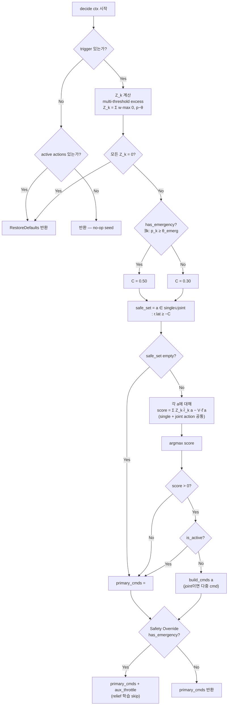

# DPP Policy Design: Lyapunov Drift-Plus-Penalty 기반 통합 정책 설계

> **작성일**: 2026-04-15
> **최종 개정**: 2026-04-15 — (1) $Z_k$를 multi-threshold excess virtual queue로 재정의, (2) Joint action을 action space에 편입 (V8), (3) Emergency throttle을 DPP-external safety override로 분리 (V7)
> **대상**: `manager/scripts/policy_default.lua` 및 `manager/src/lua_policy.rs`의 QoS 정책 엔진을 **Lyapunov Drift-Plus-Penalty (DPP)** 프레임워크로 정렬
> **상태**: **설계 문서 (구현 지시 아님)** — 현재 구현의 DPP 부합도 감사 결과 + 필요한 수정사항 정리 + 구현 가이드
> **관련**:
> - `.agent/research/2026-04-15_unified_framework_search.md` — Researcher 최종 조사 (DPP 매핑)
> - `.agent/research/2026-04-15_amani2019_mapping.md` — 이전 Amani 2019 분석 (super-seeded)
> - `docs/44_multi_domain_policy_design.md` — docs/44는 DPP의 $Z_k$ 할당 전략 (DPP 특수 케이스)
> - `docs/45_safe_lucb_design.md` — Safe-LUCB는 DPP에 UCB bonus를 덧씌운 확장 (DPP 불변 원칙 유지)
> - `manager/scripts/policy_default.lua` v1.0.1 (현재 구현)
> - `manager/src/lua_policy.rs::build_ctx()` (Lua에 전달하는 ctx 구조)
> - `manager/src/relief/linear.rs` (ReliefEstimator — DPP의 $\hat{r}_k$, $\hat{\ell}$)
> **Spec ID 후보**: MGR-POL-4xx 대역 (미할당, 본 문서 채택 시 `/spec-manage`로 할당)

---

## 1. 이론 기반

### 1.1 Drift-Plus-Penalty (DPP) 프레임워크

**원조**: Neely, M. J. (2010). *Stochastic Network Optimization with Application to Communication and Queueing Systems.* Morgan & Claypool (Springer 2025 재출간).

**Bandit-feedback 확장**: Cayci, Gupta, Eryilmaz. (2022). *A Lyapunov-Based Methodology for Constrained Optimization with Bandit Feedback* (LyOn). AAAI 2022.

DPP는 **확률적 제약 최적화** (stochastic constrained optimization) 를 virtual queue 기반 online control로 환원하는 방법이다. 각 slot $t$마다 다음 quantity를 최소화하는 action $a_t$를 선택한다:

$$
\Delta(t) + V \cdot \mathbb{E}[\ell(a_t) \mid Z(t)]
$$

여기서:
- $\Delta(t) = L(Z(t+1)) - L(Z(t))$ — Lyapunov drift (virtual queue 길이의 변화량)
- $L(Z) = \frac{1}{2} \sum_k Z_k^2$ — quadratic Lyapunov function
- $V$ — penalty 가중치 (tradeoff parameter, $V$↑이면 latency 보호 우선)
- $\ell(a)$ — penalty (우리 시스템: latency degradation)

**관례적 단순화**: drift의 상한에서 이차항을 상수로 흡수하면 per-slot action 선택은 linear objective로 귀착된다:

$$
a^* \;=\; \arg\min_{a \in \mathcal{A}_{\text{safe}}}\; \Bigl[\, V \cdot \hat{\ell}(a) \;-\; \sum_k Z_k(t) \cdot \hat{r}_k(a) \,\Bigr]
$$

Maximize 형태로 부호 변환:

$$
\boxed{\;
a^* \;=\; \arg\max_{a \in \mathcal{A}_{\text{safe}}}\; \Bigl[\, \sum_k Z_k(t) \cdot \hat{r}_k(a) \;-\; V \cdot \hat{\ell}(a) \,\Bigr]
\;}
$$

### 1.2 우리 시스템의 DPP 매핑 (1:1 대응)

| DPP 기호 | 의미 | llm.rs manager |
|----------|------|----------------|
| $Z_k(t)$ | Virtual queue (backlog) for constraint $k$ | Domain pressure ($p_{\text{mem}}, p_{\text{cpu}}, p_{\text{gpu}}, p_{\text{therm}}$) |
| $\hat{r}_k(a)$ | Expected relief (queue drain rate) for action $a$ on queue $k$ | `ctx.coef.relief[action][d]` (EWMA/RLS estimate) |
| $\ell(a)$ | Instantaneous penalty | Latency degradation (−`relief[action].lat`, positive = worse) |
| $\hat{\ell}(a)$ | Estimated penalty | $\max(-r_{a,\text{lat}}, 0)$ |
| $V$ | Tradeoff parameter | `LATENCY_LAMBDA` (docs/44 Lua 상수) |
| $\mathcal{A}_{\text{safe}}$ | Feasibility set | latency hard floor filter |
| slot | Decision epoch | per-trigger event (signal 수신 또는 polling tick) |

### 1.3 LyOn 확장 (bandit feedback)

원조 Neely(2010)은 $r_k(a)$, $\ell(a)$를 **알려진 함수**로 가정한다. LyOn(2022)은 이를 **관측에서 학습**하는 bandit feedback 버전으로 확장:

- Estimator $\hat{r}_k(a)$, $\hat{\ell}(a)$를 online update
- Regret bound: $O(\sqrt{T \log T})$ with confidence bonus

우리 시스템은 **RLS(Recursive Least Squares) with forgetting factor** 추정기를 사용한다 (`manager/src/relief/linear.rs::LinearModel`). Forgetting factor $\lambda < 1$은 non-stationary 환경에 대응하기 위한 LyOn 변형의 특수 케이스이다.

---

## 2. DPP 불변 원칙 (4가지)

> 아래 4가지 원칙은 **절대 변경할 수 없는 DPP의 핵심**이다. 원칙을 깨는 수정은 DPP 프레임워크 이탈 — 이론적 보장(regret bound, feasibility) 상실.

### 원칙 1. Score linearity

$$
\text{score}(a) \;=\; \sum_k Z_k \cdot \hat{r}_k(a) \;-\; V \cdot \hat{\ell}(a)
$$

**왜 변경하면 안 되는가**:
- DPP의 regret bound 증명이 선형성에 의존 (Neely 2010, Thm 4.2; LyOn Thm 3.1)
- Non-linear scalarization(Chebyshev, hypervolume 등) 은 별개 이론 체계 (MOMAB)
- 특히 max-domain one-hot (현재 v1.0.1) 은 DPP의 $Z_k$가 **simultaneously 여러 queue를 drain**해야 한다는 요구를 위반 → one queue만 drain → 다른 queue indefinite growth → feasibility 보장 상실

**허용 변형**:
- $Z_k$를 continuous 값 대신 discrete 계단 함수로 치환 (docs/44의 3-tier weight)
- $V$를 시간에 따라 adaptive하게 변경 (LyOn §4의 adaptive-V extension)

### 원칙 2. $Z_k$는 threshold excess virtual queue

$Z_k(t)$는 "제약 $k$의 violation 누적량"을 추적하는 **non-negative, monotone-in-excess** 지표이다:
- Pressure가 모든 threshold 아래 → $Z_k = 0$ (완전 무시)
- Threshold를 초과한 만큼만 $Z_k$에 기여 (excess 크기에 비례)
- Threshold 초과 범위가 커질수록 $Z_k$ 단조 증가

**구체적 정의** (multi-threshold excess virtual queue, §4.2 참조):

$$
Z_k(t) \;=\; w_{\text{warn}} \cdot \max(0,\; p_k - \theta_k^{\text{warn}}) + w_{\text{crit}} \cdot \max(0,\; p_k - \theta_k^{\text{crit}}) + w_{\text{emerg}} \cdot \max(0,\; p_k - \theta_k^{\text{emerg}})
$$

**왜 변경하면 안 되는가**:
- $Z_k$의 non-negativity + monotonicity가 Lyapunov drift 감소 조건의 전제 (Foster's theorem)
- Pressure↑에도 $Z_k$가 감소하면 queue가 unbounded로 발산 (QoS 붕괴)
- $Z_k < 0$을 허용하면 "credit" 개념이 되어 penalty 항과 충돌
- Threshold 아래에서 $Z_k > 0$이면 "정상 상태에서도 개입"이 되어 DPP의 "violation이 있을 때만 drain" 해석을 위반

**왜 raw pressure ($Z_k = p_k$)가 아닌가**:
- raw pressure는 "정상 상태"를 구분하지 못함: $p_k = 0.10$과 $p_k = 0.50$이 모두 Warning 아래인데도 다른 weight를 부여
- threshold 바로 아래($p_k = 0.59$)와 바로 위($p_k = 0.61$)가 거의 같은 weight를 가져 phase transition이 약함
- operator semantic: "Warning 이상일 때만 개입"이 명시적으로 표현 안 됨

**허용 변형**:
- 누적 queue $Z_k(t+1) = \max(Z_k(t) + g_k - \text{thr}_k, 0)$ 대신 **runtime instantaneous excess** 사용 (V3, 우리 시스템 선택)
- Pressure를 $[0, 1]$로 정규화 후 multi-threshold excess로 변환 (§4.2)
- Weight 튜플 $(w_{\text{warn}}, w_{\text{crit}}, w_{\text{emerg}})$ 는 operator가 config로 조정 가능

### 원칙 3. Feasibility filter 먼저 (safe set = pessimistic filtering)

$$
a^* = \arg\max_{a \in \mathcal{A}_{\text{safe}}} \bigl[\cdots\bigr]
$$

**safe set 구성이 score 계산보다 먼저 수행되어야 한다.**

**왜 변경하면 안 되는가**:
- DPP의 feasibility 보장(queue stability)은 $\mathcal{A}_{\text{safe}}$ 내에서만 성립
- Score 계산 후에 filter를 적용하면 "infeasible이지만 고득점" action이 선정될 수 있음 → hard constraint violation
- 특히 latency floor는 **user-facing QoS bound**이므로 절대 위반 불가

**허용 변형**:
- safe set을 **pessimistic UB**로 정의 (Safe-LUCB 확장, docs/45)
- safe set이 비어있을 때 fallback action (no-op 또는 emergency throttle)을 **사전 정의된 seed**에서 가져옴 (원칙 4와 연관)

### 원칙 4. Seed safe action (no-op)은 항상 feasible

$\mathcal{A}_{\text{safe}}$는 **항상 최소 하나의 element를 포함**해야 한다. 구체적으로 **no-op action(빈 command list 또는 RestoreDefaults)은 항상 feasible**이어야 한다.

**왜 변경하면 안 되는가**:
- Empty safe set → 알고리즘 정의되지 않음 → undefined behavior
- No-op은 latency 악화 0 → 항상 hard floor 만족 → safe
- Seed action이 없으면 cold-start 상황(모든 action이 infeasible 추정)에서 정지

**허용 변형**:
- No-op의 의미를 "command 미발행" (현재 구현) 또는 "RestoreDefaults" 중 선택 가능
- Seed action을 여러 개 (e.g., no-op + emergency throttle) 유지 가능

---

## 3. 현재 구현 vs DPP 정렬 상태 (Gap 분석)

### 3.1 감사 결과 요약

| 원칙 | 현재 구현 (v1.0.1) | 준수 여부 | 수정 필요성 |
|------|-------------------|-----------|-------------|
| 1. score = $\sum Z_k r_k - V\ell$ | max-domain argmax (one-hot $Z_k$) + binary lat gate | ✗ | **필수**: linear scalarization으로 교체 |
| 2. $Z_k$ = threshold excess virtual queue | `p.cpu/gpu/memory/thermal` raw 값 참조; threshold 개념 없음, one-hot 부여 | ✗ | **필수**: raw pressure → multi-threshold excess 교체 (§4.2) |
| 3. Hard floor 먼저 | `r.lat >= -0.20` 필터가 argmax 루프 **안에서** 적용 — 결과적으로 before scoring | ○ | 유지 (구조 개선 선택) |
| 4. Seed safe action (no-op) | `return {}` 빈 command 반환 경로 다수 존재 | ○ | 유지 |

### 3.2 상세 감사

#### (A) 원칙 1 위반: max-domain argmax는 DPP score가 아님

현재 `policy_default.lua` L136-144:

```lua
for action, r in pairs(c.relief) do
    local relief_val = r[domain_key] or 0  -- <-- 단일 domain 스칼라
    local better = relief_val > best_relief
    if (better or tied) and (r.lat or 0) >= -0.20 then
        best_action = action
        best_relief = relief_val
    end
end
```

DPP 기호로 해석하면 현재 scoring은:

$$
\text{score}_{\text{v1.0.1}}(a) = r_{a, d^*} \quad \text{where } d^* = \arg\max_d p_d
$$

이것은 $Z_k$가 **degenerate one-hot** 인 경우:

$$
Z_k = \begin{cases} 1 & k = d^* \\ 0 & k \ne d^* \end{cases}
$$

**문제점**:
- 2nd 도메인 starvation (docs/44 §1.2 실측 확인): memory Emergency가 지속되는 동안 cpu Warning/Critical은 weight=0 → CPU throttle 영원히 선택 안됨
- DPP feasibility 보장 상실: 여러 queue가 동시에 violation 중일 때 한 queue만 drain → 나머지 queue 발산

#### (B) 원칙 1 부분 위반: latency를 soft penalty로 반영 안 함

현재: `r.lat >= -0.20` binary gate만.  
DPP: $-V \cdot \hat{\ell}(a)$ soft penalty + hard floor.

Binary gate는 **feasibility filter 역할만 수행**하고 score에 기여하지 않는다. 이는 원칙 3만 만족하고 원칙 1을 불완전하게 만든다:

- 두 candidate action이 모두 `r.lat = -0.19` 로 safe하면, 하나가 `r.lat = -0.19`이고 다른 하나가 `r.lat = -0.05`이어도 구분 불가
- DPP는 $-V \cdot \hat{\ell}$ 항을 통해 "safe set 안에서도 latency 적게 깎는 action 선호"를 보장

#### (C) 원칙 2 위반: $Z_k$ 정의가 raw pressure + one-hot

**두 가지 문제**:

1. **One-hot 선택**: 현재는 max 하나의 도메인만 살림. DPP는 모든 threshold 초과 도메인이 동시에 weight > 0.
2. **Raw pressure → excess 누락**: 현재 max 도메인의 `p[d*]`를 그대로 비교에 사용. DPP 원칙 2는 $Z_k$가 **threshold excess**이길 요구 — threshold 아래면 0, 초과한 만큼만 기여.

예: `p.memory = 0.50`이면 "정상 범위"이지만 현재 구현은 max-argmax에서 여전히 비교 대상. DPP 관점에서는 $Z_{\text{mem}} = 0$이어야 하므로 해당 도메인은 개입 불필요.

**수정 방향**: §4.2의 multi-threshold excess virtual queue 채택.

#### (D) 원칙 3 준수: feasibility filter가 argmax 루프 내 (before scoring)

`if ... and (r.lat or 0) >= -0.20 then update best` — 조건 검사가 `best_action := action` 할당보다 먼저 수행되므로 safe set 밖은 선정 불가. **원칙 3 만족.**

#### (E) 원칙 4 준수: no-op seed 항상 존재

- L91-96: `if not t.tbt_degraded and ... then return {}` — trigger 없으면 no-op
- L113-115, L128-130, L146-148, L152-154: 다수 경로에서 `return {}` 반환

### 3.3 필요한 수정사항

| 우선순위 | 수정 | 파일 | 원칙 |
|---------|------|------|------|
| **P0 (필수)** | Score 함수를 `Σ_k Z_k · r_k − V · ℓ̂` 선형 형태로 교체 | `policy_default.lua` L133-148 | 1 |
| **P0 (필수)** | $Z_k$를 **multi-threshold excess virtual queue**로 계산 (모든 도메인, one-hot 제거, raw pressure 제거) | `policy_default.lua` L99-111 | 1, 2 |
| **P0 (필수)** | Joint action 레지스트리 정의 + 학습 연결 (§4.6, §5 V8) | `policy_default.lua` 상단 + `relief/linear.rs` 키 확장 | 1 |
| **P0 (필수)** | Emergency throttle을 **DPP 외부 safety override**로 분리 (§5 V7) | `policy_default.lua` decide 구조 | 3, 4 |
| **P1 (권고)** | Latency soft penalty 항 추가 (hard floor는 유지) | `policy_default.lua` L140 근방 | 1 |
| **P2 (선택)** | `V`, threshold weight $(w_{\text{warn}}, w_{\text{crit}}, w_{\text{emerg}})$ 를 config.toml 노출 (튜닝 가능) | `policy_default.lua` 상단 + `config.rs` | 1, 2 |
| P3 (선택) | $Z_k$ threshold $(\theta^{\text{warn}}, \theta^{\text{crit}}, \theta^{\text{emerg}})$ 를 `ctx.coef.threshold`로 Rust에서 주입 | `lua_policy.rs::build_ctx()` | 2 |

**주의**: P2/P3는 구현 복잡도와 trade-off. docs/44 §3.2 참조.

---

## 4. DPP Score 함수 설계

### 4.1 수식

$$
\boxed{\;
\text{score}(a) \;=\; \underbrace{Z_{\text{mem}} \cdot r_{a,\text{mem}} + Z_{\text{cpu}} \cdot r_{a,\text{cpu}} + Z_{\text{gpu}} \cdot r_{a,\text{gpu}} + Z_{\text{therm}} \cdot r_{a,\text{therm}}}_{\text{weighted resource relief}} \;-\; \underbrace{V \cdot \max(-r_{a,\text{lat}}, 0)}_{\text{latency penalty}}
\;}
$$

선택:

$$
a^* = \arg\max_{a \in \mathcal{A}_{\text{safe}}} \text{score}(a)
$$

with

$$
\mathcal{A}_{\text{safe}} = \{\, a : r_{a,\text{lat}} \ge -C \,\}
$$

### 4.2 $Z_k$ 설계: Multi-threshold excess virtual queue

$Z_k(t)$는 **세 개의 threshold에 대한 excess의 weighted 합**으로 정의한다:

$$
\boxed{\;
Z_k(t) \;=\; w_{\text{warn}} \cdot \max(0,\; p_k - \theta_k^{\text{warn}}) \;+\; w_{\text{crit}} \cdot \max(0,\; p_k - \theta_k^{\text{crit}}) \;+\; w_{\text{emerg}} \cdot \max(0,\; p_k - \theta_k^{\text{emerg}})
\;}
$$

#### 4.2.1 수식의 해석

각 항 $\max(0,\; p_k - \theta)$는 "threshold를 초과한 만큼"을 나타내는 **hinge**이다:
- $p_k < \theta$ → 항 = 0 (threshold 아래는 기여 없음)
- $p_k \ge \theta$ → 항 = $p_k - \theta$ (초과분에 비례)

Threshold를 차례로 넘을수록 $Z_k$가 **piecewise-linear**로 증가하며, 각 구간의 기울기는 누적 weight:
- $[\theta_{\text{warn}}, \theta_{\text{crit}})$: slope = $w_{\text{warn}}$
- $[\theta_{\text{crit}}, \theta_{\text{emerg}})$: slope = $w_{\text{warn}} + w_{\text{crit}}$
- $[\theta_{\text{emerg}}, 1]$: slope = $w_{\text{warn}} + w_{\text{crit}} + w_{\text{emerg}}$

#### 4.2.2 구체적 예시 (memory, $\theta_{\text{warn}}=0.60$, $\theta_{\text{crit}}=0.80$, $\theta_{\text{emerg}}=0.90$, $w=(1, 2, 4)$)

| $p_k$ | Excess (warn) | Excess (crit) | Excess (emerg) | $Z_k$ |
|-------|-----|-----|-----|-----|
| 0.10 | 0 | 0 | 0 | **0** |
| 0.50 | 0 | 0 | 0 | **0** |
| 0.59 | 0 | 0 | 0 | **0** |
| 0.70 | 0.10 | 0 | 0 | **0.10** |
| 0.85 | 0.25 | 0.05 | 0 | **0.25 + 0.10 = 0.35** |
| 0.95 | 0.35 | 0.15 | 0.05 | **0.35 + 0.30 + 0.20 = 0.85** |
| 1.00 | 0.40 | 0.20 | 0.10 | **0.40 + 0.40 + 0.40 = 1.20** |

Threshold를 넘을수록 **기울기가 가속**되어 Emergency 상태에서 drastic하게 weight가 증가한다.

#### 4.2.3 $w_{\text{warn}}, w_{\text{crit}}, w_{\text{emerg}}$ 초기값

**기본값**: $w_{\text{warn}} = 1.0$, $w_{\text{crit}} = 2.0$, $w_{\text{emerg}} = 4.0$ (2배씩 escalation).

**근거**:
- $w_{\text{warn}}$은 기준 단위 (baseline).
- $w_{\text{crit}} = 2 \cdot w_{\text{warn}}$: Critical 구간 진입 시 기울기 3배 (1 + 2) → Warning 대비 3배 빠른 $Z_k$ 증가.
- $w_{\text{emerg}} = 4 \cdot w_{\text{warn}}$: Emergency 진입 시 기울기 7배 (1 + 2 + 4) → 즉각적 개입 유도.
- Threshold 간격이 도메인마다 다르므로 (memory: 0.20/0.10, thermal: 0.15/0.10) 2배 escalation은 간격 차이를 대략 상쇄.

**연속성**: $p_k$ 가 threshold를 정확히 지날 때 $Z_k$는 **연속**이다 (hinge 함수의 성질). 단 미분 가능성은 threshold 지점에서 상실 (piecewise-linear).

**Config 노출**: 초기 구현은 Lua 상수로 하드코딩, 향후 `config.toml`의 `[policy.dpp]` 섹션으로 노출 (§8.1 확장).

```toml
[policy.dpp]
w_warn   = 1.0
w_crit   = 2.0
w_emerg  = 4.0
```

#### 4.2.4 도메인별 threshold 초기값

| Domain $k$ | $\theta_k^{\text{warn}}$ | $\theta_k^{\text{crit}}$ | $\theta_k^{\text{emerg}}$ | Rust Monitor 근거 |
|-----------|-----|-----|-----|-----|
| mem   | 0.60 | 0.80 | 0.90 | `MemoryMonitorConfig::default()` — available 40/20/10% → used 60/80/90% |
| cpu   | 0.70 | 0.85 | 0.95 | `ComputeMonitorConfig::default()` (warn 70%, crit 90%)에서 Emergency 확장 (추정) |
| gpu   | 0.70 | 0.85 | 0.95 | 동일 — ComputeMonitor는 cpu/gpu 공통 임계, Emergency 없음 (`f64::MAX`) → 정책 레이어에서 부여 |
| therm | 0.70 | 0.85 | 0.95 | `ThermalMonitorConfig::default()` (60/75/85°C) 정규화 (device 최대치 기준). 정규화 방식 implementer가 확정 |

**주의**:
- `ComputeMonitorConfig`는 Emergency level이 없다 (`emergency: f64::MAX`). DPP 정책 레이어는 **자체적으로** cpu/gpu Emergency threshold(0.95)를 사용하여 Rust Monitor와 독립적으로 excess를 계산한다. Monitor는 signal 발생 여부만 담당.
- Thermal pressure 정규화: `ThermalMonitorConfig::default()`는 절대 온도(60/75/85°C, 단위 mC)이므로 $p_{\text{therm}}$을 $[0,1]$로 매핑할 때 device max 온도 가정 필요. 초기 구현은 "85°C = 1.0" 선형 정규화 (즉 $p_{\text{therm}} = T_c / 85$); 추후 device-specific tuning.
- threshold 값은 **Rust Monitor의 signal 임계와 정합**을 유지해야 한다 (dual-source-of-truth 문제, §8.1 참조). P3 단계에서 `ctx.coef.threshold`로 Rust가 주입하면 단일 source 가능.

#### 4.2.5 DPP 이론 정합성

- **Non-negativity** ($Z_k \ge 0$): hinge `max(0, ...)` + 양의 weight → 자동 보장.
- **Monotonicity** ($p_k \uparrow \Rightarrow Z_k \uparrow$): piecewise-linear 단조 증가 → DPP Lyapunov drift 조건 만족.
- **Threshold below → zero weight**: 정상 상태 도메인은 score 계산에 완전히 기여하지 않음 → "violation이 있을 때만 drain"이라는 DPP 해석과 일치.
- **V3 (runtime instantaneous) 변형 유지**: 누적 queue 대신 per-tick excess 사용은 §5 V3의 연장선.

**대안 고려**:
- Raw pressure ($Z_k = p_k$): 정상 상태 구분 불가. 기각.
- 3-tier step (0/1/3): 이전 설계. Threshold crossing 연속성 약함; 특히 threshold 직전·직후에 거의 같은 $Z_k$지만 실제로는 개입 여부가 달라져야 함. 본 multi-threshold excess가 이를 해결.
- Continuous mapping ($Z_k = p_k^2$): scale 불균등 문제 (domain 간) 여전. 기각.

### 4.3 $V$ 파라미터 설계

**기본값**: $V = 1.0$

**근거** (multi-threshold excess 기준):
- $Z_k$의 범위가 이전 3-tier step (0, 1, 3)에서 **연속값 [0, ~1.2]** (§4.2.2 예시)로 바뀜.
- Warning 직후($p_k = \theta_{\text{warn}} + 0.10$) $Z_k \approx 0.10$ → 동일 스케일의 latency 손실과 대등.
- Emergency 구간($p_k \ge 0.90$) $Z_k \ge 0.40$ → $V = 1.0$이어도 relief 항이 지배적.
- "Warning-level pressure 1단위 = latency 손실 1단위" 간단한 해석.

**튜닝 범위**: $V \in [0.3, 3.0]$
- $V = 0.3$: latency 완화를 거의 무시하고 resource relief 공격적으로 추구 (Emergency 지속 시나리오)
- $V = 3.0$: latency 매우 보호 (user-facing SLA 엄격)
- 시뮬레이터 AB 테스트로 결정 (`docs/42_policy_simulator_guide.md`)

**$V$ 위치**: Lua 상수 `DPP.V = 1.0`으로 노출. 향후 `config.toml`의 `[policy.dpp] v` 필드로 Rust 주입 가능 (§8.1). Phase 0은 하드코딩 허용.

**주의**: $Z_k$ 스케일이 변경되었으므로 이전 3-tier 체계 하의 $V = 2.0$과 수치상 동등하지 않다. 시뮬레이터에서 재검증 필수.

### 4.4 Latency 처리: Hard floor + Soft penalty 하이브리드

**Hard floor** (원칙 3):

$$
\mathcal{A}_{\text{safe}} = \{\, a : r_{a,\text{lat}} \ge -C \,\}, \quad C = 0.30
$$

**Soft penalty** (원칙 1):

$$
\text{score}(a) \;\supset\; -V \cdot \max(-r_{a,\text{lat}}, 0)
$$

단, $r_{a,\text{lat}} \ge 0$ 이면 penalty 0 (latency 개선은 penalty 안 줌). 수학적 표현은 $\max(-r_{a,\text{lat}}, 0)$ 이지만 구현은 `if lat < 0 then penalty = -V * lat`.

**Emergency 완화** (docs/44 §2.4와 정합):

임의의 $k$에 대해 $p_k \ge \theta_k^{\text{emerg}}$ (Emergency 조건) 이면 hard floor를 완화:

$$
C \to C_{\text{emergency}} = 0.50
$$

Emergency 조건은 predicate `has_emergency_domain(p)`로 정의: $\exists k : p_k \ge \theta_k^{\text{emerg}}$. 이 predicate는 **§4.6의 Safety Override 레이어에서도 재사용**된다 (동일 정의).

근거: Emergency에서는 latency 손실 감수하고 pressure 해소가 우선. Soft penalty가 여전히 score를 깎지만 candidate에서 완전히 배제하지는 않음.

### 4.5 전체 알고리즘 (pseudocode)

```
function decide(ctx):
    # 1. Trigger gating (early exit — DPP: Z_k = 0 for all k)
    if no trigger active:
        if has active actions:
            return [RestoreDefaults]
        return []  # seed safe action (no-op)

    # 2. Compute Z_k (multi-threshold excess virtual queue) for each domain
    Z = {}
    has_emergency = false
    for d in [mem, cpu, gpu, therm]:
        excess_warn  = max(0, p[d] - theta_warn[d])
        excess_crit  = max(0, p[d] - theta_crit[d])
        excess_emerg = max(0, p[d] - theta_emerg[d])
        Z[d] = W_WARN * excess_warn + W_CRIT * excess_crit + W_EMERG * excess_emerg
        if p[d] >= theta_emerg[d]:
            has_emergency = true

    # 모든 Z_k = 0 이면 개입 불필요
    if all Z[d] == 0:
        if has active actions: return [RestoreDefaults]
        return []

    # 3. Determine safe set (feasibility filter — applied BEFORE scoring)
    C = 0.50 if has_emergency else 0.30
    safe_actions = [a for a in candidates if relief[a][lat] >= -C]
    # candidates = single_actions ∪ joint_actions  (§4.6)

    if safe_actions is empty:
        return []  # seed safe action

    # 4. Compute DPP score for each safe action (single OR joint)
    best_action, best_score = null, -infinity
    for a in safe_actions:
        # joint action의 경우 relief는 구성 action relief의 합
        resource_term = sum(Z[d] * relief[a][d] for d in [mem, cpu, gpu, therm])
        latency_term = V * max(-relief[a][lat], 0)
        score = resource_term - latency_term

        if score > best_score:
            best_action, best_score = a, score

    # 5. Skip if no positive improvement
    if best_action is null or best_score <= 0:
        primary_cmds = []
    else:
        # 6. Duplicate guard + command building
        if is_active_any(best_action, ctx.active):
            primary_cmds = []
        else:
            primary_cmds = build_cmds(best_action, level, cpu_pressure)
            # joint action이면 여러 command, 단일이면 [cmd]

    # 7. Safety Override (DPP 외부, §4.7)
    # Emergency 상태면 throttle을 DPP 결정과 독립적으로 강제
    if has_emergency and not is_active("throttle") and "throttle" not in primary_cmds:
        safety_cmd = aux_throttle_cmd(level, cpu_pressure)
        return primary_cmds + [safety_cmd]  # relief 학습은 skip (§4.7)

    return primary_cmds
```

### 4.5.1 Mermaid 순서도



---

### 4.6 조합 액션 처리 (Joint Action)

#### 4.6.1 동기

현재 v1.0.1은 Emergency 케이스에서만 "primary action + auxiliary throttle"이라는 조합을 발행한다. 그러나 실제 운영에서는 **여러 메커니즘을 동시에 적용해야 효과적**인 상황이 존재한다:

- 메모리 Critical + CPU Warning: `kv_evict` + `throttle` 동시 적용이 둘 다 해소에 기여
- 메모리 Emergency: `kv_evict_sliding` + `kv_quant_dynamic`이 단일 action보다 상시 더 큰 relief

이를 DPP 프레임워크에 정합적으로 통합하려면, 조합을 **Joint Action**으로 명시적으로 action space에 편입한다.

#### 4.6.2 설계: Action space 확장

$$
\mathcal{A} \;=\; \mathcal{A}_{\text{single}} \;\cup\; \mathcal{A}_{\text{joint}}
$$

여기서 $\mathcal{A}_{\text{joint}} \subseteq 2^{\mathcal{A}_{\text{single}}}$는 **사전 정의된 subset**이다 (combinatorial explosion 방지).

**Joint action의 relief / latency 추정** (선형 합 가정):

$$
\hat{r}_k(a_{\text{joint}}) \;=\; \sum_{a_i \in a_{\text{joint}}} \hat{r}_k(a_i), \qquad \hat{\ell}(a_{\text{joint}}) \;=\; \sum_{a_i \in a_{\text{joint}}} \hat{\ell}(a_i)
$$

단, **실제 학습은 joint action을 별도 arm으로 취급**한다 (EWMA/RLS 별도 키). 선형 합은 cold-start 단계의 초기값일 뿐, 관측이 쌓이면 joint 고유의 추정값이 이를 대체한다.

| 구분 | Cold-start (관측 이전) | Warm-start (관측 누적) |
|------|----------------------|----------------------|
| 초기값 | 구성 action relief 선형 합 | — |
| 업데이트 | — | joint action 전용 RLS 추정 |
| Rationale | 비선형 interaction (synergy, interference) 가능 | 실측이 정답 |

#### 4.6.3 DPP 이론 정합성

- **Action space 크기 불변성**: DPP regret bound는 $|\mathcal{A}|$에 다항적으로 의존. Joint action을 단일 arm으로 취급하면 action space 크기만 증가, 이론은 그대로 적용.
- **Linearity 유지**: Score 함수 $\sum_k Z_k \cdot \hat{r}_k(a) - V \hat{\ell}(a)$는 single/joint 구분 없이 동일 형태.
- **Feasibility 보존**: Joint action의 $\hat{\ell}$이 hard floor를 넘으면 safe set에서 제외 — 단일 action과 동일 취급.

#### 4.6.4 Combinatorial explosion 방지

Naive하게 $2^{|\mathcal{A}_{\text{single}}|} - 1$개의 조합을 모두 포함하면 action space가 폭발한다 ($K=9$이면 511개). 이를 막기 위한 규칙:

1. **수동 정의 only**: Phase 0에서는 `JOINT_ACTIONS` 테이블에 operator가 명시한 조합만 사용.
2. **Arity 제한**: 초기 구현은 **2개 단일 action 조합만** 허용 (`|a_joint| = 2`).
3. **시뮬레이터 검증**: 새 joint 추가 시 시뮬레이터에서 single보다 dominated 여부 확인.
4. **향후 학습 기반 auto-discovery**: Phase 2+에서 관측된 co-activation frequency 기반 auto-suggest (미결).

#### 4.6.5 초기 Joint Action 목록

| 키 | 구성 | 목적 | 예상 효과 |
|----|------|------|----------|
| `kv_evict_plus_quant` | `kv_evict_sliding` + `kv_quant_dynamic` | 메모리 절감 극대화 | Emergency 메모리 상황에서 단일 evict보다 2배 relief |
| `throttle_plus_layer_skip` | `throttle` + `layer_skip` | Compute 긴급 절감 | CPU/GPU Critical에서 latency trade하며 relief 빠름 |

추가 조합은 운영 데이터(`docs/42` 시뮬레이터 + production telemetry) 기반으로 후속 확장.

#### 4.6.6 Lua 표현

```lua
-- Joint action registry (DPP action space 확장)
local JOINT_ACTIONS = {
    kv_evict_plus_quant = {
        components = { "kv_evict_sliding", "kv_quant_dynamic" },
    },
    throttle_plus_layer_skip = {
        components = { "throttle", "layer_skip" },
    },
}
```

`c.relief[joint_key]`는 두 가지 경로로 채워진다:

1. **Rust 측 (선호)**: `lua_policy.rs::build_ctx()`가 `c.relief`에 joint 키를 삽입 (관측 누적 후 RLS 추정).
2. **Lua 측 fallback (cold-start)**: `c.relief[joint_key]`가 nil이면 구성 component relief의 선형 합 계산.

```lua
local function joint_relief(c, joint_key)
    if c.relief[joint_key] ~= nil then return c.relief[joint_key] end
    local spec = JOINT_ACTIONS[joint_key]
    local sum = { memory=0, cpu=0, gpu=0, thermal=0, lat=0 }
    for _, comp in ipairs(spec.components) do
        local r = c.relief[comp] or {}
        for k, _ in pairs(sum) do sum[k] = sum[k] + (r[k] or 0) end
    end
    return sum
end
```

#### 4.6.7 Learning integration (Implementer 확장 지점)

`manager/src/relief/linear.rs`의 `LinearModel`은 현재 action 이름을 키로 한다. Joint action 지원을 위해:

- Action key space를 `ActionId::Single(str) | ActionId::Joint(Vec<str>)` enum으로 확장하거나,
- 단순히 문자열 키로 `"kv_evict_plus_quant"` 같은 joint key를 추가 등록.

**권고**: 문자열 키 방식 (구조 변화 최소). `ActionRegistry`에 joint action을 1-tier 엔트리로 등록.

---

### 4.7 Safety Override (DPP 외부)

#### 4.7.1 동기와 구조

현재 v1.0.1의 Emergency 보조 throttle은 "DPP 점수 계산 결과와 독립적으로" 강제 추가되어 왔다. 이는 DPP의 score·feasibility 계산 안에 섞여 있으면 안 되는 **safety concern**이다:

- Emergency throttle은 **무조건 적용**되어야 하는 응급 조치 (user-facing fallback)
- 이를 DPP의 score에 포함하면 "relief는 매우 좋지만 latency 큰 throttle이 항상 선택"되어 DPP의 tradeoff 해석이 무의미해짐
- 따라서 **두 개의 레이어로 분리**:

```
┌─ DPP Layer ─────────────────────────────────────────┐
│ score(a) = Σ_k Z_k · r̂_k(a) − V · ℓ̂(a)          │
│ primary_cmds = build_cmds(argmax)                   │
└───────────────┬─────────────────────────────────────┘
                │
┌───────────────▼──── Safety Override Layer ─────────┐
│ if has_emergency_domain(p):                         │
│     commands = primary_cmds + [throttle]            │
│     mark observation as "safety_tainted" (skip)     │
└─────────────────────────────────────────────────────┘
```

#### 4.7.2 발동 조건

**Safety override predicate**:

$$
\text{SafetyOverride}(p) \;\Leftrightarrow\; \exists k \in \{\text{mem, cpu, gpu, therm}\} : p_k \ge \theta_k^{\text{emerg}}
$$

주의: "Z_k 값"이 아닌 "raw pressure가 Emergency threshold 초과" 여부로 판단한다. 이는 $Z_k$의 정의 변경과 무관하게 안정적인 safety trigger를 유지하기 위함.

#### 4.7.3 DPP 독립성

| 속성 | DPP Layer | Safety Override |
|-----|-----------|----------------|
| $Z_k$ 계산 영향 | 영향 없음 | 영향 없음 |
| Score 계산 영향 | — | 영향 없음 |
| Safe set 영향 | — | 영향 없음 |
| 출력 | `primary_cmds` (DPP 결정) | `primary_cmds + [throttle]` (강제 augment) |

즉 DPP 레이어의 동작은 Safety Override 존재 유무와 **완전히 독립**이다. 이는 DPP의 이론적 보장(regret bound, queue stability)이 safety augment에 의해 훼손되지 않음을 의미한다.

#### 4.7.4 Relief observation 처리 (학습 신뢰도)

Safety override가 발동된 tick에서는 primary action의 관측 relief에 throttle 효과가 섞여 있다:

$$
\text{observed\_relief}_{\text{tick}} \;=\; \text{relief}(\text{primary}) \;+\; \text{relief}(\text{throttle}) \;+\; \text{interaction}
$$

이를 primary action의 $\hat{r}_k$ 학습에 그대로 사용하면 **bias**가 발생한다. 처리 방안:

**권고 전략 (Phase 0)**: Observation skip.
- Safety override 발동 tick은 `SAFETY_TAINTED` 플래그를 observation에 첨부.
- `LinearModel::update()`가 이 플래그를 만나면 해당 observation을 skip (학습 안 함).
- 손실: 학습 속도 감소. 이익: 추정 bias 방지.

**대안 전략 (Phase 1+)**: Joint observation.
- Safety override가 발동된 tick의 action을 `primary + throttle` **joint action으로 기록**.
- §4.6의 joint action 학습 경로를 통해 업데이트.
- 요구: 모든 possible (primary × throttle) 쌍을 joint registry에 사전 등록해야 함 (K개 추가).

**구현 위치**:
- Lua: `primary_cmds`에 safety throttle을 augment할 때 observation metadata에 flag 포함.
- Rust (`manager/src/relief/`): `ObservationEntry`에 `safety_tainted: bool` 필드 추가. `LinearModel::update()`에서 skip.

#### 4.7.5 이론 정합성 요약

- **DPP 원칙 1 (score linearity)**: Safety override는 score 계산에 개입 안 함 → 원칙 유지.
- **DPP 원칙 2 ($Z_k$ pressure weight)**: 동일.
- **DPP 원칙 3 (feasibility filter)**: Safety override는 DPP의 safe set 계산 밖에서 augment만 함 → safe set 내 선택은 여전히 feasible.
- **DPP 원칙 4 (seed safe action)**: Safety throttle 자체가 seed에 가까운 "항상 safe" action → 원칙 유지.

**미결**: Safety override가 **너무 자주 발동**하는 환경에서는 primary action의 학습 데이터가 고갈된다. 이를 완화하려면 Phase 1에서 joint observation 전략으로 전환 고려.

---

## 5. 허용 변형 목록 (DPP 대비 V1~V8)

> 아래는 DPP 원형에 대해 **우리 시스템이 정당하게 수정한 8가지 변형**이다. 각 변형은 DPP 불변 원칙 4가지를 **유지하면서** 구현 현실성을 높이기 위한 것.

| # | 변형 | DPP 원형 | 우리 구현 | 이론적 근거 |
|---|------|----------|-----------|------------|
| **V1** | Discrete action space | Neely (2010)은 action space 가정 없음; LyOn은 discrete 명시 | K=9 discrete actions (`ActionId`) | DPP action-space agnostic (Neely Ch.4 §4.1). Discrete argmax는 trivial 적용 |
| **V2** | Hard latency floor | soft penalty only (penalty가 크면 자연적으로 배제) | `r.lat >= -0.30` feasibility filter + soft penalty | "DPP + hard feasibility" 변형은 Neely Ch.7 §7.5 (constrained action sets)에서 정식 지원 |
| **V3** | Virtual queue = runtime instantaneous excess | $Z_k(t+1) = \max(Z_k(t) + g_k(a) - \text{thr}_k, 0)$ (누적) | `p[d] = 1 - avail/total` 등 runtime 관측값의 multi-threshold excess (§4.2) | 누적 queue는 slot 간 상태 유지가 필수지만, 우리 pressure는 **이미 integrated metric** (OS 전체의 용량 사용률). 개념 동일, bookkeeping 단순화 |
| **V4** | Bandit-feedback effect learning | Neely: known $r_k(a), \ell(a)$; LyOn: unknown, UCB estimator | RLS with forgetting factor ($\lambda < 1$) | LyOn AAAI 2022 §4 "non-stationary extension" 특수 케이스. Forgetting은 non-stationary 환경의 sliding-window 근사 |
| **V5** | Delayed feedback | 즉시 관측 가정 | 3초 async observation queue (`OBSERVATION_DELAY_SECS`) | Pike-Burke et al. (2018) ICML "Bandits with Delayed, Aggregated Anonymous Feedback" — DPP와 호환. Relief 관측이 action 후 일정 시간 지연 가능 |
| **V6** | Explicit trigger gating | implicit ($Z_k = 0$이면 자연적으로 reward 항 사라짐 → penalty만 → no-op 선택) | `if no trigger then return []` early exit | 의미 동일, computation 절약. DPP 원칙 4 (seed safe) 와 정합 |
| **V7** | **Emergency throttle as DPP-external safety override** | Safety override 개념 없음 (penalty를 통해 간접 처리) | DPP score 계산과 독립적으로 has_emergency 조건에서 throttle을 commands에 augment (§4.7) | Safety-critical 응급 fallback은 DPP의 tradeoff 해석 밖의 hard safety requirement. DPP의 4원칙을 **수정 없이 유지**하면서 독립 레이어로 추가 (§4.7.5) |
| **V8** | **Joint action as expanded action space** | $\mathcal{A}$ = single action 집합 | $\mathcal{A} = \mathcal{A}_{\text{single}} \cup \mathcal{A}_{\text{joint}}$ (§4.6) | DPP regret bound는 $\|\mathcal{A}\|$에 다항 의존만 요구 → joint arm을 단일 arm으로 취급하면 이론 그대로 (§4.6.3). Combinatorial explosion은 수동 정의 + arity ≤ 2로 제한 |

**핵심**: V1~V8 모두 원칙 1~4를 유지한다. 즉, DPP 이론적 보장(queue stability, $O(\sqrt{T})$ regret) 은 이 변형 하에서도 성립 (LyOn §4 및 DPOP arXiv 2509.03762 증명 참조).

**V7, V8 상세 설계**: §4.6 (joint action), §4.7 (safety override) 참조.

---

## 6. 구현 가이드 (Implementer 위임용)

> **스코프**: 본 가이드는 `policy_default.lua` v2.0.0 작성 지침. Rust 코드 변경은 최소화 (P3 선택 사항 제외).

### 6.1 변경해야 할 것 (P0/P1)

#### 파일: `manager/scripts/policy_default.lua`

**(a) 버전 bump 및 changelog**

```lua
POLICY_META = { name = "llm_default", version = "2.0.0" }

-- Changelog:
--   2.0.0 (2026-04-XX): DPP (Lyapunov Drift-Plus-Penalty) 기반 재설계
--     - max-domain argmax → multi-domain linear scalarization
--     - latency binary gate → hard floor + soft penalty 하이브리드
--     - Z_k (virtual queue) 를 모든 도메인에 대해 계산 (one-hot 제거)
--     - 참조: docs/46_dpp_policy_design.md
--   1.0.1 (2026-04-15): pressure_level 임계값 정렬 (생략)
--   1.0.0 (2026-04-15): initial production policy (생략)
```

**(b) DPP 상수 테이블 추가** (스크립트 상단, L25 근방)

```lua
-- DPP parameters (docs/46 §4)
local DPP = {
    V              = 1.0,      -- latency penalty weight (§4.3, new Z_k scale)
    C              = 0.30,     -- latency hard floor (normal)
    C_EMERGENCY    = 0.50,     -- latency hard floor (emergency)
    -- Multi-threshold excess weights (§4.2.3)
    W_WARN         = 1.0,
    W_CRIT         = 2.0,
    W_EMERG        = 4.0,
}

-- Per-domain thresholds (§4.2.4, Rust Monitor defaults에 정렬)
local THETA = {
    mem   = { warn = 0.60, crit = 0.80, emerg = 0.90 },
    cpu   = { warn = 0.70, crit = 0.85, emerg = 0.95 },
    gpu   = { warn = 0.70, crit = 0.85, emerg = 0.95 },
    therm = { warn = 0.70, crit = 0.85, emerg = 0.95 },
}

local PRESSURE_KEY = { mem = "memory", cpu = "cpu", gpu = "gpu", therm = "thermal" }

-- Joint action registry (§4.6)
local JOINT_ACTIONS = {
    kv_evict_plus_quant      = { components = { "kv_evict_sliding", "kv_quant_dynamic" } },
    throttle_plus_layer_skip = { components = { "throttle",         "layer_skip"        } },
}

-- Z_k excess 계산 helper
local function compute_Zk(pv, th)
    local ew = math.max(0, pv - th.warn)
    local ec = math.max(0, pv - th.crit)
    local ee = math.max(0, pv - th.emerg)
    return DPP.W_WARN * ew + DPP.W_CRIT * ec + DPP.W_EMERG * ee
end

-- Joint action relief 계산 (cold-start fallback)
local function joint_relief(c, joint_key)
    if c.relief[joint_key] ~= nil then return c.relief[joint_key] end
    local spec = JOINT_ACTIONS[joint_key]
    if spec == nil then return nil end
    local sum = { memory = 0, cpu = 0, gpu = 0, thermal = 0, lat = 0 }
    for _, comp in ipairs(spec.components) do
        local r = c.relief[comp] or {}
        for k, _ in pairs(sum) do sum[k] = sum[k] + (r[k] or 0) end
    end
    return sum
end
```

**(c) 대체 대상 블록** — L98-148 (도메인 선정 + argmax 전체)

기존:
```lua
-- 2. max-pressure 도메인 선정 ...
-- 4. relief argmax: lat constraint >= -0.20 ...
```

교체:

```lua
-- 2. Compute Z_k (multi-threshold excess virtual queue, §4.2) for each domain
local Z = {}
local has_emergency = false
for dkey, pkey in pairs(PRESSURE_KEY) do
    local pv = p[pkey] or 0
    Z[dkey] = compute_Zk(pv, THETA[dkey])
    -- Safety override predicate uses raw pressure (§4.7.2)
    if pv >= THETA[dkey].emerg then
        has_emergency = true
    end
end

-- 모든 Z_k = 0 이면 DPP 개입 불필요. 단 Safety override는 별도 체크.
local any_active = false
for _, zv in pairs(Z) do
    if zv > 0 then any_active = true; break end
end

-- 3. Safe set: latency hard floor (Emergency 시 완화)
local lat_floor = has_emergency and -DPP.C_EMERGENCY or -DPP.C

-- 4. Build candidate action list (single + joint, §4.6)
local candidates = {}  -- list of {name, relief}
for action, r in pairs(c.relief) do
    -- 단일 action은 joint registry에 속한 key 제외 (중복 방지)
    if JOINT_ACTIONS[action] == nil then
        table.insert(candidates, { name = action, relief = r })
    end
end
for jkey, _ in pairs(JOINT_ACTIONS) do
    local jr = joint_relief(c, jkey)
    if jr ~= nil then
        table.insert(candidates, { name = jkey, relief = jr, is_joint = true })
    end
end

-- 5. DPP score argmax (single + joint 공통)
local best_action, best_relief, best_score = nil, nil, -math.huge
if any_active then
    for _, cand in ipairs(candidates) do
        local r = cand.relief
        local lat = r.lat or 0
        if lat >= lat_floor then
            -- Σ_k Z_k · r_k
            local resource_term = 0
            for dkey, zv in pairs(Z) do
                if zv > 0 then
                    local domain_key = PRESSURE_KEY[dkey]
                    resource_term = resource_term + zv * (r[domain_key] or 0)
                end
            end
            -- V · max(-lat, 0)
            local latency_penalty = (lat < 0) and (DPP.V * (-lat)) or 0
            local score = resource_term - latency_penalty

            if score > best_score then
                best_action, best_relief, best_score = cand.name, r, score
            end
        end
    end
end

-- 6. Primary commands (DPP output)
local primary_cmds = {}
if best_action ~= nil and best_score > 0 and not is_active_any(best_action, ctx.active) then
    if JOINT_ACTIONS[best_action] ~= nil then
        -- Joint action → 다중 command build
        for _, comp in ipairs(JOINT_ACTIONS[best_action].components) do
            table.insert(primary_cmds, build_cmd(comp, lvl, cpu_p))
        end
    else
        table.insert(primary_cmds, build_cmd(best_action, lvl, cpu_p))
    end
end

-- 7. Safety Override (§4.7, DPP 외부)
if has_emergency and not is_active("throttle", ctx.active) then
    -- primary_cmds에 throttle이 이미 포함되어 있으면 중복 방지
    local has_throttle_in_primary = false
    for _, cmd in ipairs(primary_cmds) do
        if cmd.type == "throttle" then has_throttle_in_primary = true; break end
    end
    if not has_throttle_in_primary then
        local throttle_cmd = build_cmd("throttle", lvl, cpu_p)
        -- Observation metadata: 학습 skip flag (§4.7.4)
        throttle_cmd.meta = throttle_cmd.meta or {}
        throttle_cmd.meta.safety_tainted = true
        -- primary_cmds에도 동일 flag (observation bias 방지)
        for _, cmd in ipairs(primary_cmds) do
            cmd.meta = cmd.meta or {}
            cmd.meta.safety_tainted = true
        end
        table.insert(primary_cmds, throttle_cmd)
    end
end

return primary_cmds
```

**주의**:
- `is_active_any(name, active)`는 joint action의 경우 모든 component가 active인지 검사해야 한다 (Implementer가 helper 정의).
- `cmd.meta.safety_tainted`는 Rust observation 처리에서 읽어서 relief 학습에서 skip (§4.7.4). Rust 측 `ObservationEntry`에 대응 필드 필요.

**(d) 보존해야 할 기존 로직** — 교체하지 말 것

- L84-96: trigger 없을 때 `restore_defaults` / no-op (원칙 4)
- L122-126: pressure level 결정(`lvl`) — `build_cmd`에 전달하기 위해 필요. Emergency 여부는 새 변수 `has_emergency`로도 추론 가능하지만 `level` 문자열은 `build_cmd` 호출에 사용
- `is_active()` 중복 가드 (action cycling 방지) — joint action 지원을 위해 `is_active_any()` helper 추가
- `build_cmd(action, lvl, cpu_p)` 호출 구조 — joint action은 component별 여러 번 호출
- **Emergency 보조 throttle 로직**: §4.7 Safety Override로 **명시적으로 재구조화** — 기존 `if lvl == "emergency" then aux_throttle` 패턴은 `has_emergency_domain(p)` 기반 predicate로 교체하고 DPP 결정 이후에만 적용

### 6.2 변경하면 안 되는 것

다음은 **DPP와 무관한 현재 구현**이므로 그대로 유지:

| 구현 | 이유 |
|------|------|
| `pressure_level()` 함수 | `build_cmd`의 parameter (`keep_ratio`, `target_bits`) 결정용 |
| `LEVEL_PARAMS` 테이블 | 동일 |
| `build_cmd()` 함수 | 선택된 action을 구체적 command로 변환하는 책임 분리 |
| `is_active()` 함수 | Action cycling 방지 (2026-04-15 이전 운영 경험) |
| Emergency 보조 throttle (L161-168) | 압박 완화 + QoS degradation fallback |
| `restore_defaults` 경로 (L91-96) | Trigger 해제 시 복원 |
| `fallback_decide()` (Rust) | Lua VM 장애 시 최소 기능 보장 |

### 6.3 테스트 요구 사항

**Unit test** (Implementer 책임, `tests/spec/`):

1. **Z_k excess 정의**:
   - $p_k < \theta_{\text{warn}}$ → $Z_k = 0$ (table-driven: memory 0.10/0.50/0.59 모두 0)
   - $p_k = \theta_{\text{warn}}$ → $Z_k = 0$ (경계)
   - $p_k = 0.70$ → $Z_k = w_{\text{warn}} \cdot 0.10$ (memory 케이스)
   - $p_k = 0.85$ → $Z_k = w_{\text{warn}} \cdot 0.25 + w_{\text{crit}} \cdot 0.05$
   - $p_k = 0.95$ → 세 항 모두 활성
   - Piecewise-linear 단조 증가 검증
2. **선형성 테스트**: 두 action의 score 차이가 $\sum_k Z_k \cdot (r_{a,k} - r_{b,k}) - V \cdot (\ell_a - \ell_b)$ 와 일치 (부동소수점 tolerance)
3. **Multi-domain activation**: memory Emergency + cpu Warning 동시 발생 시 cpu 도메인 relief 를 가진 action이 선택될 수 있는지 (docs/44 §1.2 regression)
4. **Hard floor**: `r.lat = -0.35` action은 Normal 상태에서 배제, Emergency 상태에서 선택 가능
5. **Joint action**:
   - cold-start에서 `joint_relief()`가 component relief의 선형 합과 일치
   - `c.relief[joint_key]`가 주입된 경우 warm-start 값을 우선 사용
   - joint action이 argmax로 선택되면 여러 command가 발행됨
   - joint action이 `is_active_any`에 의해 duplicate 방지
6. **Safety Override 독립성**:
   - `has_emergency_domain(p) == true`이면 DPP primary_cmds의 내용과 무관하게 throttle augment
   - primary_cmds가 empty여도 throttle만 단독 augment 가능
   - `safety_tainted` flag가 모든 augmented cmd에 부착
   - Safety override는 DPP score 계산·safe set·Z_k 값에 영향 없음 (invariant test)
7. **Seed safety**: safe set 비어도 crash 없이 `{}` 반환 (또는 Safety override만 반환)
8. **Trigger 없을 때**: no-op (active 없음) 또는 RestoreDefaults (active 있음)
9. **Score 양수 조건**: `best_score <= 0` 이면 primary_cmds empty. Safety override는 별도 동작.

**Integration test** (Tester 책임, simulator trace):

1. Memory Emergency + CPU Warning 동시 시나리오 — cpu throttle 선택 + safety throttle augment 확인
2. Latency 악화가 큰 action 우선 회피 — $V$ 효과 검증
3. Long-running Emergency 환경에서 queue starvation 없음
4. Joint action `kv_evict_plus_quant`가 메모리 Emergency에서 single `kv_evict_sliding`보다 relief trajectory 빠름
5. Safety override 발동 tick에서 primary action의 RLS 추정이 **업데이트 안 됨** (`safety_tainted` skip 검증)

### 6.4 파라미터 튜닝 가이드

**$V$ 조정** (`DPP.V`):

- Latency violation이 자주 발생하면 $V$ 증가 (1.0 → 1.5)
- 반대로 resource relief가 부족하여 pressure가 지속되면 $V$ 감소 (1.0 → 0.5)
- 시뮬레이터 AB test (`docs/42`) 로 판단
- 주의: 새 $Z_k$ 스케일 ($\sim$[0, 1.2]) 에 맞춰 기본값이 2.0 → 1.0으로 감소함

**$w_{\text{warn}}, w_{\text{crit}}, w_{\text{emerg}}$ 조정**:

- 기본 2배 escalation (1/2/4) 외에 1.5배 (1/1.5/2.25) 또는 3배 (1/3/9) 시도 가능
- 3배 escalation은 Emergency 시 가파른 개입, Warning 시 거의 무개입 → operator가 선호하는 phase transition 강도에 맞춰
- **제약**: 세 weight 모두 양수, $w_{\text{warn}} \le w_{\text{crit}} \le w_{\text{emerg}}$ (monotonicity)

**$\theta$ 조정**:

- Rust `MemoryMonitorConfig::default()` 와 정렬 유지 (dual-source-of-truth 주의 — docs/44 §3.2)
- `ComputeMonitorConfig`에는 Emergency가 없으므로 (`f64::MAX`) DPP 정책 레이어에서 자체 정의 (§4.2.4)
- Phase 3 (P3) 로 `ctx.coef.threshold` 주입 시 단일 source 가능

**Joint action 추가/제거**:

- 새 joint 추가 전 시뮬레이터에서 **Pareto dominance** 확인: component 각각보다 (relief ↑ + lat 악화 미미)한 경우만 가치 있음
- arity ≤ 2 규칙 유지 (§4.6.4). 3-ary 이상은 별도 설계 필요
- joint action이 argmax에서 자주 선택되는 반면 observation이 부족 (RLS 추정 불안정) 하면 cold-start fallback 대신 production telemetry에서 별도 seeding 필요

---

## 7. 참고 논문

### 핵심 (Primary)

- **Neely, M. J. (2010).** *Stochastic Network Optimization with Application to Communication and Queueing Systems.* Morgan & Claypool Publishers (Springer 2025 재출간). — DPP 원조 이론서. Ch.3 virtual queue, Ch.4 drift-plus-penalty, Ch.7 constrained action sets.

- **Cayci, S., Gupta, S., & Eryilmaz, A. (2022).** *A Lyapunov-Based Methodology for Constrained Optimization with Bandit Feedback* (LyOn). AAAI 2022. [PDF](https://cdn.aaai.org/ojs/20285/20285-13-24298-1-2-20220628.pdf) — DPP + bandit feedback 확장. $O(\sqrt{T\log T})$ regret bound. 본 설계 V4의 이론적 근거.

### 확장 (Secondary)

- **DPOP** — *Drift Plus Optimistic Penalty*, arXiv 2509.03762 (2025). UCB 탐색 결합. docs/45 Safe-LUCB 확장의 이론 기반.
- *Adversarial Network Optimization under Bandit Feedback*, arXiv 2408.16215 (2024) — adversarial non-stationarity.
- *A Lyapunov Drift-Plus-Penalty Method Tailored for RL*, arXiv 2506.04291 (2025) — RL 결합.
- **Pike-Burke, C., Agrawal, S., Szepesvari, C., & Grunewalder, S. (2018).** *Bandits with Delayed, Aggregated Anonymous Feedback.* ICML. — V5 (delayed feedback) 근거.

### 배경 (Background)

- Wikipedia: [Drift plus penalty](https://en.wikipedia.org/wiki/Drift_plus_penalty), [Lyapunov optimization](https://en.wikipedia.org/wiki/Lyapunov_optimization)
- *A Simple Convergence Time Analysis of Drift-Plus-Penalty*, arXiv 1412.0791.

### 관련 문서 (프로젝트 내부)

- `.agent/research/2026-04-15_unified_framework_search.md` — Researcher의 DPP 선정 보고서 (본 설계의 motivation)
- `docs/44_multi_domain_policy_design.md` — DPP $Z_k$ 할당 전략 (docs/44 §0 DPP 재정렬 섹션)
- `docs/45_safe_lucb_design.md` — DPP + UCB confidence bonus 확장 (Phase 1+)
- `docs/43_production_lua_policy_design.md` — 현재 production Lua 정책 frame work
- `docs/42_policy_simulator_guide.md` — 시뮬레이터 AB test guide

---

## 8. 미결 사항 (향후 검토)

### 8.1 $V$ 파라미터 Rust-side 노출

**현재 설계**: Lua 상수 하드코딩 (`DPP.V = 2.0`).

**향후 개선**: `ctx.coef.tradeoff.V` 로 Rust에서 주입하여 런타임 조정 가능하게. Manager config 파일에 `[policy] latency_v = 2.0` 필드 추가.

**우선순위**: 낮음. Phase 0에서는 튜닝이 시뮬레이터-based offline으로 충분.

### 8.2 Adaptive-V 확장

LyOn §4.2의 "adaptive V" 메커니즘은 관측된 violation 빈도에 따라 $V$를 online 조정한다.

$$
V_{t+1} = V_t \cdot (1 + \eta \cdot \text{violation}_t)
$$

우리 시스템 적용 가능성 검토 필요. 구현 복잡도 vs 이득 미측정.

### 8.3 Phase 1 (Safe-LUCB) 와의 일관성

docs/45의 Safe-LUCB 확장은:
- Reward 항: $\hat{r}(a) + \beta_t \|\phi\|_{V^{-1}}$ (UCB bonus 추가)
- Cost 항: $\hat{c}(a) + \beta_t \|\phi\|_{V^{-1}}$ (pessimistic UB)

이 구조는 DPP 원칙 4가지를 **모두 유지한다**:
- 원칙 1: linearity 유지 (bonus term은 여전히 $a$에 대해 linear)
- 원칙 2: $Z_k$ 변경 없음
- 원칙 3: Safe set은 pessimistic UB로 더 conservative
- 원칙 4: No-op은 bonus 0 → 원래와 동일하게 feasible

즉, **Phase 0 (본 문서) → Phase 1 (docs/45) 확장은 DPP framework 이탈이 아님**. 단일 이론 하의 refinement.

### 8.4 $Z_k$ 정의: 대안 설계 (사실상 결정됨, 기록용)

**채택 (Phase 0, §4.2)**: Multi-threshold excess virtual queue. piecewise-linear, operator-tunable weights.

**이전 제안**: 3-tier step (0, 1, 3). Threshold 직전·직후 flicker가 강하고 연속성이 약하여 교체됨.

**추가 대안** (Phase 2+ 검토):
- Continuous squared: $Z_k = p_k^2$ — smoothness 높지만 정상 상태에서도 non-zero.
- Sigmoid: $Z_k = \sigma(\alpha(p_k - \theta))$ — 미분 가능하지만 파라미터 2개($\alpha, \theta$)로 해석성 저하.
- Learnable weights $(w_{\text{warn}}, w_{\text{crit}}, w_{\text{emerg}})$: production telemetry 기반 adaptive 조정. $w_{\text{emerg}}$를 너무 크게 잡으면 Emergency action의 RLS 추정이 over-exploit → 신중한 exploration-exploitation 조정 필요.

### 8.5 Joint action auto-discovery

Phase 0은 수동 정의된 joint action만 사용 (§4.6.4). 향후 확장 방향:

- **Co-activation mining**: production telemetry에서 "같은 tick에 두 action이 함께 발행된 빈도"를 집계 → 임계 이상이면 auto-suggest.
- **Synergy detection**: 두 action이 함께 적용되었을 때 relief가 선형 합보다 significantly 크거나 작은 경우 joint arm 등록 후보.
- **Pruning**: Dominated joint는 자동 제거 (single 대비 Pareto inferior).

구현 복잡도 중간, 가치 불확실 — Phase 2 이후 검토.

### 8.6 Safety override 빈번 발동 환경의 학습 저하

§4.7.4에서 논의한대로, Safety override가 자주 발동하는 thermal-constrained 환경에서는 primary action의 RLS 추정 데이터가 고갈된다.

완화 방안 후보:
1. **Joint observation 전환** (§4.7.4 대안): Safety augmented tick도 joint arm으로 기록.
2. **Counterfactual estimation**: throttle 영향을 별도로 분리 (사전 측정된 `throttle`의 relief 모델 이용).
3. **Off-policy correction**: IPS(Inverse Propensity Scoring) 기반 보정.

Phase 0은 skip으로 단순 처리. Phase 1+에서 재검토.

### 8.7 Queue starvation 모니터링

DPP 이론은 queue stability를 보장하지만, 실제 구현에서 **특정 domain이 오랫동안 Emergency에 머무르는 상황**을 감지할 필요.

제안: `manager/src/evaluator.rs` 에 per-domain Emergency duration metric 추가. 임계값 초과 시 alert (구현은 별도 spec).

---

**문서 끝. 피드백은 `.agent/todos/architect.md`로.**
