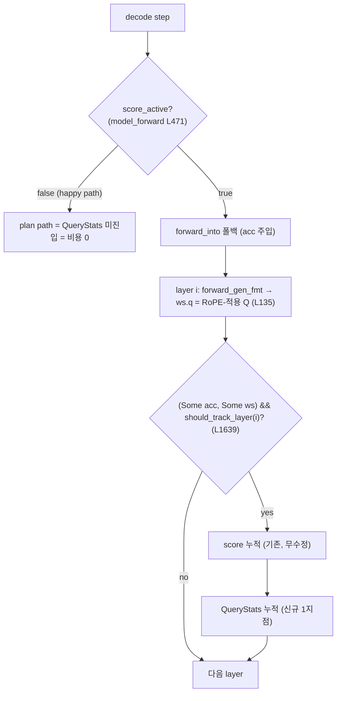

# ADR-0004: `KVCacheStage` — 단일 plan-returning trait (per-head keep + 가중 merge 통합)

> **Status**: Accepted
> **Date**: 2026-06-05
> **Decision-makers**: 사용자 + Architect (grill-with-docs 세션 "EvictionPlan 재설계", /loop M2 STOP 후)
> **Selected**: stage 축 확장 기법(eviction/merge)을 **단일 plan-returning trait `KVCacheStage`** 로 통일. 입력 = 캐시 읽기 접근 + scores + budget, 상태는 impl, 반환 `KVCachePlan`(keep + 가중 merge), 버퍼 변형은 엔진이 실행.
> **Supersedes (부분)**: ADR-0003 §D2 의 "planning 표면이 h2o+/d2o 를 덮는다 (낙관적)" — 본 ADR 이 *어떻게* 덮는지 확정하며 §D2 의 미명세를 닫는다.
> **Related**: ADR-0003(확장 메커니즘 = 정적 crate + linkme), `/CONTEXT.md`("KVCacheStage"/"KVCachePlan" 항목), `arch/pipeline_stage_design_v2.md`, `engine/src/kv/eviction/compact_parity.rs`

---

## 1. Context

ADR-0003 은 stage 축 기법을 별도 crate 가 구현하는 "planning 표면"으로 플러그인화하기로 했다(§D2). 그러나 그 표면(M1 의 `EvictionPlan::plan_keep → (Vec<usize>, Vec<Merge>)`)이 실제로 **h2o+·d2o 를 못 덮음**을 /loop M2 가 실측했다 (workflow `wf_a9f025a7`):

- **h2o+** 는 head 마다 다른 토큰을 유지(per-head) → 단일 layer-wide `Vec<usize>` 로 표현 불가 → `plan_keep` 가 `None` 반환.
- **d2o** 는 `EvictionPolicy` 가 아니라 가중 scatter-merge handler. `Merge{into, from}` 에 가중치가 없고(현 `apply_merges` 는 uniform), cosine-nearest 매칭에 raw K 가 필요하며, EMA 임계가 호출 간 stateful 이다.
- 가중 merge 적용 코드(`StandardFormat::apply_merges`)·per-head 압축(`compact_keep_positions_for_head`) primitive 는 이미 존재. parity 게이트(`compact_parity.rs`)가 4 정책(sliding/streaming/h2o/no_eviction)×3 dtype 에서 plan→compact ≡ in-place evict 를 이미 증명.

사용자는 (B) "표면을 per-head + 가중 merge 까지 확장" 을 선택했다.

## 2. Decision

**stage 축 확장 기법을 단일 plan-returning trait `KVCacheStage` 로 통일한다.**

**(D1) plan-returning, self-mutating 아님.** plugin 은 캐시를 *읽고* **계획**(`KVCachePlan`)을 반환할 뿐, 버퍼를 직접 변형하지 않는다. 변형은 엔진이 plan 을 `compact` 로 실행해 독점한다. "plan-returning vs self-mutating" 이 핵심 축이며 — 이것이 (a) 캐시 손상 방지, (b) 미래 `.so` C-ABI 표면 최소화(ADR-0003)의 근거다. **순수성은 요구하지 않는다** — stateful impl(아래 D4)을 허용한다.

**(D2) `KVCachePlan` 타입** (keep 은 배타 enum, merge 는 직교 필드):
```rust
struct KVCachePlan { keep: KeepSpec, merges: Vec<WeightedMerge> }
enum KeepSpec {
    LayerWide(Vec<usize>),       // sliding·h2o·streaming·no_eviction·d2o (ascending)
    PerHead(Vec<Vec<usize>>),    // h2o+ : [n_kv_heads][keep], 각 ascending·길이 동일
}
struct WeightedMerge { into: usize, into_weight: f32, from: Vec<(usize, f32)> } // Σw + into_weight ≈ 1
```
executor 매핑: `LayerWide`+merges → `apply_merges`(가중) → `compact_keep_positions`. `PerHead` → head 별 `compact_keep_positions_for_head`. `PerHead`+merges(=d2o+h2o+ 융합) → **당분간 `bail!`**(promotion-trigger). `new_pos` 는 plan 에 없음 — 엔진이 `keep.len()` 으로 도출(PerHead 전 head 길이 동일 assert).

**(D3) `Merge` → `WeightedMerge` 통합.** merge 타입은 하나. 가중치는 plan 에 baked 되고 `apply_merges` 가 그 가중치를 쓴다(현 uniform 대체). merge-free 정책은 빈 `Vec`.

**(D4) 상태는 impl 에.** d2o EMA(τ) 같은 호출 간 상태는 `&self` + interior-mutability(Mutex)로 plugin struct 가 보유한다 — D2OHandler 의 현 방식. ctx 로 thread 하지 않는다(type-erased 상태 blob/제네릭은 `dyn`-object trait 에 치명적).

**(D5) 입력은 "캐시 읽기 접근" 추상(`StageCtx`), `&KVCache` 직접 아님.** trait 은 `technique-api` 에 살고 거기서 엔진 타입 `KVCache` 를 참조할 수 없다(단방향 의존). 그래서 `technique-api` 가 정의하는 읽기 추상 `StageCtx`(geometry + scores + dequant K 읽기 accessor)를 받고, 엔진이 그것을 `&KVCache` 위로 구현한다. 정적 단계엔 borrow, 미래 `.so` 단계엔 동일 추상이 C accessor/flat 스냅샷으로 교체 — forward-compatible.

**(D6) 네이밍.** `KVCacheFormat`(저장 표현) 의 형제로 `KVCacheStage`(상주 토큰 조절). "Eviction" 접두는 merge/per-head 를 포괄 못 해 폐기. 부속: `KVCachePlan`/`KVCacheStageReg`/`KV_CACHE_STAGES`/`StageParams`. 세션 `EvictionStage`(dormant) deprecated — WHAT 은 `KVCacheStage`, WHEN 은 엔진 소유. legacy in-place `EvictionPolicy` 는 마이그레이션 중 공존 후 phase-out.

## 3. Rationale

- **plan-returning 이 C-ABI/안전의 근거**: plugin 이 indices+weights 만 방출하고 엔진이 검증·실행 → plugin 이 버퍼 손상 불가, KVCache 내부 결합 최소(ADR-0003 의 self-mutating accessor table 회피).
- **"순수성" 기각이 정직함**: 캐싱/리플레이는 이 엔진에 use case 없음(YAGNI). stateful 객체도 C-ABI 경계를 멀쩡히 넘음. 따라서 d2o EMA 를 impl 상태로 두는 게 옳고, 그래야 d2o 가 같은 trait 에 들어온다.
- **keep=enum / merge=필드 가 직교성 충실**: keep 모양(layer-wide vs per-head)은 진짜 배타 → enum. merge 는 keep 과 독립 capability → 필드. 융합(per-head+merge)은 타입상 이미 표현 가능(executor 만 나중에 구현, 타입 breaking 0).
- **기존 primitive 재사용**: `apply_merges`·`compact_keep_positions(_for_head)` 가 이미 있고 `compact_parity` 가 등가성 게이트를 제공.

## 4. Consequences

- M1 `technique-api` 의 `EvictionPlan`(trait)/`Merge`/`EvictionPolicyReg`/`EVICTION_POLICIES`/`PolicyParams` → `KVCacheStage`/`WeightedMerge`+`KVCachePlan`+`KeepSpec`/`KVCacheStageReg`/`KV_CACHE_STAGES`/`StageParams` 로 rename + 재구성. `StageCtx` 읽기 추상 신설.
- 엔진: `StageCtx` 를 `&KVCache` 위로 구현, `KVCachePlan` executor(LayerWide/PerHead 분기 + 가중 `apply_merges`), `KV_CACHE_STAGES` 레지스트리로 match arm(session.rs:621·init.rs) 제거, startup self-test.
- d2o: `KVCacheStage` 로 재구현(plan 에 가중치+nearest 산출, EMA 는 impl Mutex, K 는 StageCtx 로 읽기). 기존 D2OHandler 경로와 등가성 테스트 선행(미확립 시 STOP — ADR-0003 M4 게이트).
- head_importance session forward 배선 추가(현재 flat 만).
- **검증**: `compact_parity` 를 가중 merge·per-head 케이스로 확장. ~~Q4_0 merge 는 비활성 유지(현 정책)~~ — plan 은 dtype-agnostic, executor 가 dtype 분기.

> **(정정 — M4 사용자 결정 2026-06-05)**: "Q4_0 merge 비활성 유지"는 폐기한다. 현 `D2OHandler` 는 이미 `scatter_reduce_q4`(d2o_handler.rs:585)로 **Q4_0 에서 가중 merge 를 수행**하므로, d2o 를 plan→executor 로 옮기며 executor 의 `apply_merges`(현 Q4 스킵)를 그대로 쓰면 Q4_0 merge 가 silently drop 되어 **paper Eq.11 정렬 회귀**다. 따라서 executor 의 `apply_merges` 를 (a) `WeightedMerge` 가중치 사용 + (b) **Q4_0 지원**(기존 `scatter_reduce_q4` 의미 이식)으로 확장한다. plan 표면은 여전히 dtype-agnostic(`WeightedMerge` 는 위치+가중치만 운반); dtype 분기는 executor 가 흡수 — 본 ADR 의 "executor 가 dtype 분기" 원칙과 일관. 동등성 게이트: 새 d2o-KVCacheStage(plan→확장 executor)가 기존 `D2OHandler` 와 F32/F16/Q4_0 모두에서 bit-identical(미확립 시 STOP).

## 5. Alternatives Considered

- **(가-원안) D2O 를 그대로 통합 trait에 — K snapshot 복사** (REFINED): "스냅샷 복사"는 정적 단계에 불필요(읽기 borrow 로 충분) → D5 로 정련. 스냅샷은 `.so` 단계에서만.
- **(나) 2 표면(planning ⊥ handler)** (REJECTED): d2o 를 handler 로 분리. 단일 표면의 단순함을 잃고, "순수성" 논거가 약해 분리 근거가 부족 — D4(상태 impl)로 d2o 가 plan-returning 에 들어오므로 불필요.
- **Plan 타입 B(top-level enum)/C(전부 per-head)** (REJECTED): B 는 per-head+merge 를 배타로 못박아 직교성 위배 + 융합 시 breaking. C 는 layer-wide 정책이 head 수만큼 복제 — 과설계. → D2(struct + KeepSpec enum) 채택.
- **상태를 ctx 로 thread** (REJECTED): `&mut dyn Any`(downcast 취약·엔진이 미지 상태 소유) / 제네릭(`dyn`-object 깨짐, 레지스트리 불가). → D4(impl interior-mut).

## 6. References

- ADR-0003 §D2 (본 ADR 이 정정/구체화)
- `/CONTEXT.md` — "KVCacheStage"/"KVCachePlan"/"EvictionPolicy(legacy)" + Flagged ambiguities("stage 축 vs PipelineStage vs KVCacheStage")
- `engine/src/kv/eviction/compact_parity.rs` (등가성 게이트), `engine/src/kv/eviction/h2o_plus.rs`(per-head), `engine/src/kv/d2o_handler.rs`(가중 merge/EMA/nearest)
- `engine/src/kv/kv_cache.rs` (`compact_keep_positions`/`_for_head`), `engine/src/kv/standard_format.rs` (`apply_merges`)
- workflow `wf_a9f025a7` (4축 surface map), `.agent/todos/adr0003_impl_progress.md`

## 7. Amendment — M-A: TensorHandle 범용 읽기 표면 (2026-06-06 결정)

**맥락**: 본 ADR 의 `StageCtx` 는 6개 기존 기법(sliding/streaming/h2o/no_eviction/h2o_plus/d2o) 요구의
합집합인 최소 accessor 집합이었다. 그러나 **value-dependent 기법(CAOTE: criticality = `a_i·‖v_i−o_h‖`)**
은 V(value) 벡터를 읽어야 하는데, 기존 표면은 `dequant_k`(K)만 노출하고 V accessor 가 없어 plugin 안에서
metric 을 계산할 수 없었다(plugin = metric *선택자*에 그침). "zero-compile plugin 으로 임의 기법" 목표에
대한 구조적 갭.

**결정**: 읽기를 **단일 메커니즘 `tensor(kind) -> Option<&dyn TensorHandle>`** 로 통일한다.
- `TensorKind = { Key, Value, AttnWeights, Scores }`. `TensorHandle { shape()->TensorShape(POD);
  dtype()->TensorDtype; read_row(row, kv_head, out:&mut[f32]) }` (dyn-safe, out-param).
- 기존 `dequant_k`·`head_score`·`has_head_scores` + 신규 `dequant_v`·`attn_weight`·`has_attn_weights` 는
  전부 `tensor()` 위 **default sugar**. 엔진은 `tensor()` 1개만 구현(KVStageCtx). technique crate 는 무수정.
- **flat `importance()` 만 zero-copy 직접 노출(D1 통합 예외)** — scalar 를 per-element `read_row` 로 돌리면
  H2O scalar 랭킹 경로가 유일하게 순손해라 제외.
- **AttnWeights = `AttentionScoreAccumulator::last_step_head_attn`** (last layer·last step; CPU overwrite /
  GPU=head_importance proxy). `has_attn_weights()` 게이트 — last-layer 근사임을 명시(windowed/per-layer 정확값
  아님). CAOTE 는 가용 시 `attn_weight`, else `importance` 폴백.
- v1 CAOTE 는 `KeepSpec::LayerWide` 만 산출(head reduce 는 plugin 내부). per-head CAOTE 는 PerHead executor
  (단계 ⑤)와 함께.

**근거(PoC + 판정단)**: TensorHandle 의 추가 indirection(`read_row` per-element vtable)이 additive accessor
대비 비용이 큰가? — host x86 + **ARM(S25 Oryon)** microbench 실측: handle vs additive = **±0~1%**(F16 ±0%,
Q4_0 ±1%). 둘 다 per-element vtable 1회로 구조적 등가, TensorHandle 은 `tensor()` 핸들 조회만 head당 1회(O(H))
추가. dyn-vs-direct gap(ARM Q4_0 +63%)은 `plan(&dyn StageCtx)` plugin 경계 비용 그 자체로 두 안 공통·기존
기법이 이미 지불. → 성능은 차별 요소 아님 → 장기 OCP(미래 입력=variant 1개)로 TensorHandle 채택.

**Alternatives Rejected (panel)**: ① additive granular accessors(perf 동등이나 메서드 단조증가) ② CacheView
단일 borrowed struct(trait→struct 교체 = OCP/C-ABI 위반) ③ capability negotiation(materialize 타이밍 미해결
+ no-op default silent-wrong) ④ engine-precompute(plugin=metric 선택자 → ADR-0003 가 없앤 closed match-arm
재도입, 북극성 위배). 상세: 설계 workflow `design-general-stagectx`(wf_1dda0f82).

**C-ABI forward-compat**: `&dyn TensorHandle` → `{ opaque ptr + extern "C" read_row fn-ptr + #[repr(C)] POD
shape }`. `TensorKind→u32`, out-param = FFI out-buffer. snapshot/capability bit 불요. (코드 정합 — 리뷰
`wf_b5d13ff1` 반영: `TensorShape #[repr(C)]`, `TensorKind`/`TensorDtype #[repr(u32)]` 부여로 주장과 구현 일치.)

**Scope / deferred(후속)**:
- production eviction-hook 의 head_scores/last_attn → StageBackedPolicy threading 은 **CAOTE CLI 배선과 함께**
  후속(현 builtins 는 None 으로 충분; CAOTE 는 host 테스트로 증명). `EvictionPolicy::evict_with_head_scores`
  확장 필요.
- **windowed RawAttn 패밀리(SnapKV/Scissorhands/Ada-KV)** 는 엔진이 per-query attention 윈도우를 보존하지
  않아 미해금 — interface 모양과 직교한 별도 엔진 작업. TensorKind 에 variant 추가로 흡수 가능.
- `query_state`(Quest): decode-step Q 캡처 미배선 → drop(후속 PR). **→ §10 M-Q(2026-06-12)에서 닫힘:
  `TensorKind::QueryStats`(per-layer·kv_head Q running mean/var, Welford) 로 배선. Expected Attention + 항목 4
  read-plan 의 Quest 류 page 선택 신호 공급원.**
- TensorKind→TensorHandle fold 임계(현 accessor 다수): RawAttn×Window 첫 기법 등장 시 트립와이어.

**구현/검증(M-B~M-G, `.agent/todos/tensorhandle_impl_progress.md`)**: technique-api 표면 + 엔진 핸들
(KeyHandle/ValueHandle/ScalarHandle) + `dequantize_v`(dequant_k 의 v_buffer 미러, bit-identity F32/F16/Q4_0
테스트) + CAOTE crate(`crates/techniques/caote`, technique-api 만 의존, dev-dep + force-link, host
value-aware 실행 테스트). 게이트: compact_parity·d2o_stage_eq_handler_* 무회귀 + lib 1238/0 + clippy
--workspace clean + release linkme 생존.

## 8. Amendment — CAOTE production 배선 MVP (Tier 1, 2026-06-06 결정)

**맥락**: §7 이 CAOTE 의 value-aware 실행을 host 테스트로 증명했으나, dev-dep + test-only force-link 라
production 바이너리는 caote 를 미링크(`find_stage("caote")=None`)했고 `--eviction caote` 로 선택할 CLI 표면도
없었다. "zero-compile plugin install" 북극성의 마지막 한 칸 = **선택 가능한 production 플러그인화**.

**결정(Tier 1 = importance-weighted, 침습 최소)**:
- **링크 = feature `caote` opt-in**(`engine/Cargo.toml`: `caote` optional dep + `[features] caote =
  ["dep:caote"]`; `stage_registry.rs` module-level `#[cfg(feature="caote")] use caote as _;` force-link).
  feature OFF = 미링크 = "plugin 미설치". M5 문서의 "dep 1줄 + force-link 1줄" 패턴에 feature flag 1개를 더한
  install 단위. (대안 plain dep 거부: 연구용 technique 를 무조건 코어 의존으로 묶어 default 빌드를 무겁게 함.)
- **선택 seam 무수정(OCP)** — chat(`session.rs`)·argus_bench(`build_bench_loop.rs`) **둘 다 이미**
  `name => find_stage(name) → StageBackedPolicy` generic fallback. caote 는 match-arm 추가 0 으로 양쪽에서
  선택됨. CLI 만 `EvictionCmd::Caote` unit variant(`#[cfg(feature="caote")]`, 튜닝 파라미터 없음 →
  `make:|_|Box::new(Caote)`) + `policy_name()→"caote"` 추가로 표현 가능화.
- **value-aware via importance** — V 는 `ctx.tensor(Value)`(KVStageCtx 가 cache 로 항상 공급)로 직접 읽고,
  가중치 `a_i` 는 `importance()` 로 충당한다. 그래서 chat decode 가 `force_evict_with_scores` 로 importance 를
  흘리도록 `score_based` 집합에 `"caote"` 추가(session.rs). 결과 = `crit_i = importance_i·‖v_i − o_h‖` —
  H2O(importance 단독)와 구별되는 진짜 value-aware 랭킹. attention-weight(`last_attn`) 정밀화는 **Tier 2 deferred**.

**Tier 2 (deferred, §7 의 head_scores/last_attn threading)**: `EvictionPolicy` trait 에 last_attn 슬롯
(ScoreContext 신규 variant) → cache_manager → `try_evict`(3 호출부) → StageBackedPolicy override 까지 배선해야
`use_aw=true`(per-head attention weight) CAOTE 가 된다. 침습적이라 보류. 게다가 production decode 의
`last_step_head_attn` 은 현재 eval-ll probe 전용이라 chat threading 만으론 채워지지 않는다(별도 probe 배선 필요).
S25 GPU proxy(`import_gpu_scores`)는 그 위에 device-gated.

**Landmine — 현 마이그레이션 갭(중요)**: **value-aware CAOTE 를 E2E 실행하는 shipping 바이너리는 아직 없다.**
(1) chat session(`session/chat/`, score_based 경로 = 본 배선의 핵심)은 추출됐으나 **어떤 바이너리도 호출 안 함**
(`argus-chat` planned; `argus_cli`/`argus_bench` 는 `--chat` reject). (2) `argus_bench`(live, AB-1)는 caote 를
`find_stage` 로 선택 가능하나 **score accumulator 미장착**(score-free) → caote 가 recency-degrade. (3)
`legacy_generate` 는 동결 + 자체 inline chat-eviction 경로(추출본 미사용). → 본 MVP 는 **배선(plugin install +
선택 seam + CLI 표현 + value-aware 코드경로)을 완성**하되, live-binary E2E 는 argus-chat 마이그레이션(또는
argus_bench score 장착)에 종속. 이는 배선 결함이 아니라 argus-* 전환 진행 상태.

**타 경로 활성 레시피(동일 패턴)**: argus_bench 에서 caote value-aware = `build_resilience_cache_manager` 에
AttentionScoreAccumulator 장착 + ScoreContext 공급(AB-task). eval-ll/ppl/batch = 각 하네스의
`score_based_eviction` 소스에 caote 포함. 전부 본 MVP 와 동형(1줄~소규모).

**게이트**: lib 1238/0(`--features caote`, caote 통합 테스트 포함) + default 무회귀 + caote crate 2/0 + CLI
parse 양쪽(feature ON `parses_caote_unit_subcommand` / OFF `rejects_caote_when_plugin_absent`) + clippy
--workspace & `--features caote` clean. 기여자 가이드: `docs/50_adding_kvcache_stage.md` §3-3.

## 9. Amendment — `importance()` 비통합은 의도된 역할 구분 (2026-06-07 결정)

**맥락**: TensorHandle 통합(§7) 이후 "`tensor(Scores)` 로 점수를 읽을 수 있는데 `importance()` 별도
accessor 가 왜 남나"라는 일관성 질문이 제기됐다. §7 은 *perf* 사유(scalar 를 per-element `read_row` 로
돌리면 H2O 랭킹 경로가 순손해)만 기록했고, 더 근본적인 *역할* 사유가 누락돼 있었다.

**명문화**:
- `importance()` ≠ `tensor(Scores)` — **집계 레벨이 다른 별개 텐서**다. `importance()` = 레이어-와이드
  per-token `[n_tokens]`(head 축 환원 완료; H2O heavy-hitter 랭킹 / D2O 토큰 랭크 입력, `lib.rs:101`).
  `tensor(Scores)`/`head_score()` = per-head per-token `[n_kv_heads][pos]`(미환원; h2o_plus/CAOTE,
  `lib.rs:137`). `KVStageCtx::new` 가 둘을 **별개 인자**(`importance` ⊥ `head_scores`)로 받는다
  (`stage_registry.rs:204-209`). 설령 `importance ≈ reduce_over_heads(head_scores)` 라도 plan() 호출마다
  `n_kv_heads×n_tokens` 재환원은 핫패스 낭비.
- `importance()` 는 **raw 텐서가 아니라 엔진 스코어링이 내놓는 digested decision-input** 이다 — 형제는
  `Key`/`Value`(raw tensor 패밀리)가 아니라 `target_len()`(엔진이 ratio→count 로 이미 해소한 결정-입력)이다.
  그래서 `tensor()` 단일 통로 *밖*에 사는 것이 역할에 부합한다.
- **production 가용성**: 현 builtins 는 `KVStageCtx::new(.., importance, None, None)`(`stage_registry.rs:287`)
  → `tensor(Scores)=None`. per-head tensor 경로는 host-test(CAOTE) 한정(§7 deferred). 즉 production
  score-based eviction 의 유일 신호 = `importance()`. 지금 제거하면 production H2O 가 끊긴다.

**결론**: `importance()` 의 `tensor()` 비통합은 §7 의 perf carve-out 을 넘어 **의도된 역할 구분**이다(오버사이트
아님). `tensor(Importance)` 로 fold 하면 zero-copy 유지를 위해 `TensorHandle::as_slice()`(f32-연속 전용)가
필요해 wart 를 핸들 *안으로* 옮길 뿐이다. **비통합 유지(현 상태)가 권고.** fold 재검토 임계 = §7 deferred
(head_scores production threading)가 풀리고 동시에 `.so` C-ABI 단일 read 표면이 실제 제약이 될 때.

## 10. Amendment — M-Q: `TensorKind::QueryStats` (Expected Attention query 통계, 2026-06-12 결정)

> **상위 스프린트**: `.agent/todos/sprint_kv_roadmap_item34_2026_06_12.md` P1 (KV 로드맵 항목 3).
> **이 amendment 가 닫는 자리**: §7 Scope/deferred 의 *"`query_state`(Quest): decode-step Q 캡처 미배선 → drop(후속 PR)"*.
> **arch 매핑 (구현 HOW)**: `arch/kv_query_stats.md` (컴포넌트별 설계 결정 + 인터페이스 + 처리 흐름 + Spec Triage).

**맥락**: §7 은 읽기 표면을 `tensor(kind)` 단일 메커니즘으로 통일하면서 *cache-resident* 텐서(Key/Value)와
*엔진-누적* 스칼라(Scores/AttnWeights) 4종을 흡수했다. 그러나 **query-distribution-dependent 기법**
(Expected Attention, arXiv 2510.00636 — query 분포의 running mean/var 로 *미래* attention 을 closed-form
추정; Quest 류 page 선택 신호 재사용)은 **Q(query) 벡터 자체의 통계**를 읽어야 하는데, 기존 4 kind 는
K/V/score 만 노출하고 Q 통계 accessor 가 없다. §7 은 이를 명시적으로 deferred 했다(decode-step Q 캡처 미배선).
KV 로드맵 항목 4(read-plan ADR)의 Quest 류 page 선택 신호도 동일 Q 통계를 입력으로 재사용하므로, 본 amendment
가 그 공급원을 미리 고정한다(D4 적용: 1B 게이트 RED 무관하게 인프라로 진행).

**결정 (6건 고정)**:

**(MQ-1) 좌표계 — single kind, rows=2(mean/var) × cols=head_dim, per_head.** `TensorKind::QueryStats`
discriminant 4 를 가산한다(`#[repr(u32)]`: Key=0/Value=1/AttnWeights=2/Scores=3/**QueryStats=4**). 노출은
`tensor(QueryStats) -> TensorHandle` 1개이며 `shape = { rows: 2, cols: head_dim, per_head: true }` —
`read_row(0, kv_head, out)` = 그 kv_head 의 Q running **mean[head_dim]**, `read_row(1, kv_head, out)` =
running **var[head_dim]**. 근거: (a) Expected Attention 소비자는 kv_head 마다 `(μ, σ²)` 쌍을 함께 읽어
`E[score] = f(μ·k, σ²)` 를 산출하므로 mean/var 를 *같은 핸들의 두 row* 로 묶는 것이 소비자 좌표계에 가장
자연스럽다. (b) `Mean`/`Var` 2-variant 분리는 discriminant 2개 소비 + AbiStageCtx 배열 6 확장 + "쌍으로만
의미 있는데 따로 노출" 직교성 위배 → 기각(§5 Plan 타입 B/C 기각과 동형 논리). (c) `cols=head_dim×2`
(mean/var 인터리브)는 `read_row` 1회로 둘 다 받지만 cols 의미가 "head_dim f32" 라는 기존 4 kind 불변식을
깨고 소비자가 슬라이스를 반갈라야 함 → 기각. **rows 축에 통계 종류, cols 축에 head_dim** 이 기존
`TensorShape` 의미(cols = "row 당 f32 원소 수")와 일관.

**(MQ-2) GQA 환원 — Q heads(예 32) → kv_heads(예 8), 그룹 내 Q-head Welford 통계의 **element-wise 평균**.**
백로그 정의 "per layer·kv_head" 를 따른다. 근거: (a) eviction/read-plan 의 budget·selection 은 KV-head 단위
(GQA: K/V 가 kv_head 당 1세트)이므로 신호도 kv_head 좌표여야 keep/page-select 와 정합(§7 AttnWeights/Scores 의
`accumulate_layer_gqa` 환원과 동형). (b) Expected Attention 의 `μ·k` 내적은 k 가 kv_head 차원이라 Q 도 같은
차원으로 환원돼야 형상 일치. 환원 규칙: kv_head `h` 의 Q 통계 = 그 그룹 `n_rep` 개 Q-head 의 per-element
mean/var 평균(`accumulate_layer_gqa` 의 `inv_rep` 가중 평균과 동일 패턴). **이것이 §3.13 score 누적의 GQA
환원과 같은 좌표 → 소비자가 QueryStats 와 Scores 를 같은 kv_head 인덱스로 교차 사용 가능.**

**(MQ-3) 누적 주체·수명·알고리즘 — 신규 `QueryStatsAccumulator`(별도 모듈), per-layer running, Welford
online.** `AttentionScoreAccumulator` 패턴을 *참조*하되 **별도 struct·별도 모듈**(`engine/src/inference/
query_stats.rs`)로 격리한다(U4: `attention_scores.rs`/`qcf_runtime.rs` 무수정 — QCF_kv 설계 라운드 충돌
방지). 상태 = per-(layer, kv_head, dim) Welford `(count, mean, M2)` triple. 알고리즘 = Welford online
(`var = M2/count`) — 단일 패스·수치 안정·decode step 마다 1 sample 추가에 O(head_dim) (numerically stable,
two-pass 불요). 수명 = score accumulator 와 동형(`ScoreCell` 패턴): decode step 마다 활성 layer 의 RoPE-적용
Q 를 1 sample 누적, eviction 시 `reset`. **prefill 미누적**(MQ-4 게이트로 자연 배제 — prefill 은
`args.workspace=None` 이라 누적 seam 미진입, score 누적과 동일).

**(MQ-4) 캡처 seam — `transformer.rs` forward_into 의 CPU score 누적 지점(현 L1639~1667)에서 `ws.q` 읽기,
score-active 게이트에 한정.** Q 는 `forward_gen_fmt`(`transformer_layer/forward_gen_fmt.rs` L88 matmul →
L125-135 `rope_inplace(&mut q_rope, …)` 가 `ws.q.buffer()` 를 in-place 회전) **직후 `ws.q` 에 RoPE-적용
Q 로 보존**된다(코드 확인 2026-06-12). 따라서 score 누적이 이미 `&workspace` 를 잡는 L1639 블록에서
`ws.q.as_slice::<f32>()` 를 같은 `should_track_layer(i)` 조건으로 읽어 `QueryStatsAccumulator::accumulate_layer`
에 넘긴다(seam 1지점). 근거: (a) **RoPE-적용 Q** — Expected Attention 의 attention 추정은 RoPE-rotated query
분포를 쓰며(추정 대상 `q·k` 의 q 가 RoPE 후), `ws.q` 가 정확히 그 값. RoPE-전 Q 는 위치 정보 없는 분포라 부적합.
(b) **score-active 게이트 = hot path 비용 0** — `model_forward.rs:471 score_active` 가 active 면 plan path 를
**우회**하고 `forward_into` layer loop 로 폴백함을 코드로 확인(L476 `if hook.is_none() && !score_active`).
즉 QueryStats 캡처를 이 폴백 경로(`score_accumulator.is_some()` + `should_track_layer`)에만 배선하면, score
비활성 happy path 는 (i) plan path 유지(폴백 미진입), (ii) 폴백 진입해도 `Option::is_some` 분기 1회 추가뿐
(INV-147 hook=None 선례와 동형) → **forward 출력 byte-identical + 분기 외 비용 0**. (c) **per-layer 누적인데
KVStageCtx 는 단일 layer 관점** — 공급 시 `QueryStatsAccumulator` 의 `[n_kv_heads*2*head_dim]` per-layer
버퍼에서 `layer_idx` slice 를 `KVStageCtx::new` 에 넘긴다(KVStageCtx 의 `layer_idx()` 는 현재 0 고정이나,
공급 측이 올바른 layer slice 를 선택해 핸들에 바인딩 — `ScalarHandle` 가 `[n_kv_heads*max_seq]` 에서 row 를
뽑는 패턴과 동형).

**(MQ-5) AbiStageCtx 확장 — `handles: [_; 4]` → `[_; 5]`, kinds 배열에 QueryStats 추가, C-ABI 가산.**
discriminant 0~3 불변 + 4 추가만이므로 **기존 `.so` plugin 무수정 호환**: (a) `StageCtxAbi` 의 fn-ptr 테이블
(`tensor_read_row`/`tensor_shape`)은 *kind 를 u32 인자로 받는 일반화 표면*이라 시그니처 불변 — 기존 .so 는
kind=4 를 절대 질의하지 않으므로 영향 0. (b) `AbiStageCtx::new` 의 `kinds` 배열에 `QueryStats` 추가 +
`handles` 배열 4→5 = host 측 어댑터 변경(엔진 재빌드 대상)이며 plugin ABI 표면 불변. (c) `tensor_kind_from_u32`
(`stage_registry.rs:689`)에 `4 => QueryStats` arm 추가 = host 역매핑. **GATE-C v2 ABI 버전 bump 불요** —
봉투(`StageExportAbi::abi_version`)는 *벡터 of vtable* 구조 버전이지 TensorKind 카탈로그 버전이 아니고,
TensorKind 가산은 fn-ptr 시그니처를 안 바꾸므로 v1 plugin 과 forward-compatible(§7 "TensorKind 에 variant
추가로 흡수 가능" 명시와 정합).

**(MQ-6) 실모델 e2e 1회 seam — `argus_eval --dump-importance` 확장(신규 flag 0 우선) 또는 측정 전용
`--dump-query-stats`.** §8 landmine(production decode 의 `last_step_head_attn` 은 eval-ll probe 전용) 정합:
production chat decode 는 score accumulator 를 장착하지만 QueryStats 소비자(Expected Attention)가 아직 없으므로,
e2e 검증은 **score-active 가 보장되는 eval 하네스**(`session/ppl/runner.rs` eviction hook 또는
`dump_importance.rs`)에서 1회 추론 시 `tensor(QueryStats)` 가 non-empty + greedy token-id 무변경을 확인한다.
최소 비용 경로 = `dump_importance.rs` JSON 에 `query_stats` 섹션 추가(P2c head 분산 덤프와 동일 패턴, 신규
flag 0). **핵심: 단위 통계 테스트만으로 완료 선언 금지**(항목 0 미배선 허상 교훈, U5) — score-active 실경로로
누적기가 실제 채워짐을 e2e 로 증명.

**Spec Triage 결론**: **spec 변경 없음**(arch-only). technique-api 의 `TensorKind` 는 **plugin 읽기 어휘**이고
`spec/` 어디에도 등장하지 않는다(grep 확인 — `tensor(QueryStats)` 는 ADR + technique-api + 엔진 impl 의
계약). 가산 variant + 신규 accumulator 는 (a) 기존 INV 의 의미를 바꾸지 않고, (b) production 정책 카탈로그
(spec/30-engine.md CLI)·protocol(spec/10~12)·FSM(spec/31)을 건드리지 않으며, (c) **off 기본 + happy path
byte-identical** 이라 동작 추가가 아니다. 신규 INV 는 §7 amendment 가 INV 를 추가하지 않은 선례를 따라 **불요**
— off-게이트 무회귀는 기존 **INV-147**(hook=None hot-path 비용 = `Option::is_some` 1회) 의 정신을 그대로
재사용하고, α-K frozen 3-dtype byte-identical 게이트(P3)가 검증한다. 상세 판정·역참조 = `arch/kv_query_stats.md`
§Spec Triage.

**Alternatives Rejected**: ① `Mean`/`Var` 2-variant(MQ-1 (b)) ② `cols=head_dim×2` 인터리브(MQ-1 (c))
③ RoPE-전 Q 캡처(MQ-4 (a) — 위치 정보 부재) ④ `AttentionScoreAccumulator` 에 Q 필드 추가(U4 위배 — QCF_kv
라운드 충돌) ⑤ 모든 decode step·prefill 무조건 누적(U3 위배 — happy path 비용) ⑥ GATE-C ABI v2 bump
(MQ-5 — 시그니처 불변이라 불요).

### 10.1 캡처 seam 코드 검증 (PM 주장 검증 완료 — 2026-06-12)

본 amendment 의 hot-path 비용 0 논거는 코드로 확인했다(MQ-4):

1. **`ws.q` = RoPE-적용 Q** — `engine/src/layers/transformer_layer/forward_gen_fmt.rs`: L88
   `matmul_transposed(.., wq, &mut ws.q)`(raw Q) → L125-127 `q_rope = Tensor::new(.., ws.q.buffer().clone(), ..)`
   (버퍼 공유) → L135 `rope_inplace(&mut q_rope, ..)`(**`ws.q` in-place RoPE**). ∴ layer 호출 직후 `ws.q` =
   RoPE-rotated Q `[batch, 1, n_heads_q*head_dim]`. RoPE-전 Q 는 위치 정보 부재라 Expected Attention 부적합.
2. **score-active 가 plan path 우회** — `engine/src/session/forward/model_forward.rs`: L471
   `let score_active = self.score_cell_active();` → L476 `if hook.is_none() && !score_active { /* plan path */ }`
   → score-active 면 plan path **미진입**, L529~558 `forward_into` layer loop 폴백(score accumulator 주입).
   ∴ QueryStats 캡처를 이 폴백 경로에만 배선하면 happy path(plan path) 무비용.
3. **누적 seam 은 이미 `&workspace` 보유** — `engine/src/models/transformer.rs` L1639:
   `if let (Some(acc), Some(ws)) = (&mut score_accumulator, &workspace) && acc.should_track_layer(i)`. 이 블록
   내 score 누적 직후 `query_stats_acc.accumulate_layer(ws.q.as_slice::<f32>(), i, ..)` 1지점 추가.



### 10.2 컴포넌트 매핑 + P2 task 분해 (Senior Implementer)

> Owner = Senior Implementer(forward hot path + score accumulator 인접). **commit 격리 필수**(U4):
> `attention_scores.rs`/`qcf_runtime.rs` 무수정, QueryStats 전용 commit.

| Task | 파일 | 변경 | 검증 게이트 |
|------|------|------|-------------|
| **P2-1** TensorKind variant | `crates/technique-api/src/lib.rs` (`TensorKind` enum) | `QueryStats`(disc 4) + doc(rows=2/cols=head_dim 의미) | 빌드 GREEN, 기존 4 kind 매치 무영향 |
| **P2-2** AbiStageCtx 확장 | `crates/technique-api/src/lib.rs` (`AbiStageCtx`) | `handles:[_;4]`→`[_;5]` + `new` kinds 배열 QueryStats 추가 | C-ABI 가산성(기존 .so dlopen 무회귀), ABI bump 없음 |
| **P2-3** QueryStatsAccumulator | `engine/src/inference/query_stats.rs` (신규, no-mod.rs) + `mod` 1줄 | Welford struct + new/accumulate_layer(GQA inv_rep)/layer_stats/reset/active 게이트 | TQS-1~6 host 통계 정확성 |
| **P2-4** 캡처 seam | `engine/src/models/transformer.rs` (L1639 인접) + `TransformerModelForwardArgs` 필드 가산 | score 누적 직후 `ws.q` 읽어 `accumulate_layer` 1지점 + args 필드 + 호출처 None | α-K frozen byte-identical(U6), score-active 누적 동작 |
| **P2-5** Cell/배선 | `engine/src/session/forward/model_forward.rs` (`ScoreCell` 미러) | `QueryStatsCell`(또는 슬롯 확장) — eval/측정 active, production None | score-active 게이트 정합(L471), happy path 무비용 |
| **P2-6** KVStageCtx 공급 | `engine/src/kv/eviction/stage_registry.rs` (L197/L210/L260/L689) | `QueryStatsHandle` + `KVStageCtx::new` 인자 가산 + `tensor()` arm + `tensor_kind_from_u32(4)` arm + production 호출부 None | TQS-7~9 핸들/ctx 계약 |
| **P2-7** e2e 덤프 | `engine/src/session/dump_importance.rs` | JSON `query_stats` 섹션(신규 flag 0) | 실모델 e2e non-empty(U5) |

**`QueryStatsHandle` 좌표** (`stage_registry.rs`): `data[kv_head*2*head_dim + stat_row*head_dim + d]`
(stat_row 0=mean/1=var), `shape = {rows:2, cols:head_dim, per_head:true}`, `read_row(row, kv_head, out)` =
`data[base..base+head_dim]` copy. `ScalarHandle`(per-head 스칼라) 패턴 미러. 공급원 =
`QueryStatsAccumulator::layer_stats(layer_idx)` slice(per-layer 누적 → 단일-layer ctx 에 slice 바인딩, MQ-4 (c)).

### 10.3 테스트 명세 (P3 Implementer — host 단위 + e2e + frozen)

> spec 무관(§Spec Triage)이라 `tests/spec/` 명세가 아니라 엔진 host 단위 테스트 + e2e + α-K frozen 게이트.

| ID | 테스트 | 위치 |
|----|--------|------|
| TQS-1 | Welford 단일 sample → mean=q, var=0 (count=1) | `query_stats.rs` `#[cfg(test)]` |
| TQS-2 | Welford N sample mean/var = 2-pass ground-truth `<1e-5` | 동 |
| TQS-3 | GQA 환원(n_heads_q=4, n_kv_heads=2): Q 0/1→kv0, 2/3→kv1 평균 | 동 |
| TQS-4 | layer 격리 — layer 0 누적이 layer 1 통계 누설 0 | 동 |
| TQS-5 | reset → count/mean/m2 전부 0 | 동 |
| TQS-6 | off(`set_active(false)`) 무회귀 | 동 |
| TQS-7 | `QueryStatsHandle` shape={2,head_dim,true} + read_row(0)=mean/(1)=var | `stage_registry.rs` `#[cfg(test)]` |
| TQS-8 | tensor(QueryStats) 공급 시 Some/미공급 None + **기존 0~3 kind 무영향** | 동 |
| TQS-9 | `tensor_kind_from_u32(4)==Some(QueryStats)`, `(5)==None` | 동 |
| — | 기존 소비자 무회귀: `compact_parity` + `d2o_stage_eq_handler_*` PASS | P3 게이트 |
| — | **α-K frozen 3-dtype byte-identical** (happy path forward 무회귀, U6) | P3 Tester |
| — | **실모델 e2e 1회** (llama3.2-1b GGUF, score-active): `query_stats` non-empty + greedy token-id 무변경(U5) | P3 |

**전체 완료 게이트**: 빌드 GREEN + TQS-1~9 PASS + compact_parity/d2o_stage_eq 무회귀 + α-K frozen 3-dtype
byte-identical + 실모델 e2e 1회 + fmt/clippy --workspace clean + QueryStats 전용 격리 commit(QCF 미혼합).

### 10.4 리스크

| ID | 리스크 | 심각도 | 완화 |
|----|--------|--------|------|
| R1 | forward hot path 회귀(happy path 비용) | 높음 | MQ-4 score-active 게이트(plan 우회) + INV-147 정신(분기 1회) + α-K frozen(P3) |
| R2 | accumulator 머지 충돌(L1112 QCF_kv 동시) | 중간 | MQ-3 별도 struct·모듈 격리 + attention_scores.rs 무수정 + 전용 commit(U4) |
| R3 | C-ABI 비가산(기존 .so 깨짐) | 낮음 | MQ-5 disc 0~3 불변 + fn-ptr 시그니처 불변, dlopen 테스트 게이트 |
| R4 | e2e 미배선 허상(항목 0 선례) | 중간 | MQ-6 실모델 e2e non-empty 필수(U5) |
| R5 | RoPE-전 Q 오판 | 낮음(설계 차단) | MQ-4 §10.1 코드 확인(ws.q = rope_inplace 후) |
| R6 | GQA 좌표 불일치(QueryStats vs Scores) | 낮음 | MQ-2 accumulate_layer_gqa 와 동일 inv_rep → 같은 kv_head 좌표 |
