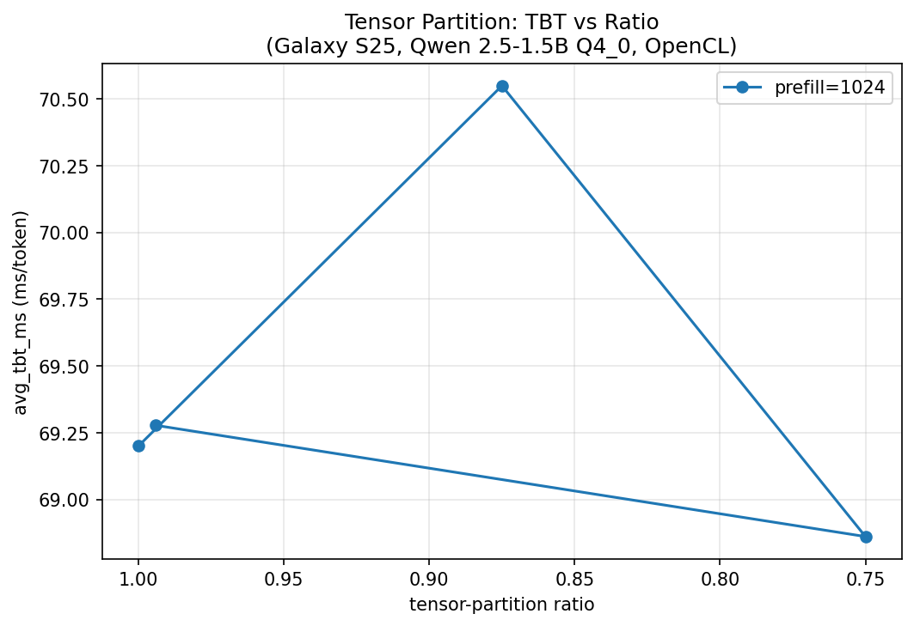

# Tensor Partition Benchmark Report

**Device**: Galaxy S25
**Model**: Qwen 2.5-1.5B Q4_0
**Backend**: OpenCL
**Ratios tested**: 1.0, 0.875, 0.75, 0.994
**Prefill lengths**: 1024
**Decode tokens**: 128

## Results

| prefill | ratio | avg_tbt_ms (mean±Δ) | tok/s | ttft_ms | Δ vs ratio=1.0 | thermal_peak |
|---------|-------|---------------------|-------|---------|---------------|-------------|
| 1024 | 1.0 | 69.2±0.9 | 14.45 | 5871 | +0.0% | 72.8°C |
| 1024 | 0.875 | 70.5±0.1 | 14.17 | 8999 | +1.9% | 74.0°C |
| 1024 | 0.75 | 68.9±0.4 | 14.52 | 7330 | -0.5% | 77.5°C |
| 1024 | 0.994 | 69.3±1.0 | 14.43 | 9373 | +0.1% | 74.4°C |

## TBT vs Ratio Plot

### Per-run Thermal Start (°C at first sys record)

| run | ratio | prefill | thermal_start |
|-----|-------|---------|---------------|
| run1 | 1.0 | 1024 | 59.2°C |
| run2 | 1.0 | 1024 | 60.7°C |
| run1 | 0.875 | 1024 | 56.8°C |
| run2 | 0.875 | 1024 | 58.8°C |
| run1 | 0.75 | 1024 | 65.4°C |
| run2 | 0.75 | 1024 | 63.1°C |
| run1 | 0.994 | 1024 | 55.3°C |
| run2 | 0.994 | 1024 | 58.4°C |

---
*Generated by experiments/analysis/tensor_partition_report.py*
