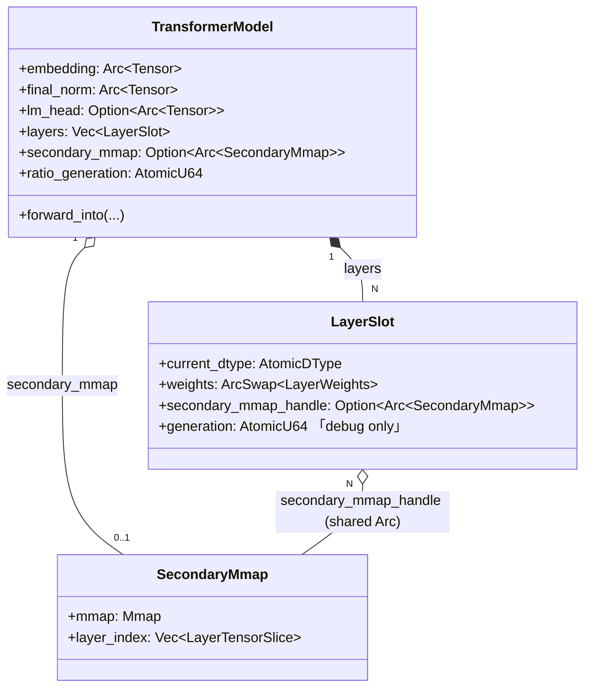

# Engine Data Types

> **TL;DR**: Engine 내부 데이터 타입, KV 캐시 구조, Backend/Buffer trait, CLI 설정을 정의한다. KVCacheOps trait (14+ 메서드)과 3종 구현체(KVCache, KiviCache, OffloadKVCache), Buffer trait 계층과 4종 구현체(SharedBuffer, MadviseableGPUBuffer, UnifiedBuffer, OpenCLBuffer), Backend trait (~20 메서드), Tensor 구조, ExecutionPlan/EvictPlan/KVSnapshot, EvictionPolicy trait과 5종 구현체, QcfMetric/QcfConfig, SkipConfig, ImportanceTable, CachePressurePipeline 데이터 타입, Engine CLI 60+ 플래그를 기술한다. 필드명/타입/범위/기본값을 정의하되 struct 레이아웃은 자유이다.

## 1. Purpose and Scope

이 문서는 Engine 내부의 **데이터 타입, 인터페이스, 설정**을 정의한다. 의미와 관계, 필드명/타입/범위/기본값을 기술한다.

**이 파일이 명세하는 것:**

- KVCacheOps trait과 구현체 (KVCache, KiviCache)
- PrefetchableCache extension trait
- Buffer trait 계층과 4종 구현체
- DType enum
- Backend trait과 구현체
- Tensor 구조
- ExecutionPlan, EvictPlan, KVSnapshot (데이터 관점)
- EvictionPolicy trait과 5종 구현체
- QcfMetric, QcfConfig, QcfMode, AggregationMode
- SkipConfig, ImportanceTable
- CachePressurePipeline 관련 타입 (PressureLevel, ActionResult, HandlerContext)
- Engine CLI 플래그 전체

**이 파일이 명세하지 않는 것:**

- Engine 아키텍처 개요 → `30-engine.md`
- 상태 머신 전이 테이블 → `31-engine-state.md`
- 알고리즘 상세 (eviction 수식, QCF 계산 등) → `32-engine-algorithms.md`
- Manager 알고리즘/데이터 → `20-manager.md` ~ `23-manager-data.md`
- 프로토콜 메시지/시퀀스 → `10-protocol.md` ~ `12-protocol-sequences.md`

## 2. Definitions

| 용어 | 정의 |
|------|------|
| **KVLayout** | KV 캐시의 메모리 레이아웃. SeqMajor 또는 HeadMajor. |
| **Dynamic Cache** | `Memory` trait을 보유한 KVCache. 런타임에 grow/shrink가 가능하다. |
| **Static Cache** | `memory = None`인 KVCache. 고정 용량이며 shrink_to_fit 불가. |
| **Monomorphization** | `<C: KVCacheOps>` 제네릭으로 컴파일 타임에 구체 타입을 결정. dyn Trait 아님, zero overhead. |
| **UMA** | Unified Memory Architecture. CPU와 GPU가 물리 메모리를 공유하는 아키텍처 (Qualcomm Snapdragon 등). |

## 3. Specification

### 3.1 KVCacheOps Trait [ENG-DAT-010]

**[ENG-DAT-010]** KVCacheOps는 KV 캐시 연산의 추상 인터페이스이다. Generic monomorphization (`<C: KVCacheOps>`)으로 사용되며 dyn Trait이 아니다. *(MUST)*

| 메서드 | 시그니처 (의사) | 설명 |
|--------|----------------|------|
| `current_pos` | `() -> usize` | 현재 유효 토큰 수 |
| `set_current_pos` | `(usize)` | 위치 카운터 직접 설정 (probe 되돌리기용) |
| `capacity` | `() -> usize` | 물리 버퍼 토큰 용량 |
| `kv_heads` | `() -> usize` | KV head 수 |
| `head_dim` | `() -> usize` | head당 차원 |
| `layout` | `() -> KVLayout` | 메모리 레이아웃 (SeqMajor / HeadMajor) |
| `kv_dtype` | `() -> DType` | 호출자가 `update()`에 전달할 dtype. KiviCache는 F32 반환 (내부 양자화) |
| `memory_usage_bytes` | `() -> usize` | 현재 저장 KV 데이터의 바이트 수 |
| `update` | `(&Tensor, &Tensor) -> Result<()>` | 새 K/V 추가. 입력: `[batch, seq_len, kv_heads, head_dim]` |
| `get_view` | `() -> (Tensor, Tensor)` | attention 계산용 K/V 텐서. `[0..current_pos]` 범위 |
| `get_buffers_mut` | `() -> Option<(&mut Tensor, &mut Tensor)>` | zero-copy scatter write용 직접 접근. KiviCache는 None 반환 |
| `advance_pos` | `(usize)` | 데이터 복사 없이 position 전진 (`get_buffers_mut`과 함께 사용) |
| `ensure_capacity` | `(usize) -> Result<bool>` | 최소 토큰 수 보장, 필요 시 grow. bool = 버퍼 변경 여부 |
| `needs_attn_scores` | `() -> bool` | decode 시 post-softmax score 계산 필요 여부 (KiviCache AWQE용) |
| `set_attn_scores` | `(&[f32], n_heads_q, stride, valid_len)` | 최근 decode step의 attention score 저장 |

---

### 3.2 PrefetchableCache Extension Trait [ENG-DAT-011]

**[ENG-DAT-011]** PrefetchableCache는 OffloadKVCache 전용 확장 trait이다. 레이어 간 I/O 파이프라인을 제공한다. *(MAY)*

| 메서드 | 설명 |
|--------|------|
| `preload` | 외부 저장소 → 메모리 버퍼 로드 |
| `release_buffers` | 메모리 버퍼 해제 (동시 2 레이어만 활성) |
| `reset_preload` | 토큰 경계에서 preloaded 플래그 리셋 |
| `retain_preload` | cross-token 버퍼 유지 (다음 토큰의 preload skip) |

---

### 3.3 KVCache 구현체 [ENG-DAT-012]

**[ENG-DAT-012]** KVCache는 일반 KV 캐시 구현체이다. F16/F32/Q4_0 dtype을 지원하며, dynamic grow/shrink가 가능하다. *(MUST)*

**필드**:

| 필드 | 타입 | 설명 |
|------|------|------|
| `k_buffer` | Tensor | K 저장소 |
| `v_buffer` | Tensor | V 저장소 |
| `current_pos` | usize | 유효 토큰 수 |
| `high_water_pos` | usize | 최대 current_pos 기록 (madvise 범위 제한, ENG-ALG-071 참조) |
| `max_seq_len` | usize | 절대 상한 |
| `capacity` | usize | 현재 물리 용량 (dynamic grow 시 변동) |
| `kv_heads` | usize | KV head 수 |
| `head_dim` | usize | head당 차원 |
| `layout` | KVLayout | SeqMajor 또는 HeadMajor |
| `memory` | Option\<Arc\<dyn Memory\>\> | dynamic grow/shrink용 할당자. None = 고정 용량 |

**KVLayout**:

| Layout | 메모리 순서 | offset(pos, head) | 용도 |
|--------|-----------|-------------------|------|
| SeqMajor | `[batch, seq_pos, kv_heads, head_dim]` | `pos * kv_heads * head_dim + head * head_dim` | Sliding window (연속 prune) |
| HeadMajor | `[batch, kv_heads, seq_pos, head_dim]` | `head * capacity * head_dim + pos * head_dim` | H2O/H2O+ (per-head eviction) |

**Dynamic grow**: `new_dynamic()` 생성자. 초기 용량에서 시작, 2배 확장 (`max_seq_len` 상한). Layout별 데이터 복사 필요 (HeadMajor는 per-head copy).

**주요 메서드** (KVCacheOps 외):

| 메서드 | 설명 |
|--------|------|
| `offset(pos, head)` | layout 기반 요소 오프셋 |
| `pos_stride()` | 연속 position 간 요소 거리 |
| `head_stride()` | 연속 head 간 요소 거리 |
| `q4_block_offset(pos, head, bpp)` | Q4_0 블록 인덱스 |
| `grow(min_capacity)` | 2배 확장, alloc_kv + 데이터 복사 |
| `shrink_to_fit()` | `next_power_of_2(current_pos)`로 축소 (ENG-ALG-072 참조) |
| `prune_prefix(count)` | 앞 count개 제거, shift, release_unused_pages |
| `shift_positions(src, dst, count)` | layout-aware 위치 이동 |
| `shift_positions_for_head(head, ...)` | HeadMajor 전용 per-head 이동 |
| `compact_keep_positions(keep, start)` | 연속 구간 batch 최적화 compaction (ENG-ALG-010 참조) |
| `compact_keep_positions_for_head(head, ...)` | per-head compaction |
| `release_unused_pages()` | shrink_to_fit 또는 madvise (ENG-ALG-071, ENG-ALG-072 참조) |
| `memory_usage_bytes()` | current_pos 기반 실제 사용량 |

---

### 3.4 KiviCache 구현체 [ENG-DAT-013]

**[ENG-DAT-013]** KiviCache는 KIVI 비대칭 양자화 KV 캐시 구현체이다. Q2/Q4/Q8 + FP32 residual 이중 구조. *(MUST)*

**필드**:

| 필드 | 타입 | 범위/기본값 | 설명 |
|------|------|------------|------|
| `bits` | u8 | {2, 4, 8} | 현재 양자화 bit-width |
| `qk` | QuantizedBlocks | - | Key blocks (per-channel) |
| `qv` | QuantizedBlocks | - | Value blocks (per-token) |
| `q2_tokens` | usize | res_cap의 배수 | 양자화 저장소의 토큰 수 |
| `res_k` | Vec\<f32\> | - | FP32 residual K `[kv_heads * res_cap * head_dim]` |
| `res_v` | Vec\<f32\> | - | FP32 residual V `[kv_heads * res_cap * head_dim]` |
| `res_pos` | usize | [0, res_cap) | residual 유효 토큰 수 |
| `res_cap` | usize | QKKV=32의 배수 | residual 용량 (CLI: `--kivi-residual-size`) |
| `attn_k_buf` | Vec\<f32\> | - | Pre-allocated attention K 출력 `[max_seq_len * kv_heads * head_dim]` |
| `attn_v_buf` | Vec\<f32\> | - | Pre-allocated attention V 출력 |
| `q2_deq_tokens` | usize | - | incremental dequant 추적 (ENG-ALG-022 참조) |
| `kv_heads` | usize | - | KV head 수 |
| `head_dim` | usize | - | head당 차원 |
| `max_seq_len` | usize | - | 최대 시퀀스 길이 |
| `group_size` | usize | 32 (= QKKV) | 양자화 그룹 크기 |
| `flush_proxies` | Vec\<QcfMetric\> | - | flush 시 수집된 QCF proxy |
| `awqe_enabled` | bool | false | AWQE proxy 활성화 여부 |
| `last_attn_scores` | Option\<AttnScoresSnapshot\> | None | 최근 attention score 스냅샷 |

**GPU mode 추가 필드** (CPU mode에서는 모두 None):

| 필드 | 타입 | 설명 |
|------|------|------|
| `gpu_backend` | Option\<Arc\<dyn Backend\>\> | GPU 백엔드 |
| `gpu_memory` | Option\<Arc\<dyn Memory\>\> | GPU 메모리 할당자 |
| `gpu_res_k`, `gpu_res_v` | Option\<Tensor\> | GPU residual 버퍼 |
| `gpu_attn_k`, `gpu_attn_v` | Option\<Tensor\> | GPU attention 출력 버퍼 |
| `gpu_q2k`, `gpu_q2v` | Option\<Tensor\> | GPU 양자화 저장소 (U8) |
| `gpu_q2k_blocks`, `gpu_q2v_blocks` | usize | GPU 양자화 블록 수 |

**AttnScoresSnapshot**:

| 필드 | 타입 | 설명 |
|------|------|------|
| `scores` | Vec\<f32\> | `[n_heads_q * stride]`, post-softmax |
| `n_heads_q` | usize | query head 수 |
| `stride` | usize | = max_seq_len allocation |
| `valid_len` | usize | 스냅샷 시점의 유효 position 수 |

**QuantizedBlocks**: enum { Q2(Vec\<BlockQ2_0\>), Q4(Vec\<BlockKVQ4\>), Q8(Vec\<BlockKVQ8\>) }. 모두 QKKV=32 단위 블록.

---

### 3.5 Buffer Trait 계층 [ENG-DAT-020]

**[ENG-DAT-020]** Buffer trait은 모든 물리 메모리 표현의 추상 인터페이스이다. `Send + Sync` 요구. *(MUST)*

| 메서드 | 시그니처 (의사) | 기본값 | 설명 |
|--------|----------------|--------|------|
| `as_any` | `() -> &dyn Any` | - | 다운캐스트용 |
| `dtype` | `() -> DType` | - | 데이터 타입 |
| `size` | `() -> usize` | - | 바이트 단위 총 크기 |
| `as_ptr` | `() -> *const u8` | - | CPU 읽기 전용 포인터 |
| `as_mut_ptr` | `() -> *mut u8` | - | CPU 쓰기 포인터 |
| `cl_mem` | `() -> Option<&Mem>` | - | OpenCL 핸들 (없으면 None) |
| `sync_device` | `() -> Result<()>` | - | 디바이스 동기화 |
| `map_for_cpu` | `() -> Result<()>` | Ok(()) | CPU 접근 매핑 (GPU→CPU 전환) |
| `unmap_for_gpu` | `() -> Result<()>` | Ok(()) | GPU 접근 매핑 (CPU→GPU 전환) |
| `is_mapped` | `() -> bool` | true | 현재 CPU 매핑 상태 |
| `is_host_managed` | `() -> bool` | true | 앱이 메모리 소유 (madvise 유효 여부 판단, ENG-ALG-071 참조) |

**구현체 4종**:

| 구현체 | 설명 | is_host_managed | cl_mem |
|--------|------|----------------|--------|
| SharedBuffer | `Vec<u8>` 기반 CPU 전용 | true | None |
| MadviseableGPUBuffer | `Vec<u8>` + `CL_MEM_USE_HOST_PTR` (ENG-ALG-073 참조) | true | Some |
| UnifiedBuffer | `CL_MEM_ALLOC_HOST_PTR` (드라이버 관리) | false | Some |
| OpenCLBuffer | GPU-only (`CL_MEM_READ_WRITE`) | false | Some |

---

### 3.6 DType [ENG-DAT-021]

**[ENG-DAT-021]** DType enum은 텐서 요소의 데이터 타입을 정의한다. *(MUST)*

| Variant | 바이트 크기 | 설명 |
|---------|-----------|------|
| Q4_0 | 블록 단위 | Block quantized (4-bit, 1 바이트/요소) |
| Q4_1 | 블록 단위 | Block quantized (4-bit, variant 1) |
| F16 | 2 | IEEE 754 half-precision |
| BF16 | 2 | Brain floating-point |
| F32 | 4 | IEEE 754 single-precision |
| U8 | 1 | Unsigned 8-bit integer |

---

### 3.7 Backend Trait [ENG-DAT-030]

**[ENG-DAT-030]** Backend trait은 하드웨어 추상화 계층이다. 모든 수치 연산을 디스패치한다. *(MUST)*

| 범주 | 메서드 | 설명 |
|------|--------|------|
| **Identity** | `name()`, `device()` | 백엔드 이름/디바이스 식별 |
| **Basic Math** | `matmul`, `matmul_transposed`, `matmul_slice` | 행렬 곱 (3종) |
| **In-place** | `add_assign`, `scale`, `add_row_bias` | 원소별 연산 |
| **Activation/Norm** | `silu_mul`, `gelu_tanh_mul`, `rms_norm`, `rms_norm_oop`, `add_rms_norm_oop`, `softmax` | 활성화/정규화 |
| **Positional** | `rope_inplace` | RoPE 위치 인코딩 |
| **Attention** | `attention_gen` | 단일 쿼리 attention (GQA 인식), `scores_out` 옵션 |
| **Memory** | `copy_from`, `copy_into`, `read_buffer`, `write_buffer`, `copy_slice`, `buffer_shift`, `gather` | 데이터 이동/복사 |
| **Cast** | `cast`, `kv_scatter_f32_to_f16` | 타입 변환 (fused F32→F16 scatter 포함) |
| **Sync** | `synchronize`, `flush` | GPU 동기화/큐 플러시 |

**구현체 2종**:

| 구현체 | 조건 | 특징 |
|--------|------|------|
| CpuBackend | `aarch64` → CpuBackendNeon, `x86_64` → CpuBackendAVX2, 기타 → CpuBackendCommon | SIMD 가속, Rayon 병렬 |
| OpenCLBackend | `opencl` feature gate | GPU kernel, plan-based decode |

---

### 3.8 Tensor [ENG-DAT-031]

**[ENG-DAT-031]** Tensor는 shape + 물리 버퍼 + 연산 디스패치 대상의 3-tuple이다. *(MUST)*

**필드**:

| 필드 | 타입 | 설명 |
|------|------|------|
| `shape` | Shape | 차원 정보 (e.g., `[1, 2048, 8, 64]`) |
| `buffer` | Arc\<dyn Buffer\> | 물리 메모리 (공유 가능) |
| `backend` | Arc\<dyn Backend\> | 연산 디스패치 대상 |

| 메서드 | 설명 |
|--------|------|
| `shape()`, `buffer()`, `backend()` | 필드 접근 |
| `dtype()`, `size()`, `numel()` | 메타데이터 |
| `as_ptr()`, `as_mut_ptr()` | 원시 포인터 |
| `as_slice::<T>()`, `as_mut_slice::<T>()` | 타입드 슬라이스 접근 |
| `reshape(new_shape)` | shape만 변경, 버퍼 불변 (numel 동일 필수) |
| `to_device(backend)` | 다른 백엔드로 복사 (같은 이름이면 no-op) |

**Clone**: `Arc<dyn Buffer>` 공유 (shallow copy). 버퍼 데이터를 복제하지 않는다.

---

### 3.9 ExecutionPlan (데이터 관점) [ENG-DAT-040]

**[ENG-DAT-040]** ExecutionPlan은 단일 `poll()` 호출의 결과물이며, Inference Loop가 즉시 소비한다. 수명 규칙은 `31-engine-state.md` ENG-ST-042 참조. *(MUST)*

**필드**:

| 필드 | 타입 | 기본값 | 설명 |
|------|------|--------|------|
| `evict` | Option\<EvictPlan\> | None | eviction 계획 |
| `switch_device` | Option\<String\> | None | 전환 대상 디바이스 (e.g., "opencl") |
| `prepare_device` | Option\<String\> | None | pre-warm 대상 디바이스 |
| `throttle_delay_ms` | u64 | 0 | 토큰 간 딜레이 (0 = 없음) |
| `suspended` | bool | false | 추론 일시중지 |
| `resumed` | bool | false | 일시중지 해제 |
| `layer_skip` | Option\<f32\> | None | skip ratio (0.0 = skip 없음) |
| `kv_quant_bits` | Option\<u8\> | None | KIVI 양자화 bits (2, 4, 8) |
| `restore_defaults` | bool | false | 모든 action 상태 초기화 |

**EvictPlan**:

| 필드 | 타입 | 범위 | 설명 |
|------|------|------|------|
| `target_ratio` | f32 | 0.0-1.0 | 보존 비율 |
| `level` | ResourceLevel | - | Warning = lossless only, Critical = lossy OK |
| `method` | EvictMethod | - | H2o, Sliding, Streaming |
| `streaming_params` | Option\<StreamingParams\> | - | Streaming 전용 파라미터. 나머지 method에서는 None |

**EvictMethod**: `enum { H2o, Sliding, Streaming }`

- `Streaming`: StreamingLLM 정책 실행. `streaming_params`에서 sink_size, window_size를 추출하여 `StreamingLLMPolicy::new(sink_size, window_size).evict()` 호출

**StreamingParams**:

| 필드 | 타입 | 설명 |
|------|------|------|
| `sink_size` | usize | Attention sink 토큰 수 (시퀀스 선두 유지) |
| `window_size` | usize | Recent window 크기 (시퀀스 후미 유지) |

**KVSnapshot**:

| 필드 | 타입 | 설명 |
|------|------|------|
| `total_bytes` | u64 | KV 캐시 총 바이트 |
| `total_tokens` | usize | 유효 토큰 수 |
| `capacity` | usize | 물리 용량 |
| `protected_prefix` | usize | 보호 prefix 수 |
| `kv_dtype` | String | "f16", "q4", "q2" 등 |
| `eviction_policy` | String | "none", "h2o", "sliding", "d2o" 등 |
| `skip_ratio` | f32 | 현재 layer skip 비율 |

---

### 3.10 EvictionPolicy Trait [ENG-DAT-050]

**[ENG-DAT-050]** EvictionPolicy trait은 eviction 정책의 추상 인터페이스이다. `Send + Sync` 요구. *(MUST)*

| 메서드 | 시그니처 (의사) | 설명 |
|--------|----------------|------|
| `should_evict` | `(&KVCache, mem_available: usize) -> bool` | eviction 트리거 판단 |
| `evict` | `(&mut KVCache, target_len: usize) -> Result<()>` | score 없는 eviction |
| `name` | `() -> &str` | 정책 이름 |
| `evict_with_scores` | `(&mut KVCache, target_len, importance: &[f32]) -> Result<()>` | flat importance array 기반 eviction |
| `evict_with_head_scores` | `(&mut KVCache, target_len, flat, head, n_kv_heads) -> Result<()>` | per-KV-head importance 기반 eviction |

**구현체 4종**:

| 구현체 | name() | 설명 |
|--------|--------|------|
| H2OPolicy | "h2o" | score 기반 3-partition (ENG-ALG-010 참조). `keep_ratio`, `protected_prefix`, `decay` 파라미터 |
| H2OPlusPolicy | "h2o_plus" | per-KV-head eviction (HeadMajor 전용) |
| SlidingWindowPolicy | "sliding_window" | FIFO prune_prefix (ENG-ALG-011 참조) |
| StreamingLLMPolicy | "streaming" | Attention sink + sliding window 결합. `sink_size` + `window_size` 파라미터 |
| NoEvictionPolicy | "none" | `should_evict` 항상 false |

---

### 3.11 QcfMetric [ENG-DAT-060]

**[ENG-DAT-060]** QcfMetric은 단일 QCF 측정의 결과를 표현한다. *(MUST)*

| 필드 | 타입 | 범위 | 설명 |
|------|------|------|------|
| `action` | String | - | 액션 식별자. 가능한 값: `"h2o"`, `"sliding_attn"`, `"eviction_attn"`, `"eviction_caote"`, `"sliding_caote"`, `"kivi"`, `"kivi_opr"`, `"kivi_awqe"`, `"swift"` |
| `raw_value` | f32 | 주로 [0, 1] | 집계된 QCF 값. Eviction: `evicted_imp / total_imp` (clamp 0~1). Non-eviction: unbounded 가능 |
| `normalized_value` | f32 | [0, +inf) | 정규화 값. Eviction: `evicted_imp / remaining_imp` (**unbounded, 1 이상 가능**). Non-eviction: raw_value와 동일 |
| `per_head` | Option\<Vec\<f32\>\> | - | per-KV-head QCF. Layout: `[n_kv_heads]` |
| `tokens_affected` | usize | - | 액션이 영향을 미친 토큰 수 |

> **코드와 기존 스펙 불일치 (00-overview SYS-043)**: SYS-043은 normalized_value를 "[0,1] 정규화"로 기술하나, 실제 코드에서 eviction의 `normalized_value = evicted_importance / remaining_importance`이며 1 이상이 가능하다. 이 스펙은 코드를 따른다.

---

### 3.12 QcfConfig [ENG-DAT-061]

**[ENG-DAT-061]** QcfConfig는 QCF 수집의 런타임 설정이다. *(MUST)*

| 필드 | 타입 | 기본값 | 설명 |
|------|------|--------|------|
| `enabled` | bool | true | QCF 수집 활성화 |
| `mode` | QcfMode | Attn | proxy 모드 |
| `aggregation` | AggregationMode | Mean | head 집계 방식 |
| `d_max` | f32 | 5.0 | 최대 degradation 추정값 |
| `epsilon` | f32 | 1e-8 | division-by-zero 가드 |

**QcfMode**: `enum { Attn, Caote, Both }`

**AggregationMode**: `enum { Mean, Defensive { temperature: f32 } }`

- `Mean`: 단순 평균
- `Defensive`: softmax-weighted mean (ENG-ALG-041 참조). temperature가 낮을수록 worst-case head 강조

---

### 3.13 SkipConfig [ENG-DAT-062]

**[ENG-DAT-062]** SkipConfig는 SWIFT 기반 layer skip 설정이다. *(MUST)*

**필드**:

| 필드 | 타입 | 설명 |
|------|------|------|
| `attn_skip` | HashSet\<usize\> | attention skip 레이어 인덱스 |
| `mlp_skip` | HashSet\<usize\> | MLP skip 레이어 인덱스 |

**메서드**:

| 메서드 | 설명 |
|--------|------|
| `new()` | 빈 설정 (skip 없음) |
| `uniform_init(num_layers, skip_ratio)` | 균등 분배 초기화 (ENG-ALG-030 참조) |
| `validate(num_layers) -> bool` | SWIFT 제약 검증 (layer 0, L-1 보호) |
| `skip_attn(layer_id)` | 해당 레이어 attention skip 여부 |
| `skip_mlp(layer_id)` | 해당 레이어 MLP skip 여부 |
| `total_skips()` | 전체 skip된 sub-layer 수 |
| `is_active()` | 하나라도 skip이면 true |

---

### 3.14 ImportanceTable / ImportanceEntry [ENG-DAT-063]

**[ENG-DAT-063]** ImportanceTable은 prefill 시 1회 계산된 per-layer importance를 저장한다. *(MUST)*

**ImportanceEntry**:

| 필드 | 타입 | 범위 | 설명 |
|------|------|------|------|
| `layer_id` | usize | [0, L) | 레이어 인덱스 |
| `sublayer` | SubLayer | Full, Attention, Mlp | sub-layer 구분 |
| `importance` | f32 | [0, 1] | `1 - cosine_similarity(input, output)`. 0=identity, 1=orthogonal |
| `opr` | f32 | [0, +inf) | `||output-input|| / ||input||` |

**ImportanceTable**:

| 필드 | 타입 | 설명 |
|------|------|------|
| `entries` | Vec\<ImportanceEntry\> | 레이어별 importance 목록 |
| `total_importance` | f32 | 모든 entry의 importance 합 |

**메서드**:

| 메서드 | 설명 |
|--------|------|
| `compute_qcf(skip_set)` | 주어진 skip set의 QCF 값 [0, 1] (ENG-ALG-032 참조) |
| `compute_opr_skip(skip_set)` | skip된 레이어들의 OPR 합 |
| `estimate_qcf_for_count(n, L)` | importance 최저 n개 선택, QCF + skip set 반환 |

---

### 3.15 Engine CLI 플래그 [ENG-DAT-070]

**[ENG-DAT-070]** `generate` 바이너리의 모든 CLI 인수를 정의한다. *(MUST)*

#### 3.15.1 기본 설정

| 플래그 | 타입 | 기본값 | 설명 |
|--------|------|--------|------|
| `--model-path` | String | "models/llama3.2-1b" | 모델 경로 |
| `--prompt` | String | "Hello, world! I am a" | 입력 프롬프트 |
| `--prompt-file` | String? | None | 프롬프트 파일 경로 (`--prompt` 대체) |
| `--num-tokens` | usize | 20 | 생성 토큰 수 |
| `--backend` | String | "cpu" | "cpu", "opencl", "hybrid" |
| `--switch-threshold` | usize | 0 | hybrid CPU→GPU 전환 토큰 수 |
| `--zero-copy` | bool | false | zero-copy shared memory |
| `--max-seq-len` | usize | 2048 | 최대 시퀀스 길이 |
| `--threads` | usize | 0 | 스레드 수 (0=auto) |
| `--use-rayon` | bool | false | Rayon vs SpinPool 토글 |

#### 3.15.2 샘플링

| 플래그 | 타입 | 기본값 | 설명 |
|--------|------|--------|------|
| `--temperature` | f32 | 0.8 | 샘플링 온도 |
| `--top-p` | f32 | 0.9 | Top-p (nucleus) 샘플링 |
| `--top-k` | usize | 40 | Top-k 샘플링 |
| `--repetition-penalty` | f32 | 1.1 | 반복 페널티 |
| `--repetition-window` | usize | 64 | 반복 페널티 윈도우 |
| `--greedy` | bool | false | 그리디 샘플링 (temperature=0) |
| `--ignore-eos` | bool | false | EOS 무시, 계속 생성 |

#### 3.15.3 GPU / Attention

| 플래그 | 타입 | 기본값 | 설명 |
|--------|------|--------|------|
| `--gpu-attn` | bool | false | GPU attention 커널 사용 |
| `--no-gpu-plan` | bool | false | GPU 커널 플랜 비활성 |
| `--no-prefill-ws` | bool | false | PrefillWorkspace 비활성 |
| `--prefill-chunk-size` | usize | 0 | Chunked prefill 크기 (0=비활성, ENG-ALG-080 참조) |

#### 3.15.4 KV 캐시

| 플래그 | 타입 | 기본값 | 설명 |
|--------|------|--------|------|
| `--weight-dtype` | String | "f16" | 모델 가중치 타입 ("f16", "q4") |
| `--kv-type` | String | "f16" | KV 캐시 타입 ("f32", "f16", "q4") |
| `--kv-layout` | String | "head" | "head" (HeadMajor) 또는 "seq" (SeqMajor) |
| `--initial-kv-capacity` | usize | 0 | 초기 KV 용량 (0=auto) |
| `--kv-budget` | usize | 0 | KV 예산 (토큰, 0=무제한) |
| `--kv-budget-ratio` | f32 | 0.0 | KV 예산 (prompt 대비 비율) |

#### 3.15.5 KIVI 양자화

| 플래그 | 타입 | 기본값 | 설명 |
|--------|------|--------|------|
| `--kivi` | bool | false | KIVI 양자화 활성 |
| `--kivi-residual-size` | usize | 32 | KIVI residual 버퍼 크기 |

#### 3.15.6 Eviction 정책

| 플래그 | 타입 | 기본값 | 설명 |
|--------|------|--------|------|
| `--eviction-policy` | String | "none" | "none", "sliding", "streaming", "h2o", "h2o_plus", "d2o" |
| `--eviction-window` | usize | 1024 | sliding/streaming 윈도우 크기 |
| `--sink-size` | usize | 4 | StreamingLLM attention sink 토큰 수 |
| `--streaming-window` | usize | 0 | StreamingLLM recent 윈도우 (0=auto) |
| `--protected-prefix` | usize? | None | eviction 보호 prefix (기본: 정책별 상이) |
| `--memory-threshold-mb` | usize | 256 | eviction 트리거 메모리 임계값(MB) |
| `--eviction-target-ratio` | f32 | 0.75 | eviction 보존 비율 |

#### 3.15.7 H2O 설정

| 플래그 | 타입 | 기본값 | 설명 |
|--------|------|--------|------|
| `--h2o-keep-ratio` | f32 | 0.5 | H2O heavy hitter 보존 비율 |
| `--h2o-tracked-layers` | usize | 0 | H2O score 추적 레이어 수 (0=전체) |
| `--h2o-decay` | f32 | 0.0 | H2O score 지수 감쇠 (0=없음) |
| `--h2o-debug` | bool | false | H2O 디버그 출력 |
| `--h2o-raw-scores` | bool | false | time-normalized scoring 비활성 |

#### 3.15.8 D2O 설정

| 플래그 | 타입 | 기본값 | 설명 |
|--------|------|--------|------|
| `--d2o-keep-ratio` | f32 | 0.75 | D2O heavy hitter 비율 |
| `--d2o-ema-alpha` | f32 | 0.5 | D2O EMA old-threshold 가중치 |
| `--d2o-ema-beta` | f32 | 0.5 | D2O EMA new-mean 가중치 |
| `--d2o-layer-alloc` | bool | false | D2O per-layer 동적 할당 |
| `--d2o-protected-layers` | Vec\<usize\>? | None | D2O 보호 레이어 |

#### 3.15.9 Layer Skip

| 플래그 | 타입 | 기본값 | 설명 |
|--------|------|--------|------|
| `--skip-layers` | Vec\<usize\>? | None | 명시적 skip 레이어 |
| `--skip-ratio` | f32? | None | skip 비율 (uniform_init, ENG-ALG-030 참조) |
| `--dump-importance` | bool | false | importance table 출력 후 종료 |

#### 3.15.10 QCF

| 플래그 | 타입 | 기본값 | 설명 |
|--------|------|--------|------|
| `--qcf-mode` | String | "attn" | "attn", "caote", "both" |

#### 3.15.11 Resilience

| 플래그 | 타입 | 기본값 | 설명 |
|--------|------|--------|------|
| `--enable-resilience` | bool | false | Resilience Manager 활성 |
| `--resilience-transport` | String | "dbus" | "dbus", "unix:\<path\>", "tcp:\<addr\>" |
| `--experiment-eviction-ratio` | f32? | None | resilience eviction ratio override |

#### 3.15.12 KV Offload

| 플래그 | 타입 | 기본값 | 설명 |
|--------|------|--------|------|
| `--kv-offload` | String | "none" | "none", "raw", "disk" |
| `--offload-path` | String | "" | disk offload 경로 |
| `--max-prefetch-depth` | usize | 4 | offload prefetch depth |

#### 3.15.13 프로파일링

| 플래그 | 타입 | 기본값 | 설명 |
|--------|------|--------|------|
| `--profile` | bool | false | 프로파일링 활성 |
| `--profile-dir` | String | "results/profile" | 프로파일 출력 디렉토리 |
| `--profile-interval` | usize | 1 | Score snapshot 간격 |
| `--profile-probes` | String | "ops,latency,scores" | 프로파일 프로브 목록 |
| `--profile-per-head` | bool | false | per-KV-head score 추적 |

#### 3.15.14 평가

| 플래그 | 타입 | 기본값 | 설명 |
|--------|------|--------|------|
| `--eval-ll` | bool | false | log-likelihood 평가 모드 |
| `--eval-continuation` | String? | None | 평가 continuation 텍스트 |
| `--eval-batch` | String? | None | 평가 배치 JSON |
| `--ppl` | String? | None | perplexity 평가 참조 텍스트 |

#### 3.15.15 실험

| 플래그 | 타입 | 기본값 | 설명 |
|--------|------|--------|------|
| `--experiment-schedule` | String? | None | 실험 스케줄 JSON |
| `--experiment-output` | String? | None | 실험 출력 JSONL |
| `--experiment-logits-topk` | usize | 10 | 실험 top-K logits 기록 수 |
| `--experiment-sample-interval` | usize | 1 | 시스템 메트릭 샘플 간격 |

---

### 3.15.16 Weight Loading / Dynamic Weight Swap

| 플래그 | 타입 | 기본값 | 설명 |
|--------|------|--------|------|
| `--model-path` | String | (기존) | Primary 가중치 파일. 초기 로딩 시 모든 decoder layer가 이 파일의 dtype으로 로드된다. |
| `--model-path-secondary` | String? | None | Secondary 가중치 파일 (낮은 정밀도, e.g. Q4_0). 제공 시 디스크에 mmap만 되고, 런타임 swap 대상으로 예약된다. (ENG-DAT-090) |
| `--force-swap-ratio` | `Option<f32>` | None | 디버그 전용. Manager 없이 prefill 종료 시 `ResilienceAction::SwapWeights { ratio }`를 직접 트리거한다. 값은 `[0.0, 1.0]`. (ENG-ALG-211 debug hook) |

---

### 3.16 PressureLevel / ActionResult [ENG-DAT-080]

**[ENG-DAT-080]** CachePressurePipeline의 pressure level과 handler 결과 타입을 정의한다. *(MUST)*

**PressureLevel**: `type PressureLevel = llm_shared::Level` -- `Normal < Warning < Critical < Emergency` (Ord derive).

**ActionResult**:

| Variant | 필드 | 설명 |
|---------|------|------|
| `NoOp` | - | 액션 미수행 |
| `Evicted` | `tokens_removed: usize`, `new_pos: usize` | 토큰 제거됨 |
| `Quantized` | - | KV 정밀도 감소 (stub) |
| `Swapped` | `tokens_swapped: usize` | KV 토큰 offload됨 |
| `WeightSwapped` | `layers: Vec<(usize, DType, DType)>`, `freed_bytes: u64`, `latency_ms: u64` | Weight layer dtype 교체됨. `(layer_idx, from_dtype, to_dtype)` 튜플 목록. `freed_bytes`는 `madvise(DONTNEED)` 후 회수된 상주 바이트. `latency_ms`는 swap 전체 실행 시간. (WSWAP-2, INV-123 검증 기반) |

**HandlerContext**: 각 CachePressureHandler에 전달되는 컨텍스트.

| 필드 | 타입 | 설명 |
|------|------|------|
| `caches` | &mut [KVCache] | 모든 레이어의 KV 캐시 |
| `importance` | Option\<&[f32]\> | per-token importance scores |
| `head_importance` | Option\<&[f32]\> | per-KV-head importance scores |
| `n_kv_heads` | usize | KV head 수 |
| `pressure_level` | PressureLevel | 현재 pressure level |
| `mem_available` | usize | 가용 메모리 바이트 |
| `target_ratio` | Option\<f32\> | 외부 override (resilience) |
| `qcf_sink` | Option\<&mut Vec\<QcfMetric\>\> | QCF 메트릭 수집 대상 |
| `layer_ratios` | Option\<&[(f32, f32)]\> | D2O layer allocation |

---

### 3.17 LoadConfig — Weight Loading with Dynamic Swap [ENG-DAT-090]

**[ENG-DAT-090]** `LoadConfig`는 가중치 로딩의 런타임 설정이다. 초기 로딩은 단일 `default_dtype`을 사용하고, `secondary_source`가 제공되면 런타임 swap 대상 파일로 예약한다. *(MUST)*

**필수 필드**:

| 필드 | 타입 | 설명 |
|------|------|------|
| `primary_source` | PathBuf | Primary 가중치 파일 경로. 기존 `--model-path`가 연결되는 지점. 초기 모든 decoder layer 로딩 소스. |
| `default_dtype` | DType | Primary 파일이 공급하는 기본 dtype. Loader가 파일 헤더에서 추론하며 초기 로딩 시점의 `LayerSlot::current_dtype` 초깃값. |

**신규 필드** (Dynamic Swap 지원):

| 필드 | 타입 | 기본값 | 설명 |
|------|------|--------|------|
| `secondary_source` | `Option<PathBuf>` | None | Secondary 가중치 파일 경로. Primary보다 낮은 정밀도 dtype(e.g. Q4_0)이어야 의미가 있다. **초기 로딩에 사용되지 않는다** — mmap 핸들만 `TransformerWeights`에 보관되어 나중에 `SwapExecutor`가 layer 단위로 참조한다. |

**의미론**:

- `secondary_source == None`이면 swap 경로 비활성. `EngineCommand::SwapWeights`는 `WeightSwapError::NoSecondary` 응답(ENG-DAT-C09).
- `secondary_source == Some(path)`이면 로더가 primary에 더해 secondary 파일의 metadata(n_layer, n_head, n_kv_head, hidden_size, intermediate_size, head_dim)를 검증하고 mmap을 열어둔다. mmap handle은 `LayerSlot::secondary_mmap_handle`로 공유된다 (ENG-DAT-092).
- **초기 로딩 후 ε(양자화 noise factor) 계산도 eager하게 수행된다** (ENG-DAT-095, ENG-ALG-216). 계산 결과는 `QuantNoiseTable`로 engine에 보관되어 이후 모든 swap 결정의 독립 입력이 된다.
- 초기 로딩 후 모든 decoder layer의 `current_dtype`은 `default_dtype`과 같고, `Primary` 전용 상태이다.
- Cross-layer tensor(embedding, final_norm, lm_head)는 항상 primary에서 로드된다. **Swap 대상이 아니다.**
- Backend 무관. OpenCL 백엔드의 `rewrap_weights_for_dual_access()`는 swap 직후의 새 Buffer에 대해서도 동일 규칙으로 호출된다.

**Phase 3 사이드 이펙트 명시**:

- `secondary_source.is_some()` ⇒ engine init에서 다음 두 객체가 반드시 생성된다:
  1. `Arc<SecondaryMmap>` (ENG-DAT-094) — `TransformerModel::secondary_mmap` 필드에 보관.
  2. `QuantNoiseTable` (ENG-DAT-095) — engine에 보관, `WeightSwapDecider`가 read-only 소비.
- ε 계산은 **실패해도 엔진 기동을 막지 않는다**: 개별 layer 실패 시 `ε_i = 1.0` fallback, 전체 실패 시 `QuantNoiseTable::uniform_ones(num_layers)`로 degrade. 실패 layer는 decider에서 **swap 후보에서 제외**된다 (INV-127, ENG-ALG-216).
- ε 계산 시간은 Llama 1B(16 layer × ~7 tensor × 수백 MiB Frobenius)에서 호스트 CPU 대략 200ms~1s 예상. 5초 이상 예상 디바이스에서는 loader가 **progress log**를 stderr로 출력한다 (권장사항, *(SHOULD)*).

**구현 전환 계획 (Loader 시그니처)**:

- Phase 1(현재): `LoadConfig` struct는 선언만 완료된 상태이며, 실제 loader 엔트리(`load_gguf_with_secondary` 등)는 여전히 `primary_path`, `default_dtype`, `Option<secondary_path>` 를 **낱개 파라미터**로 받는다. Phase 1 범위에서는 struct 도입으로 인한 시그니처 변경을 보류한다.
- Phase 2 `WSWAP-2-TRIGGER` 커밋(`--force-swap-ratio` CLI 추가) 시점에 loader 엔트리 포인트를 `load_model(config: LoadConfig) -> Result<TransformerWeights, LoadError>` 형태로 **일괄 전환**한다. 이 전환은 ENG-DAT-090 구현 완결의 일부이며, 전환 전까지는 Phase 1 shim 시그니처를 정답으로 취급한다.
- 전환 후에는 CLI 파싱 → `LoadConfig` 구성 → `load_model` 호출의 단일 경로만 유효하며, 낱개 파라미터를 받는 API는 제거된다.

**ENG-DAT-091 [DEPRECATED 2026-04-24]**: 구 TOML `LayerDtypeProfile` 스키마는 정적 per-layer profile 노선과 함께 폐기되었다. 동적 swap은 Manager 신호 기반이며 TOML 입력이 없다. `quantize_profile` 바이너리도 동시 폐기. ID는 재사용하지 않는다.

---

### 3.18 LayerSlot — Swappable Weight Slot [ENG-DAT-092]

**[ENG-DAT-092]** `LayerSlot`은 decoder block 한 layer의 가중치 묶음을 런타임에 교체 가능한 단위로 캡슐화한다. Forward pass는 이 slot을 통해서만 layer weight에 접근한다. *(MUST)*

**필드**:

| 필드 | 타입 | 설명 |
|------|------|------|
| `current_dtype` | `DType` | 현재 slot이 보유한 weight dtype. 초기값은 `LoadConfig::default_dtype`. swap 후 secondary dtype으로 전환. `INV-124` 대상. |
| `weights` | `Arc<LayerWeights>` 또는 동치 snapshot 타입 | Layer의 QKV/O/gate/up/down + attn_norm/ffn_norm tensor 묶음. **Lock-free snapshot 교체**가 핵심 요건. 기본 권장 구현은 `arc_swap::ArcSwap<LayerWeights>`. 대안은 `RwLock<Arc<LayerWeights>>` 또는 custom epoch 기반 swap. 최종 선택은 Senior Implementer PoC의 decode latency 측정 후 확정한다. |
| `secondary_mmap_handle` | `Option<Arc<SecondaryMmap>>` | Secondary 파일의 mmap view. Layer 범위의 tensor slice 정보(offset+len+dtype)를 포함. `None`이면 이 layer는 swap 불가. |
| `generation` | `AtomicU64` | **Debug/tracing 전용 카운터.** Swap 발생 시 `SwapExecutor`가 1씩 증가. Forward hot path, plan invalidation, 재진입 판정 등 **정확성 경로에서 절대 참조하지 않는다** — 이 목적에는 전역 `TransformerModel.ratio_generation`(ENG-DAT-093) 하나만 사용된다. per-slot `generation`은 관측/로그/테스트 보조로만 사용한다. |

**후조건**:
- Forward 읽기 경로는 `weights` snapshot을 `Arc::clone`으로 획득 후 사용 (per-token atomic snapshot 규약은 ENG-ALG-214 및 INV-121 참조). 진행 중 swap이 발생해도 해당 토큰은 이전 snapshot을 계속 사용하고, **다음 토큰 진입 시 최신 snapshot을 본다**.
- `current_dtype`은 snapshot 교체와 **동일 원자 단계**에 갱신되어야 한다 (INV-124).
- `generation` 증가 타이밍은 `weights.store()` 완료 직후이지만, forward/plan 경로는 이를 관찰하지 않으므로 느슨한 순서(`Relaxed`)로 충분하다.

**3-counter 관계 (generation counters)**:

| 카운터 | 스코프 | 증가 주체 | 증가 단위 | 관찰자 | 용도 |
|--------|--------|-----------|-----------|--------|------|
| `LayerSlot::generation` | per-slot | `SwapExecutor` | slot 단일 swap마다 +1 | tracing/로그/테스트 | **Debug 전용.** 정확성 경로 참조 금지. |
| `TransformerModel.ratio_generation` (ENG-DAT-093, flat 필드) | global | `SwapExecutor` | batch 완료 후 **정확히 1회** +1 | `PartitionPlanContext`, plan 빌드 경로 | 전역 plan 재빌드 트리거 단일 소스. |
| `PartitionPlanContext::ratio_generation` (INV-120 기존) | plan snapshot | Plan 빌드 시점 | Plan 빌드 시 `TransformerModel.ratio_generation` 값 캡처 | `PartitionStep::run` | Plan stale 감지. mismatch 시 `PlanInvalidated`. |

교차 참조: INV-120, INV-121, INV-123.

---

### 3.19 TransformerWeights 배치 — `TransformerModel` 내부 flat 필드 [ENG-DAT-093]

**[ENG-DAT-093]** 모델 전체의 per-layer slot, cross-layer tensor, 공유 secondary mmap handle, 전역 swap 세대 카운터는 `TransformerModel`(`engine/src/models/transformer.rs`)의 **flat 멤버 필드**로 배치된다. 별도의 `TransformerWeights` wrapper struct를 두지 않는다. *(MUST)*

**설계 결정 (2026-04-24 확정)**:

- 이전 초안은 독립 struct `TransformerWeights { layers, embedding, final_norm, lm_head, secondary_mmap, ratio_generation }`를 가정했다.
- 그러나 실제 `TransformerModel`은 이미 embedding / final_norm / lm_head 를 자체 필드로 보유하므로 독립 struct로 묶을 경우 **이중 소유 또는 중복 필드**가 발생한다.
- Phase 1 구현은 이를 회피하기 위해 `TransformerWeights`를 파일(`engine/src/models/weights/transformer_weights.rs`)에 선언만 해 두고 실사용처가 0이며, 대신 `TransformerModel`에 `layers`, `secondary_mmap`, `ratio_generation` 을 직접 추가했다. **이 flat 배치가 정답으로 확정된다.**
- 따라서 `engine/src/models/weights/transformer_weights.rs`의 `TransformerWeights` struct는 **죽은 추상화**이며, Phase 2 구현 진입 시 해당 파일 및 `mod.rs`의 pub re-export는 제거된다. 이름(`TransformerWeights`)은 폐기되지만 **식별자 `ENG-DAT-093`은 본 항목(flat 배치)으로 의미 승계**한다.

**배치 요구사항**:

`TransformerModel`(또는 동등한 최상위 모델 struct)은 swap 관련 다음 필드를 **모두 flat 멤버**로 보유한다. 필드 이름은 정확한 철자가 아닌 **역할**로 정의되며, 구현은 동등한 이름/타입을 사용할 수 있다.

| 역할 | 타입 | 설명 |
|------|------|------|
| decoder layer slots | `Vec<LayerSlot>` | Decoder block layer 목록. 길이 = `num_layers`. 순서는 layer index와 동일. Swap 대상의 **유일한** 컬렉션이다. |
| embedding | `Arc<Tensor>` 또는 동치 | 임베딩 테이블. **Swap 대상 아님**. `LoadConfig::default_dtype`으로 로드된 상태 유지. **기존 `TransformerModel` 필드 그대로 사용**. |
| final_norm | `Arc<Tensor>` 또는 동치 | 최종 RMSNorm weight. **Swap 대상 아님**. 기존 필드 재사용. |
| lm_head | `Option<Arc<Tensor>>` 또는 동치 | 출력 projection. tie_word_embeddings 모델(Qwen 등)은 `None`이며 forward는 embedding을 재사용. **Swap 대상 아님**. 기존 필드 재사용. |
| secondary_mmap | `Option<Arc<SecondaryMmap>>` | Secondary 파일 mmap 소유권 핸들. 모든 `LayerSlot::secondary_mmap_handle`은 여기서 clone된 Arc를 공유. 생성자에서 1회 설정 후 모델 lifetime 동안 **drop 금지** (INV-125). |
| ratio_generation | `AtomicU64` | **전역 swap 세대 카운터 (single source of truth).** `SwapExecutor`가 ratio 기반 다중 layer를 한 배치로 교체할 때 **배치 전체에 대해 정확히 1회** 증가 (ENG-ALG-211 참조). Plan 재빌드 트리거의 유일한 키 (INV-120, ENG-ALG-200과 의미 통합). |

**구조 다이어그램**:



**불변식**:

- `secondary_mmap.is_some()` ⇒ 해당 `Arc<SecondaryMmap>`는 `TransformerModel` drop 시점까지 살아있다 (INV-125). 모델이 이 Arc의 **최후 keeper**이다.
- 각 `LayerSlot::secondary_mmap_handle.is_some()` ⇒ 해당 Arc는 `TransformerModel.secondary_mmap`과 동일 pointee.
- `ratio_generation`은 **오직** `SwapExecutor`만 증가시키며, 배치 내 여러 layer를 교체하더라도 **배치당 정확히 1회** 증가한다 (개별 layer 단위 bump 금지). 교차 참조: ENG-ALG-211, INV-120, INV-123.

**Arch 매핑**: `arch/weight_swap.md` §2.3 (컴포넌트 설명은 flat 배치 기준으로 작성됨).

---

### 3.20 SecondaryMmap — Layer Tensor View [ENG-DAT-094]

**[ENG-DAT-094]** `SecondaryMmap`은 secondary GGUF 파일의 메모리 매핑과, **decoder block layer에 한정된** tensor slice 인덱스를 보관하는 read-only 핸들이다. *(MUST)*

**Swap 범위 제약**:

- Swap 대상은 **decoder block layer에 속한 tensor만**이다 (예: `blk.{i}.attn_*.weight`, `blk.{i}.ffn_*.weight`, `blk.{i}.*_norm.weight`).
- Embedding, final_norm, lm_head 등 **cross-layer tensor는 swap 대상이 아니다** (ENG-DAT-C11 동일 취지). 따라서 `SecondaryMmap`은 이 영역에 대한 offset 정보를 **보관하지 않는다**.
- Metadata 정합성 검증(n_layer / hidden_size / 등)은 loader가 primary/secondary 파일을 **읽는 시점**에 수행하며, 검증이 끝나면 관련 cross-layer offset은 폐기한다 — 런타임에 `SecondaryMmap`이 들고 있을 필요가 없다.
- 향후 cross-layer tensor swap을 허용해야 한다면 **별도의 신규 필드/ID**로 재도입한다. 본 ID(ENG-DAT-094)의 범위는 decoder layer로 고정이다.

**필드**:

| 필드 | 타입 | 설명 |
|------|------|------|
| `mmap` | `memmap2::Mmap` 또는 동치 | Secondary 파일 전체 read-only mmap. |
| `layer_index` | `Vec<LayerTensorSlice>` | 각 decoder layer에 속한 tensor들의 `(name, offset, len, dtype, shape)` 목록. GGUF header 파싱 1회로 구축. 길이는 `num_layers`와 일치한다. |

**폐기된 필드 (2026-04-24)**:

- `cross_layer_offsets: HashMap<String, (u64, u64, DType)>` — Phase 1에서 populate만 되고 **read 경로가 0**이었다. Swap 범위가 decoder layer로 확정된 이상 런타임에 보관할 이유가 없다. Phase 2 구현 진입 시 필드와 채우는 코드를 함께 제거한다. 메타데이터 검증은 loader 로컬 변수로 충분하다.

**의미론**:
- `SwapExecutor`는 `layer_index[i]`를 조회해 해당 layer에 필요한 tensor의 raw byte slice를 얻고, Q/K permutation 등 primary loader와 동일한 후처리를 적용하여 새 `LayerWeights`를 생성한다.
- `mmap` 자체는 swap 후에도 drop되지 않는다. `madvise(DONTNEED)`는 swap된 **primary** 페이지 영역에만 적용된다 (INV-125의 보호 대상이 아닌 쪽).

---

### 3.21 QuantNoiseTable — Per-Layer Quantization Noise Factor [ENG-DAT-095]

**[ENG-DAT-095]** `QuantNoiseTable`은 primary 대 secondary 가중치의 layer별 quantization noise factor `ε_i`를 보관하는 read-only 테이블이다. 생성은 **engine init**에서 secondary mmap open 직후 eager하게 1회 수행되며, 이후 모든 `WeightSwapDecider` 호출의 독립 입력이 된다. *(MUST)*

**설계 결정 (2026-04-24 확정)**:

- **Eager 계산**: engine 기동 시 단 1회. 근거:
  1. 실험 재현성. 동일 swap 결정을 모든 세션에서 재현해야 QCF-PPL 상관 검증이 성립한다.
  2. ε는 QCF_swap 수식(ENG-ALG-217)의 **고정 상수**로 쓰이며, 실행 중 변하지 않아야 Manager의 LinUCB 학습이 수렴한다.
  3. Lazy 계산은 첫 swap 시점의 latency spike를 유발한다 (Manager 신호 응답성 저하).
- **Read-only 테이블**: 생성 후 불변. `Arc<QuantNoiseTable>`로 공유 가능.
- **Per-layer 스칼라**: per-tensor 분해는 저장하지 않는다 (`Q/K/V/O/gate/up/down`별 Frobenius는 layer 단위로 합산). 근거: decider는 layer 단위로 결정하며, per-tensor 세분화는 현 스코프 외.

**필드**:

| 필드 | 타입 | 설명 |
|------|------|------|
| `per_layer` | `Vec<f32>` | 길이 = `num_decoder_layers`. `per_layer[i] = ε_i ∈ [0.0, +∞)`. 값이 클수록 양자화 오차가 크다. 해당 layer의 **계산 실패**(shape mismatch, dequant 실패 등) 시 `f32::NAN`으로 표기된다. |
| `computed_at_init` | `bool` | 테이블이 eager 경로로 생성되었는지 여부. 진단/로그용. `false`인 경우는 fallback 경로(uniform ones). |

**접근 API (개념)**:

| 메서드 | 시그니처 | 후조건 |
|--------|----------|--------|
| `new_from_frobenius` | `(primary, secondary) -> Self` | ENG-ALG-216 절차 수행. 실패 layer는 NaN. |
| `uniform_ones` | `(num_layers) -> Self` | fallback. 모든 `ε_i = 1.0`, `computed_at_init = false`. |
| `epsilon` | `(layer_idx) -> Option<f32>` | NaN이면 `None`, 유효값이면 `Some(ε_i)`. |
| `len` | `() -> usize` | 레이어 수. |

**의미론**:

- `epsilon(i).is_none()` ⇒ layer i는 **swap 후보에서 제외**된다 (INV-127, ENG-ALG-215). 이 규칙은 `WeightSwapDecider`의 책임.
- 테이블 없음 (`secondary_source == None`) ⇒ `SwapWeights` 명령 자체가 `WeightSwapError::NoSecondary`로 거부되므로 decider에 도달하지 않는다.
- 값 범위: `ε_i` 자체는 비정규화 값이다 (Frobenius 상대 오차 제곱, `[0, +∞)`). QCF_swap 공식에서 `importance × ε` 합으로 쓰이며, 합으로 정규화된 뒤에 `[0, 1]` 보장 (ENG-ALG-217).

**보관 위치**:

- `TransformerModel`의 flat 필드로 보관하거나, 별도 service state(engine init에서 생성 후 `WeightSwapDecider`에 주입). 정확한 위치는 arch/weight_swap.md §5 참조.
- `QcfEstimate` 응답 생성 시 `per_layer` 복사본이 shared 프로토콜로 전송될 수 있다 (MSG-084).

**교차 참조**:

- 계산 절차: ENG-ALG-216.
- 소비처: ENG-ALG-215 (layer 선택), ENG-ALG-217 (QCF_swap 공식), ENG-ALG-218 (QcfEstimate 응답).
- 불변식: INV-127 (NaN layer 제외), INV-128 (QcfEstimate payload 누수 금지).

### 3.22 AUF (Argus Unified Format) v0.1 — Self-Contained Weight Asset [ENG-DAT-096]

**[ENG-DAT-096]** `AUF`는 Weight Swap Phase 3.7에서 도입되는 **자립적(self-contained) 가중치 자산 포맷**이다. 단일 파일에 모델 메타데이터, tokenizer, tensor index, 그리고 backend별 사전 변환된 weight payload를 포함하며, GGUF 원본 없이도 Engine이 동작 가능하다. **multi-variant single file** 방식으로 모든 backend variant(Adreno SOA / CUDA AOS / CPU AOS)를 한 파일에 동시 보관할 수 있고, 배포 시 dead variant를 strip할 수 있다. *(MUST)*

**파일 식별**:

| 속성 | 값 |
|------|-----|
| 확장자 | `.auf` |
| 권장 파일명 | `secondary.auf` (Phase 3.7 컨텍스트), 일반 사용은 임의의 `<name>.auf` |
| Magic bytes | `"ARGUS_W\0"` (8B, ASCII + NUL) |
| Endianness | **little-endian** (전 필드 공통, ARM/x86 모두 자연) |

**파일 식별 근거**: `"ARGUS_W\0"`는 AviUtl filter `.auf`(Windows GUI 자산)와 byte-level로 구분된다. ARGUS_ prefix는 향후 Argus 프로젝트가 다른 자산 포맷을 추가할 경우의 namespace 예약이다.

#### 3.22.1 헤더 (256B 고정) [ENG-DAT-096.1]

헤더는 파일 시작 0 ~ 255 바이트 영역에 고정 배치된다. 모든 multi-byte 필드는 little-endian.

| Offset | Size | Field | Type | 의미 |
|--------|------|-------|------|------|
| 0 | 8 | `magic` | `[u8; 8]` | `"ARGUS_W\0"` 고정 |
| 8 | 2 | `format_major` | `u16` | breaking change 시 증가 (v0.1 = 0) |
| 10 | 2 | `format_minor` | `u16` | additive 변경 시 증가 (v0.1 = 1) |
| 12 | 2 | `format_patch` | `u16` | reserved (v0.1 = 0) |
| 14 | 2 | `_pad0` | `u16` | 0으로 채움 |
| 16 | 32 | `created_by` | `[u8; 32]` | UTF-8, 우측 NUL 패딩 (예: `"llm_rs2 v0.4.0"`) |
| 48 | 32 | `source_hash` | `[u8; 32]` | 원본 GGUF의 sha256 (또는 hybrid hash, §3.22.6) |
| 80 | 8 | `source_size` | `u64` | 원본 GGUF 파일 바이트 크기 |
| 88 | 8 | `source_mtime` | `u64` | 원본 GGUF mtime (Unix epoch seconds) |
| 96 | 8 | `capability_required` | `u64` | reader가 모르면 reject할 capability bit set |
| 104 | 8 | `capability_optional` | `u64` | reader가 모르면 skip해도 안전한 capability bit set |
| 112 | 4 | `section_count` | `u32` | section table 엔트리 수 |
| 116 | 4 | `_pad1` | `u32` | 0으로 채움 |
| 120 | 8 | `section_table_offset` | `u64` | section table 시작 byte offset |
| 128 | 8 | `payload_start_offset` | `u64` | 모든 section payload는 이 offset 이상 |
| 136 | 120 | `_reserved` | `[u8; 120]` | 0으로 채움. 향후 capability 또는 stable 헤더 필드 확장 영역 |

**총 256 바이트**.

**금지 사항**:
- 헤더에 `device_tag` 또는 `backend_id` 필드를 두지 않는다. multi-variant 파일이므로 backend 식별자는 각 `WEIGHTS_*` section의 tag로 표현한다.
- `_pad*` / `_reserved` 영역은 v0.1 reader가 0이 아닌 값을 만나면 **무시**한다 (forward compat). v0.1 writer는 반드시 0으로 채운다.

#### 3.22.2 Section Table Entry (48B) [ENG-DAT-096.2]

Section table은 `header.section_table_offset`에서 시작하여 `section_count × 48` 바이트를 점유한다.

| Offset | Size | Field | Type | 의미 |
|--------|------|-------|------|------|
| 0 | 16 | `tag` | `[u8; 16]` | UTF-8 ASCII section 식별자, 우측 NUL 패딩 |
| 16 | 8 | `offset` | `u64` | 파일 시작 기준 payload 시작 byte offset |
| 24 | 8 | `size` | `u64` | payload 바이트 크기 |
| 32 | 4 | `flags` | `u32` | section flag bit set (§3.22.3) |
| 36 | 4 | `version` | `u32` | section 자체 버전. additive 변경 추적 |
| 40 | 8 | `_reserved` | `[u8; 8]` | 0으로 채움 |

**총 48 바이트**.

**Tag 명명 규약**: 대문자 + 언더스코어. 16B 초과 금지. 미사용 영역은 NUL 패딩.

#### 3.22.3 Section Flag bits [ENG-DAT-096.3]

`flags: u32` 필드의 비트 정의. 미정의 비트는 0으로 설정.

| Bit | Name | 의미 |
|-----|------|------|
| 0 | `SECTION_REQUIRED` | reader가 이 section을 인식하지 못하면 파일을 reject |
| 1 | `SECTION_STRIPPABLE` | `auf-tool strip`이 안전하게 제거 가능 |
| 2 | `SECTION_COMPRESSED` | payload가 zstd 등으로 압축됨 (v0.1에서는 reserved, 사용 금지) |
| 3..31 | reserved | 0으로 설정. 향후 capability flag 후보. |

**제약**:
- `SECTION_REQUIRED`와 `SECTION_STRIPPABLE`은 동시에 1로 설정할 수 없다 (논리 모순). writer는 mutually exclusive 검증.
- v0.1에서 `SECTION_COMPRESSED = 1`인 section을 만나면 reader는 fail-fast하고 "compressed sections not supported in format_minor=1" 에러를 반환.

#### 3.22.4 Section 카탈로그 (v0.1) [ENG-DAT-096.4]

v0.1 reader/writer가 인식하는 section tag 목록. 6개로 시작하며, capability flag 미사용으로도 모든 정보가 표현된다.

| Tag | required | strippable | version (v0.1) | 내용 |
|-----|----------|------------|----------------|------|
| `META` | yes | no | 1 | 모델 architecture (qwen2/llama 등), `n_layers`, `n_heads_q`, `n_kv_heads`, `head_dim`, `hidden_dim`, `ffn_dim`, `vocab_size`, `max_seq_len`, RoPE config (`theta`, `rotary_dim`, `scaling`), RMSNorm `epsilon`. JSON-in-binary (UTF-8 JSON, `size`로 길이 명시). |
| `TOKENIZER` | yes | no | 1 | vocab strings, BPE merges, special token IDs (`bos_id`, `eos_id`, `pad_id`, `unk_id`), chat template. 직렬화 형식: §3.22.7 (Architect 결정 권고 — GGUF tokens 그대로 보존 + 이진 헤더). |
| `TENSOR_INDEX` | yes | no | 1 | layer index → `(kind, shape, dtype, alignment, payload_offset)` 매핑. payload_offset은 해당 layer의 weight가 자신의 `WEIGHTS_*` section 내에서 차지하는 위치(section-local). |
| `WEIGHTS_ADRENO_SOA` | no | yes | 1 | Adreno noshuffle SOA layout. Q4_0 `q_buf`(uint8 quants) + `d_buf`(f16 scales) 분리, `q_img` image2d 정렬 hint 포함. Q/K permute 사전 적용. |
| `WEIGHTS_CUDA_AOS` | no | yes | 1 | CUDA용 AOS layout. `block_q4_0 = (half d, uint8 qs[16])` (18B) 그대로 + 128B align padding + Q/K permute 사전 적용. |
| `WEIGHTS_CPU_AOS` | no | yes | 1 | CPU용 AOS layout. block_q4_0 그대로 + 64B align (NEON dotprod cache line) + Q/K permute 사전 적용. |

**Reader 의무**:
- 자기 backend의 `WEIGHTS_*` section을 자동 lookup. 부재 시 fail-fast하며 다음 메시지를 반환한다 (정확한 wording은 arch가 결정): `"AUF does not contain WEIGHTS_<XXX> section. Run 'auf-tool repack --add WEIGHTS_<XXX>' to add it from source GGUF."` (cf. INV-133)
- `META`/`TOKENIZER`/`TENSOR_INDEX` 중 하나라도 없으면 fail-fast.

**Writer 의무**:
- Mode B (self-contained) 생성 시 `META`/`TOKENIZER`/`TENSOR_INDEX`는 항상 포함.
- `WEIGHTS_*` 중 최소 1개 이상 포함 (그렇지 않으면 useless asset). 권장은 build 시점에 모든 backend variant 포함.

#### 3.22.5 무결성 / Alignment 규약 [ENG-DAT-096.5]

**Alignment**:

| 영역 | 최소 alignment | 근거 |
|------|---------------|------|
| 헤더 | 0 (파일 시작) | 고정 위치 |
| Section table | 8B | u64 필드 정합 |
| `META` payload | 8B | JSON 시작 |
| `TOKENIZER` payload | 8B | 이진 헤더 정합 |
| `TENSOR_INDEX` payload | 8B | u64 offset/size 정합 |
| `WEIGHTS_*` payload | **64KB** (65536 B) | Linux/Android THP 친화 + 페이지 경계 자연 정렬. mmap 후 zero-copy device upload 시 효율 |

**근거 (Architect 결정)**: 결정 권고 — 64KB. 4KB 표준 페이지보다 크지만, Linux 5.x+ 와 Android 14+의 THP(Transparent Huge Pages) 후보가 되고, Adreno 드라이버의 zero-copy `CL_MEM_USE_HOST_PTR` 시 페이지 정렬 요구도 만족한다. 평균 1B 모델 weight payload는 ~600 MB 이상이라 64KB 패딩 비용은 무시 가능. device-aware로 차등화하면 cross-device 호환이 깨진다.

**Padding 규칙**:
- 각 section payload 시작 직전까지 0으로 채움.
- 헤더(256B) → section table(`section_count × 48B`) → 첫 payload offset(64KB align) → 이후 payload들은 각자 alignment 충족.

**무결성 검증** (reader 진입 시 1회 수행):

```
for each section_entry in section_table:
    require(section_entry.offset >= header.payload_start_offset)
    require(section_entry.offset + section_entry.size <= file_size)

for each pair (a, b) in section_table:
    require(a.offset + a.size <= b.offset OR b.offset + b.size <= a.offset)
    // 즉, 어떤 두 section도 byte range가 overlap 금지

require(header.section_count * 48 + 256 + ... <= header.payload_start_offset)
require(unique(section_entry.tag for section_entry in section_table))
    // 동일 tag가 두 번 등장 금지
```

**INV-134 매핑**: 위 검증 절차가 INV-134(section offset/size 무결성)의 구현이다.

#### 3.22.6 source_hash 알고리즘 [ENG-DAT-096.6]

**선택지**:
1. **Full sha256**: 원본 GGUF 파일 전체를 sha256으로 해시. 32 바이트.
2. **Hybrid hash**: `sha256(size_le8 || mtime_le8 || head_8MB || tail_8MB)`. 큰 파일에서 빠른 검증.

**Architect 결정 권고 — Hybrid hash 채택**.

**근거**:
- Llama 3.2 1B GGUF Q4_0은 ~700 MB, full sha256은 ARM CPU에서 1~2초 소요. Engine 기동 시 매번 검증한다면 사용자 응답성 저하.
- Hybrid hash는 ~100ms 이내 완료, GGUF의 mmap layout 특성상 head(메타데이터+첫 layer) + tail(마지막 layer + checksum) 변경을 모두 감지.
- 충돌 가능성: GGUF 중간 부분만 손상된 경우 hybrid hash가 통과할 수 있으나, **이는 위협 모델이 아니다** — AUF는 untrusted source 검증 도구가 아니라 "사용자가 의도한 그 GGUF에서 변환된 자산인가"의 확인 도구이다.
- 참고: full sha256이 필요한 향후 capability는 `capability_optional` bit으로 추가 가능 (예: bit 0 = `SOURCE_HASH_FULL_SHA256`).

**Hybrid 알고리즘** (확정):

```
function compute_source_hash(gguf_path) -> [u8; 32]:
    let file_size = stat(gguf_path).size
    let mtime = stat(gguf_path).mtime_seconds

    let head_n = min(8 * 1024 * 1024, file_size)
    let tail_n = min(8 * 1024 * 1024, file_size - head_n)

    let head_bytes = read(gguf_path, 0, head_n)
    let tail_bytes = read(gguf_path, file_size - tail_n, tail_n)

    let mut hasher = Sha256::new()
    hasher.update(file_size.to_le_bytes())          // 8 bytes
    hasher.update(mtime.to_le_bytes())              // 8 bytes
    hasher.update(head_bytes)
    hasher.update(tail_bytes)
    return hasher.finalize()
```

**파일이 head_n 미만인 경우** (테스트 fixture 등): tail_n = 0, head_n = file_size 전체로 fallback. 즉 full hash가 자동 적용됨.

#### 3.22.7 TOKENIZER section 직렬화 [ENG-DAT-096.7]

**Architect 결정 권고 — GGUF tokens 그대로 보존 + 경량 이진 헤더**.

**근거**:
- AUF는 GGUF의 derived asset이므로 tokenizer 의미를 변환하지 않고 보존하는 것이 가장 안전.
- SentencePiece 별도 포맷 변환은 정보 손실 위험 (unicode 정규화, special token 처리 차이).
- JSON-in-binary는 사람이 읽기 쉽지만 vocab=128K 수준에서 파일 크기가 6~10 MiB 증가.

**구조**:

```
TOKENIZER section payload layout:
[0..16):    magic = "ARGUS_TOK\0\0\0\0\0\0\0"  (16B)
[16..20):   schema_version: u32 = 1
[20..24):   tokenizer_kind: u32  (0 = bpe, 1 = unigram, 2..31 = reserved)
[24..28):   vocab_size: u32
[28..32):   merges_count: u32  (BPE only, 0이면 부재)
[32..40):   special_tokens_offset: u64  (section-local)
[40..48):   chat_template_offset: u64   (section-local, 0이면 부재)
[48..56):   tokens_blob_offset: u64     (section-local)
[56..64):   merges_blob_offset: u64     (section-local, 0이면 부재)
[64..]:     payload (위 offset이 가리키는 영역)

tokens_blob (u32 length-prefixed UTF-8 strings, vocab_size개):
    for i in 0..vocab_size:
        u32 byte_len  (little-endian)
        [u8; byte_len]  // UTF-8

merges_blob (BPE only, u32 length-prefixed pair, merges_count개):
    for i in 0..merges_count:
        u32 byte_len
        [u8; byte_len]  // "AAA BBB" UTF-8 (space-separated pair)

special_tokens (고정 12B):
    bos_id: i32  (-1이면 미설정)
    eos_id: i32
    pad_id: i32
    unk_id: i32  (cf. v0.2에서 확장 가능)

chat_template:
    u32 byte_len
    [u8; byte_len]  // UTF-8 chat template string
```

**확장 정책**: `tokenizer_kind = 1` (unigram, SentencePiece 호환) 등은 v0.2 capability에서 정의. v0.1 reader는 `tokenizer_kind != 0`이면 reject (ARGUS_TOK schema_version=1 한정).

#### 3.22.8 TENSOR_INDEX section 직렬화 [ENG-DAT-096.8]

`TENSOR_INDEX`는 layer 단위로 weight tensor의 메타데이터를 보관한다. 각 entry는 다음을 포함한다:

| 필드 | 타입 | 의미 |
|------|------|------|
| `layer_idx` | `u32` | decoder layer index. cross-layer tensor(embedding 등)는 `u32::MAX` 예약 |
| `kind` | `u32` | tensor 종류 enum (0=attn_q, 1=attn_k, 2=attn_v, 3=attn_o, 4=ffn_gate, 5=ffn_up, 6=ffn_down, 7=attn_norm, 8=ffn_norm, 9=embedding, 10=final_norm, 11=lm_head, 12+ reserved) |
| `dtype` | `u32` | DType enum (0=F32, 1=F16, 2=BF16, 3=Q4_0, 4=Q4_1, 5=Q8_0, 6=U8, 7+ reserved) |
| `shape_rank` | `u32` | shape 차원 수 (보통 2) |
| `shape` | `[u64; shape_rank]` | 차원 크기 |
| `alignment` | `u64` | 이 tensor의 alignment 요구 (Adreno SOA: image2d width 정렬 등) |
| `variant_offsets` | `[u64; N_variants]` | 각 backend variant의 section-local payload offset (없으면 `u64::MAX`) |
| `variant_sizes` | `[u64; N_variants]` | 각 variant의 byte size |

**`N_variants` 결정**: section table에서 `WEIGHTS_*` 가 등장한 순서대로 0..N. TENSOR_INDEX 자체에 `variant_count: u32` 헤더를 둔다.

**구조**:

```
TENSOR_INDEX section payload layout:
[0..16):    magic = "ARGUS_TIDX\0\0\0\0\0\0"  (16B)
[16..20):   schema_version: u32 = 1
[20..24):   variant_count: u32              // = N_variants
[24..28):   tensor_count: u32
[28..32):   _pad: u32
[32..32+variant_count*16):
            for i in 0..variant_count:
                tag: [u8; 16]                // section table의 tag와 일치 ("WEIGHTS_ADRENO_SOA" 등)
[그 이후]:   tensor entry 배열, 각 entry는 가변 길이 (shape_rank에 따라)
```

**Reader 사용**: 자기 backend의 `WEIGHTS_*` tag를 찾아 `variant_idx`를 결정 → 각 tensor entry에서 `variant_offsets[variant_idx]` / `variant_sizes[variant_idx]`로 payload locate.

**Cross-layer tensor**: embedding/final_norm/lm_head 도 `TENSOR_INDEX`에 포함 (`layer_idx = u32::MAX`, `kind = 9/10/11`). Phase 3.7 시점에 이들이 swap 대상은 아니지만(ENG-DAT-C11), AUF는 self-contained 자산이므로 모두 보관해야 GGUF 의존을 끊을 수 있다.

#### 3.22.9 의미론 / 운영 모드 [ENG-DAT-096.9]

**Mode B (self-contained, 본 spec의 운영 모드)**:
- AUF 단일 파일로 Engine 기동 가능. 원본 GGUF는 build 시점에만 필요하며 배포 시에는 부재해도 무방.
- `META`/`TOKENIZER`/`TENSOR_INDEX` + 1개 이상의 `WEIGHTS_*`는 필수.
- `source_hash`는 build 시점의 GGUF에서 계산되어 보존되며, 배포된 AUF에서는 검증 대상 GGUF가 부재할 수 있다 (§3.22.10 참조).

**Selective Strip (B-2 + Strip)**:
- Build 시점에 모든 backend variant를 포함시키고, 배포 시 target device에 맞는 variant만 남긴다.
- Strip은 단순 file truncation이 아니라 **rewrite**: 유지할 section만 새 파일에 순서대로 write → section table offset 재계산 → header 갱신 → atomic rename.
- `auf-tool strip --keep WEIGHTS_ADRENO_SOA` 형태로 호출. 자세한 절차는 `ENG-ALG-223` (32-engine-algorithms.md).

**capability_optional 갱신**:
- Strip 후 제거된 variant에 해당하는 capability bit이 있다면 `capability_optional`에서 해제한다.
- v0.1에서는 backend variant를 capability bit으로 표현하지 않으므로 (section tag로 충분) 이 절차는 v0.1에서는 NoOp이다. 향후 capability 추가 시 활성화.

#### 3.22.10 source_hash 검증 정책 (Mode B 한정) [ENG-DAT-096.10]

**원칙**: AUF reader는 `source_hash`/`source_size`/`source_mtime`을 **불변 메타데이터**로 보관하지만, **자동 검증을 강제하지 않는다**.

**근거**:
- Mode B 배포 시 GGUF가 부재하므로 hybrid hash 재계산 불가.
- 만약 GGUF가 동시에 존재하면 사용자가 명시적으로 `auf-tool verify --source <gguf> <auf>`로 일치를 확인할 수 있다.

**Reader의 의무 (INV-132 매핑)**:
- `magic` 불일치 → reject + 명확 메시지.
- `format_major` 불일치 → reject + "AUF format_major=X but reader supports Y" 메시지.
- `capability_required`의 알려지지 않은 비트가 set → reject + "Required capability bit N not understood" 메시지.
- `source_hash` 자체는 informational. 사용자가 명시적 verify를 요청하지 않는 한 reject 사유가 아니다.

#### 3.22.11 안정성 / 진화 정책 [ENG-DAT-096.11]

**`format_major = 0` 기간 (v0.1, v0.2, ...)**:
- **실험적**. forward/backward 호환성 보장 안 함.
- v0.x → v0.(x+1) 변경 시 reader는 반드시 갱신되어야 함을 가정.
- 사용 시 운영자에게 명시적 경고: "AUF format_major=0 is experimental".

**v1.0 stable 선언 조건** (Architect 권고):
1. Phase 4 디바이스 실측이 INV-122 통과한 상태로 머지됨.
2. 최소 1개 이상의 디바이스 변종(예: CUDA AOS)이 추가되어 multi-variant 시나리오가 검증됨.
3. `auf-tool` CLI가 stable 인터페이스로 사용된 기간 ≥ 4주.

**v1.0 이후 호환성 규칙**:
- `format_minor`만 증가 시: 기존 reader는 새 section을 무시하고 동작 (additive 변경).
- `format_major` 증가 시: migration note 필수. `auf-tool migrate <old> <new>` 도구 제공 책임.

---

## 4. Alternative Behavior

해당 없음. 이 문서는 데이터 정의 문서이다. 데이터 처리의 대안 동작은 `32-engine-algorithms.md`에서 다룬다.

## 5. Constraints

**[ENG-DAT-C01]** KVCacheOps는 dyn Trait이 아닌 generic monomorphization으로 사용한다. 런타임 dispatch overhead가 없어야 한다. *(MUST)*

**[ENG-DAT-C02]** KiviCache의 `kv_dtype()`은 항상 F32를 반환한다. 호출자는 F32 텐서로 `update()`를 호출하며, 내부에서 양자화가 수행된다. *(MUST)*

**[ENG-DAT-C03]** KiviCache의 `get_buffers_mut()`은 항상 None을 반환한다. zero-copy scatter write가 불가능하다. *(MUST)*

**[ENG-DAT-C04]** KVLayout 변경은 KV 캐시 재생성을 요구한다. 런타임 layout 전환은 지원하지 않는다. *(MUST NOT)*

**[ENG-DAT-C05]** ~~(폐기)~~ EvictMethod::Streaming은 구현 완료되었다. executor.rs에서 `KvStreaming` 수신 시 `EvictPlan { method: Streaming, streaming_params: Some(StreamingParams { sink_size, window_size }), target_ratio: 0.0, pressure_level: Critical }`을 생성하고 `CommandResult::Ok`를 반환한다. generate.rs에서 `StreamingLLMPolicy::new(sink_size, window_size).evict()` 즉석 호출로 실행한다. *(MUST)*

**[ENG-DAT-C06]** QcfMetric의 `action` 필드 값은 이 스펙에 명시된 9종 문자열 중 하나여야 한다. *(MUST)*

**[ENG-DAT-C07]** Tensor의 `reshape()`은 numel이 동일한 경우에만 허용된다. *(MUST)*

**[ENG-DAT-C08]** Swap 대상 layer index는 `[0, num_layers)` 범위 내여야 하며, 이 범위 밖 인덱스를 담은 swap 요청은 NoOp으로 처리된다. *(MUST)*

**[ENG-DAT-C09]** `LoadConfig::secondary_source == None`이면 `ResilienceAction::SwapWeights`는 무조건 NoOp을 반환한다. 로딩 경로는 단일 primary 파일만 열고, `LayerSlot::secondary_mmap_handle`은 모두 `None`이다. *(MUST)*

**[ENG-DAT-C10]** Primary와 secondary 가중치 파일의 모델 메타데이터(GGUF metadata의 `n_layer`, `n_head`, `n_kv_head`, `hidden_size`, `intermediate_size`, `head_dim`) 및 각 layer tensor의 shape은 모두 일치해야 한다. 불일치 시 loader는 에러 반환하고 swap 경로도 비활성화된다. *(MUST)*

**[ENG-DAT-C11]** Cross-layer tensor(embedding, final_norm, lm_head)는 swap 대상에서 제외된다. 이들의 dtype은 모델 lifetime 동안 `LoadConfig::default_dtype`으로 고정이다. ENG-DAT-093 flat 배치에서 이 필드들은 `TransformerModel`의 기존 멤버 그대로 유지되며, `LayerSlot` 컬렉션에 포함되지 않는다. *(MUST)*

**[ENG-DAT-C12]** `TransformerModel.secondary_mmap`(ENG-DAT-093 flat 필드)이 `Some`인 동안 해당 `Arc<SecondaryMmap>`은 drop될 수 없다. `LayerSlot::secondary_mmap_handle`의 모든 clone이 drop되어도 `TransformerModel`이 최후 소유권을 보존한다. *(MUST)*

**[ENG-DAT-C13]** AUF v0.1 reader는 `format_major` 불일치, magic 불일치, 미인식 `capability_required` bit, required section 누락 중 어느 하나라도 발견하면 파일을 reject하고 panic 없이 명시적 에러를 반환한다. `source_hash` 불일치는 정보성 경고이며 reject 사유가 아니다 (Mode B 자립성 — INV-132). *(MUST)*

**[ENG-DAT-C14]** AUF section 간 byte range overlap 금지. 모든 section은 `[header.payload_start_offset, file_size)` 내에 있어야 한다. tag는 unique. (INV-134 매핑) *(MUST)*

## 6. Examples

### 6.1 KVCache 생성 및 사용

```
// HeadMajor, F16, 8 heads, 64 dim, max 2048 tokens
cache = KVCache::new_dynamic(kv_heads=8, head_dim=64, max_seq_len=2048,
                              layout=HeadMajor, dtype=F16, memory=cpu_memory,
                              initial_capacity=256)

// Prefill: 100 tokens
cache.ensure_capacity(100)       // capacity=256, 충분
cache.update(k_tensor, v_tensor) // current_pos=100, high_water_pos=100

// Decode: 200 tokens 추가
for _ in 0..200:
    cache.ensure_capacity(current_pos + 1)
    if current_pos + 1 > capacity:
        cache.grow(current_pos + 1)  // capacity: 256 -> 512
    cache.update(k_token, v_token)

// Eviction: 300 -> 200 tokens
h2o_evict(cache, target_len=200, ...)
// current_pos=200, release_unused_pages() -> shrink_to_fit 또는 madvise
```

### 6.2 KiviCache Lifecycle

```
// Q4, residual_size=64
kivi = KiviCache::new(bits=4, kv_heads=8, head_dim=64,
                       max_seq_len=2048, residual_size=64)

// kv_dtype() returns F32 (호출자는 F32 텐서 전달)
assert kivi.kv_dtype() == F32

// Token 1~64: residual에 누적
for t in 1..=64:
    kivi.update(k_f32, v_f32)  // res_pos: 1..64

// Token 64: flush 발생
// res_pos(64) >= res_cap(64) -> flush_residual()
// q2_tokens=64, res_pos=0

// Token 65~128: 다시 누적 -> flush
// q2_tokens=128

// get_view(): incremental dequant + residual copy
(k_view, v_view) = kivi.get_view()
// k_view.shape = [1, 128+res_pos, 8, 64]
```

### 6.3 CLI 조합 예시

```bash
# H2O eviction + KIVI Q4 + Resilience
./generate --model-path models/qwen2.5-1.5b \
  --eviction-policy h2o --h2o-keep-ratio 0.5 \
  --kivi --kivi-residual-size 64 \
  --kv-layout head --kv-type f16 \
  --enable-resilience --resilience-transport "unix:/tmp/llm.sock" \
  --num-tokens 500 --max-seq-len 4096

# D2O + Layer Skip + Chunked Prefill + GPU
./generate --model-path models/llama3.2-1b \
  --eviction-policy d2o --d2o-keep-ratio 0.75 --d2o-layer-alloc \
  --skip-ratio 0.3 \
  --prefill-chunk-size 512 \
  --backend opencl --gpu-attn \
  --num-tokens 1000
```

## 7. Rationale (non-normative)

### 왜 KVCacheOps가 dyn Trait이 아닌가

KV 캐시 연산은 추론 루프의 hot path에 있다. 매 토큰, 매 레이어에서 `update()`와 `get_view()`가 호출된다. dyn Trait의 vtable 간접 호출은 분기 예측 실패와 인라인 불가로 인한 성능 저하를 유발한다. Generic monomorphization은 컴파일 타임에 구체 타입을 결정하여 zero-cost 추상화를 보장한다.

### 왜 KiviCache가 kv_dtype에서 F32를 반환하는가

KiviCache의 residual buffer가 FP32이므로, 호출자는 항상 FP32 텐서로 update()를 수행한다. 양자화는 KiviCache 내부에서 flush 시 발생하며 호출자에게 투명하다. 이는 KVCacheOps 인터페이스의 균일성을 보장한다 -- 호출자 코드가 캐시 구현체에 무관하게 동작한다.

### 왜 SeqMajor와 HeadMajor 2종인가

SeqMajor는 `prune_prefix()`(sliding window)에서 연속 메모리 이동으로 최적이다. HeadMajor는 per-head eviction(H2O/H2O+)에서 head 단위 독립 처리가 가능하여 cache-friendly이다. Eviction 정책에 따라 적합한 layout이 다르므로 두 가지를 모두 지원한다.

### 왜 Buffer trait에 is_host_managed()가 필요한가

madvise(MADV_DONTNEED)는 앱이 소유한 anonymous private mapping에서만 물리 페이지를 해제한다. GPU 드라이버가 할당한 메모리(UnifiedBuffer, OpenCLBuffer)에서는 효과가 없거나 정의되지 않은 동작을 유발한다. `is_host_managed()`는 madvise 안전성을 런타임에 판단하는 유일한 수단이다.

### 왜 CLI 플래그가 60+ 개인가

llm_rs2는 연구 프로토타입으로서 eviction 정책, 양자화, layer skip, QCF 모드, 프로파일링 등 다양한 실험 설정을 하나의 바이너리에서 조합해야 한다. 각 플래그는 독립적인 실험 변수를 제어하며, 플래그 조합으로 실험 매트릭스를 구성한다. 프로덕션 배포 시에는 설정 파일(TOML/JSON)로 축약할 수 있다.
